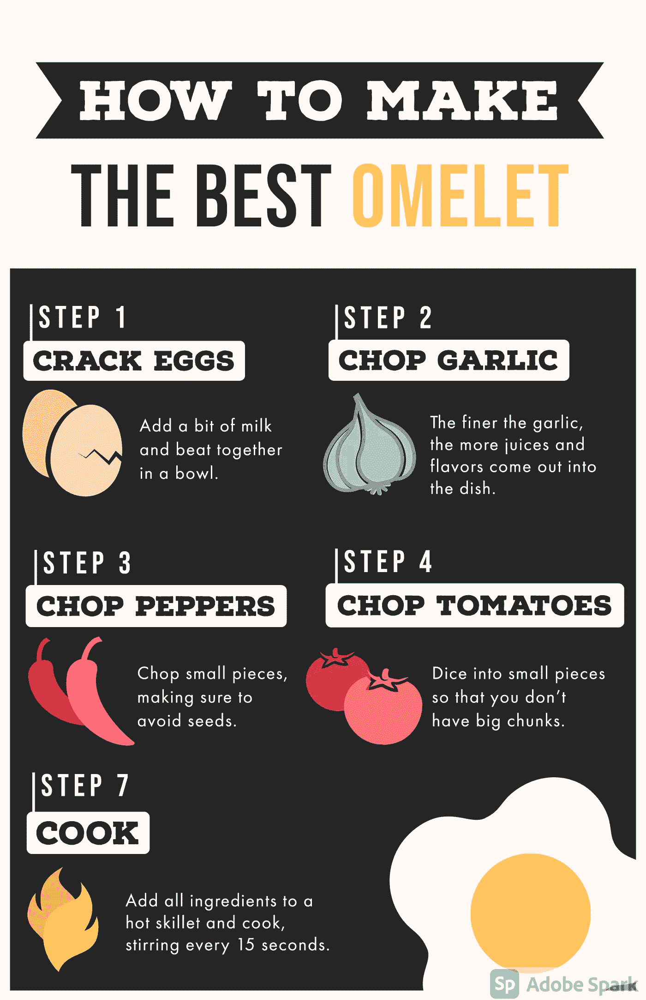

# 如何免费设计专业的信息图表

> 原文：<https://medium.com/analytics-vidhya/how-to-design-a-professional-infographics-for-free-e01ffcc8d9c1?source=collection_archive---------17----------------------->

# 什么是信息图？

信息图是将复杂的数据和许多文字投射到图片和图形中，这些图片和图形简单地显示信息，并排列和给出你想要表达的完整画面。

> 信息图可以帮助你总结大量的数据，并以吸引人的方式呈现出来。