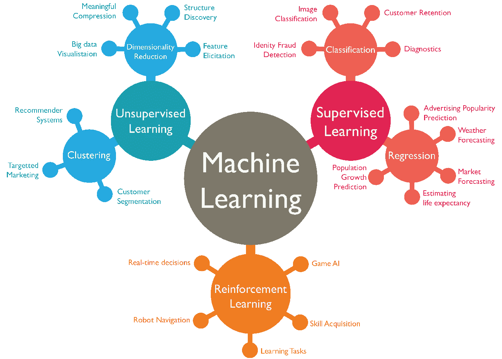

# 如何在巴基斯坦或任何南亚国家的任何公司内使用数据科学方法为任何问题设计解决方案

> 原文：<https://medium.com/analytics-vidhya/how-to-design-a-solution-for-any-problem-using-data-science-methodologies-within-any-corporation-in-28489a0ffb7?source=collection_archive---------1----------------------->

正如我们所知，数据科学为许多技术爱好者和试图采用现代技术的公司创造了许多夸大的期望和对其潜力的好奇。在我们开始讨论如何将数据科学应用于巴基斯坦公司的任何工作之前，我想消除围绕这一领域的许多神话和夸张。首先；

> 数据科学不是魔法，它只不过是一门求助的企业科学。

许多人认为数据科学可以将收入从零提高到六位数，并将拥有 10 个客户的公司发展成为拥有数百万客户的公司。

对于这一点，答案是肯定的，也许在某种程度上是肯定的，但也绝对不是。

作为一名数据科学家，意味着能够理解和分析数据的过去、现在，并估计数据的未来，以及依赖数据的组织应该如何做好相应的准备。

# 有什么数据，什么类型的公司使用它，如果面对一个小公司，我们如何设计我们的计划？

如何思考

作为一名数据科学家或分析师或机器学习工程师。在开始分析之前，我们需要先看看商业环境和组织的政治思维。

> 想什么

比方说，拥有人力资源、销售和财务等三个部门的公司在大多数情况下都是小公司，或者是依靠销售单一类型产品来获取收入的公司，比如茶杯制造厂。

什么时候思考

当他们决定存储他们的数据时，主要是为了跟踪他们的销售活动以及与之相关的任何事情，因为考虑到他们保守的业务设置，即确保一件产品顺利、正确地销售，他们不会对推进人类思维或管理程序感兴趣。在这种情况下，可以雇佣一名数据科学家来预测明年茶杯的销量。

> 如何着手此事

该项目的数据科学家只需要每月销售的茶杯，并将其输入现有的机器学习算法，如时间段销售的线性回归，并获得明年的预测，同时显示时间序列预测，以便销售团队进行比较和多维分析。但如果公司成本非常有限，那么数据科学家可能只会使用统计预测和旅程概述来进行分析，而机器算法会使用大量的计算能力和大量的数据重组。

> 与外部人才合作

在这种情况下，数据科学家需要雇用一名应用程序开发人员，将他/她的机器学习代码转换为具有预测界面的工作应用程序，因为像茶杯制造公司这样的小公司没有云服务或数据管道来运行机器学习服务或自动统计分析报告工具。

**如果公司太大？**

# 如果是一家跨国公司或大公司，这些数据可以用来做什么？

当考虑南亚地区的大型公司时，如跨国公司。

我们必须首先评估他们的组织生态系统，如部门如何从不同的数据平台共享和交互，如销售部门如何与人力资源共享 it 销售数据，以评估哪个员工的销售额最高，他们应该如何激励其他员工也这样做，以及人力资源是否可以相应地为 it 设计培训计划或重新设计奖金基础设施，以激励员工在销售中的表现。

# 我们应该重组数据吗？

我们需要首先检查数据是通过 Oracle 或 SAP 等 ERP 系统共享，还是通过 One Drive 等共享存储库共享，或者只是通过 Microsoft Sharepoint 等通用平台共享。

然后，我们需要评估对所有部门都有价值的数据类型，例如，员工人数对人力资源有用，但对销售无用，但每个员工的销售额是对销售和人力资源都有用的数据类型，因为他们都可以通过它评估收入流和员工发展。

在最后阶段，我们可以决定是否应该通过共享控制或 SQL 数据库以表格形式(如 excel 表)提供这些数据，这两个部门在某些方面都有访问限制，因为销售人员无法查看与其销售相关的员工工资，但人力资源部门可以。

# 我们应该应用什么算法？

我们需要看看数据的结果是否可以通过监督或无监督的机器学习来实现。

对于基于数字的结果，大多数监督算法是首选算法，而对于建立像网飞或 spotify 这样的推荐系统或像分析大规模数据集上的黑洞图像这样的深层分析，我们使用无监督算法，对于制作自动人工智能软件，如 Alexa 或 Bixby，我们主要依赖强化算法。

在完全了解数据的性质及其战略目的后，我们应该进行探索性的数据分析，看看我们是否能找到类似于以下的东西:

*   其中是否存在任何错误或异常值。我们可以通过使用商业智能工具如 PowerBI 或 Tableau 甚至 Python 编程来实现数据可视化。

# 我们应该应用预测分析还是简单的机器学习建模？

如果我们想要的预测想要根据未来数字比较过去和现在的数据，例如:

*   发放的薪金。
*   员工人数。

然后，我们将使用基于回归的算法，但如果我们希望预测二进制结果，如是或否，如员工是否欺诈，那么我们将采用基于分类的方法。

一旦我们明确了手头的业务目标，例如，如果我们希望看到员工工资的未来预测，那么我们将使用基于树的算法，如决策树或 RandomForest，这取决于组织的工资结构，例如，如果工资取决于相关的货币因素，如上个月的奖金发放或每年申请多少奖金，那么决策树算法将用于编码相关变量，以预测未来的工资。如果不是这种情况，那么我们将使用随机森林回归器来保持其他变量独立于预测值的计算。

# 结果应该是什么样的？

这将完全取决于股东或客户的要求。

根据他们的思考能力，比如如果他们想以多维形式查看，那么我们会将我们的机器学习代码转换为仪表板，或者如果他们想以界面工具的形式查看，那么我们可以将机器学习代码转换为 web 应用程序或 API 在这里，一旦输入了所需的数据，就可以得到显示的输出。

> 一个 API

> 仪表盘

> 基于网络的应用

# 结论

这是一个总结生命周期，试图在任何南亚国家运行和实施一个基于数据科学的项目，在那里你面临文化保守主义和技术变量的组织复杂性。

> 我希望你能理解我的文章，并期待你在下面的评论中给出你的想法。
> 
> 我目前正在伦敦大学学习理学硕士数据科学和人工智能，我一直是 Upwork 的自由职业数据科学专家，并与个人客户和组织合作研究商业智能系统和机器学习模型。
> 
> 如果你有兴趣分享专业知识或一起做项目，请订阅我的中型个人资料以获取更多文章，并在 LinkedIn 上与我联系。

[https://www . LinkedIn . com/in/goto-resumemuhammad-ammar-jam shed-029280145](https://www.linkedin.com/in/goto-resumemuhammad-ammar-jamshed-029280145)

> *注:所有图片不是我的版权，不属于我*。