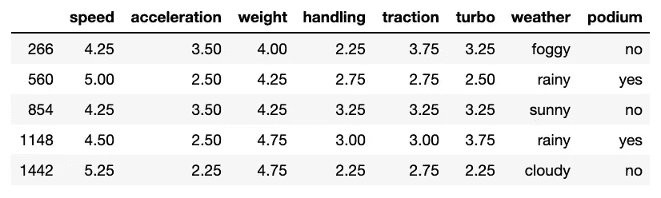
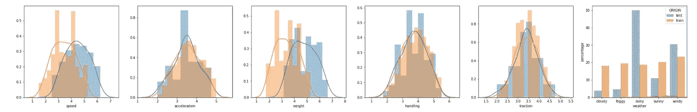
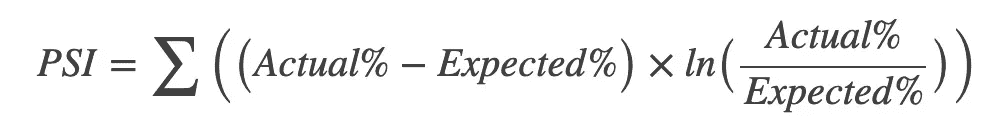
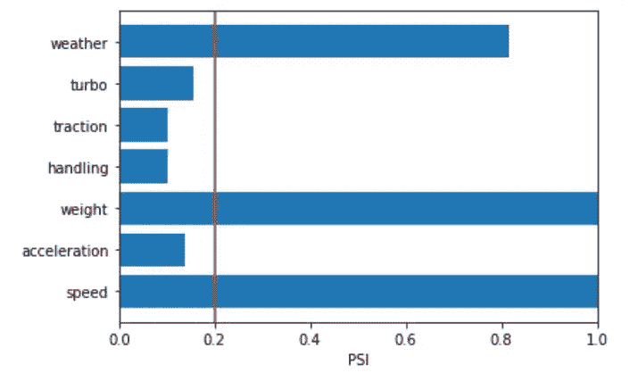
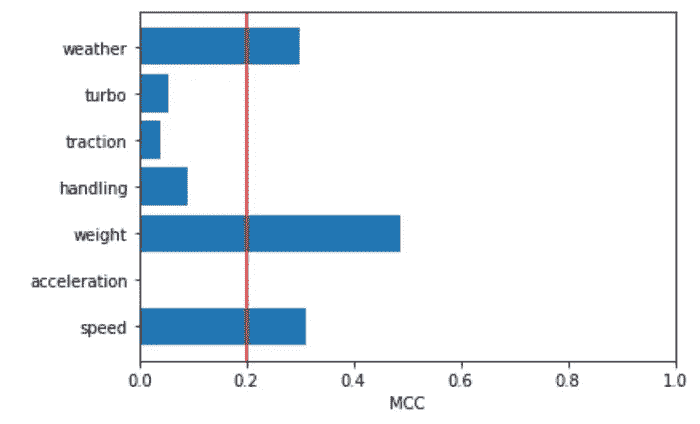

# 如何检测一个过时的模型？

> 原文：<https://medium.com/analytics-vidhya/how-to-detect-an-obsolete-model-ac5a25f2fa54?source=collection_archive---------11----------------------->

## 你听说过协变量漂移吗？无论如何，本文将向您介绍它是什么，以及如何使用它来引起您对模型过时的注意


图片由 [Aral Tasher](https://unsplash.com/@araltasher?utm_source=medium&utm_medium=referral) 在 [Unsplash](https://unsplash.com?utm_source=medium&utm_medium=referral) 上拍摄

*在现实世界中，用于训练模型的数据和用于预测的数据之间可能会发生很多变化。特别是如果训练和预测是在不同的时间范围内完成的话。这些变化是由协变量漂移现象定义的。它对应于训练集和预测集之间模型的解释变量的分布差异。*

## 介绍

本文的目标不是给你一个详细的解决方案来克服你的模型过时，而只是如何检测它。事实上，这是第一步。

检测模型过时与检测协变量漂移直接相关。这意味着能够在某个值(称为**漂移系数**)达到某个阈值时发出警报。这个阈值可以任意选择。基于经验研究，您可以认为**如果协变量的计算系数超过 0.2** ，则协变量会显著漂移。

协变量是模型用来预测目标值的变量。例如，当试图预测足球队在下一场比赛中的进球数(目标值)时，之前的进球数和获得的红牌数是协变量。这些值可能会随着时间的推移而改变，这取决于团队的表现。

为了计算协变量的漂移系数，有两种方法:

*   使用统计指数
*   使用统计模型

对于这两种方法，其思想是测量两个样本之间特征的分布差异。第一个样本是训练集，第二个样本是预测集。

## 例子

为了说明这两种方法，我们将使用一个包含汽车比赛信息的数据集。这个数据集允许一个模型根据不同的变量来预测一辆汽车是否会登上领奖台:汽车的速度，加速度，重量，操控性，牵引力，涡轮和比赛期间的天气。我们将关注那些作为预测模型协变量的变量。



赛车数据集(640 行 x 8 列)

首先，让我们导入实现这些方法所需的所有包。

```
import seaborn as sns
from sklearn.model_selection import train_test_split
import pandas as pd
import numpy as np
```

将数字特征和分类特征分开将是有用的。

```
numerical_features = ['speed', 'acceleration', 'weight', 'handling', 'traction', 'turbo']
categorical_features = ['weather']
```

然后，从数据集创建两个样本。当然，在真实的用例中，您将使用您的人口样本(如果不是全部)和新收集的数据。

```
train, test = train_test_split(df, test_size=0.3)
```

现在让我们画出每个特征的样本分布。



速度、重量和天气变化最大

关于上面的图，我们可以看到速度、重量和天气这些变量在视觉上是漂移的。

现在，我们将借助统计指数和机器学习方法，通过测量这些分布差异来了解如何自动检测它。

## 统计指数法

在统计学中，**群体稳定性指数**用于衡量一个变量在两个不同样本中的分布差异。下面是公式:



更详细地说，实际百分比对应于第一个样本中某个类变量的百分比，而第二个样本中的预期百分比相同。要获得 PSI，必须对所有 classes 变量的括号内表达式求和。

这个公式可以很容易地应用于分类变量。

以下是分类特征 PSI 计算的实现:

```
def calculate_psi_categorical(actual, expected):
    actual_perc = actual.value_counts()/len(actual)
    expected_perc = expected.value_counts()/len(expected) actual_classes = list(actual_perc.index) 
    expected_classes = list(expected_perc.index) PSI = 0
    classes = set(actual_classes + expected_classes)for c in classes:
        final_actual_perc = actual_perc[c] if c in actual_classes else 0.00001
        final_expected_perc = expected_perc[c] if c in expected_classes else 0.00001
        PSI += (final_actual_perc - final_expected_perc)*np.log(final_actual_perc/final_expected_perc) return PSI
```

然而对于数字来说就变得更难了。事实上，我们需要一个有类的变量，这不是数字特征的情况。因此，为了将这些公式应用于数值变量，您需要将区间用作类。

以下是使用统计指数方法获取数字特征漂移系数的步骤:

*   将你的第一个样本分成指定数量的区间(对于小数据集至少比记录数量低 10 倍)
*   计算样本中每个间隔内记录百分比
*   获得所有区间的截止点
*   将截止点应用于第二个样本
*   计算样本中每个间隔内记录百分比
*   根据记录值的百分比，用其中一个统计指标计算漂移系数

为了计算数字特征的 PSI，我建议你使用 Matthew Burke 在 GitHub 上提出的一个高效实现:[https://GitHub . com/MW Burke/population-stability-index/blob/master/PSI . py](https://github.com/mwburke/population-stability-index/blob/master/psi.py)

以下是赛车数据集的代码示例:

```
psis = []#Using the above implementation to compute PSI's categorical feature
for feature_name in categorical_features:
   ** psi = calculate_psi_categorical(train[feature_name], test[feature_name])**
    psis.append(psi)#Using the github implementation to compute PSI's numerical features
for feature_name in numerical_features:
   ** psi = calculate_psi(train[feature_name], test[feature_name], buckettype='bins', buckets=buckets, axis=0)**
    psis.append(psi)#Plot each feature's PSI value
height = psis
bars = numerical_features
y_pos = np.arange(len(bars))
plt.barh(y_pos, height)
plt.axvline(x=0.2,color='red')
plt.yticks(y_pos, bars)
plt.xlabel("PSI")
plt.show()
```



变量天气、重量和速度已超过漂移阈值

这种方法的一个巨大优点是计算速度快。然而，所获得的指数是没有界限的，PSI 的范围在 0 和无穷大之间。

## 统计模型方法

为了通过机器学习来检测协变量漂移，需要进行一些建模。

这个想法是建立一个模型，根据它的值来预测一个特征属于哪个样本。因此，该模型是一个二元分类模型，因为我们比较两个样本之间的特征分布。你也可能已经猜到了模型只由一个解释变量定义。

下面是使用机器学习方法的程序

*   在您的两个示例中添加一个新列“ORIGIN”
*   根据所属样本，如“训练”或“测试”,用标签填写“原点”
*   连接两个样本，使所有记录都在一个数据集中
*   将数据集分为 80%和 20%两部分
*   用其中一个特征的最大集合训练一个模型来预测“起源”
*   计算漂移系数:由于马太相关系数，基于最小集合评估你的模型

为了得到漂移系数，建议你使用 Catboost 算法。这种算法的优点是，您不必对模型的分类变量进行虚拟化，您将直接获得每个变量的一个漂移系数。在其他情况下，每个天气等级都有一个漂移系数。

下面是使用汽车比赛数据实现的方法:

```
from catboost import Pool, CatBoostClassifiermccs = []
for feature_name in numerical_features+categorical_features:
    is_categorical = feature_name == "weather" train_dataset = Pool(data=lg_set[feature_name].to_numpy(),
                         label=lg_set['ORIGIN'].to_numpy(),
                         cat_features=[0] if is_categorical else []) eval_dataset = Pool(data=sm_set[feature_name].to_numpy(),
                         label=sm_set['ORIGIN'].to_numpy(),
                         cat_features=[0] if is_categorical else []) # Initialize CatBoostClassifier
    model = CatBoostClassifier(iterations=10,
                               learning_rate=0.2,
                               depth=2,
                               loss_function='Logloss',   auto_class_weights="Balanced")
    # Fit model
    model.fit(train_dataset)
    # Get predicted classes
    preds_class = model.predict(eval_dataset)mccs.append(matthews_corrcoef(sm_set['ORIGIN'].to_numpy(), preds_class))#Plot each feature's PSI value
height = mccs
bars = numerical_features+categorical_features
y_pos = np.arange(len(bars))
plt.barh(y_pos, height)
plt.yticks(y_pos, bars)
plt.axvline(x=0.2,color='red')
plt.xlabel("PSI")
plt.xlim(0,1)
plt.show()
```



变量天气、重量和速度已超过漂移阈值

这种方法提供了一个有界漂移系数。MCC 范围在-1 和 1 之间。然而，与统计索引方法相比，为每个特征训练一个模型可能非常慢。

## 下一步是什么？

使用上述方法之一获得每个特征的漂移系数后，您可以筛选出大于 0.2 的漂移系数。这将给你模型的漂移特征。

在本文中，我们没有讨论协变量漂移对模型性能的影响，也没有考虑特征的重要性。当然，一个不太重要的特性会危险地漂移，它对性能的影响不会像一个非常重要的特性那样大。

检测到漂移特征后，您应该对其进行调查，并采取措施降低其对模型性能的影响。有时，在真实世界的用例中，隐含着一个收集问题。在这种情况下，您应该对漂移特征的采集方法进行修正。在其他情况下，改变学习方法、在更近的时间框架上重新训练模型、移除那些特征或者至少降低它们在模型中的重要性可以减少漂移影响。

参考资料:

*   [https://www.lexjansen.com/wuss/2017/47_Final_Paper_PDF.pdf](https://www.lexjansen.com/wuss/2017/47_Final_Paper_PDF.pdf)
*   [https://MW Burke . github . io/data % 20 science/2018/04/29/population-stability-index . html](https://mwburke.github.io/data%20science/2018/04/29/population-stability-index.html)
*   [https://blog . bigml . com/2014/01/03/simple-machine-learning-to-detect-co variate-shift/](https://blog.bigml.com/2014/01/03/simple-machine-learning-to-detect-covariate-shift/)

**感谢您的阅读！**