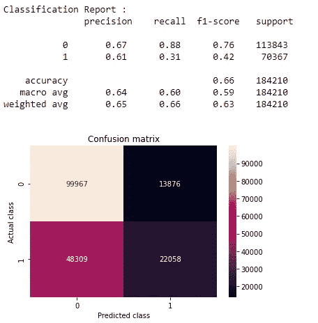

# 如何从零开始开发医疗保健提供商欺诈检测分析的 ML 模型

> 原文：<https://medium.com/analytics-vidhya/how-to-develop-ml-models-from-scratch-for-healthcare-provider-fraud-detection-analysis-71cae0fac6f9?source=collection_archive---------4----------------------->

机器学习在医学中的应用变得越来越重要。美国拥有世界上最昂贵的医疗保健系统，私营部门占了上风。提供商欺诈和滥用在保险费上涨中扮演着重要角色。

# 概观

本博客分为 11 个部分；它们是:

1.业务问题的解释

2.我们的数据来源

3.解决我们问题的现有方法

4.我们的方法

5.特征工程

6.探索性数据分析

7.如何开发随机模型

8.如何开发一个 ML 模型

9.以表格形式比较您的所有模型

10.如何开发进一步的改进

11.参考

**业务问题说明**

Medicare 是美国政府的一项计划，为 65 岁以上、65 岁以下以及患有某些残疾的人士提供医疗保险。它包括四个部分:A 部分(住院)、B 部分(医疗)、C 部分(医疗保险优惠)和 D 部分(处方)。大多数供应商都努力按照道德规范工作，但也有一些供应商参与欺诈活动的案例。

根据美国政府。强制医疗保健欺诈和滥用是犯罪，可处以民事处罚、监禁和将提供者排除在联邦医疗保健计划之外。

提供商的一些医疗保险欺诈行为包括:

故意对复杂程度高于医疗记录中提供或记录的服务收费。

故意提交未提供的服务，包括伪造信息以从中获益。

支付 FHP 受益人的转诊费用，并提交患者无法预约的账单

**数据**

数据集来自*https://www . ka ggle . com/rohitrox/health care-provider-fraud-detection-analysis*，与医疗保健医疗保险索赔相关。给定提供者的住院、门诊&受益人详细信息，分类目标是预测提供者是否为欺诈性提供者。

**解决问题的现有方法:**

他们采用了一些过采样技术，如 SMOT、阿达辛和 TGAN 来处理不平衡问题。由于欠采样会丢失一些原始数据，过采样是解决数据不平衡问题的最佳方法。参见参考网站(1)。

在过采样之前，他们在特征工程中进行了一些调整，例如移除缺失值百分比非常高的特征，降低高度相关特征的权重，并对缺失值很少的特征执行插补技术。

决策树、随机森林、XGBoost、light GBM & GBM——是作为本文一部分训练的五个机器学习模型。其中，随机森林是使用多个 DT 的集合装袋技术。GBM 是一种集成增强技术，其中 LightGBM 和 XGBoost 是 GBM 的变体。除了这些最大似然模型之外，他们使用几个密集层和漏失层实现了简单的神经网络模型，产生了极好的结果。

**我们的方法:**

我们计划从诊断代码中获取更多的文本信息，并且不应该对不平衡问题有任何特殊的关注，因为我们的模型应该实时处理异常数据。由于数据不平衡，将会有许多挑战，但我们的目标是建立一个强大的模型，为所有最坏的情况实时做好准备。

我们的重点是功能工程和 EDA，以找出更多的功能。我们计划只采用机器学习模型来解决这个问题。

我们选择了宏观精度、召回率和 F1 分数(每个类别 F1 分数的算术平均值)作为性能指标，并且对每个类别给予同等的重视。

举个例子:在我们的数据集中，95 个正点和 5 个负点。如果我们的哑模型预测所有点都是正的，简单精度将是 95，回忆 100 和 F1 分数是 97.4，表明我们的模型是好的，其中我们错误地分类了未被考虑用于计算的少数类。

然而，如果我们使用宏观精度、回忆和 F1 分数，我们可以更好地理解我们的模型性能。参见参考网站(2)。

**特色工程:**

不出所料，诊断代码有数值，这当然没有什么信息。但是每个诊断代码都有其由 ICD 基金会管理的代码描述。不足为奇的是，我们已经知道 python 具有许多支持所有领域的实用程序。其中，我们发现一个特定于我们任务的实用程序是来自 pypi.org[的 icd9cms。](pypi.org.)

搜索(诊断代码)功能返回诊断代码的描述。我们已经获得了每个数据上十个诊断代码的诊断描述。

以下是搜索方法的代码片段:

此外，如下应用文本预处理技术:

缩减-用完整的单词替换单词。例子:不会->不会。

停止单词删除

删除带数字的单词

转换小写字母并删除特殊字符

除此之外，作为特性工程的一部分，我们还执行了以下工作

将患者出生日期转换为 2009 年的年龄

通过找出索赔开始日期和索赔结束日期之间的差异来计算总治疗天数。

获取治疗月份

从索赔结束日期获取最后一次治疗日期。

计算执行的测试数量

所有慢性病患者数据的总和

将州代码转换为州缩写代码

计算咨询的医生数量。

**探索性数据分析:**

这是一个不平衡的数据，欺诈案件的比例高于非欺诈案件的住院索赔。对于门诊病人的索赔，反之亦然。

***观察结果*** :

属于 CA & SD 的提供商涉及的欺诈案件比美国其他州多。

住院数据有几个欺诈案例，门诊数据有几个非欺诈案例。

由于美国医疗保险计划主要为 65 岁以上的人服务，几起欺诈案件针对的是 60 岁以上的病人。

受益人 ID、索赔 ID、提供者 ID、主治医师 ID、手术医师 ID 和其他医师 ID——因为这些都是 ID，所以没有任何信息，这不是一个优秀的特性。所以，我们可以移除它们。

A 部分覆盖的月数和 B 部分覆盖的月数—不是很好的功能，因为所有索赔都是 12 个月

支付的可扣除金额—没有用，因为其 1068 适用于所有住院索赔

大多数特征重叠很多，但是州代码特征在预测潜在欺诈状态方面优于其他特征。

这涉及到年龄在 65 岁到 90 岁之间的病人的更多欺诈案件。

性别#1 比性别#2 涉及更多欺诈案件

75 岁患者的欺诈案件最多

患者年龄在 54 岁至 70 岁之间，治疗天数超过 30 天——涉及更多欺诈案例。

它涉及到更多的欺诈案件，患者年龄为 60 岁，治疗天数超过 30 天

如果治疗天数> 20 天，门诊报销无欺诈案例

如果患者年龄在 65 岁至 89 岁之间，且治疗天数< 20 days for In-Patient claims

# Visualizations

Reimbursed Amount — There is a long tail for fraudulent providers. Though it’s overlapping a lot, still it can be a useful feature.

No bias — Both Gender code # 1 & # 2 equally involves fraudulent cases. The ratio of IP fraudulent cases is higher than OP fraudulent rate.

Age Vs Gender, There is an enormous leap at 65\. It shows more fraudulent cases filed if patient age > = 65 天，则会出现几起欺诈案件，75 岁时出现的欺诈案件最多。

程序代码数量与咨询的医生数量之比，使用程序编号归档的欺诈案例更多—住院和门诊索赔分别为 9 和 1。

**如何开发随机模型:**

这是一个简单的基线模型。我们建立了一个随机模型，它会产生两个数字，数字的和应该是 1。

它返回大约 0.88 的训练和测试日志损失，这是最坏情况下的日志损失。理想情况下，高于 0.88 的任何值都应被视为比随机模型更差。我们期望我们的最大似然模型胜过这种对数损失并产生优异的结果。

**如何开发一个 ML 模型:**

正如我们计划的那样，我们没有使用任何技术来平衡训练和测试数据。我们照原样使用它们。如上所述，我们已经执行了上述预处理技术，并将原始数据转换为更清晰的数据，这些数据可以输入到模型中。

下面是为我们的模型执行的矢量转换列表:

对预处理的诊断描述应用不同的编码技术——它们是:TFIDF、BOW 和 tokenizers，我们在每个编码向量上训练模型，以确定哪一个更适合我们的问题并产生优秀的结果。

通过使用 sklearn 的 MinMaxScaler 方法将每个特征缩放到给定范围来转换数字特征。

一些特征，如性别，慢性疾病，肾脏疾病指标，不需要应用缩放操作，因为它们大多是 1 和 2。因此，我们应用了熊猫地图功能，将 1 和 2 转换为 0 和 1。

有几个功能没有给模型增加任何价值，所以我们已经放弃了它们。

最后，在文本和数字特征转换之后，使用 hstack()将输入数组序列水平(即，按列)堆叠起来，形成一个数组。

让我们建立 ML 模型。由于这是一个二元分类问题，我们首先建立了超参数调整的 Logistic 回归模型。

1.  拟合逻辑回归

预测测试集结果并计算宏 F1 分数

我们在集合 1 数据(基于诊断描述+数字特征的 TFIDF)上构建了这个。类似地，我们在集合 2(BOW on diagnostics descriptions+numerical features)和集合 3(Tokenizer on diagnostics description+numerical features)数据上构建 LR。

逻辑回归分类器对测试数据的宏观 F1 得分:0.47。它显示只有 47%的数据如预期的那样预测，而欺诈案件的正确预测是 18%，这是非常低的，这是很可怕的。所以，LR 型号不合格。

2.拟合决策树

预测测试集结果并计算宏 F1 分数

决策树分类器对测试数据的 Macro-F1 评分:0.72。它显示 72%的数据预测与预期一致，65%的欺诈案例分类正确。DT 模型性能优于 LR 模型。

3.拟合随机森林

预测测试集结果并计算宏 F1 分数

随机森林分类器对测试数据的宏观 F1 得分:0.73。它显示 73%的数据预测与预期一致，65%的欺诈案例分类正确。RF 模型性能优于 LR 模型，与 DT 相当。

即使 RF 模型对 Set3 训练数据产生了 100%的准确性，但是我们观察到非常低的测试分数 60%,这表明它是一个过拟合模型。

4.安装 AdaBoost

预测测试集结果并计算宏 F1 分数

AdaBoost 分类器对测试数据的 Macro-F1 评分:0.59。它显示只有 59%的数据如预期的那样预测，而欺诈案件的正确预测是 42%，这是非常低的，这是很可怕的。所以，AdaBoost 模型不符合要求。

5.拟合 XGBoost 模型

预测测试集结果并计算宏 F1 分数

XGBoost 分类器对测试数据的 Macro-F1 评分:0.77。它显示 77%的数据预测符合预期，71%的欺诈案例预测正确。因此，XGBoost 是一个比以前的任何模型都给出优秀结果的模型。

**以表格形式比较您的所有型号:**

根据以上数据，可以清楚地看出 XGBoost 是所有模型中最好的模型。因此，我们最终确定 XGBoost 作为我们对这个问题的预测模型，它返回的 Macro-F1 得分为 77% & 80%的准确性。

尽管有不平衡的问题，我们的 XGBoost 模型能够预测大约 80%的点，这在模型性能方面真的很棒。

**如何进一步改进:**

毫无疑问，有一个范围来尝试一些深度学习模型，我们可以使用几个密集和稀疏层来实现简单的神经网络模型，这将产生良好的结果。

代码可在 https://github.com/muru94/Medicare_provider_fraud.git[的 github](https://github.com/muru94/Medicare_provider_fraud.git)获得

下面是部署模型的演示[https://drive . Google . com/file/d/1 nybjk 6 gz 5 hjzbr-DMP 5 hvegwohs 5 vmx 8/view](https://drive.google.com/file/d/1NYBJk6gZ5HjzBR-dmP5hVEGwOhS5vMx8/view)

Linkedin 个人资料—[www.linkedin.com/in/murugesh-krishnan-718971157](http://www.linkedin.com/in/murugesh-krishnan-718971157)

**参考文献:**

1.  [https://www . research gate . net/profile/Rohan-Gupta-5/publication/350132738 _ A _ Comparative _ Study _ of _ Using _ variable _ Machine _ Learning _ and _ Deep _ Learning-Based _ Fraud _ Detection _ Models _ For _ Universal _ Health _ Coverage _ Schemes/links/605d 6 e 21 A 6 fdccbfea 085 b 79/A-Comparative-Study-of-of-Using-variable-Machine-Learning-Based-discredit-Detection-Models](https://www.researchgate.net/profile/Rohan-Gupta-5/publication/350132738_A_Comparative_Study_of_Using_Various_Machine_Learning_and_Deep_Learning-Based_Fraud_Detection_Models_For_Universal_Health_Coverage_Schemes/links/605d6e21a6fdccbfea085b79/A-Comparative-Study-of-Using-Various-Machine-Learning-and-Deep-Learning-Based-Fraud-Detection-Models-For-Universal-Health-Coverage-Schemes.pdf)
2.  [https://towards data science . com/multi-class-metrics-made-simple-part-ii-the-f1-score-ebe 8 b 2c a1](https://towardsdatascience.com/multi-class-metrics-made-simple-part-ii-the-f1-score-ebe8b2c2ca1)
3.  [https://www.appliedaicourse.com/](https://www.appliedaicourse.com/)