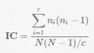
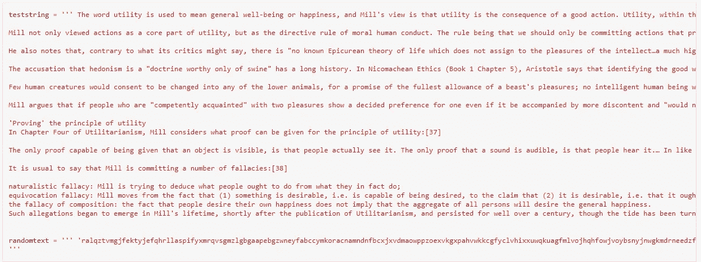
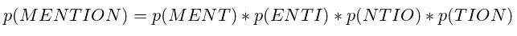
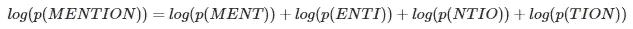
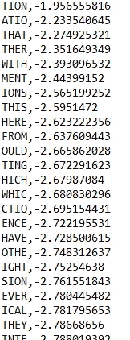

# 如何区分乱码和有效的英文文本

> 原文：<https://medium.com/analytics-vidhya/how-to-distinguish-between-gibberish-and-valid-english-text-4975078c5688?source=collection_archive---------4----------------------->

**文本适配函数的世界**

在黑客电影的流行比喻中，有时需要解密一个加密的文本来挽救局面。主角在他们的电脑上做一些快速的恶作剧，然后弹出解密的文本；在最后一刻，及时拯救了世界。


认真对待这些想法是不明智的，因为电影和电视剧中展示的技术往往离题太远，可笑地不可行，而且过于戏剧化——但这将是另一个话题。

然而，如果你要写一个程序来解密一段加密的文本，你肯定需要知道你什么时候完成。更确切地说，计算机需要知道这一点！作为人类，我们可以从胡言乱语中自动解析合法的文本，但你如何将这些辨别能力转移给一个高速的低能儿(你的计算机)？

当我在 YouTube 上的 Computerphile 频道偶然发现这个优秀的视频时，这是一个多年来萦绕在我脑海中的疑问，它将我引入了文本健身功能的世界。

根据维基百科，适应度函数是一种特定类型的目标函数，作为一个单一的品质因数，用于总结给定设计解决方案与实现既定目标的接近程度。

具体地说，当应用于文本时，它总结了一段特定文本的统计特性与所考虑的语言中的相似文本的接近程度。这是一个完整的领域，但我想做的是向你们介绍我用 Python 复制的两个适应函数。

# 共现指数

来自[维基百科](https://en.wikipedia.org/wiki/Index_of_coincidence):

> 重合指数提供了通过从给定文本中随机选择两个字母来绘制两个匹配字母的可能性的度量。在文本中画出给定字母的几率是(该字母出现的次数/文本的长度)。再次绘制相同字母(没有替换)的机会是(外观-1/文本长度-1)。这两个值的乘积给了你连续画两次那个字母的机会。人们可以找到文本中出现的每个字母的乘积，然后将这些乘积相加，就有机会抽中两个相同的。这个概率可以通过乘以某个系数来标准化，在英语中通常是 26。



> 其中 N 是文本的长度，n1 到 nc 是字母表中 c 个字母的频率(作为整数)(对于单字符英语，c = 26)。ni 的和必然是 n。

重点是英文文本的 IoC 是接近 1.7 的**，而随机文本的 IoC 应该是接近 **1** 。**

第一步是获得一个随机文本和一些有效文本。



需要为分析准备文本。准备是指去掉所有标点符号、空格和特殊字符；并将所有内容设置为统一的大小写(这里选择小写)。

```
**def** prep_str(iptext):
    iptext **=** iptext**.**lower()
    iptext**=** iptext**.**replace(".","")
    **import** string

    **for** punc **in** string**.**punctuation:
        iptext **=** iptext**.**replace(punc,"")

    iptext **=** iptext**.**replace("’","")
    iptext **=** iptext**.**replace(" ","")
    iptext **=** iptext**.**replace("\n", "")
    iptext **=** iptext**.**replace("…","")

    **for** i **in** range(10):
        iptext **=** iptext**.**replace(str(i), "")

    **return** iptext 
```

为了计算 IoC，应使用上述帮助函数。

```
def calc_ioc(iptext):
  ’’[https://en.wikipedia.org/wiki/Index_of_coincidence'''](https://en.wikipedia.org/wiki/Index_of_coincidence''')
  iptext = prep_str(iptext)
  cnt = Counter(iptext)
  sum = 0
  N = len(iptext)
  for x in cnt:
    #print(f”{N} {cnt[x]}”)
    sum = sum + cnt[x]*(cnt[x]-1) return sum*26/(N*(N-1)), cnt
```

结果出来了，而且很有希望:

```
print(calc_ioc(randomtext)[0])
print(calc_ioc(teststring)[0])**1.0002113411341134
1.7642129827559332**
```

这段代码可以清楚地区分乱码和英文文本。

# **四元图适应度计算**

基于 Google books 在许可的情况下发布的 n-Gram 数据，我们可以计算任何 n 长字母序列的相对频率(以及概率)。如果 n=4，则 n 元图称为四元图。

引用此[链接](https://planetcalc.com/7959/):

> 有了这些频率，从技术上来说，我们可以估计在整个文本语料库中找到给定文本的概率(这是适合性度量的一个很好的候选)。比如让我们的文字是“提”字。它由以下四元图组成:MENT —实体— NTIO —实体。所以，



> 然而，这里真正的问题是，概率非常小，所以这些的乘法运算很快就变成了更小的值，引入了舍入误差，并且不太有用。解决方案是已知的——应用对数函数。



我在 Github 上找到一个数据文件，里面已经包含了四元图的 log10 概率，我把它读了进去。

以下是该文件的内容:



啊哦！这些是大写字母，需要处理...

注意，对数概率都是负的，因为概率总是在 0 和 1 之间，它的 log10 将是负的。

```
**def** quadgram_fitness(iptext):
    a **=** prep_str(iptext)
    quadtext **=** [a[idx:idx**+**4] **for** idx **in** range(len(a)**-**3)]
    quaddict**=**{}
    **with** open("quadgrams.txt") **as** f:
        **for** line **in** f:
            quaddict[line**.**split(",")[0]]**=** float(line**.**split(",")[1])

    sum **=** 0
    **for** quad **in** quadtext:
        sum **+=** (quaddict**.**get(quad**.**upper(),0))
    **return** abs(sum)**/**len(quadtext)
```

在上面的两个字符串上运行，我们得到:

```
print(quadgram_fitness(randomtext))
print(quadgram_fitness(teststring)) *#larger the better, as this is the absolute value of the sum of the log likelihood* **0.5542850898467538
3.7183183502414807**
```

答对了。

不用说，还有更多的文本健身功能，你可以实现和发挥。根据使用案例，您还可以考虑对适应度函数进行适当加权，以使您的预测更加可信。

上述实验的代码是完全独立的，可从以下网址获得:

[](https://github.com/vaibhavgarg1982/MiscPythonTools/blob/main/text_fitness.ipynb) [## vaibhavgarg 1982/MiscPythonTools

### 在 GitHub 上创建一个帐户，为 vaibhavgarg 1982/MiscPythonTools 的开发做出贡献。

github.com](https://github.com/vaibhavgarg1982/MiscPythonTools/blob/main/text_fitness.ipynb) 

四元图数据文件可从以下网址获得:

[](https://github.com/vaibhavgarg1982/MiscPythonTools/blob/main/quadgrams.txt) [## vaibhavgarg 1982/MiscPythonTools

### 在 GitHub 上创建一个帐户，为 vaibhavgarg 1982/MiscPythonTools 的开发做出贡献。

github.com](https://github.com/vaibhavgarg1982/MiscPythonTools/blob/main/quadgrams.txt)