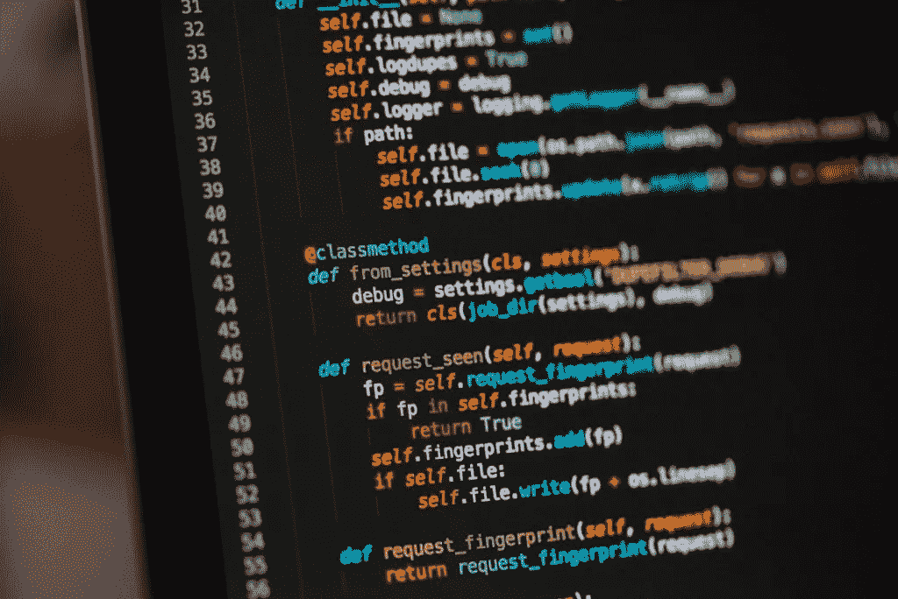

# 如何用 Python 在一行中完成所有工作

> 原文：<https://medium.com/analytics-vidhya/how-to-do-everything-in-one-line-minifying-python-code-d2a247a7ed0e?source=collection_archive---------20----------------------->

这是[系列](https://kgdavidson.co.uk/category/python-bare-minima/)的一部分，讨论在尽可能短的时间内全面掌握 Python 编程语言所需的一切。不管你是初学者还是专家，我都希望你能学到一些新东西。

编写 python 代码时，您可能希望代码更短。这可能是由于字符限制或为了使代码看起来更整洁。这些技巧对于像[代码冲突](https://www.codingame.com/home)这样的编码挑战特别有用，在这种情况下，你用更少的字符就能获胜。

# 交换变量

一条将获得大量里程的线是一条交换变量而不使用临时变量的线。在 Python 中，你可以简单地使用多重赋值符号。

缩小 IF 语句的第一种方法是简单地将所有代码移到一行。这假设只有一个操作要运行，并且不需要使用 else。通常根本不建议这样做。

第二种方法是，如果条件为真，则写结果，然后写“如果”条件。如果您需要一个简短的 if/else 语句，后面还可以跟一个“else”和结果 false。如图所示，整个语句可以放在变量声明之后或 print 语句中，只有结果会被设置或打印。

在我看来，最后的、最短的、也是最好的方法是利用列表。很多人说使用 if/else 语句是不好的做法，所以这是一种完全摆脱它们的有效方法。代码是通过创建一个列表来编写的，第 0 项为假结果，第 1 项为真结果。然后，您可以使用该条件从该列表中提取适当的结果。

这是可行的，因为条件只能是真或假。在代码中，True 和 False 完全等同于 1 和 0。因此，条件只能被认为是 1 或 0。这意味着我们可以只使用条件来处理任何数组中的第 0 项或第 1 项。

这甚至可以更进一步，将 lambdas 放入数组中以调用函数或运行代码，并在用“()”运行它们之前通过条件寻址它们，所有这些都在一行中。

一行中的 for 循环有时被称为列表或字典理解，因为它通常输出一个列表或字典。

Python 有两个函数非常匹配列表理解的结果。第一个是地图功能。正常的列表理解实现了同样的事情，本质上创建了一个新的列表，其中输入列表中的每个元素都被函数或操作修改了。

第二个是过滤功能，用条件列表理解代替。这和普通的列表理解是一样的。重要的是，它还通过 if 语句过滤掉不希望包含在结果列表中的项目。

最后是字典理解。除了它必须接受一个元组列表之外，它的工作方式基本相同。这适用于每个元组中的一个元素成为键，另一个元素成为值的情况。有很多方法可以通过拆分每个元素来使用 1D 列表，但是这不是一个初学者的路线。

SUM 函数只是将列表中的所有元素相加，然后输出结果。

REPLACE 函数用于替换字符串中的子字符串。该函数还允许您选择应该替换子字符串出现的次数。默认情况下，替换所有引用。

反转和反向功能略有不同，但作用相同。两者都反转或翻转输入列表。唯一的区别是 REVERSED 返回输入列表的反转版本，而 REVERSE 在列表上被调用并反转它，不返回任何内容。

类似地，只需在变量名后添加“[::-1]”，就可以反转字符串。

希望所有这些提示和技巧能让你更加注意什么时候可以更有效地编码，并帮助你想出更有创造性的解决方案来解决你的编码问题。

*原载于 2021 年 2 月 22 日*[*【https://kgdavidson.co.uk】*](https://kgdavidson.co.uk/python-bare-minima--how-to-do-everything-in-one-line-minifying-python-code/)*。*