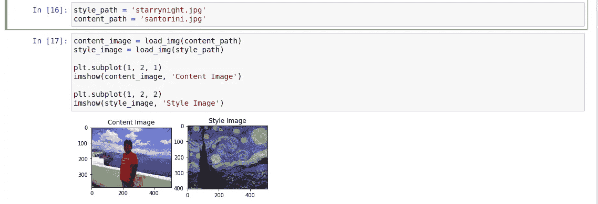
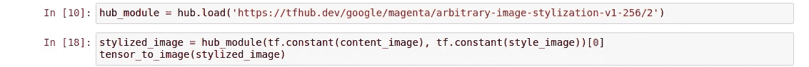
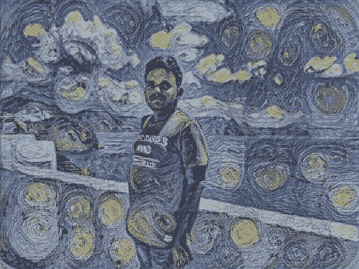

# 如何在 Python 中进行图像风格转换

> 原文：<https://medium.com/analytics-vidhya/how-to-do-neural-style-transfer-in-python-bee3f0d1008b?source=collection_archive---------11----------------------->

Prisma 应用程序允许您将名画风格转移到您的图像中。但在免费版中，可供选择的画作数量有限。Prisma 使用经过训练的人工神经网络将一幅图像的风格转换成另一幅。

幸运的是，谷歌已经发布了一个经过训练的风格转移神经网络[1]。它可以用来将任何图像的风格转移到任何其他图像。我们可以任意选择内容和风格的形象。

在这篇文章中，我展示了如何使用一个图像到另一个图像的传输样式。首先，我们导入以下库并声明助手函数

然后，我们必须加载内容图像和样式图像。我用《星夜》作为风格。这是文森特·梵高最著名的画作。



内容图像和样式图像的尺寸不需要匹配。

然后，我们必须从 tensorflow hub 加载训练好的模型，并提供内容图像和样式图像作为输入，如下所示:



它提供以下图像作为输出。



您可以使用以下代码保存图像

```
tensor_to_image(stylized_image).save('image_name.jpeg')
```

使用上面的代码，你可以将任何图像的风格转换成另一种。

1.  [https://tfhub . dev/Google/magenta/arbitrary-image-stylization-v1-256/2](https://tfhub.dev/google/magenta/arbitrary-image-stylization-v1-256/2)
2.  [https://colab . research . Google . com/github/tensor flow/hub/blob/master/examples/colab/tf2 _ arbitrary _ image _ stylization . ipynb # scroll to = DRC 0 vat 3 alzo](https://colab.research.google.com/github/tensorflow/hub/blob/master/examples/colab/tf2_arbitrary_image_stylization.ipynb#scrollTo=dRc0vat3Alzo)