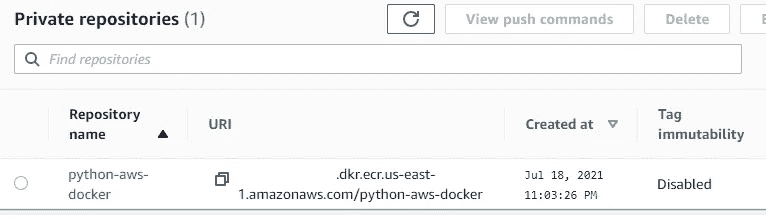

# 如何使用弹性容器注册表为 AWS Lambda 对接 Python Pytesseract

> 原文：<https://medium.com/analytics-vidhya/how-to-dockerize-python-pytesseract-for-aws-lambda-using-elastic-container-registry-752a651edecd?source=collection_archive---------5----------------------->

在本文中，我将解释编排 docker 映像以在 ECR 中部署并最终在无服务器环境中使用 AWS lambda 运行的整个过程。


[https://godatadriven.com/topic/the-virtual-classroom/](https://godatadriven.com/topic/the-virtual-classroom/)

## 目录:

∘ [数据工程师的问题陈述](#a55c)
∘ [为什么是 Docker？](#cee2)
∘ [Docker 文件内容](#ded0)
∘[Docker 文件做以下](#5d36)
∘ [app.py 内容](#423c)
∘ [app.py 做以下](#d4ec)
∘[requirements . txt 内容](#5906)
∘ [requirement.txt 文件做以下](#da6d)
∘ [步骤创建 docker 镜像](#56d4) 部署到集控室
∘ [部署到 AWS](#f54b)步骤
∘ [测试使用](#993b)t49】∘[关于作者](#6d38)t52】∘[github](#8e0d)t55】∘[LinkedIn](#0193)

## 数据工程师的问题陈述:

将图像或文本扩展名转换为 pdf。听起来很简单？让我们深入了解一下。输入文件会在 S3。输出也将被写入输入所在的同一个 S3 文件夹。听起来不错…嗯，让我们看看更多的细节。解决方案需要有 tesseract 二进制文件来运行无服务器 lambda。此外，这个包应该可以在 Amazon Linux 上运行。这意味着宇宙魔方二进制文件应该与 Amazon Linux 兼容。除此之外，我们对部署包的大小有 lambda 限制。如果你用的是 windows 或 mac，这种情况不会很快消失。

然后我想到了一个东西，如果它在本地工作，应该可以在无服务器中无缝工作——Docker！

## 为什么是 Docker？

仅仅因为 docker 可以构建和分享容器化的应用——从桌面到云。句号。这给了我足够的信心，让我开始为 docker 开发一些代码并构建它。

所以，我创建了一个如下的结构:

```
│   Dockerfile
│   requirements.txt
├───app
│       app.py
```

## Docker 文件内容:

```
FROM public.ecr.aws/lambda/python:3.8COPY requirements.txt ./requirements.txt
RUN pip install -r requirements.txtRUN rpm -Uvh [https://dl.fedoraproject.org/pub/epel/epel-release-latest-7.noarch.rpm](https://dl.fedoraproject.org/pub/epel/epel-release-latest-7.noarch.rpm)
RUN yum -y update
RUN yum -y install tesseractCOPY ./app/app.py   ./RUN aws configure set aws_access_key_id ""
RUN aws configure set aws_secret_access_key ""
RUN aws configure set region ""
RUN aws configure set output ""CMD ["app.lambda_handler"]
```

## Dockerfile 执行以下操作:

在构建映像时，它将逐个运行 docker 文件中的每个语句并执行。

1.  从支持 3.8 的 AWS lambda 克隆 Amazon Linux 的公共 ECR 映像
2.  复制要求文件，然后安装 python 程序 app.py 运行的要求
3.  接下来，它在映像中安装宇宙魔方
4.  复制应用程序文件夹内容
5.  最后，它设置了 AWS CLI 与 S3 协同工作的环境。
6.  最后一行告诉图像，每当有请求时，app.lambda_handler 是我的应用程序入口点。

## app.py 内容:

```
from fpdf import FPDF
import os
import pytesseract
import boto3
from PIL import Imagedef download_dir(prefix, local, bucket, client):
    """
    params:
    - prefix: pattern to match in s3
    - local: local path to folder in which to place files
    - bucket: s3 bucket with target contents
    - client: initialized s3 client object
    """
    keys = []
    dirs = []
    next_token = ''
    base_kwargs = {
        'Bucket':bucket,
        'Prefix':prefix,
    }
    while next_token is not None:
        kwargs = base_kwargs.copy()
        if next_token != '':
            kwargs.update({'ContinuationToken': next_token})
        results = client.list_objects_v2(**kwargs)
        contents = results.get('Contents')
        for i in contents:
            k = i.get('Key')
            if k[-1] != '/':
                keys.append(k)
            else:
                dirs.append(k)
        next_token = results.get('NextContinuationToken')
    for d in dirs:
        dest_pathname = os.path.join(local, d)
        if not os.path.exists(os.path.dirname(dest_pathname)):
            os.makedirs(os.path.dirname(dest_pathname))
    for k in keys:
        dest_pathname = os.path.join(local, k)
        if not os.path.exists(os.path.dirname(dest_pathname)):
            os.makedirs(os.path.dirname(dest_pathname))
        client.download_file(bucket, k, dest_pathname)def lambda_handler(event, context):
    pdf = FPDF()
    pdf.add_page()
    pdf.set_font('Arial', size=20)session = boto3.Session()
    s3_client = session.client('s3')
    bucket_name='filestorageexchange'
    s3_folder='main_folder/sub_folder'
    lambda_write_path = '/tmp/'
    download_dir(prefix=s3_folder, local=lambda_write_path, bucket=bucket_name, client=s3_client)for item in os.listdir(main_path := os.path.abspath(os.path.join(lambda_write_path, s3_folder))):
        for folder in os.listdir(sub_path := os.path.join(main_path, item)):
            for file in os.listdir(sub_folder_path := os.path.join(sub_path, folder)):
                Converted = False
                file_path = os.path.join(sub_folder_path, file)
                print(f'\nProcessing text file...{file_path}')
                pdf_file_name = file_path.replace(file_path.split('.')[1], 'pdf')
                s3_folder = 'main_folder' + '/' + 'sub_folder' + '/' + item + '/' + folder
                s3_object = pdf_file_name.split(os.sep)[-1]
                try:
                    if file_path.endswith('txt'):
                        pdf.cell(200, 10, txt="".join(open(file_path)))
                        pdf.output(os.path.join(lambda_write_path, pdf_file_name))
                        Converted=True
                    if file_path.lower().endswith(('png', 'jpg', 'gif', 'tif')):
                        pdf_png = pytesseract.image_to_pdf_or_hocr(file_path, extension='pdf')
                        with open(os.path.join(lambda_write_path, pdf_file_name), 'w+b') as f:
                            f.write(pdf_png)
                        Converted=True    
                    if file_path.endswith(('pcd')):                       
                        Image.open(file_path).save(temp_file:=file_path.replace(file_path.split('.')[1], 'png'))
                        pdf_png = pytesseract.image_to_pdf_or_hocr(temp_file, extension='pdf')
                        with open(os.path.join(lambda_write_path, pdf_file_name), 'pdf', 'w+b') as f:
                            f.write(pdf_png)
                            os.remove(temp_file)
                        Converted=True
                except Exception as e:
                    print(e)if Converted:
                    print(f"Created - {os.path.join(lambda_write_path, pdf_file_name)}")
                    with open(os.path.join(lambda_write_path, pdf_file_name), 'rb') as data:
                        s3_client.upload_fileobj(data, bucket_name, s3_folder + '/' + s3_object)
                    print(f"Uploaded to - {s3_folder + '/' + s3_object}")
                else:
                    print(f"Not Created - {os.path.join(lambda_write_path, pdf_file_name)}")if __name__ == "__main__":
    if os.name == 'nt':
        pytesseract.pytesseract.tesseract_cmd = r'C:\Program Files\Tesseract-OCR\tesseract.exe'
    else:
        pytesseract.pytesseract.tesseract_cmd = r'tesseract/4.1.1/bin/tesseract'

    lambda_handler(None, None)
```

注意:app.py 是在 3.8 中编写和测试的

## app.py 执行以下操作:

1.  使用 appid 和 appsecret 登录 AWS
2.  从 S3 桶下载文件
3.  使用 pytesseract、fpdf 和 pillow 转换它们
4.  给 S3 回信

## requirements.txt 内容:

```
fpdf
pillow
pytesseract
awscli
boto3
```

## requirement.txt 文件执行以下操作:

1.  收集以上所有 python 包。
2.  安装上述所有软件包。

## 创建 docker 映像的步骤:

先决条件:

1.  安装 docker 并确保它在后台运行
2.  在 vs 代码中安装 docker 扩展(可选)。这将让您轻松浏览图像，查看日志和许多其他内容。

## 构建:

```
docker build -t <image-name> .
```

或者右键单击 vscode 中的 dockerfile，然后单击→从 Dockerfile 构建映像


一旦您创建了这个，您将在 vs 代码扩展中看到类似这样的内容。理想章鱼是我 16 小时前给它起的名字。


或者您可以在终端中执行此操作

```
docker images
```


这将向您显示系统中的所有 docker 图像。

## 运行:

要运行映像，请在终端中输入以下命令并设置端口

```
docker run -p 9000:8080 <image-name>
```

一旦你这样做了，终端会显示这个

```
docker run -p 9000:8080 idealoctopotato:latest                            
time="2021-07-18T15:54:14.975" level=info msg="exec '/var/runtime/bootstrap' (cwd=/var/task, handler=)"
```

所以这个映像运行在本地主机端口 8080/tcp，9000 是绑定地址。

列出容器图像:

```
docker container ls
CONTAINER ID   IMAGE                    COMMAND                  CREATED         STATUS         PORTS                                       NAMES
9c19c488f2dc   idealoctopotato:latest   "/lambda-entrypoint.…"   16 hours ago   Up 16 hours  0.0.0.0:9000->8080/tcp, :::9000->8080/tcp   dreamy_chebyshev
```

Vs 代码 docker 扩展帮助你导航到图像目录，并验证文件和内容。


## 测试:

打开另一个终端并键入

```
curl -XPOST "http://localhost:9000/2015-03-31/functions/function/invocations" -d "{}"
```

这将在容器内部启动 app.py 处理。

您可以切换回之前开始运行 docker 的终端，并在应用程序运行时查看其日志。

## 什么是 ECR

来自 AWS 文档—

> Amazon Elastic Container Registry(**ECR**)是一个完全托管的容器注册中心，它使存储、管理、共享和部署容器映像变得容易

因此，我们的想法是使用 ECR 并在我们刚刚在本地创建的云中托管 docker 映像。

## 部署到 ECR 的步骤

1.  去亚马逊弹性容器注册处
2.  创建一个私有库，因为 lambda 不支持公共库:


3.现在使用这个命令登录并获得权限

```
aws ecr get-login-password --region us-east-1 | docker login --username AWS --password-stdin <aws_account_id>.dkr.ecr.us-east-1.amazonaws.com
```

如果一切正常，它应该会给你这个—

```
Login Succeeded
```

4.接下来，使用此命令为您创建的图像添加一个标签

```
docker tag <docker_image_id> ecr_uri
```

图像 id —可以通过在终端中运行 **docker images** 并从图像中复制 id 来获得。

ecr_uri —从控制台的存储库中复制 uri。



5.运行这个命令将图像推送到 AWS 中的存储库。

```
docker push ecr_uri
```

一旦你这样做了，你应该会看到这样的东西


当所有东西都被推动时，它会向你展示—

```
latest: digest: sha256:2a0c7a019ddabaf92babxxxxxxxxxxxa1879e size: 3673
```

现在，您可以刷新 AWS 控制台，并在那里看到带有您的图像的最新标记。

## 部署到 AWS Lambda 的步骤

现在你的图像在 ECR 中，打开 Lambda 控制台

1.  在 AWS lambda 功能页面中选择容器图像选项。
2.  把 URI 的形象和创造


这应该看起来像

```
aws_account_id.dkr.ecr.us-east-1.amazonaws.com/python-aws-docker:latest
```

一旦完成，它会向你展示这个—


## 使用 lambda 测试

1.  在 AWS lambda Cloud9 ide 中点击 test，您可以看到与刚才在 docker 本地看到的相同的应用程序日志。
2.  访问 S3，并通过下载验证 pdf 文件。
3.  查看云监控日志。

最终的结果—


就是这样！您刚刚使用来自 Amazon Elastic Container Registry 的 Docker 容器图像构建了一个无服务器的 Amazon Lambda 函数，它将各种图像格式转换为驻留在 S3 的 pdf。

# 关于作者:

我是 Kuharan Bhowmik，我希望你喜欢这篇文章。上述工作仍在进行中，是目前托管在 Github 中的私有库。我欢迎任何相同的建议。

让我们贡献自己的一点知识，让互联网变得更美好。

## Github —

[](https://github.com/kuharan) [## 库哈兰-概述

### 数据工程师| Python | Azure | AWS |

github.com](https://github.com/kuharan) 

## LinkedIn —

 [## Kuharan Bhowmik -应用开发高级分析师-埃森哲| LinkedIn

### 数据工程师:Python、PySpark、Powershell、Shell Script、AWS Lambda、Azure Data Factory、Azure ML、Azure Logic Apps……

www.linkedin.com](https://www.linkedin.com/in/kuharan/)