# 如何通过 Google Drive 将 Kaggle 数据集下载到 Google Colab

> 原文：<https://medium.com/analytics-vidhya/how-to-download-kaggle-datasets-into-google-colab-via-google-drive-dcb348d7af07?source=collection_archive---------2----------------------->


Kaggle 到 Google Colab

每个数据科学和机器学习爱好者都听说过两个流行词 **Kaggle** 和 **Google Colab** 。让我把这些话介绍给新手。

1.  **Kaggle** 允许用户查找和发布数据集，在基于网络的数据科学环境中探索和构建模型，与其他数据科学家和机器学习工程师合作，并参加竞赛以解决数据科学挑战。
2.  Colaboratory，简称“ **Colab** ”，是谷歌研究院的产品。 **Colab** 允许任何人通过浏览器编写和执行任意 python 代码，特别适合机器学习、数据分析和教育。

大多数新加入的人在将数据集从 Kaggle 下载到 Google Colab 时面临困难。我发现了通过 Google Drive 从 Kaggle 下载数据集到 Colab 的最简单的方法。Google Drive 用于存储数据集，供 Colab 以后使用。让我们开始吧。

请仔细遵循以下步骤，

# 步骤 1:创建您的 Kaggle API 令牌

*   转到**您的个人资料**，点击**编辑个人资料**。
*   滚动页面直到 **API** 部分，并点击**创建新的 API 令牌**按钮

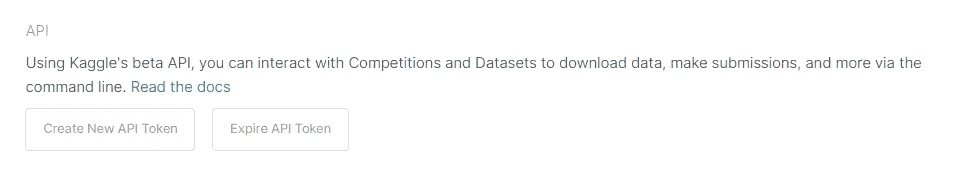

作者截图— Kaggle API 部分

*   将下载一个名为 **kaggle.json** 的文件，其中包含您的用户名和令牌密钥

# 第二步:上传 kaggle.json 到 Google Drive

*   在 Google Drive 中创建一个文件夹(在我的例子中，我使用的是: **Kaggle** )，我们将在那里存储我们的 Kaggle 数据集
*   将下载的 **kaggle.json** 文件上传到创建的文件夹中

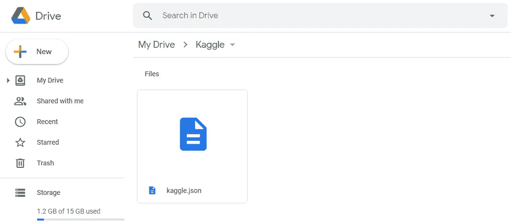

作者截图— kaggle.json 上传至 Google Drive

# 第三步:打开 Colab 笔记本

打开您的 Google colab 笔记本或创建一个新的 Google colab 笔记本,您可以在其中使用 Kaggle 数据集

# 步骤 4:将 Google Drive 安装到 Google Colab 笔记本上

*   运行下面的脚本来安装你的 Google Drive

```
**from** google.colab **import** drive
drive.mount('**/content/drive**')
```

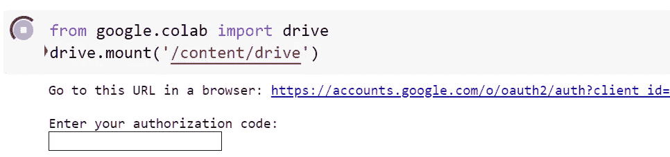

作者截图——验证谷歌账户

*   单击链接以验证用户 Google 帐户
*   选择您要安装的相应 Google Drive 帐户，然后单击登录
*   将验证码复制并粘贴到输入单元格中
*   恭喜你。你的谷歌硬盘已经安装好了，

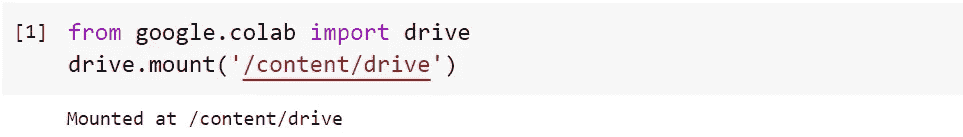

作者截图——安装了 Google Drive

# 步骤 5:配置 Kaggle

下面的代码将 Kaggle 配置路径设置为**ka ggle . JSON**。 **注意:**如果您对 *kaggle.json* 使用了不同的文件夹名或目录路径，请使用相同的而不是下面代码中的 */Kaggle*

```
**import** os
os.environ['**KAGGLE_CONFIG_DIR**'] = "**/content/drive/MyDrive/Kaggle**"
```

# 步骤 6:更改当前工作目录

*   下面的 shell 命令会将当前工作目录设置为，
    `/content/drive/MyDrive/Kaggle`

```
%cd **/content/drive/MyDrive/Kaggle/**
```

**注意:**您的 Google Drive 主目录位于，`/content/drive/MyDrive/`

# 步骤 7:下载 Kaggle 数据集

现在，您可以下载普通数据集或竞争数据集。根据您的要求，遵循以下步骤，

## 第七步。答:正常数据集

*   进入 Kaggle 数据集仪表板，点击**复制 API 命令**，如图所示。

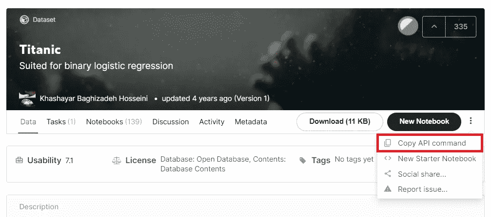

作者截图—泰坦尼克号数据集仪表板

*   您的 API 命令将类似于`kaggle datasets download -d **<username>/<datasets>**`或`kaggle datasets download -d **<datasets>**`
*   使用`**!**`符号运行命令，

```
!kaggle datasets download -d **heptapod/titanic**
```

*   您可以使用`ls`命令检查文件，

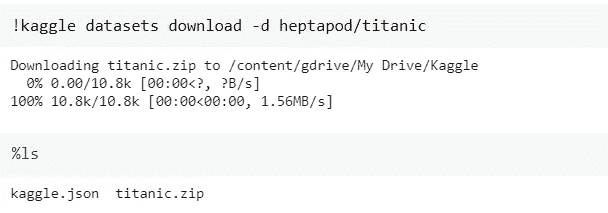

作者截图——从 Kaggle 下载的压缩文件格式的泰坦尼克号数据集

**注意:**数据集下载为 **zip 文件**。您需要手动解压缩文件。但是，有一个关键字`--unzip`用于下载后即时解压文件，删除 zip 文件。

```
!kaggle datasets download -d **heptapod/titanic** --unzip
```

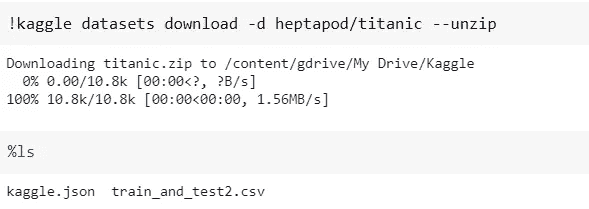

作者截图——泰坦尼克号数据集被下载并立即解压缩

了解更多关于 [Kaggle 数据集 API 命令](https://github.com/Kaggle/kaggle-api#datasets)

## 第七步。b:竞赛数据集

*   进入 Kaggle 竞赛仪表盘，点击**数据**选项卡，如图所示。

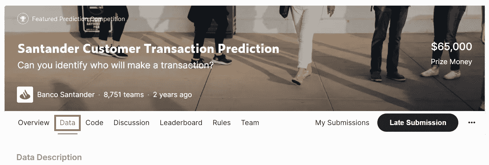

*   向下滚动同一页。您将看到 Kaggle API 命令。在右侧，有一个复制命令的图标。

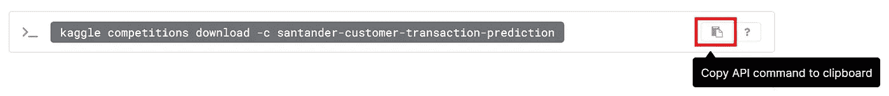

*   您的 API 命令将类似于`kaggle competitions download -c **<username>/<datasets>**`或`kaggle competitions download -c **<datasets>**`
*   使用`**!**`符号运行命令，

```
!kaggle competitions download -c **santander-customer-transaction-prediction**
```

*   根据比赛情况，可能会下载一个或多个 zip 文件。使用`ls`命令查看文件。在我的例子中，有三个文件下载为 zip 文件

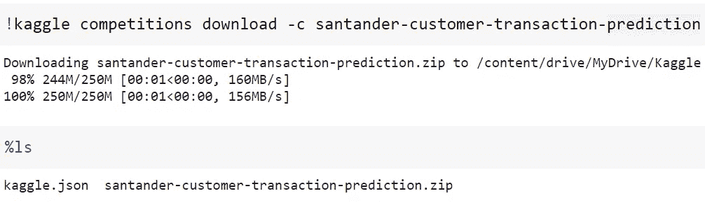

作者截图—从 Kaggle 下载的 zip 文件形式的竞赛数据集

**注意:**与普通数据集不同，您不能使用`--unzip`关键字来解压缩下载的 zip 文件，即使它不是实时的。你可以使用 python 的内置包来解压文件。下面是这样做的代码，

```
**import** zipfilefor **file** in os.listdir():
    if **file**.endswith("**.zip**"):
        with zipfile.ZipFile(**file**, "**r**") as **zip_file**:
            **zip_file**.extractall()
        os.remove(**file**)
```

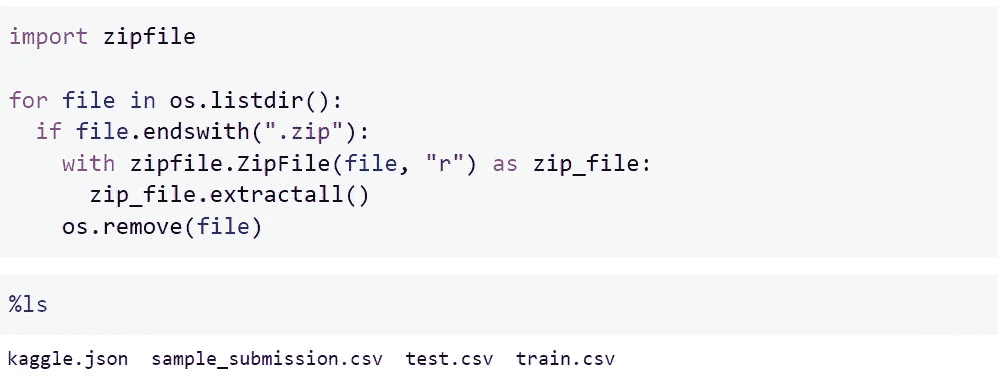

作者截图—用于解压缩压缩文件的 Python 代码

了解更多关于 [Kaggle 竞赛相关 API 命令](https://github.com/Kaggle/kaggle-api#competitions)

恭喜你！！我们已经成功地从 Kaggle 下载了数据集。快乐学习…

# 参考:

1.  [谷歌实验室](https://colab.research.google.com/)
2.  https://github.com/Kaggle/kaggle-api#kaggle-api[Kaggle API 命令](https://github.com/Kaggle/kaggle-api#kaggle-api)—
3.  [Kaggle 数据集 API 命令](https://github.com/Kaggle/kaggle-api#datasets)—[https://github.com/Kaggle/kaggle-api#datasets](https://github.com/Kaggle/kaggle-api#datasets)
4.  [Kaggle 竞赛 API 命令](https://github.com/Kaggle/kaggle-api#competitions)——[https://github.com/Kaggle/kaggle-api#competitions](https://github.com/Kaggle/kaggle-api#competitions)