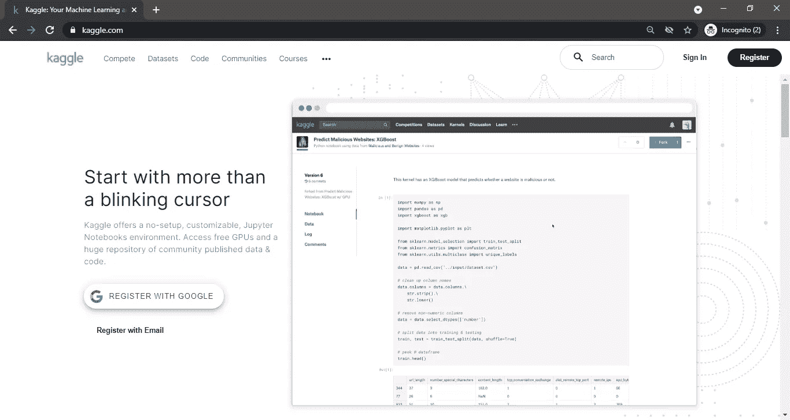
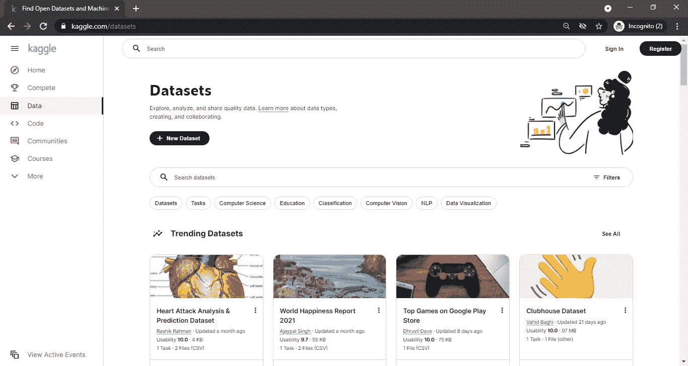
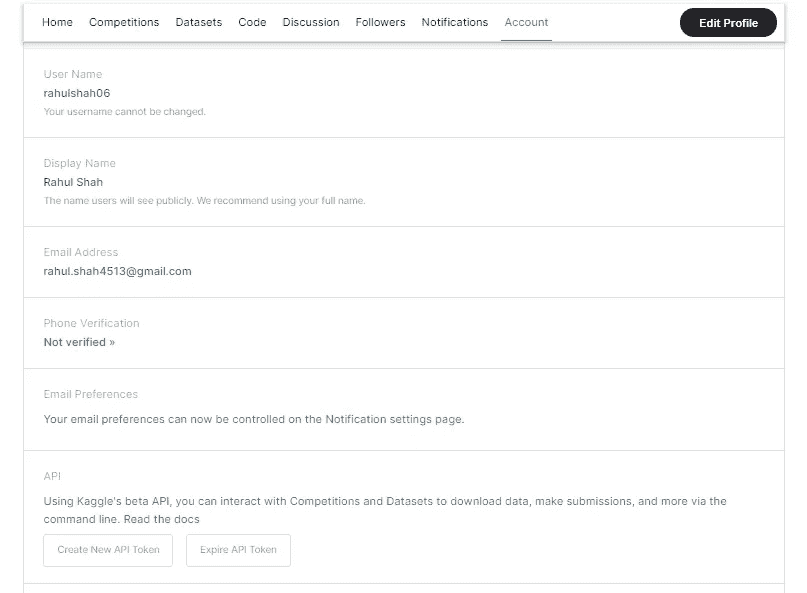
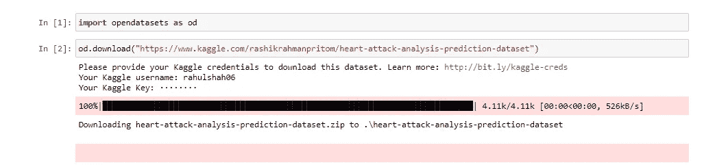
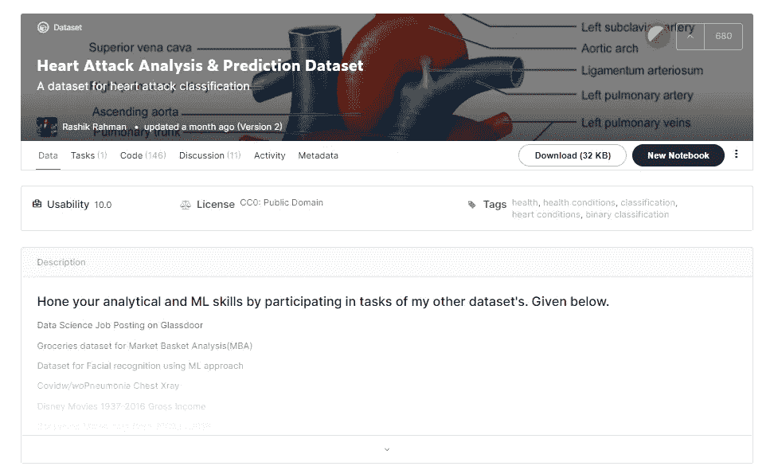

# 如何使用 Jupyter 笔记本下载 Kaggle 数据集

> 原文：<https://medium.com/analytics-vidhya/how-to-download-kaggle-datasets-using-jupyter-notebook-690f686bacfd?source=collection_archive---------10----------------------->

*本文作为* [*数据科学博客*](https://datahack.analyticsvidhya.com/contest/data-science-blogathon-7/) *的一部分发表。*

# 什么是 Kaggle？

Kaggle 是一个庞大的在线社区，由机器学习领域的专业人士和从业者组成，他们在这里会面并分享他们的知识。无论您是初学者还是专家，Kaggle 都可能在您的领域之旅中派上用场。Kaggle 成立于 2010 年，曾在那里举办机器学习比赛，后被谷歌收购。

使用 Kaggle 可以为用户提供多种功能帮助。人们可以通过参加比赛来展示他们的技能，这将有助于他们充实自己的口袋。Kaggle 还主持了几个基于不同主题的论坛，由来自全球的高素质和善良的人组成。除此之外，您可以学习编码和解决平台上的许多问题。你可能听说过 Kaggle 的主要原因之一是它托管的开源数据集的数量和种类。Kaggle 最好的一点是，如果你的数据集对分析或训练一个人的模型有一点价值，你甚至可以托管它。



Kaggle 主页(来源——个人电脑)

# 下载 Kaggle 数据集(传统方式):

从 Kaggle 下载数据集的传统方式是:

1.首先，进入 [Kaggle](https://www.kaggle.com) ，你将登陆 Kaggle 主页。

2.注册或使用所需凭据登录。

3.然后从左侧窗格中选择**数据**选项，您将进入数据集页面。

4.现在，从各种域中选择最符合您需求的数据集，然后按下**下载**按钮。



Kaggle 数据集页面(来源-个人电脑)

如果你不知道或者不清楚应该选择哪个数据集，Kaggle 已经帮你解决了。Kaggle 有几个基于观众兴趣的数据集更新列表。例如，当你登陆 Kaggle 数据集页面时，你会发现多个数据集列表，如**趋势数据集**、**热门数据集**、与**商家相关的数据集**、与 **COVID** 相关的数据集等等。

除此之外，如果您对想要的数据集有特定要求，您可以随时使用**过滤器**并选择文件类型和所需数据集的文件大小。

# 在 Jupyter 笔记本中下载 Kaggle 数据集

现在，让我们看看下载 Kaggle 数据集的新方法。

开始之前，您需要在系统中安装 **opendatasets** 库。如果您的系统中没有，使用 Python 的包管理器 **pip** 并运行:

```
!pip install opendatasets
```

在 Jupyter 笔记本的电池里。Python 的 **opendatasets** 库用于从 Kaggle 等平台下载开放数据集。

下载过程如下:

1.导入 **opendatasets** 库

```
import opendatasets as od
```

2.现在使用 **opendatasets** 库的下载功能，顾名思义就是用来下载数据集的。它将数据集的链接作为参数。

例如，如果我选择了下载**心脏病发作分析&预测数据集**。我将选择它的超链接。现在，这个超链接被用作**中的一个参数。下载()**功能。

```
od.download("https://www.kaggle.com/rashikrahmanpritom/heart-attack-analysis-prediction-dataset")
```

3.在执行上面一行时，它会提示输入 Kaggle 用户名。Kaggle 用户名可以从**我的资料**部分的**账户**标签中获取。

4.在输入用户名时，它会提示输入 Kaggle 密钥。同样，转到**我的资料**部分的账户选项卡，并点击**创建新的 API 令牌。**这将下载一个 **kaggle.json** 文件。



5.打开这个文件，你会在里面找到**用户名**和**密钥**。复制密钥并将其粘贴到提示的 Jupyter 笔记本单元格中。下载文件的内容如下所示:

6.进度条将显示数据集是否已完全下载。

7.成功完成下载后，将在 Jupyter 笔记本的当前工作目录下创建一个文件夹。这个文件夹包含我们的数据集。

您的 Jupyter 笔记本应该是这样的:



执行代码后的 Jupyter 笔记本(来源—个人电脑)

*注意:记住，你不必每次想下载数据集时都从 Kaggle 创建一个新的 API 令牌。您可以在每次下载时使用相同的密钥。*

# Kaggle 数据集页面

数据集在一个人在机器学习领域达到更高境界的旅程中发挥着至关重要的作用。因此，必须知道获取数据集的每一种可能的方法。Kaggle 是下载数据集使用最广泛的平台。因此，您可以获得由现场专家上传的大量数据集。

除了标题，Kaggle 中的每个数据集还有更多属性，如**可用性** **分数**、发布者、大小和数据集格式。当你打开一个数据集，你会发现这些细节。可用性得分由某些参数给出。对于这个分数，没有提到什么范围的分数是好的可用性分数，但是从高可用性分数数据集开始总是好的。每个数据集还显示要下载的数据集的**大小**。更大的文件大小将花费**更多的时间**来加载数据帧。例如，流行的数据集**美国事故**约有 420 万行，文件大小约为 300 MBs。因此，加载到数据帧中需要不同的时间。它还显示了数据所在的**文件格式**。了解数据集的这些细节也是有益的。



心脏病发作分析和预测数据集。注意我们谈到的细节。(来源——个人电脑)

用户可以在每个数据集页面的**代码**部分练习和分享他们的发现。你会在每个数据集页面上发现几个 Kaggle 成员提交的内容。此外，数据集的发布者可以发布任何可以瞄准并朝着它努力的任务。由于机器学习中的任何问题都没有单一的解决方案，所以看到别人并向别人学习总是好的。这可能对你接下来的项目有所帮助。例如，**新冠肺炎开放研究数据集挑战赛**数据集的文件大小为 9gb，提交的代码超过 1500 个。

为您的需求选择完美的数据需要时间。您可能会多次下载没有按照您的需求准备好的数据集。因此，阅读它所提供的数据集描述总是有利的。例如，如果您想要分析基于全球 COVID 19 疫苗接种计划的数据集，您会发现大量这样的数据集满足您的兴趣。在这种情况下，阅读和选择最适合你的数据集总是很有帮助的。

除此之外，Kaggle 还提供**免费课程**来提高数据科学技能，如 Python、数据清理、数据可视化等等。成功完成一门课程后，您将获得结业证书。

# 结论

因此， **opendatasets** 对于那些希望在该领域出类拔萃的从业者来说是一个福音。数据集是每个数据科学项目的重要组成部分。你的每一点分析都是从数据开始的。Python 中任务的执行效率最高。当涉及到下载数据集时，你的最终任务是用最少的努力获得数据集。

总之，从 [Kaggle](https://www.kaggle.com) 下载数据集的传统方法并不太难获得，上述 Jupyter Notebook 方法在以下方面相对更有优势:

1.如果你直接从 Jupyter 笔记本下载，你不一定要登录 Kaggle。出现提示时，您可以使用您的用户名和密钥。

2.您可以省去从浏览器传输下载文件到将其复制到笔记本目录的麻烦。该文件将仅在当前工作目录下下载。

3.了解现有解决方案的替代方案总是好的。

别忘了在这里看看我以前的文章[。](https://www.analyticsvidhya.com/blog/2021/04/delimiters-in-pandas-read_csv-function/)

*原载于 2021 年 4 月 30 日 https://www.analyticsvidhya.com*[](https://www.analyticsvidhya.com/blog/2021/04/how-to-download-kaggle-datasets-using-jupyter-notebook/)**。**