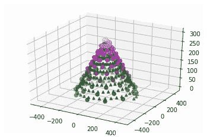

# 如何用 Matplotlib 绘制 3D 圣诞树

> 原文：<https://medium.com/analytics-vidhya/how-to-draw-a-3d-christmas-tree-with-matplotlib-aabb9bc27864?source=collection_archive---------9----------------------->

循序渐进的指南

因为我们把圣诞树安装在加热电池旁边，它很快就死了。所以我决定在 Matplotlib 画一棵圣诞树。你不需要保护它免受阳光或高温，也不需要任何水。在阿拉基斯星球，水是有限的。顺便说一下，在地球上也是如此。

# 初始代码