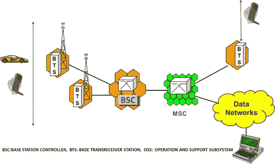
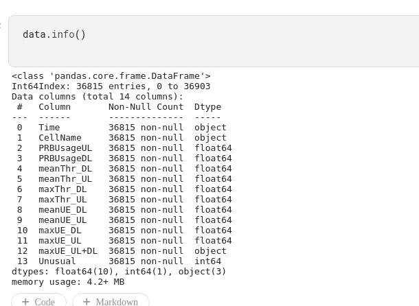
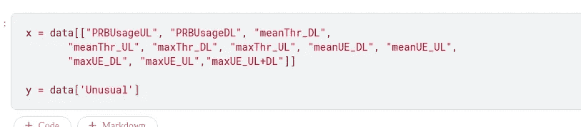
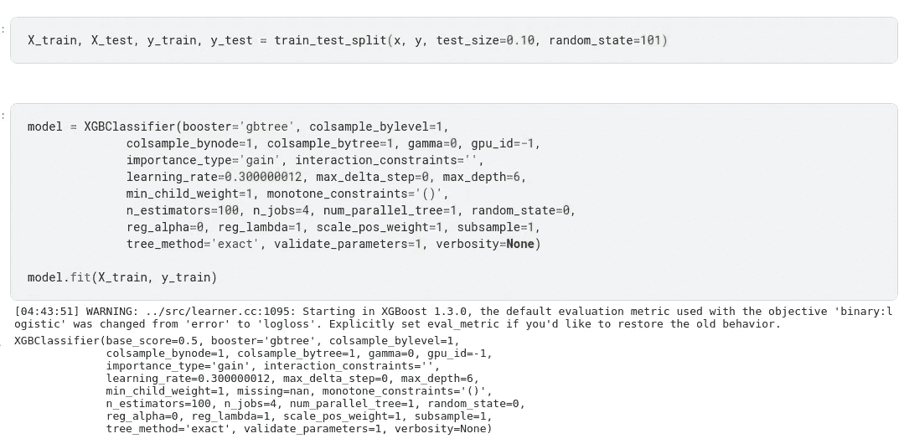
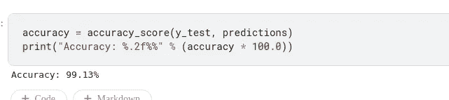

# 如何使用人工智能向蜂窝网络动态分配资源

> 原文：<https://medium.com/analytics-vidhya/how-to-dynamically-allocate-resources-to-cellular-networks-using-ai-e93d0073971e?source=collection_archive---------12----------------------->

无线通信已经成为我们日常生活中不可或缺的一部分。无论是语音通话还是 zoom 上的小组会议，没有一次我们不会遇到故障或延迟。电信运营商的投诉热线总是回答忙音，这导致沮丧。所有的移动电话都依靠无线电信号工作，因此需要大量的资源来保证电信的顺利运行。让我们了解一下目前资源是如何分配给蜂窝基站的。

# 现行资源分配制度

你一定注意到，每当你靠近一个大型公共集会，如音乐会，体育赛事等，或在特殊事件，如除夕，圣诞夜，你的网络连接完全下降，你不情愿地进入鬼模式。这是因为蜂窝网络的资源分配是基于设备的平均数量及其在特定基站的利用率来静态处理的。因此，每当网络利用率急剧上升时，有时会导致网络中断，从而失去连接。由于静态分配以及在保持高质量网络连接性和确保平稳运行的持续压力下，大多数基站被过度提供了无线电资源。

典型的蜂窝网络架构

# 人工智能是如何变魔术的

为了克服这种情况，我们可以利用**人工智能**的力量。人工智能可用于使资源分配过程动态化。由大量过去数据支持的机器学习算法可以帮助检测网络异常，从而帮助在需要时触发资源。简而言之，每当连接到特定基站的设备数量突然激增时，AI 模型就会检测到这种情况，系统会自动为基站分配更多资源，从而确保基站平稳运行。动态资源分配还有助于降低能耗和成本，从而使其更加高效和经济实惠。

# 让我们潜得更深

让我们来看一个实际的演示，并理解这是如何实现的。为了便于理解，我使用了一个 kaggle 竞赛数据集，可以在[这里](https://www.kaggle.com/c/anomaly-detection-in-cellular-networks/data)找到。

# 关于数据集

该数据集是从真实的 LTE 部署中获得的。在两周内，每 15 分钟从一组 10 个基站收集不同的指标，每个基站具有不同数量的小区。数据集以 csv 文件的形式提供，其中每一行对应于在某一时间从一个特定像元获得的样本。每个数据示例都包含以下功能:

*   时间:一天中生成样本的小时(格式为 hh:mm)。
*   CellName1:用于唯一标识生成当前样本的单元格的文本字符串。CellName 的格式为 xαLTE，其中 x 表示基站，α表示该基站内的小区(参见右图中的示例)。
*   PRBUsageUL 和 PRBUsageDL:小区中资源利用水平，测量为在前 15 分钟内使用的物理无线电块(PRB)的部分(%)。上行链路(UL)和下行链路(DL)是分开测量的。
*   meanThrDL 和 meanThrUL:过去 15 分钟的平均传输流量(Mbps)。上行链路(UL)和下行链路(DL)是分开测量的。
*   maxThrDL 和 maxThrUL:在过去 15 分钟内测量的最大承载流量(Mbps)。上行链路(UL)和下行链路(DL)是分开测量的。
*   meanUEDL 和 meanUEUL:在过去 15 分钟内同时处于活动状态的用户设备(UE)的平均数量。上行链路(UL)和下行链路(DL)是分开测量的。
*   maxUEDL 和 maxUEUL:在过去 15 分钟内同时处于活动状态的用户设备(UE)的最大数量。上行链路(UL)和下行链路(DL)是分开测量的。
*   马雪 _UL+DL:在过去 15 分钟内同时处于活动状态的用户设备(UE)的最大数量，不考虑 UL 和 DL。
*   不寻常:监督学习的标签。值 0 确定样本对应于正常操作，值 1 标识异常行为。

我们将使用该数据集，其中“异常”是我们要预测的目标列，所有其他列是我们的特征，这将帮助我们预测异常。我们还必须执行一些预处理步骤，如将对象转换为浮点数，因为 ML 算法只能理解数字。

定义功能和目标列后，我们将训练模型。我使用了 XGBClassifier，因为它是一种增强算法。XGBoost 被广泛应用于机器学习竞赛和产品的原因有很多。主要优点是:

*   它旨在处理缺失的功能，从而减少我们的数据清理工作
*   它支持正则化并执行并行处理，这使得它更快，并使用更少的计算资源
*   它适用于中小型数据集，因为它使用决策树作为基础学习器。
*   它是一个 boosting 算法，所以它把很多弱学习者结合起来，形成一个强学习者。因此它被称为**集成学习。**

我将我的数据分为训练(90%)和测试(10%)。这意味着我们使用了大约 33000 行数据来训练模型，并保留了 3600 行数据用于测试。这些数据被随机打乱和分割，以便无偏地评估我们的模型。

## 然后嘣！

测试数据的准确性

我们达到了*99.1%的准确率！这意味着基于给定的特征，100 次中有 99 次，我们的模型准确地检测到我们的网络使用中存在突然的峰值，并且我们需要分配更多的资源以确保蜂窝网络的平稳运行。*

# *未来的增强*

*仅用 36000 行的样本数据，我们就可以达到如此高的精度。毫无疑问，当我们使用数据的每个方面，包括不同的时间段、事件、地点时，事情可能会变得复杂。为了使它成为一个通用模型，需要进行各种修改。然而，这无疑表明，通过适当的数据和适当的机器学习管道，我们可以动态地将资源分配给蜂窝网络，从而使其节能，并确保即使在激增时也能保持稳健的性能。*

*感谢你的经历。如果有任何疑问，请随时通过 LinkedIn 与我联系，或者给 darshil3011@gmail.com 发邮件。我非常乐意帮忙！*

*如需定制 AI 解决方案，请访问 [***以字节为单位进行思考。***](http://www.thinkinbytes.in)*

***参考文献:***

* [## XGBoost 梯度增强的高效实现

### “XGBoost”算法在许多机器学习竞赛中高歌猛进。自 2014 年推出以来…

数据科学基金会](https://datascience.foundation/datatalk/xgboost-an-efficient-implementation-of-gradient-boosting)  [## 蜂窝网络中的异常检测

### 探索检测基站异常行为的 ML 解决方案

www.kaggle.com](https://www.kaggle.com/c/anomaly-detection-in-cellular-networks/data)*