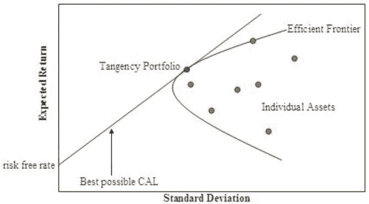
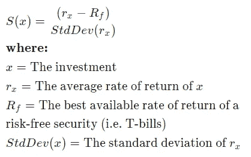
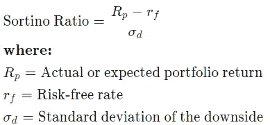
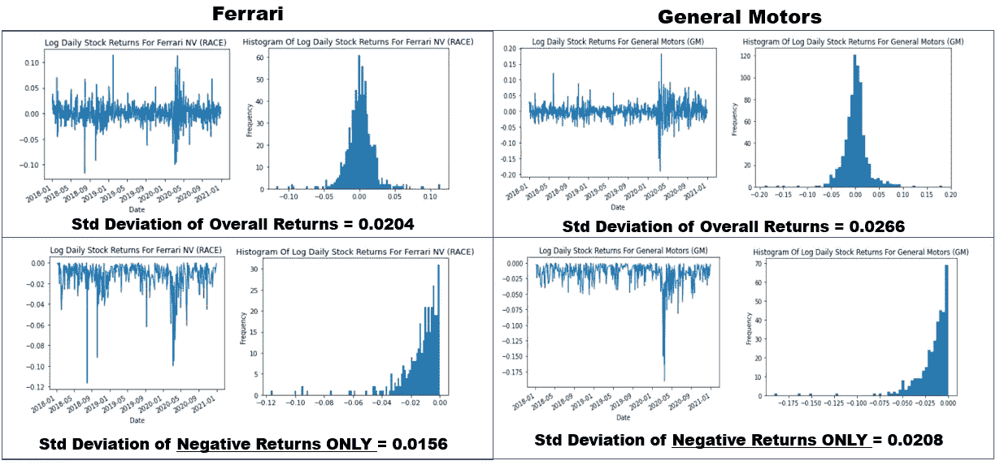
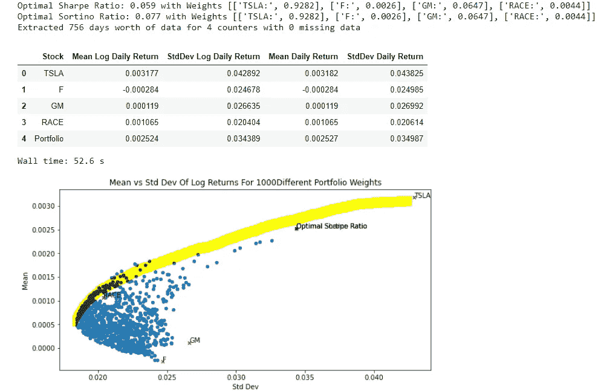
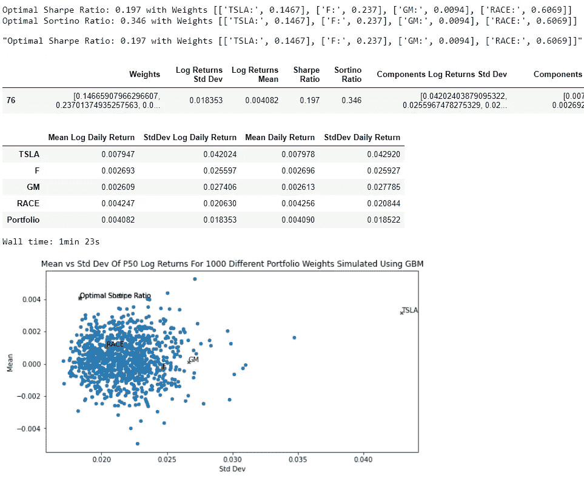
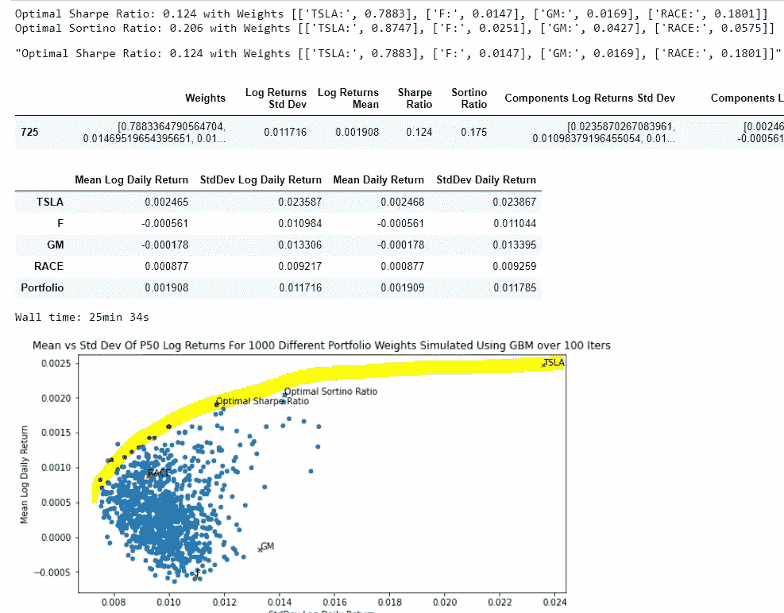

# 如何使用蒙特卡罗模拟和现代投资组合理论估计最优股票投资组合权重

> 原文：<https://medium.com/analytics-vidhya/how-to-estimate-optimal-stock-portfolio-weights-using-monte-carlo-simulations-modern-portfolio-d27d534e8a1a?source=collection_archive---------4----------------------->


20 世纪 20 年代的福特汽车工厂(与主题一致，因为后面的示例投资组合都是美国汽车行业的股票)

# 摘要

> 在这篇文章中，我简要地解释了如何将现代投资组合理论与蒙特卡洛模拟结合使用，以估计给定股票投资组合的最佳权重，从而实现“最佳”风险回报权衡

这是我上一篇文章的延续，在那篇文章中，我分享了我开发的一个 python [web 应用](https://www.stonksforecast.online/)，它允许用户使用几何布朗运动(GBM)或 Bootstrap 采样来模拟未来的股票价格运动。

[](/analytics-vidhya/building-a-monte-carlo-method-stock-price-simulator-with-geometric-brownian-motion-and-bootstrap-e346ff464894) [## 用几何布朗运动和 Bootstrap 建立蒙特卡罗方法股票价格模拟器

### 警告！我不是任何类型的投资大师，所以我强烈建议你不要把这篇文章作为(唯一的)…

medium.com](/analytics-vidhya/building-a-monte-carlo-method-stock-price-simulator-with-geometric-brownian-motion-and-bootstrap-e346ff464894) 

然而，在上一篇文章的结尾，我留下了一个悬而未决的问题:**对于一个给定的股票投资组合，我们如何知道我们选择了“最佳”权重？**

***【警告！我不是任何类型的投资大师，所以我强烈建议你不要把这篇文章作为你投资决策的(唯一)来源。考虑到 MPT 和有效前沿模型的一些局限性，这一点尤其重要，正如本文后面所讨论的]***

# 概述

*   [现代投资组合理论&有效前沿](#d00d)
*   [投资组合绩效指标—夏普&排序比率](#4d72)
*   [用 Python 代码实现](#79b9)
*   [结论](#c94d)

[](https://github.com/ZhijingEu/StockSimulatorFlaskApp) [## ZhijingEu/StockSimulatorFlaskApp

### 这是一个股票分析 Python Flask web 应用程序，它允许你使用…

github.com](https://github.com/ZhijingEu/StockSimulatorFlaskApp) 

# 现代投资组合理论与有效前沿

MPT 是由诺贝尔奖获得者 Harry Markowitz 博士在 20 世纪 50 年代发明的，它是一种确定投资组合“最优”权重的方法，该方法使收益最大化(由投资组合的预期收益表示)，同时风险最小化(由收益的标准差反映)

[](https://www.guidedchoice.com/video/dr-harry-markowitz-father-of-modern-portfolio-theory/) [## 哈里·马科维茨的现代投资组合理论【有效前沿】

### 世上没有完美的投资，但精心策划一个能提供高回报和相对低成本的策略…

www.guidedchoice.com](https://www.guidedchoice.com/video/dr-harry-markowitz-father-of-modern-portfolio-theory/) 

乍一看，天真的解决方案可能是将所有资金投资于平均回报率最高、标准差最低的股票，但推动投资组合整体“风险”水平的是股票回报率的联动(GBM 和 Bootstrap 抽样方法都试图对此建模)。股票收益之间的较低协方差导致较低的整体投资组合标准差。换句话说， ***多样化一般会降低风险*** 。

可视化不同权重投资组合表现的一个有用方法是绘制每个投资组合回报的平均值和标准差，这将导致一个看起来有点像下图的图表



来源:https://en.wikipedia.org/wiki/Efficient_frontier

根据现代投资组合理论，有一个投资组合权重的“有效边界”，它由“C”曲线的左上部分反映，因为它为给定的标准差提供了最高的回报。还有“无风险”资产的概念，即给你回报但标准差为零的资产。这通常是政府短期国库券(*注:不幸的是，在实践中通常没有完全零标准差的项目)*

如果我们画一条穿过“无风险利率”回报的线到曲线的切线，这给出了具有最高斜率的资本分配线(CAL ),位于切线上的投资组合是具有“最佳”风险回报比的投资组合。

## **投资组合绩效指标—夏普比率&索提诺比率**

有许多不同的投资组合业绩指标，但我们现在只关注两个相对简单的指标:夏普比率和索蒂诺比率。

**夏普比率**

夏普比率本质上可以被认为是资本分配线的斜率，而*描述了你在经历额外波动时获得的“无风险”资产的超额回报。*它由以下等式表示:



来源:[https://www.investopedia.com/articles/07/sharpe_ratio.asp](https://www.investopedia.com/articles/07/sharpe_ratio.asp)

[](https://www.investopedia.com/articles/07/sharpe_ratio.asp) [## 了解夏普比率

### 自从 1966 年威廉·夏普创立夏普比率以来，它一直是最受关注的风险/回报…

www.investopedia.com](https://www.investopedia.com/articles/07/sharpe_ratio.asp) 

利用这一点，我们可以估计具有最高夏普比率的投资组合，该比率反映了给出“最佳”风险回报剖面的投资组合。

夏普比率的典型值范围为:

*   小于 1: **坏**
*   1–1.99:**充足/良好**
*   2–2.99:**非常好**
*   大于 3: **优秀**

来源:[CorpFinanceInstitute.com](https://corporatefinanceinstitute.com/resources/knowledge/finance/sharpe-ratio-definition-formula/)

**排序比**

夏普比率的一个缺点是，它假设上涨和下跌的可变性同等重要(即标准偏差只是整个收益分布的标准偏差，不管收益是+ve 还是-ve)。

如果回报分布相当对称，即正回报与负回报的天数相等，夏普比率就是“风险”的合理反映。然而，如果这不是真的，并且假设我们更担心不利因素而不是有利因素，我们需要另一个衡量标准*，特别是在比较不同的投资*时，因为它们可能有相似的总体标准差，但可能有不同的不利因素。



资料来源:Investopedia.com

从上面的公式中可以看出，Sortino 比率是 Sharpe 比率的略微调整版本，其中标准偏差仅基于下行值。

[](https://www.investopedia.com/ask/answers/010815/what-difference-between-sharpe-ratio-and-sortino-ratio.asp) [## 夏普比率和索提诺比率之间的差异

### 夏普比率和索蒂诺比率都是对投资回报的风险调整评估。夏普比率…

www.investopedia.com](https://www.investopedia.com/ask/answers/010815/what-difference-between-sharpe-ratio-and-sortino-ratio.asp) 

当比较这两种股票时，GM 股票的“波动性”(假设对数回报的标准差是风险的良好代表)高出 34%(即 0.0266/0.0204)。然而，如果你使用收益的整个分布，但如果你只使用负收益，只有大约 29%

# **用 Python 代码实现**

这里的一些代码将引用之前的文章，我已经描述了一些函数，这些函数使用几何布朗运动和 Bootstrap 采样从 Yahoo Finance 中提取 _prices，计算 _returns 并预测未来价格，我将在下面再次引用这些函数。

以前，对未来回报(以及价格)的蒙特卡洛模拟是使用用户定义的投资组合权重进行的。

这一次，我们将使用随机生成的投资组合权重来运行它们，而不是科技公司股票的投资组合，我想我会在 2018 年至 2020 年的 3 年时间里使用汽车行业的股票(通用汽车-通用汽车，Tesla 特斯拉，福特，赛车-法拉利)。

要根据历史结果计算有效边界，只需提取过去的回报并选择一个合适的无风险利率。

在代码中，它看起来像这样:

```
def EfficientPortfolioHistorical(start_date,end_date,symbols,portfolioValue,NoOfIterationsMC,AnnualRiskFreeRate,imagecounter,targetfolder):

    RiskFreeRate=(1+AnnualRiskFreeRate)**(1/252)-1
    #Effective rate for period = (1 + annual rate)**(1 / # of periods) – 1

    for symbol in symbols:
        dfprices = data.DataReader(symbols, start=start_date, end=end_date, data_source='yahoo')
        dfprices = dfprices[['Adj Close']]
    dfprices.columns=[' '.join(col).strip() for col in dfprices.columns.values]

    priceAtEndDate=[]
    for symbol in symbols:
        priceAtEndDate.append(dfprices[[f'Adj Close {symbol}']][-(1):].values[0][0])

    symbolsWPortfolio=symbols+["Portfolio"]

    ResultsTable=[]

    for i in range(0,NoOfIterationsMC):

        dfprices_inner=dfprices
        portfolioWeightsRandom=list(np.random.dirichlet(np.ones(len(symbols)),size=1)[0])

        noOfShares=[]
        portfolioValPerSymbol=[x * portfolioValue for x in portfolioWeightsRandom]
        for j in range(0,len(symbols)):
            noOfShares.append(portfolioValPerSymbol[j]/priceAtEndDate[j])
        noOfShares=[round(element, 5) for element in noOfShares]
        listOfColumns=dfprices_inner.columns.tolist()   
        dfprices_inner["Adj Close Portfolio"]=dfprices_inner[listOfColumns].mul(noOfShares).sum(1)dfreturns ,df_mean_stdev=calc_returns(dfprices_inner,symbols)

        mu=np.array(df_mean_stdev["Mean Log Daily Return"].values.tolist())
        sigma=np.array(df_mean_stdev["StdDev Log Daily Return"].values.tolist())

        IterationStdDev=df_mean_stdev.tail(1).values[0][2]
        IterationMean=df_mean_stdev.tail(1).values[0][1]

        negativereturnsonly=pd.DataFrame(dfreturns.iloc[:,len(dfreturns.columns)-1])
        negativereturnsonly=negativereturnsonly[negativereturnsonly['Log Daily Returns Adj Close Portfolio']<0]
        IterationNegativeReturnsStdDev=negativereturnsonly['Log Daily Returns Adj Close Portfolio'].std()

        # Note to go from LOG returns to Simple returns , I used simple returns =exp(log returns)−1 
        IterationSharpeRatio=round(((np.exp(IterationMean)-1)-RiskFreeRate)/(np.exp(IterationStdDev)-1),3)

        IterationSortinoRatio=round(((np.exp(IterationMean)-1)-RiskFreeRate)/(np.exp(IterationNegativeReturnsStdDev)-1),3)

        X=[portfolioWeightsRandom,IterationStdDev,IterationMean,IterationSharpeRatio,IterationSortinoRatio]

        ResultsTable.append(X)

        dfprices_inner.drop('Adj Close Portfolio',inplace=True, axis=1)

    FinalResultsTable=pd.DataFrame(ResultsTable,columns=["Weights","Std Dev","Mean","Sharpe Ratio","Sortino Ratio"])

    historical_dfreturns ,historical_df_mean_stdev=calc_returns(dfprices,symbols)

    historical_df_mean_stdev=historical_df_mean_stdev[['Stock','StdDev Log Daily Return','Mean Log Daily Return']]
    historical_df_mean_stdev.columns=['Stock','Std Dev','Mean']

    fig, ax = plt.subplots(figsize=(10, 5))

    FinalResultsTable.plot.scatter(x="Std Dev",y='Mean',ax=ax)
    historical_df_mean_stdev.plot.scatter(x="Std Dev",y='Mean',c='r',marker='x',ax=ax)SharpeStdDev=FinalResultsTable.nlargest(1,['Sharpe Ratio'])['Std Dev'].values[0]
    SharpeMean=FinalResultsTable.nlargest(1,['Sharpe Ratio'])['Mean'].values[0]
    Sharperoundedweights=[round(num, 4) for num in FinalResultsTable.nlargest(1,['Sharpe Ratio'])['Weights'].values[0]]
    Sharpeweightstring=[]
    for i in range(0,len(symbols)):
        Sharpeweightstring.append([symbols[i]+":",Sharperoundedweights[i]])
    SharpeLabel="Optimal Sharpe Ratio"
    SharpeDetail='Optimal Sharpe Ratio: '+str(FinalResultsTable.nlargest(1,['Sharpe Ratio'])['Sharpe Ratio'].values[0])+" with Weights "+str(Sharpeweightstring)SortinoStdDev=FinalResultsTable.nlargest(1,['Sortino Ratio'])['Std Dev'].values[0]
    SortinoMean=FinalResultsTable.nlargest(1,['Sortino Ratio'])['Mean'].values[0]
    Sortinoroundedweights=[round(num, 4) for num in FinalResultsTable.nlargest(1,['Sortino Ratio'])['Weights'].values[0]]
    Sortinoweightstring=[]
    for i in range(0,len(symbols)):
        Sortinoweightstring.append([symbols[i]+":",Sortinoroundedweights[i]])
    SortinoLabel='Optimal Sortino Ratio'
    SortinoDetail='Optimal Sortino Ratio: '+str(FinalResultsTable.nlargest(1,['Sortino Ratio'])['Sortino Ratio'].values[0])+" with Weights "+str(Sortinoweightstring)

    SharpeSortino=pd.DataFrame(zip([SharpeStdDev,SortinoStdDev],[SharpeMean,SortinoMean]),index=['Optimal Sharpe','Optimal Sortino'],columns=['Std Dev','Mean'])
    SharpeSortino.plot.scatter(x="Std Dev",y='Mean',c='g',marker='x',ax=ax)

    txt=list(historical_df_mean_stdev['Stock'])+[SharpeLabel,SortinoLabel]
    z=list(historical_df_mean_stdev['Std Dev'])+[SharpeStdDev,SortinoStdDev]
    y=list(historical_df_mean_stdev['Mean'])+[SharpeMean,SortinoMean]for i, text in enumerate(txt):
        ax.annotate(text, (z[i], y[i]))

    plt.title("Mean vs Std Dev Of Log Returns For "+str(NoOfIterationsMC)+" Different Portfolio Weights")
    plt.savefig(f'static/{targetfolder}/{imagecounter}_efficientportfolio.png')
    print(SharpeDetail)
    print(SortinoDetail)

    FinalResultsTable['Log Returns Std Dev']=FinalResultsTable['Std Dev']
    FinalResultsTable['Log Returns Mean']=FinalResultsTable['Mean']
    FinalResultsTable=FinalResultsTable[['Weights','Log Returns Std Dev','Log Returns Mean','Sharpe Ratio','Sortino Ratio']]

    return FinalResultsTable, SharpeDetail, SortinoDetail
```



黄色突出显示反映了有效边界

未来的结果会变得更有趣。我采用的概念方法是使用蒙特卡罗模拟生成一组随机的投资组合权重，然后对每个投资组合使用几何布朗运动或自助抽样来预测整体投资组合回报的未来回报，并计算夏普和索蒂诺比率。然后对所有这些单个投资组合进行排名，以找到具有“最佳”夏普和索蒂诺比率的投资组合权重。

我第一次尝试实现它时，看起来如下

```
def EfficientPortfolioWRONGFuture(start_date,end_date,symbols,portfolioValue,T,N,NoOfIterationsMC,AnnualRiskFreeRate,SimMethod,imagecounter,targetfolder):

    RiskFreeRate=(1+AnnualRiskFreeRate)**(1/252)-1
    #Effective rate for period = (1 + annual rate)**(1 / # of periods) – 1

    for symbol in symbols:
        dfprices = data.DataReader(symbols, start=start_date, end=end_date, data_source='yahoo')
        dfprices = dfprices[['Adj Close']]
    dfprices.columns=[' '.join(col).strip() for col in dfprices.columns.values]

    priceAtEndDate=[]
    for symbol in symbols:
        priceAtEndDate.append(dfprices[[f'Adj Close {symbol}']][-(1):].values[0][0])

    symbolsWPortfolio=symbols+["Portfolio"]

    ResultsTable=[]

    for i in range(0,NoOfIterationsMC):

        dfprices_inner=dfprices
        portfolioWeightsRandom=list(np.random.dirichlet(np.ones(len(symbols)),size=1)[0])

        noOfShares=[]
        portfolioValPerSymbol=[x * portfolioValue for x in portfolioWeightsRandom]
        for j in range(0,len(symbols)):
            noOfShares.append(portfolioValPerSymbol[j]/priceAtEndDate[j])
        noOfShares=[round(element, 5) for element in noOfShares]
        listOfColumns=dfprices_inner.columns.tolist()   
        dfprices_inner["Adj Close Portfolio"]=dfprices_inner[listOfColumns].mul(noOfShares).sum(1)dfreturns ,df_mean_stdev=calc_returns(dfprices_inner,symbols)

        S0=np.array(dfprices.tail(1).values.tolist()[0])
        mu=np.array(df_mean_stdev["Mean Log Daily Return"].values.tolist())
        sigma=np.array(df_mean_stdev["StdDev Log Daily Return"].values.tolist())

        if SimMethod=="GBM":
            if len(symbols)==1:
                stocks, time = GBMsimulatorUniVar(S0, mu, sigma, T, N)
                prediction=pd.DataFrame(stocks)
                prediction=prediction.T
                prediction.columns=dfprices.columnselse:
                Cov=create_covar(dfreturns)
                stocks, time = GBMsimulatorMultiVar(S0, mu, sigma, Cov, T, N)
                prediction=pd.DataFrame(stocks)
                prediction=prediction.T
                prediction.columns=dfprices.columns

            IterationReturn,Iteration_Mean_Stdev=calc_returns(prediction,symbols)
            IterationStdDev=Iteration_Mean_Stdev.tail(1).values[0][2]
            IterationMean=Iteration_Mean_Stdev.tail(1).values[0][1]

            IterationMeanComponentStocks=Iteration_Mean_Stdev.T.loc["Mean Log Daily Return"][:-1].values.tolist()
            IterationStdDevComponentStocks=Iteration_Mean_Stdev.T.loc["StdDev Log Daily Return"][:-1].values.tolist()

            negativereturnsonly=pd.DataFrame(IterationReturn.iloc[:,len(IterationReturn.columns)-1])
            negativereturnsonly=negativereturnsonly[negativereturnsonly['Log Daily Returns Adj Close Portfolio']<0]
            IterationNegativeReturnsStdDev=negativereturnsonly['Log Daily Returns Adj Close Portfolio'].std()

        elif SimMethod=="Bootstrap":

            prediction=bootstrapforecast(dfreturns,T)
            IterationStdDev=prediction.iloc[:,0].std()
            IterationMean=prediction.iloc[:,0].mean()
            negativereturnsonly=prediction[prediction['Log Daily Returns Adj Close Portfolio']<0].iloc[:,0]
            IterationNegativeReturnsStdDev=negativereturnsonly.std()

        # Note to go from LOG returns to Simple returns , I used simple returns =exp(log returns)−1 
        IterationSharpeRatio=round(((np.exp(IterationMean)-1)-RiskFreeRate)/(np.exp(IterationStdDev)-1),3)

        IterationSortinoRatio=round(((np.exp(IterationMean)-1)-RiskFreeRate)/(np.exp(IterationNegativeReturnsStdDev)-1),3)

        X=[portfolioWeightsRandom,IterationStdDev,IterationMean,IterationSharpeRatio,IterationSortinoRatio,\
           IterationStdDevComponentStocks,IterationMeanComponentStocks]

        ResultsTable.append(X)

        dfprices_inner.drop('Adj Close Portfolio',inplace=True, axis=1)

    FinalResultsTable=pd.DataFrame(ResultsTable,columns=["Weights","Std Dev","Mean",\
                                                         "Sharpe Ratio","Sortino Ratio","Components Log Returns Std Dev","Components Log Returns Mean"])

    historical_dfreturns ,historical_df_mean_stdev=calc_returns(dfprices,symbols)

    historical_df_mean_stdev=historical_df_mean_stdev[['Stock','StdDev Log Daily Return','Mean Log Daily Return']]
    historical_df_mean_stdev.columns=['Stock','Std Dev','Mean']

    fig, ax = plt.subplots(figsize=(10, 5))

    FinalResultsTable.plot.scatter(x="Std Dev",y='Mean',ax=ax)
    historical_df_mean_stdev.plot.scatter(x="Std Dev",y='Mean',c='r',marker='x',ax=ax)SharpeStdDev=FinalResultsTable.nlargest(1,['Sharpe Ratio'])['Std Dev'].values[0]
    SharpeMean=FinalResultsTable.nlargest(1,['Sharpe Ratio'])['Mean'].values[0]
    Sharperoundedweights=[round(num, 4) for num in FinalResultsTable.nlargest(1,['Sharpe Ratio'])['Weights'].values[0]]
    Sharpeweightstring=[]
    for i in range(0,len(symbols)):
        Sharpeweightstring.append([symbols[i]+":",Sharperoundedweights[i]])
    SharpeLabel="Optimal Sharpe Ratio"
    SharpeDetail='Optimal Sharpe Ratio: '+str(FinalResultsTable.nlargest(1,['Sharpe Ratio'])['Sharpe Ratio'].values[0])+" with Weights "+str(Sharpeweightstring)SortinoStdDev=FinalResultsTable.nlargest(1,['Sortino Ratio'])['Std Dev'].values[0]
    SortinoMean=FinalResultsTable.nlargest(1,['Sortino Ratio'])['Mean'].values[0]
    Sortinoroundedweights=[round(num, 4) for num in FinalResultsTable.nlargest(1,['Sortino Ratio'])['Weights'].values[0]]
    Sortinoweightstring=[]
    for i in range(0,len(symbols)):
        Sortinoweightstring.append([symbols[i]+":",Sortinoroundedweights[i]])
    SortinoLabel='Optimal Sortino Ratio'
    SortinoDetail='Optimal Sortino Ratio: '+str(FinalResultsTable.nlargest(1,['Sortino Ratio'])['Sortino Ratio'].values[0])+" with Weights "+str(Sortinoweightstring)

    SharpeSortino=pd.DataFrame(zip([SharpeStdDev,SortinoStdDev],[SharpeMean,SortinoMean]),index=['Optimal Sharpe','Optimal Sortino'],columns=['Std Dev','Mean'])
    SharpeSortino.plot.scatter(x="Std Dev",y='Mean',c='g',marker='x',ax=ax)

    txt=list(historical_df_mean_stdev['Stock'])+[SharpeLabel,SortinoLabel]
    z=list(historical_df_mean_stdev['Std Dev'])+[SharpeStdDev,SortinoStdDev]
    y=list(historical_df_mean_stdev['Mean'])+[SharpeMean,SortinoMean]for i, text in enumerate(txt):
        ax.annotate(text, (z[i], y[i]))

    plt.title("Mean vs Std Dev Of P50 Log Returns For "+str(NoOfIterationsMC)+" Different Portfolio Weights Simulated Using "+SimMethod)
    plt.savefig(f'static/{targetfolder}/{imagecounter}_efficientportfolio.png')
    print(SharpeDetail)
    print(SortinoDetail)

    FinalResultsTable['Log Returns Std Dev']=FinalResultsTable['Std Dev']
    FinalResultsTable['Log Returns Mean']=FinalResultsTable['Mean']
    FinalResultsTable=FinalResultsTable[['Weights','Log Returns Std Dev','Log Returns Mean','Sharpe Ratio','Sortino Ratio',"Components Log Returns Std Dev","Components Log Returns Mean"]]

    return FinalResultsTable, SharpeDetail, SortinoDetail
```

如果你能遵循上面的逻辑，你可能会注意到我 ***犯了一个错误***…这是因为对于每个随机的投资组合权重，上面的代码将**只运行一次迭代来预测潜在的未来回报。**最终结果是你得到一个看起来有点像这样的形状:-



对每个投资组合的未来回报仅运行单一预测时的结果

这创造了一个“圆形椭圆气泡”形状，看起来有点奇怪，因为我根据理论预期了一个“更弯曲”的形状。更重要的是，如果你看看所谓的“最佳”夏普或索蒂诺比率，它是 ***古怪地*** 建议加大对法拉利股票的投资。这没有意义，因为历史上“最佳”投资组合的权重主要是特斯拉股票。

然后我意识到，这是因为每组投资组合权重需要多次迭代未来回报，因为每个投资组合的未来回报的单次迭代并不能很好地反映可能的未来回报。因此，“代码的固定版本”如下所示:

```
def EfficientPortfolioFuture(start_date,end_date,symbols,portfolioValue,T,N,NoOfIterationsMC,NoOfIterationsInnerLoop,AnnualRiskFreeRate,SimMethod,imagecounter,targetfolder):

    symbolsWPortfolio=symbols+["Portfolio"]RiskFreeRate=(1+AnnualRiskFreeRate)**(1/252)-1
    #Effective rate for period = (1 + annual rate)**(1 / # of periods) – 1

    for symbol in symbols:
        dfprices = data.DataReader(symbols, start=start_date, end=end_date, data_source='yahoo')
        dfprices = dfprices[['Adj Close']]
    dfprices.columns=[' '.join(col).strip() for col in dfprices.columns.values]

    priceAtEndDate=[]
    for symbol in symbols:
        priceAtEndDate.append(dfprices[[f'Adj Close {symbol}']][-(1):].values[0][0])

    symbolsWPortfolio=symbols+["Portfolio"]

    ResultsTable=[]

    for i in range(0,NoOfIterationsMC):

        dfprices_inner=dfprices
        portfolioWeightsRandom=list(np.random.dirichlet(np.ones(len(symbols)),size=1)[0])

        noOfShares=[]
        portfolioValPerSymbol=[x * portfolioValue for x in portfolioWeightsRandom]
        for j in range(0,len(symbols)):
            noOfShares.append(portfolioValPerSymbol[j]/priceAtEndDate[j])
        noOfShares=[round(element, 5) for element in noOfShares]
        listOfColumns=dfprices_inner.columns.tolist()   
        dfprices_inner["Adj Close Portfolio"]=dfprices_inner[listOfColumns].mul(noOfShares).sum(1)dfreturns ,df_mean_stdev=calc_returns(dfprices_inner,symbols)

        S0=np.array(dfprices.tail(1).values.tolist()[0])
        mu=np.array(df_mean_stdev["Mean Log Daily Return"].values.tolist())
        sigma=np.array(df_mean_stdev["StdDev Log Daily Return"].values.tolist())

        if SimMethod=="GBM":forecastresults=pd.DataFrame()
            percentiles=pd.DataFrame()

            for x in range(1,int(NoOfIterationsInnerLoop)):      

                Cov=create_covar(dfreturns)
                stocks, time = GBMsimulatorMultiVar(S0, mu, sigma, Cov, T, N)
                prediction=pd.DataFrame(stocks)
                prediction=prediction.T
                prediction.columns=dfprices.columns
                forecastresults=pd.concat([forecastresults,prediction], axis=1, sort=False)

            for y in range(0,len(symbolsWPortfolio)):
                percentiles["P50_"+symbolsWPortfolio[y]]=forecastresults.filter(regex=symbolsWPortfolio[y]).quantile(0.5,1) 

            IterationReturn,Iteration_Mean_Stdev=calc_returns(percentiles,symbols)
            IterationStdDev=Iteration_Mean_Stdev.tail(1).values[0][2]
            IterationMean=Iteration_Mean_Stdev.tail(1).values[0][1]
            IterationMeanComponentStocks=Iteration_Mean_Stdev.T.loc["Mean Log Daily Return"][:-1].values.tolist()
            IterationStdDevComponentStocks=Iteration_Mean_Stdev.T.loc["StdDev Log Daily Return"][:-1].values.tolist()

            negativereturnsonly=pd.DataFrame(IterationReturn.iloc[:,len(IterationReturn.columns)-1])
            negativereturnsonly=negativereturnsonly[negativereturnsonly[negativereturnsonly.columns[0]]<0]            
            IterationNegativeReturnsStdDev=negativereturnsonly[negativereturnsonly.columns[0]].std()

        elif SimMethod=="Bootstrap":

            forecastresults=pd.DataFrame()
            returnspercentiles=pd.DataFrame()

            for x in range(1,int(NoOfIterationsInnerLoop)):  

                prediction=bootstrapforecast(dfreturns,T)
                prediction=prediction.add_prefix('Iter_'+str(x)+'_')
                forecastresults=pd.concat([forecastresults,prediction], axis=1, sort=False)

            for y in range(0,len(symbolsWPortfolio)):
                returnspercentiles["P50_"+symbolsWPortfolio[y]]=forecastresults.filter(regex=symbolsWPortfolio[y]).quantile(0.5,1)

            IterationMeanComponentStocks=[]
            IterationStdDevComponentStocks=[]

            for y in range(0,int(len(returnspercentiles.columns)-1)):
                IterationMeanComponentStocks.append(returnspercentiles[returnspercentiles.columns[y]].mean())
                IterationStdDevComponentStocks.append(returnspercentiles[returnspercentiles.columns[y]].std())

            IterationStdDev=returnspercentiles[returnspercentiles.columns[-1]].std()
            IterationMean=returnspercentiles[returnspercentiles.columns[-1]].mean()

            negativereturnsonly=returnspercentiles[returnspercentiles[returnspercentiles.columns[-1]]<0]          
            IterationNegativeReturnsStdDev=negativereturnsonly[negativereturnsonly.columns[0]].std()

        # Note to go from LOG returns to Simple returns , I used simple returns =exp(log returns)−1 
        IterationSharpeRatio=round(((np.exp(IterationMean)-1)-RiskFreeRate)/(np.exp(IterationStdDev)-1),3)

        IterationSortinoRatio=round(((np.exp(IterationMean)-1)-RiskFreeRate)/(np.exp(IterationNegativeReturnsStdDev)-1),3)

        X=[portfolioWeightsRandom,IterationStdDev,IterationMean,IterationSharpeRatio,IterationSortinoRatio,\
           IterationStdDevComponentStocks,IterationMeanComponentStocks]

        ResultsTable.append(X)

        dfprices_inner.drop('Adj Close Portfolio',inplace=True, axis=1)

    FinalResultsTable=pd.DataFrame(ResultsTable,columns=["Weights","Std Dev","Mean",\
                                                         "Sharpe Ratio","Sortino Ratio","Components Log Returns Std Dev","Components Log Returns Mean"])SharpeStdDev=FinalResultsTable.nlargest(1,['Sharpe Ratio'])['Std Dev'].values[0]
    SharpeMean=FinalResultsTable.nlargest(1,['Sharpe Ratio'])['Mean'].values[0]
    Sharperoundedweights=[round(num, 4) for num in FinalResultsTable.nlargest(1,['Sharpe Ratio'])['Weights'].values[0]]
    Sharpeweightstring=[]
    for i in range(0,len(symbols)):
        Sharpeweightstring.append([symbols[i]+":",Sharperoundedweights[i]])
    SharpeLabel="Optimal Sharpe Ratio"
    SharpeDetail='Optimal Sharpe Ratio: '+str(FinalResultsTable.nlargest(1,['Sharpe Ratio'])['Sharpe Ratio'].values[0])+" with Weights "+str(Sharpeweightstring)

    SortinoStdDev=FinalResultsTable.nlargest(1,['Sortino Ratio'])['Std Dev'].values[0]
    SortinoMean=FinalResultsTable.nlargest(1,['Sortino Ratio'])['Mean'].values[0]
    Sortinoroundedweights=[round(num, 4) for num in FinalResultsTable.nlargest(1,['Sortino Ratio'])['Weights'].values[0]]
    Sortinoweightstring=[]
    for i in range(0,len(symbols)):
        Sortinoweightstring.append([symbols[i]+":",Sortinoroundedweights[i]])
    SortinoLabel='Optimal Sortino Ratio'
    SortinoDetail='Optimal Sortino Ratio: '+str(FinalResultsTable.nlargest(1,['Sortino Ratio'])['Sortino Ratio'].values[0])+" with Weights "+str(Sortinoweightstring)

    SharpeSortino=pd.DataFrame(zip([SharpeStdDev,SortinoStdDev],[SharpeMean,SortinoMean]),index=['Optimal Sharpe','Optimal Sortino'],columns=['Std Dev','Mean'])

    SharpeRatio_Best=pd.DataFrame(FinalResultsTable.nlargest(1,['Sharpe Ratio'])["Components Log Returns Mean"].values[0],index=symbols,columns=["Mean Log Daily Return"])
    SharpeRatio_Best["StdDev Log Daily Return"]=FinalResultsTable.nlargest(1,['Sharpe Ratio'])["Components Log Returns Std Dev"].values[0]
    SharpeRatio_Best

    fig, ax = plt.subplots(figsize=(10, 5))

    SharpeSortino.plot.scatter(x="Std Dev",y='Mean',c='g',marker='x',ax=ax)

    FinalResultsTable.plot.scatter(x="Std Dev",y='Mean',ax=ax)
    SharpeRatio_Best.plot.scatter(x="StdDev Log Daily Return",y='Mean Log Daily Return',c='r',marker='x',ax=ax)txt=list(SharpeRatio_Best.index)+[SharpeLabel,SortinoLabel]
    z=list(SharpeRatio_Best['StdDev Log Daily Return'])+[SharpeStdDev,SortinoStdDev]
    y=list(SharpeRatio_Best['Mean Log Daily Return'])+[SharpeMean,SortinoMean]for i, text in enumerate(txt):
        ax.annotate(text, (z[i], y[i]))plt.title("Mean vs Std Dev Of P50 Log Returns For "+str(NoOfIterationsMC)+" Different Portfolio Weights Simulated Using "+SimMethod+" over "+str(NoOfIterationsInnerLoop)+" Iters")
    plt.savefig(f'static/{targetfolder}/{imagecounter}_efficientportfolio.png')
    print(SharpeDetail)
    print(SortinoDetail)

    FinalResultsTable['Log Returns Std Dev']=FinalResultsTable['Std Dev']
    FinalResultsTable['Log Returns Mean']=FinalResultsTable['Mean']
    FinalResultsTable=FinalResultsTable[['Weights','Log Returns Std Dev','Log Returns Mean','Sharpe Ratio','Sortino Ratio',"Components Log Returns Std Dev","Components Log Returns Mean"]]

    return FinalResultsTable, SharpeDetail, SortinoDetail
```

在纠正代码并对 1000 个不同投资组合权重迭代中的每一个运行 100 次未来回报迭代，然后提取每个投资组合的**对应 P50 回报后，均值-标准差图开始看起来更像理论形状，并且“最佳”投资组合符合我们的直觉预期，即更多投资于特斯拉(假设其在 2018-2020 年的良好表现持续到 2021 年)**



运行 100 次迭代以生成每个投资组合未来回报的 P50 预测时的结果

老实说，我自己仍在尝试这种方法，但一个关键的收获是，历史“最佳投资组合”并不总是与未来预测的“最佳投资组合”完全一致。根据上面的例子，它建议我抛售一些 TSLA 股票，买入更多的赛车股票(这很令人惊讶，因为在历史“最佳夏普比率”投资组合中，权重最大的股票是通用汽车)

但是请注意，由于结果在本质上是随机的，答案每次都会有一点变化，这也取决于你选择预测未来多长时间的回报。

# 结论

我希望你喜欢这篇文章。如果你想自己尝试一下，我已经将代码更新到了 Web 应用程序中，但请注意，这是一个计算量很大的过程——运行 1000 次迭代(针对不同的投资组合权重)X 100 次迭代(针对未来回报)，大约需要 25 分钟，这只是 P50 的值。

*(因此，在 web 应用程序中，为了避免服务器超时错误，我对其进行了“硬编码”,以便用户只能为不同的投资组合权重定义迭代次数，但每个投资组合都被“硬编码”为仅运行 10 次迭代来生成 P50 未来回报——我建议您使用我在 Github 链接* 中设置的 [*单独的 ipynb 笔记本文件)*](https://github.com/ZhijingEu/StockSimulatorFlaskApp/blob/master/MonteCarloEfficientFrontier.ipynb)

最后，值得一提的是，在概念层面上，这种使用 MPT 来估计最佳投资组合权重的方法有其局限性。下面这篇文章值得一读，但我的重点是:-

[](https://www.institutionalinvestor.com/article/b150q9c8vhc1r0/efficient-frontier-models-dangerous-toys) [## 高效前沿模型:危险的玩具

### 有一种误解，认为分配投资组合只是运行投资组合优化软件…

www.institutionalinvestor.com](https://www.institutionalinvestor.com/article/b150q9c8vhc1r0/efficient-frontier-models-dangerous-toys) 

*   有效前沿模型假设股票收益可以用正态分布来精确表示，在正态分布中，收益和波动性通常是不变的(实际上两者可能都不正确)
*   有效前沿模型估计对输入的微小变化高度敏感，因此预期未来回报的微小变化(由于不同的历史数据范围或预测方法，甚至只是随机噪声)会导致最优分配的巨大变化
*   在有效前沿模型中,“最佳”投资组合仅根据狭义的市场风险来判断，市场风险由回报的波动性来表示。但是，可能存在波动性(如期限风险和违约风险)和其他非风险因素(如投资组合中各组成公司的市值规模)未能捕捉到的风险因素

因此，如果你打算用它来做你的投资计划——考虑你自己的预先警告！

如果你觉得这很有趣，请访问这个网站，在下面给我留言，让我知道你想让我讨论什么话题！

[](https://www.stonksforecast.online/) [## z 的股票模拟器

### 图片来源:KnowYourMeme.com 嗨！我是 Z，这是一个简单的股票价格预测网络应用程序，我是为了好玩而开发的…

www.stonksforecast.online](https://www.stonksforecast.online/) 

接下来——上面的文章介绍了如何优化投资组合中一组给定股票的权重，但首先你该如何选择将哪些股票放入投资组合呢？如果你想知道怎么做，请点击我的下一篇文章的链接，这篇文章准确地回答了这个问题:

[](/analytics-vidhya/building-a-simple-stock-ranking-screening-tool-7bc10049e85) [## 建立一个简单的股票排名和筛选工具

### 配料:一杯要素投资原则；从雅虎网上新收集的一些股票指数…

medium.com](/analytics-vidhya/building-a-simple-stock-ranking-screening-tool-7bc10049e85)