# 如何评价你的机器学习模型？

> 原文：<https://medium.com/analytics-vidhya/how-to-evaluate-your-machine-learning-model-76a7671e9f2e?source=collection_archive---------1----------------------->

马克西姆·霍普曼在 [Unsplash](https://unsplash.com?utm_source=medium&utm_medium=referral) 上的照片

M 机器学习是人工智能(AI)的一种应用，它为系统提供了自动学习和根据经验改进的能力，而无需显式编程。

机器学习的难点之一是评估模型的性能。那么，如何衡量一个机器学习模型的成功呢？我们怎么知道什么时候停止训练和评估，称之为好呢？应该选择什么样的标准来评估这个模型？在本文中，我们将尝试回答这些问题。

本文的结构如下:在第一部分，我们已经介绍了什么是机器学习模型评估，以及为什么它是模型成功的基础。在下一节中，您将会遇到一些分类指标和回归指标。

# 介绍

评估指标用于衡量统计或机器学习模型的质量。

建立机器学习模型的想法基于建设性反馈原则。评估指标解释了模型的性能。

评估指标的一个重要方面是它们区分模型结果的能力。评估有助于您更好地了解您的模型。它告诉你的模型是否已经记忆或学习。如果你的模型只是记忆而不是学习，这是非常重要的，模型对已知数据表现良好，使模型效率低下。

为了确保您的模型知道使用多个评估指标来评估模型是很重要的。因为一个模型可能使用一个评估度量表现良好，而对于不同的评估度量，性能可能降低。评估指标的使用对于确保您的模型以最佳方式正确运行至关重要。

## **为什么评估是成功模式的必要条件？**

过拟合和欠拟合是机器学习算法性能差的两个最大原因。

[***过度拟合***](https://en.wikipedia.org/wiki/Overfitting) : *当模型对一组特定数据(已知数据)表现良好时，会发生过度拟合，因此可能无法拟合其他数据(未知数据)或可靠地预测未来观察值。*

**:当模型不能充分捕捉数据的底层结构时发生。**

*[***泛化***](https://towardsdatascience.com/generalization-regularization-overfitting-bias-and-variance-in-machine-learning-aa942886b870) *:指机器学习模型学习到的概念应用到模型在学习时看不到的具体例子上的程度。**

*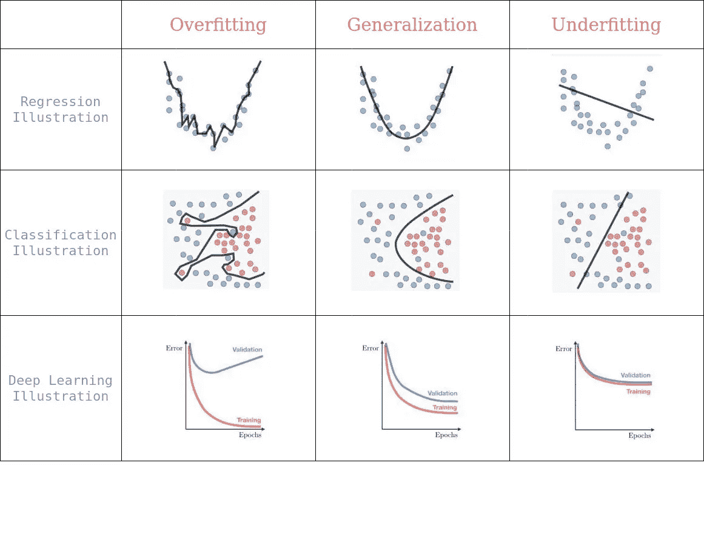*

*过度拟合 vs 一般化 vs 欠拟合*

> *在机器学习中，从训练数据中学习目标函数被描述为归纳学习。归纳是指从具体的例子中学习一般的概念，这正是有监督机器学习模型要解决的问题*

# *评估指标*

*分类、回归、排序、聚类、主题建模等任务有不同的度量标准。一些指标如下:*

1.  **分类指标(准确度、精确度、召回率、F1 分数、ROC、AUC、…)**
2.  **回归度量(MSE，MAE)**
3.  **排名指标(MRR、DCG、NDCG)**
4.  **统计指标(相关性)**
5.  **计算机视觉指标(PSNR、SSIM、IoU)**
6.  **NLP 指标(困惑度，BLEU 分数)**
7.  **深度学习相关指标(初始得分、Frechet 初始距离)**

> *注意:为了更好地理解，我计划在本文中关注分类和回归度量。*

# *1.分类指标*

## ***混淆矩阵***

*混淆矩阵是一个表格，通常用于**描述分类模型**(或“分类器”)对一组真实值已知的测试数据的性能。*

*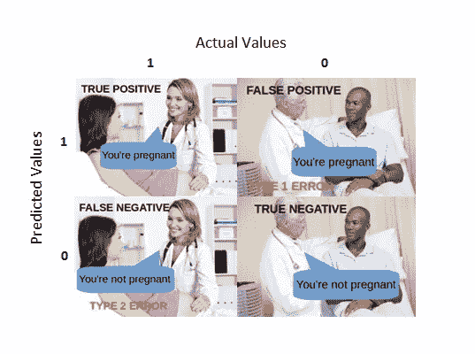*

*混乱矩阵。*

****真阳性(TP) —*** *真阳性是模型正确预测阳性类别的结果。**

****真否定(TN) —*** *真否定是模型正确预测否定类别的结果。**

****假阳性(FP)——****假阳性是模型错误预测阳性类别的结果。**

****假阴性(FN)——****假阴性是模型错误预测阴性类别的结果。**

# ***1.1 精度***

*准确性是评估分类模型的一个度量标准。形式上，准确性可以定义为正确预测的数量与预测总数之比。*

*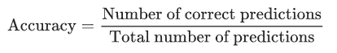*

*用真正的积极和消极来写这个，*

*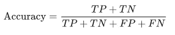*

*让我们考虑一个例子，并尝试找到它的准确性。*

*假设你试图建立一个简单的二进制分类来区分人类图像和非人类图像。假设你有 1100 张图片(100 张是人的图片，1000 张是非人的图片)，混淆矩阵如下。*

*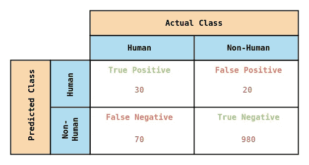*

*混淆矩阵*

*从混淆矩阵推断，*

1.  *从 **100 个人类图像**中，你的模型已经将 **30 个图像预测为人类***【TP】*，剩余 **70 个图像预测为非人类** *(FN)。**
2.  *从 **1000 幅非人类图像**中，您的模型已经将 **980 幅图像预测为非人类***【TN】*，剩余 **20 幅图像预测为人类***【FP】。**

*现在计算你的模型的精确度，*

*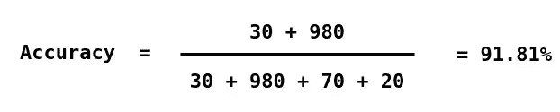*

*精确度计算*

*所以模型的准确率是 91.81%，非常好。*

*但是如果你仔细观察，当你处理一个**类别不平衡的数据集**时，准确性本身并不能说明全部情况，就像这个，其中正面和负面标签的数量之间存在显著差异。*

> *分类精度很高，但是给了我们达到高精度的错觉。*

**忍不住自己加了这个 meme**

**

# *1.2 精确度和召回率*

***精度**(也称为正预测值)是检索到的实例中相关实例的分数，而**召回**(也称为敏感度)是检索到的相关实例的分数。因此，精确度和召回率都基于相关性。*

*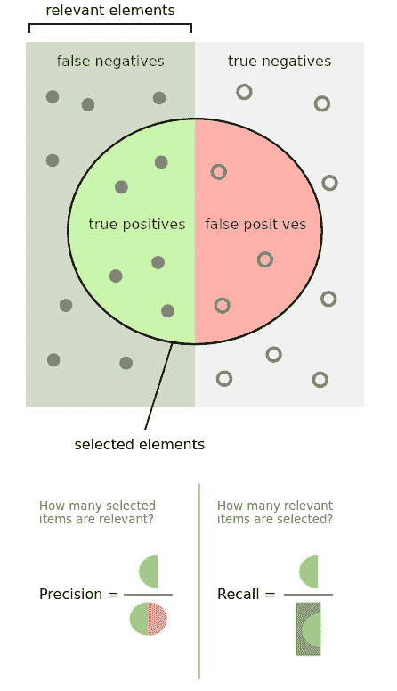*

*[精度和召回](https://en.wikipedia.org/wiki/Precision_and_recall#/media/File:Precisionrecall.svg)*

*在分类中，精度是真正的正实例的数量与被标记为属于正类的实例的总数之比。*

*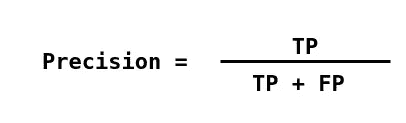*

*召回率是真正的阳性实例数与实际属于阳性类的实例总数之比。*

*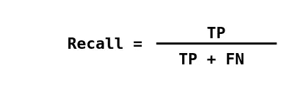*

*从准确性计算实例的精度和召回率，*

*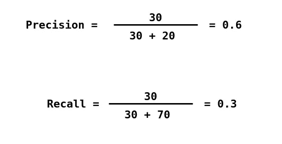*

*你的模型可以在 60%的时候预测人类，但它只能正确识别 30%的人类。*

> *高精度意味着算法返回的相关结果比不相关的结果多得多。高召回率意味着算法返回了大部分相关结果。*

## *PR 曲线*

*PR 曲线是一个简单的图表，y 轴表示精度值，x 轴表示召回值。换句话说，PR 曲线包含 y 轴上的 TP/(TP+FN)和 x 轴上的 TP/(TP+FP)。*

*希望该算法应该同时具有高精度和高召回率。然而，大多数机器学习算法往往涉及这两者之间的权衡。*

*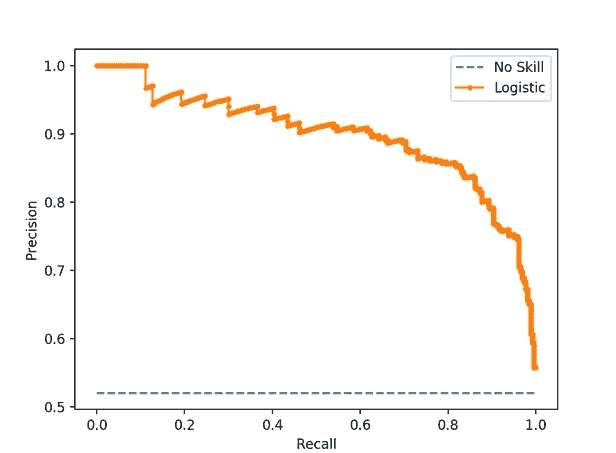*

*无技能分类器和逻辑回归模型的样本精确召回曲线*

# *1.3 F1 分数*

*根据应用的不同，您可能希望给予更高的召回或精度优先级。但是在许多应用中，召回率和精确度都很重要。因此，很自然会想到将这两者结合成一个单一指标的方法。**一个结合了精确度和召回率的流行指标被称为 F1 分数**，它是精确度和召回率的调和平均值，定义为:*

*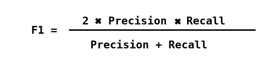*

****为什么谐音的意思？*** 由于一列数字的调和平均值强烈地偏向列表中最少的元素，它倾向于(与算术平均值相比)减轻大的[异常值](https://machinelearningmastery.com/how-to-use-statistics-to-identify-outliers-in-data/)的影响，并加重小的异常值的影响。*

> *一个缺点是，精确度和召回率同等重要，根据我们的应用，我们可能需要一个比另一个高，F1 分数可能不是它的精确度量。因此，加权 F1 分数或查看 PR 或 ROC 曲线会有所帮助。*

# *1.4 ROC*

***ROC 曲线** ( **接收器工作特性曲线**)是显示分类模型在所有[分类阈值](https://developers.google.com/machine-learning/crash-course/classification/thresholding)下的性能的图表。该曲线绘制了两个参数:*

*   *真实阳性率(回忆)*
*   *假阳性率(FPR)*

*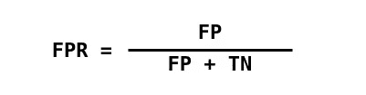*

*ROC 曲线绘制了 TPR 对不同分类阈值的 FPR。降低分类阈值会将更多的项目分类为阳性，从而增加假阳性和真阳性。*

*许多分类模型是概率性的，即它们预测样本是人类的概率。然后，他们将输出概率与某个截止阈值进行比较，如果它大于该阈值，则他们预测其标签为人类，否则为非人类。例如，您的模型可以预测 4 个样本图像的以下概率:**【0.45，0.6，0.7，0.3】**。然后根据下面的阈值，您将获得不同的标签:*

*截止值= 0.5:预测标签= [0，1，1，0](默认阈值)
截止值= 0.2:预测标签= [1，1，1，1]
截止值= 0.8:预测标签= [0，0，0，0]*

*如你所见，通过改变阈值，你会得到完全不同的标签。可以想象，这些场景中的每一个都会导致不同的精确度和召回率(以及 TPR、FPR)。*

*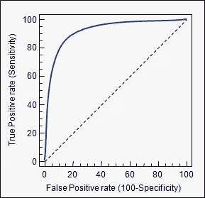*

*ROC 曲线样本*

*ROC 曲线有一个吸引人的特性:它们对阶级分布的变化不敏感。如果在一个测试集中正面和负面实例的比例发生变化，ROC 曲线不会改变。ROC 曲线的这一特征被称为**类偏斜独立性。***

*这是因为用于 ROC 的度量 TPR 和 FPR 与其他度量(如准确度、精确度等)相比，独立于类别分布。，受到不平衡的阶级分布的影响。*

*为了计算 ROC 曲线中的点，您可以使用不同的分类阈值多次评估逻辑回归模型，但这将是低效的。幸运的是，有一种有效的基于排序的算法可以提供这些信息，这种算法叫做 AUC。*

# *1.5 AUC*

*曲线 (AUC)下的**面积是二元分类器在所有可能的阈值上的性能的综合度量(因此它是阈值不变的 **)** 。也就是说，AUC 测量整个 ROC 曲线下的整个二维面积。***

*因为 AUC 是单位平方面积的一部分，所以它的值总是在 0 和 1.0 之间。然而，因为随机猜测产生(0，0)和(1，1)之间的对角线，其具有 0.5 的面积，**没有真实的分类器应该具有小于 0.5 的 AUC***

*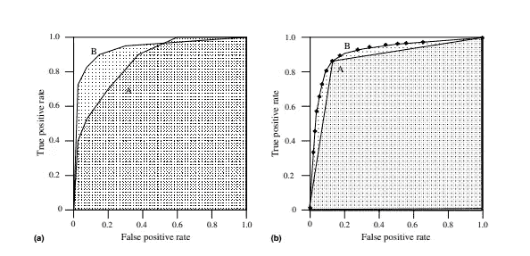*

*ROC 曲线下面积*

*出于以下两个原因，AUC 是可取的:*

*   *AUC 是**比例不变的**。它衡量预测的排名，而不是它们的绝对值。*
*   *AUC**是分类阈值不变的**。它测量模型预测的质量，而不管选择什么分类阈值。*

# *2 个回归指标*

# *2.1 均方误差*

***均方差** (MSE)或许是回归问题中最常用的度量标准。它实际上找到了预测值和实际值之间的平均平方误差。MSE 是对估计量质量的一种度量，它总是非负的，值越接近零越好。*

*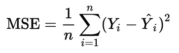*

*均方误差*

*其中 ***n*** *为数据点数，* ***yᵢ*** *为观察值，****ŷ****ᵢ为预测值。**

*在回归分析中，绘图是查看整个数据的总体趋势的一种更自然的方式。简单地说，MSE 告诉你一条回归线离一组点有多近。它通过从点到回归线的距离(这些距离就是“误差”)并平方它们来实现。平方对于降低负号的复杂度至关重要。它也给予较大的差异更多的权重。*

*为了最小化 MSE，模型可以更精确，这意味着模型更接近实际数据。使用这种方法的线性回归的一个例子是——评估线性回归模型对二元数据集的适用性的最小二乘法，但其局限性与数据的已知分布有关。*

> *MSE 越低，预测越好。*

# *2.2 平均绝对误差*

***平均绝对误差** (MAE)测量一组预测中误差的平均大小，不考虑它们的方向。它是预测和实际观察之间的绝对差异的测试样本的平均值，其中所有个体差异都具有相同的权重。*

*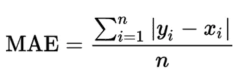*

*绝对平均误差*

*其中 ***n*** *为数据点数，****【xᵢ】****为真值，****【yᵢ】****为预测值。**

*可以将 MAE 表示为两个部分的和:数量不一致和分配不一致。*

*也可以通过查看(x，y)图来识别差异的类型。当 X 值的平均值不等于 Y 值的平均值时，存在数量差异。当且仅当点位于同一条线的两侧时，分配差异才存在。*

*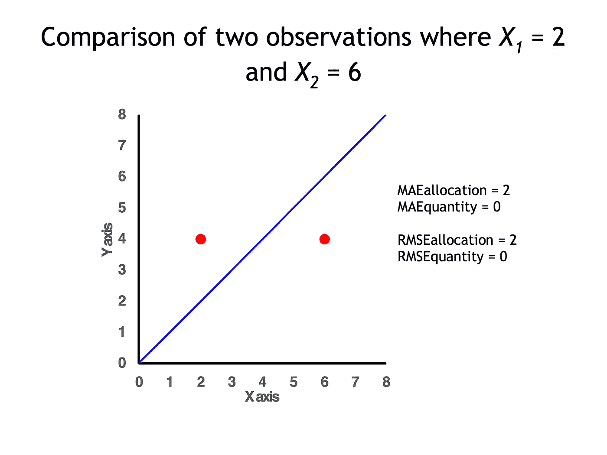*

*[MAE 和 RMSE](https://en.wikipedia.org/wiki/Mean_absolute_error#/media/File:MAE_example.png) 的 2 个数据点，数量分歧为 0，分配分歧为 2*

*众所周知，MAE 比 MSE 对异常值更稳健。主要原因是，在通过平方误差的 MSE 中，异常值(通常比其他样本具有更高的误差)在最终误差中得到更多的关注和支配，并影响模型参数。*

# *2.3 均方根误差*

***均方根误差或均方根偏差**是平方误差平均值的平方根。RMSE 是*残差*(预测误差)的标准差。*

*残差是数据点离回归线有多远的度量；RMSE 是对这些残差分布程度的一种度量。换句话说，它告诉你数据在最佳拟合线周围的集中程度。*

*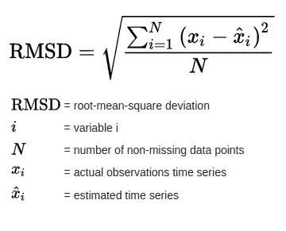*

*均方根偏差*

*每个误差对 RMSE 的影响与误差平方的大小成正比；因此，较大的误差会对 RMSE 产生不成比例的巨大影响。因此，RMSE 对异常值很敏感。均方根误差通常用于气候学、预测和回归分析，以验证实验结果。*

*当标准化观测和预报被用作 RMSE 输入时，与[相关系数](https://en.wikipedia.org/wiki/Correlation_coefficient)有直接关系。例如，如果相关系数为 1，RMSE 将为 0，因为所有点都位于回归线上(因此没有误差)。*

> *RMSE 总是非负的，值为 0(实际上几乎从未达到过)表示与数据完全吻合。一般来说，较低的 RMSD 比较高的要好。*

****喜欢深究这个吗？****

* [## 分类精度不够:你可以使用更多的性能指标-机器学习…

### 当你为一个分类问题建立一个模型的时候，你几乎总是想看看这个模型的准确性，因为…

machinelearningmastery.com](https://machinelearningmastery.com/classification-accuracy-is-not-enough-more-performance-measures-you-can-use/)  [## 评估您的机器学习算法的指标

### 评估你的机器学习算法是任何项目的重要组成部分。你的模型可能会让你满意…

towardsdatascience.com](https://towardsdatascience.com/metrics-to-evaluate-your-machine-learning-algorithm-f10ba6e38234)  [## 平均绝对误差-维基百科

### 在统计学中，平均绝对误差(MAE)是表达相同数据的成对观察值之间误差的度量

en.wikipedia.org](https://en.wikipedia.org/wiki/Mean_absolute_error)  [## 分类:精度和召回|机器学习速成班

### " type": "thumb-down "，" id ":" missingtheinformationneed "，" label ":"缺少我需要的信息" }，{ "type"…

developers.google.com](https://developers.google.com/machine-learning/crash-course/classification/precision-and-recall)  [## 分类:ROC 曲线和 AUC |机器学习速成班

### " type": "thumb-down "，" id ":" missingtheinformationneed "，" label ":"缺少我需要的信息" }，{ "type"…

developers.google.com](https://developers.google.com/machine-learning/crash-course/classification/roc-and-auc) 

*如果您当前提高模型效率的方法需要更多的调整，请实施建议的效率指标。机器学习模型的性能依赖于效率指标，你必须在这些方面下功夫。*

***有什么提高模特效率的小技巧吗？请在下面的评论区与我们分享。***

*感谢阅读！！**