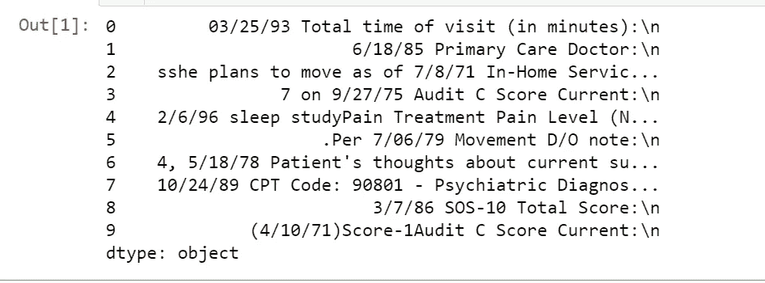
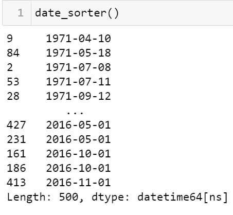

# 如何使用 python 从现实世界的数据中提取所有日期变量。

> 原文：<https://medium.com/analytics-vidhya/how-to-extract-all-date-variants-from-real-world-data-using-python-c9dc7413954c?source=collection_archive---------1----------------------->

使用 python 中的数据挖掘技术从结构化和非结构化数据中挖掘所有日期变量的实用权威指南。

照片由[保尹](https://unsplash.com/@insungyoon?utm_source=medium&utm_medium=referral)在 [Unsplash](https://unsplash.com?utm_source=medium&utm_medium=referral)

无论您是数据科学家还是分析师，总有一天您会遇到与日期和时间有关的问题。

当数据被很好地整理和组织在像`06/18/2021, 09/27/2000`这样的数据框的单个列中时，生活变得更加容易。不幸的是，事情并不总是这样。

当你得到类似于`7/20`的东西，甚至是一句话，比如“他在黎明时分乘`2/21`号来到医院”，你如何提取日期呢

在我们不知所措之前，让我们开始吧！！

**项目目标** 我们的目标是正确识别数据集中编码的所有不同日期变量，并对它们进行适当的规范化和排序。

**东西学**
1。使用[熊猫对医疗数据进行基本操作。](https://pandas.pydata.org/)2
2。使用 [python 正则表达式(Regex)提取所有日期变量。](https://www.tutorialspoint.com/python/python_reg_expressions.htm)
3。根据一些概述的规则，按时间升序对日期进行排序。
4。摘要

以下是我们可能需要处理的一些日期变量:

*   `04/20/2009; 04/20/09; 4/20/09; 4/3/09`
*   `Mar-20–2009; Mar 20, 2009; March 20, 2009; Mar. 20, 2009; Mar 20` `2009;`
*   `20 Mar 2009; 20 March 2009; 20 Mar. 2009; 20 March, 2009`
*   `Mar 20th, 2009; Mar 21st, 2009; Mar 22nd, 2009`
*   `Feb 2009; Sep 2009; Oct 2010`
*   `6/2008; 12/2009`
*   `2009; 2010`

让我们学习一些有用的正则表达式，为旅程做准备

**[]** :匹配`[]`中的一组字符

**【a-z】**:匹配范围字符`a,b, …,z`中的一个

**a|b** :匹配`a`或`b`，其中`a`和`b`为字符串

**()** :运算符范围

**\** :特殊字符的转义符`(\t, \n, \b)`

**\b** :匹配单词边界

**\d** :任意数字，相当于`[0–9]`

**\w** :字母数字字符，相当于`[a-zA-Z0–9_]`

任何空白

***** ':匹配零个或多个匹配项

**+** ':匹配一个或多个事件

**？**:匹配零个或一个匹配项

**{n}** :正好 n 次重复，`n≥0`

**{n，}** :至少`n`次重复

**{，n}** :最多`n`次重复

**{m，n}** :最少`m`最多`n`次重复

**一些有用的功能**

`re.search(pattern,string,flags=0)` : [该函数使用可选的*标志*在*字符串*中搜索 RE *模式*的第一次出现。](https://www.tutorialspoint.com/python/python_reg_expressions.htm)

`re.match(pattern, string, flags=0)` : [该功能试图将 RE *模式*与*字符串*匹配到可选的*标志*。](https://www.tutorialspoint.com/python/python_reg_expressions.htm)

1.  **导入库**

*NB:* `*re*` *是 python 正则表达式*

**2。加载数据**

**3。日期提取**

I .我们用以下格式提取日期:`04/20/2009; 04/20/09; 4/20/09; 4/3/09`

二。提取日期格式`# Mar-20–2009; Mar 20, 2009; March 20, 2009; Mar. 20, 2009; Mar 20 2009;`

**关于。I** 执行不区分大小写的匹配。

**关于。M** 让$匹配一行的结尾(不仅仅是字符串的结尾)，让^匹配任何一行的开头(不仅仅是字符串的开头)。

三。用格式`# 6/2008; 12/2009`提取日期

四。用格式提取日期；`# 2009; 2010`

动词 （verb 的缩写）连接所有系列

不及物动词让我们将以上所有内容放在一个函数中

**4。重新格式化提取的日期**

虽然我们已经提取了日期，但还是有一些规则可以将日期整理得很好。

**规则#1**
假设 `xx/xx/xx`格式的所有日期都是`mm/dd/yy`

**规则#2**
假设所有年份编码为两位数的日期都是 1900 年代以后的年份(例如 1/5/89 是 1989 年 1 月 5 日)。让我们做这个转换。

**规则#3**
如果缺少日期(例如 9/2009)，则假设它是该月的第一天(例如 2009 年 9 月 1 日)。让我们这样做:

**规则#4**
如果缺少月份(如 2010 年)，则假设是该年的 1 月 1 日(如 2010 年 1 月 1 日)。让我们这样做:

**规则 5**
注意潜在的错别字，因为这是一个原始的、真实的衍生数据集。

**5。将文字中的日期转换为数字**

我们需要按照特定的时间顺序将数据分类。因此，所有用文字书写的日期都必须转换成数字。一月是 1 日，二月是 2 日…十二月是 12 日。

让我们写一些函数来解决这个问题。

现在让我们将整个代码部分合并成一个整体

通过调用函数`date_sorter()`，所有的日期都将从文本中提取出来，并按照大小的升序排列，如下所示。

6。总结

*   我们学习了这个项目所需的正则表达式。
*   我们介绍了一些有用的 re 函数，如`match`和`search`。
*   所有日期变量都是从给定文档中提取的。
*   根据特定的规则，数据被重新格式化
*   words 中的所有日期都被转换成数字以便排序
*   提取的日期然后按大小升序排序。