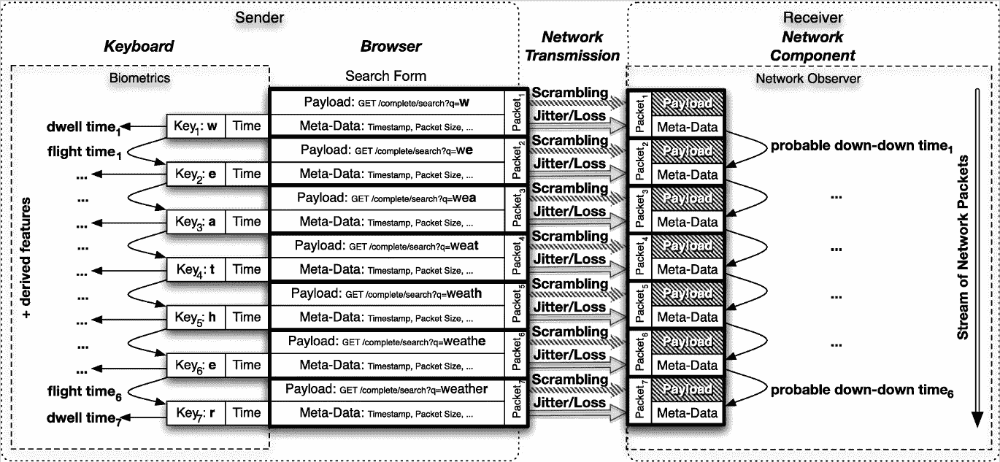
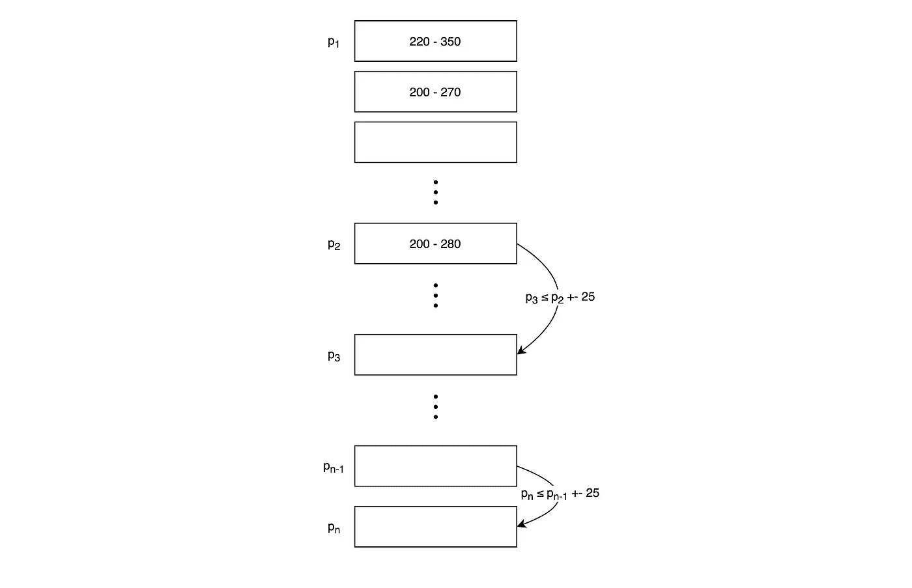
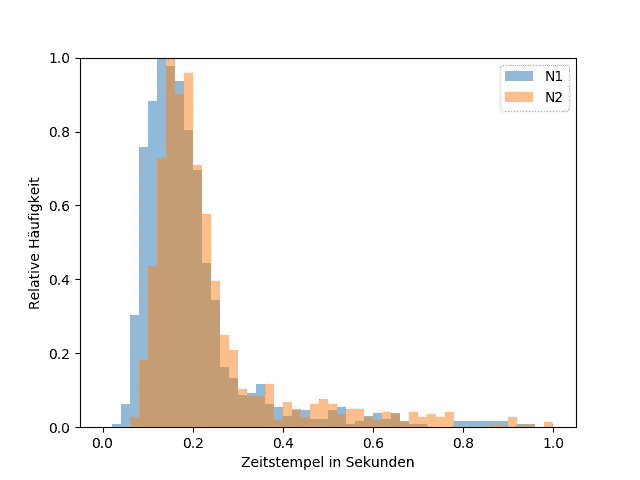
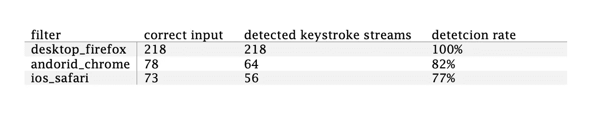

# 根据打字行为通过谷歌搜索识别用户

> 原文：<https://medium.com/analytics-vidhya/how-to-extract-keystroke-biometrics-from-encrypted-google-search-traffic-2772aaa47ed9?source=collection_archive---------16----------------------->

如何从加密的谷歌搜索流量中提取击键生物特征？

# **简介**

个人资料的概念是一般资料保护条例的基本要素。它包括与已识别或可识别的自然人有关的所有信息。在 GDPR 的框架内，试图特别保护这些数据。而且通过所谓的元数据，也可以得出关于个人身份的结论，而元数据并没有受到 GDPR 的明确保护。搜索引擎的搜索建议功能(SSF)提供了从结果元数据中分配信息的可能性。

> 搜索引擎的搜索建议功能(SSF)是基于已经输入的键入序列自动建议和完成可能的搜索查询。

该功能通过在输入搜索查询时记录网络数据流以及相关网络数据包的标识，使得当用户基于这些数据包输入键盘时测量生成的打字生物测定成为可能。

[资料来源](https://doi.org/10.1186/s13635-020-0100-8):加密领域的击键生物测定学:由 Nicholas Whiskerd、Nicklas Kö rtge、Kris Jürgens、Kevin lamshft、Salatiel Ezennaya-Gomez、Claus Vielhauer、Jana Dittmann 和 Mario Hildebrandt 编写的关于网络搜索引擎的搜索建议功能的首次研究， [CC BY 4.0](https://creativecommons.org/licenses/by/4.0/)

该图显示了单词“天气”的输入和击键生物测定之间的关系。击键间时间(这些是表示两次击键之间经过时间的时间值)可以根据打字序列的包的时间戳来计算和评估。

本文描述了如何从网络流量的快照中提取这些相关的数据包。

更多的理论背景，请看这篇[论文](https://jis-eurasipjournals.springeropen.com/articles/10.1186/s13635-020-0100-8)。

# **接近**

实现提取生物特征信息的功能的技术途径是，将解决方案划分到不同的组件上。首先，Wireshark 会嗅探网络流量。为了向我们自己的应用程序提供捕获的流量，数据将被存储到一个 PCAP 文件中。开发的软件将访问这些数据，并对其应用过滤器。过滤器包含一组值，模式算法使用这些值提取每个击键序列的相关数据包。由此，击键间时间可以被计算为击键生物测定的可测量表示。

*   **网络流量:** [Wireshark](https://www.wireshark.org/) 用于捕获网络流量。结果将导出为 PCAP 文件(Wireshark/tcpdump/…-pcap)。
*   **过滤器:**为了配置算法的不同参数，为每个不同的环境创建一个额外的过滤器。
*   **击键生物特征:**击键生物特征将以 [ARFF](https://www.cs.waikato.ac.nz/ml/weka/arff.html) 格式导出为击键间时间。

# **实现**

前言:本文仅涵盖并解释了应用程序的主要逻辑。完整的程序可在 [GitHub](https://github.com/n1ckl0sk0rtge/KeystrokeExtractor) 上获得。

为了捕获在 PC 上使用 Firefox 的用户的击键，配置文件如下所示:

该文件包含五个不同的部分和一些子部分:

*   **IP 版本** : IP 版本:此处最初指定 IP 版本。由于可能会自动检测使用的 IP 版本，此选项在未来版本中可能会过时。目前，所使用的 IP 版本必须通过配置文件提供。
*   **端口**:该值指定目的端口，通过该端口过滤网络流量。
*   **输入短语:**输入短语值可配置为将识别的击键与输入短语的实际预期字母进行比较。该选项是开发过程中质量检查的一部分，仅在网络流量被解密且盲模式关闭时可用。
*   **系统:**这个字符串值定义了生成搜索查询的系统。不同的设备类型和操作系统会影响哪种模式算法可用于检测网络流量中的数据包。Web 浏览器只影响窗口大小(下一个要点)，但对搜索正确网络数据包的逻辑过程没有影响。
*   **Windows:** 这部分配置最重要。它定义了模式算法将从击键流中检测不同类型的包的范围，例如序列的第一个(开始)包。有关不同值的更详细解释，请参见模式算法的解释。
*   **错误流计数器:**该值规定了在模式算法返回当前打字序列结束且可能开始新序列之前，检测到的不属于击键流的数据包的最大数量。

## 模式算法

模式算法构成了这个应用程序的主要逻辑。下面的代码是通过不断的测试创建和改进的，直到结果足够好。

在 PC 上使用 firefox 时，从输入序列中检测到的软件包模式。

在开发从击键流中识别数据包的模式算法之前，必须首先定义实际的模式。用于搜索和键入。在 PC 上使用 Firefox 的 Google 搜索引擎中，模式看起来如上图所示。对应于输入的第一次键击的第一分组的大小在 220 和 350 字节的范围内。为了识别这是击键流的第一个包，下一个包(来自按目的地端口、目的地 IP 和 TCP 有效载荷预过滤的包序列)的大小在 200 和 270 字节之间。作为该击键序列的一部分的任何其他传入分组的大小在 200 到 280 字节的范围内，并且不大于或小于前一分组的大小加或减 25 字节。如果在最后一个有效包之后，检测到超过 10 个(错误流计数器)包不满足作为键击流一部分的包的要求(大小在 200 和 280 之间，与前一个相比+/- 25 字节),则键击序列终止。

在模式算法的实现中，网络流首先通过以下方式过滤:

*   **目的端口**:检查目的端口是否为 443
*   **目的 IP** :检查数据包的目的 IP 地址是否是来自 Google 的地址
*   **有效载荷**:检查包装中是否包含有效载荷

如果网络流的数据包满足所有三个要求，则调用`lookup_for_new_stream()`函数，通过调用`is_new_stream`来检查该数据包是否可能是击键流的开始。

如果至少检测到一个流的开始，则为每个通过过滤器的新包调用`lookup_for_new_packages_of_current_stream()`函数。在这个函数中，如果当前选择的流只包含一个包，则调用`is_second_package_of_stream`来检查当前包是否满足第二个包的属性。

同样的，每次`is_second_package_of_stream`返回 false 时`lookup_for_new_packages_of_current_stream()`内部的`is_next_package`函数被调用。对于同一个选中的包，该函数检查它是否有资格成为击键流的下一个包。

围绕这种用于检测网络流中击键序列模式的逻辑，必须实现用于管理信息的其他功能。

> 完整代码可通过 [Github](https://github.com/n1ckl0sk0rtge/KeystrokeExtractor) 获得。

# 结果

通过从给定个体收集足够数量的击键间时间，生物测定打字行为可以被映射为所有数据点上的频率分布

该图可视化了通过捕获加密的 Google 搜索流量(x 轴:相对频率，y 轴:以秒为单位的击键间隔时间)收集的两个不同个人的生物特征打字行为。

> 通过比较不同的打字行为分布，仅仅通过观察加密的网络流量就有可能检测和识别一个人！

# 质量

为了描述模式算法的质量和正确性，可以使用两种类型的错误类。

**假阴性:**

**误报:**

*   在不使用谷歌搜索的情况下捕获网络流量
*   Wireshark 检测到大约 11000 个包
*   如果不检查 ip 和端口，模式算法将检测不到击键序列

 [## n1 ckl 0 sk 0 rtge/KeystrokeExtractor

### 在 GitHub 上创建一个帐户，为 n1 ckl 0 sk 0 rtge/KeystrokeExtractor 的开发做出贡献。

github.com](https://github.com/n1ckl0sk0rtge/KeystrokeExtractor)