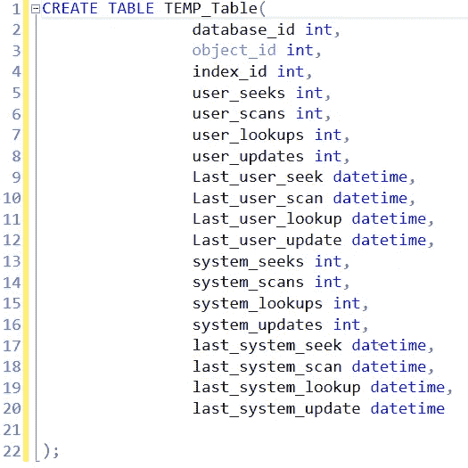
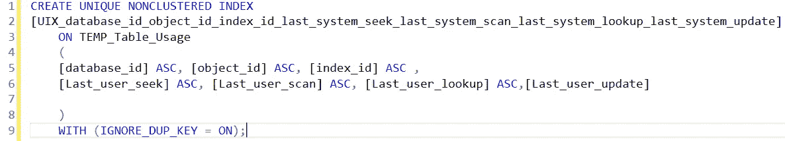
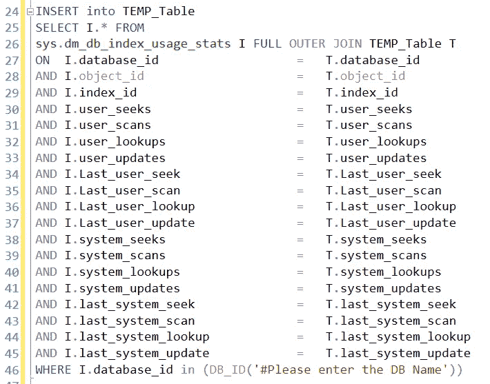

# 如何在 SQL Server 中找到最常用和最少使用的表？

> 原文：<https://medium.com/analytics-vidhya/how-to-find-most-used-and-least-used-tables-in-sql-server-944102c65926?source=collection_archive---------1----------------------->

在本文中，我们将解决如何在 SQL Server 中找到最常用和最少使用的表这一最常见的问题。这将有助于我们清理数据库，组织我们使用的表，删除不必要的表。

我们在 SQL Server 中有一个默认视图**sys . DM _ db _ index _ usage _ stats**，它存储表的使用信息。但是，当 SQL Server 重新启动时，这将丢失其数据。所以为了解决这个问题，我想出了周边工作。

我创建了一个每 3 小时运行一次的 SQL 作业来备份上述视图，并使用新数据增量加载临时表。在这种方法中，即使视图数据丢失，我们在临时表中仍有备份数据。大约一个月后，我们有足够的数据来识别最近使用的表以及它们的最后访问和修改日期。

首先，我们将创建一个具有类似列的临时表，如 view**sys . DM _ db _ index _ usage _ stats**，我们将加载临时表。

在加载之前，我们需要创建一个唯一的聚集索引，这将停止插入冗余数据并避免重复。

现在，我们准备将数据插入临时表中。我们将使用下面的代码连接两个表。

最后，我们需要指定我们关注哪个数据库，以便只记录那些数据库的表信息。现在将它作为存储过程，并按照指定的频率安排运行。

现在，我们可以使用这个临时表创建一个视图，通过使用这个函数将 DB_ID 和 OBJECT_ID 分别解析为数据库名和表名，从而使这个视图更有意义。数据库名称(数据库标识)，对象名称(对象标识)。

我们还可以将这个表与 **sys.indexes、sys.partitions、sys.allocation_units、sys.schemas、sys.objects 视图连接起来，找出以 GB/MB 为单位的已用空间。**

我已经使用了这个查询，并在 PowerBI 中创建了一个仪表板来检查表的使用情况。希望这有所帮助，如果有任何更正，请给我建议。

如果有任何错误/疑问，请分享或评论。我希望你们都喜欢阅读这篇文章。

谢谢你。