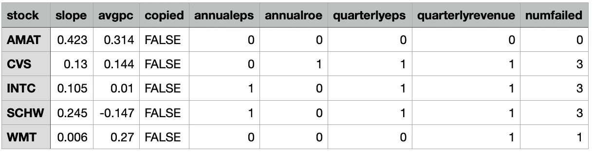

# 如何使用 Python 寻找股票进行投资

> 原文：<https://medium.com/analytics-vidhya/how-to-find-stocks-to-invest-in-using-python-87b5169190d5?source=collection_archive---------2----------------------->


Hart Rockwell 摄于新西兰奥克兰

我着迷于股票市场，并发现它是无数想法使用 Python 转化为项目的灵感。本文概述了下载公司财务报告、对财务数据运行一系列测试以及总结哪些股票通过了测试的过程。这篇文章旨在尽可能简化选择股票投资的过程。

将涵盖以下部分:

1.  如何寻找股票进行投资
2.  运行脚本需要什么
3.  主要功能概述
4.  输出文件的描述
5.  如何使用输出文件选择股票
6.  布丁中的证据

不应该假设这里介绍的方法、技术或指标会盈利或不会导致亏损。

你可以在这里查看库！


由[劳埃德·布兰克](https://unsplash.com/@blunkorama?utm_source=medium&utm_medium=referral)在 [Unsplash](https://unsplash.com?utm_source=medium&utm_medium=referral) 上拍摄

# 如何寻找股票进行投资

我对寻找有前途的股票的大部分研究来自威廉·奥尼尔的《如何在股票中赚钱》一书。尽管我读的这一版是 2009 年出版的，而且自那以后市场已经发生了巨大的变化，但我相信，有一些基本的衡量标准永远可以识别一家成功的公司。

以下是我的脚本使用的指标:

*   [收入/销售](https://www.investopedia.com/terms/r/revenue.asp)
*   [净收入](https://www.investopedia.com/terms/n/netincome.asp)
*   [股东权益](https://www.investopedia.com/terms/s/shareholdersequity.asp)
*   [已发行股份](https://www.investopedia.com/terms/o/outstandingshares.asp)
*   [每股收益](https://www.investopedia.com/terms/e/eps.asp)
*   [净资产收益率](https://www.investopedia.com/terms/r/returnonequity.asp)

奥尼尔的书主要基于一个名为 CAN SLIM 的首字母缩略词。我开发的 Python 脚本利用了前两个字母。

## 当前季度收益和销售额

每股季度收益必须至少增长 18-20%，但最好增长 40-100%或更多。越高越好。在最近几个季度的某个时候，它们也应该在加速增长。季度销售额也将加速增长或达到 25%或更多。

## 年收入增加

在过去三年中，每年必须有显著(25%或以上)的收入增长，并且股本回报率达到 17%或以上(25-50%优先)。如果股本回报率太低，税前利润率必须很高。

利用这些知识，我设置了脚本来测试股票，如下所示:

1.  年度报告的每股收益必须至少增长 20%
2.  年度报告的净资产收益率必须至少增长 17%
3.  季度报告的每股收益必须至少增长 20%
4.  季度报告必须有至少 20%的销售增长

百分比增长是逐年的，例如，从 2020 年第一季度到 2021 年第一季度的百分比变化。


[在华尔街日报上找到](https://www.wsj.com/articles/BL-TOTALB-1670)

# 运行脚本需要什么

要开始使用这些脚本，您需要一个要处理的股票代码列表。您可以生成自己的符号列表，也可以从网上下载列表。我已经用[交易视图](https://www.tradingview.com/)、[股票图表](https://stockcharts.com)和 [finfiz](https://finviz.com) 下载了一个*。股票符号的 csv。如果你不想付费订阅，这些网站有一个月的免费试用期。当我使用这些脚本时，我通常会下载一个价格范围的符号列表，或者寻找特定行业的股票。


带符号栏的股票列表示例

最重要的是。csv 需要有一个标记为“Symbol”的列，其中包含所有要处理的股票符号。

您还需要一个来自 Alpha Vantage 的免费 API 密匙[,用于下载财务报告。](https://www.alphavantage.co/support/#api-key)


沃尔玛(WMT)季度损益表


沃尔玛(WMT)季度资产负债表

API 将下载四个报告:季度损益表、季度资产负债表、年度损益表和年度资产负债表。这些报告将提供与你在 SEC.gov 找到的相同的财务信息。上面的两个数字突出了脚本中使用的列:总收入、净收入、股东权益和流通股。

*你需要运行的两块* [*脚本*](https://gitlab.com/hartr/stock-search-public.git) *都是*。您想要处理的所有股票的 csv 和 API 密钥。*

一旦下载了存储库和必要的 Python 包，只需从命令行解释器运行以下命令:

```
python findStocks.py --stock_list "Your Stock List.csv" --key "YOURAPIKEY"
```


[在 Glasbergen 卡通服务上找到](https://www.glasbergen.com/ngg_tag/stock-market-humor-cartoon-comics/)

# 主要功能概述

下面你会看到脚本的一般过程。

## 伪代码

```
Download the data
for stock in all_stocks
    Run preliminary tests on stock
    Calculate additional metrics
    Run main tests
    Save financial data for stock
Save results for all stocks
```

下面你会看到主函数和解释过程的详细注释。

## [findStocks.py](https://gitlab.com/hartr/stock-search-public)

```
if __name__ == '__main__': # Get user inputs
    stockFile, dataFolder, apikey, flexible, record = getInputs() # Get financial report data
    symbols = getData(stockFile, dataFolder, apikey) # Loop through all stocks
    for s in symbols:
        print('>>>', s) # Initialize Stock object
        stock = Stock(s, dataFolder, flexible) # Run preliminary tests to check if stock is disqualified
        preliminaryTests(stock) # Skip stock if it failed preliminary tests. Update
        # the *Processed.csv
        if stock.errorMessage != 'processed':
            updateProcessed(stockFile, s, stock.errorMessage)
            continue for r in stock.reports:
            # Manage missing data and other inconsistencies in data
            manageBadData(stock, r) # Calculate new metrics and run stock tests
            analyzeStock(stock, r) # Save data and update files
        record = saveResults(stock, s, stockFile, record) # Save the test results for all stocks
    columns = [x for x in stock.record.keys()]
    saveAll(record, columns)
```

我创建了一个 *preliminaryTests* 函数，它将运行可以取消股票进一步分析资格的初步测试。取消股票资格可以加快运行时间，减少保存的文件数量。它还减少了 **Results.csv* 中的股票数量，从而减少了最终分析的混乱和混乱。初步测试包括以下内容:

1.  最近两个季度报告和最近一个年度报告不能有负的净收入。
2.  该股不可能正在经历调整。稍后将详细讨论这个初步测试。
3.  从 Alpha Vantage 下载的财务报告，一半以上的数据都不能少。
4.  财务报告必须以美元报告。


[在推特上找到的](https://twitter.com/Calvinn_Hobbes/status/502817542940143617/photo/1)

# 输出文件的描述

运行脚本后，将保存以下文件和文件夹:

*   **Results.csv* 总结测试结果。
*   **Processed.csv* 跟踪哪些股票已经处理以及任何错误信息。
*   *数据*文件夹包含使用 Alpha Vantage API 下载的数据。
*   *已处理的*文件夹将包含压缩的财务报告。*Results.csv 中包含的所有数据都是使用已处理文件夹中的文件计算的。


Example *Processed.csv 显示所有成功处理的股票

上图是*Processed.csv. This *的一个例子。csv 用于跟踪哪些股票已被处理，以及在处理股票时发生的任何错误。

从 Alpha Vantage 下载的数据经常丢失或不正确。我已经编写了代码，以便在出错时将错误消息保存到*Processed.csv 文件中。

一些错误消息可以通过手动清理和更正财务报告来更正。如果您想更正错误或阅读关于错误消息的更多信息，您可以阅读脚本顶部的 docstring[findstocksclasses . py](https://gitlab.com/hartr/stock-search-public.git)。


处理过的沃尔玛(WMT)财务数据

处理后的文件夹将有每只股票的压缩财务数据(见上图)。

财政日期、总收入、净收入、股东权益和已发行股票直接取自资产负债表和损益表。所有其他列都经过计算，用于测试库存质量。

为了减少文件数量，我把季度报告和年度报告连接在一起。这就是日期从 2017 年 7 月 31 日跳到 2020 年 1 月 31 日的原因。百分比变化是逐年计算的，上图中的空单元格是由于没有数据来计算百分比变化。



*总结库存质量的 Results.csv

运行脚本后，a *Results.csv 将提供哪些股票值得投资的信息(见上图)。

## 倾斜

第二列*斜率*是衡量股价最近上涨多少的一种方式。我创建了一个简短的算法，对最近的股票价格变化进行加权，使其比几个月前的价格变化更重。斜率值越大，最近涨价幅度越大。价格变化率是用从[雅虎下载的数据计算出来的财务 API](https://pypi.org/project/yahoo-finance/) 。

下面你可以看到斜率是如何计算的。您也可以在 findStocksClasses.py 中查看第[行 179-206 的代码。](https://gitlab.com/hartr/stock-search-public)

```
# Download ticker data
df = yf.download(self.s, period='1y', interval='1d')# Get the most recent close price
last = df.iloc[-1, 3]
self.changes = []
adjSlope = 0
normalizer = 0# Example dates: [9/1/2020, 10/1/2020, 11/1/2020, 12/1/2020,
#                 1/1/2021, 2/1/2021]
for i in range(len(dates)): # Fist of the month might not be a day that the stock market is
    # open. If not then subtract one day until it is in df.index
    d = dates[i]
    while d not in df.index or d in self.daysClosed:
        d -= td(days=1)

    # Get close price
    price = df.loc[d, 'Close']

    # Calculate percent change
    pc = (last - price) / price

    # Weight increases each month
    # More weight is added to recent slopes
    weight = i + 1 # Add to normalizer, this will normalize the cumulative slopes.
    normalizer += weight

    # Add to the cumulative slope
    adjSlope += pc * (weight)
    self.changes.append(pc)self.record['slope'] = round(adjSlope / normalizer, 3)
```

## 平均百分比变化

第三列 *avgpc* 是最近三个季度总收入百分比变化和 EPS 百分比变化的平均值(六个值的平均值)。平均百分比变化衡量了过去三个季度中每个季度的平均收入和每股收益的同比增长情况。

## 复制

我添加了一个*复制的*列，如果财务信息(除了发行在外的股票)是从最近的季度/年度报告中复制的，该列将具有真实值。使用 Alpha Vantage API 经常会丢失数据。对于已发行的股票来说尤其如此。如果数据丢失，则复制下一个最旧报告中的数据，以避免用户输入丢失的数据。如果被复制，在*复制*栏会有一个真值。如果用户想要找到并输入任何丢失的数据，则由用户决定。可以将脚本配置为在遇到缺失数据时等待用户输入。更多信息见[库](https://gitlab.com/hartr/stock-search-public.git)。

## 股票测试

接下来的四列 *annualeps、* *annualroe* 、 *quarterlyeps* 和*quarterly revue*是我在本文第一部分中描述的测试。这些测试包括年报 EPS 增长 20%以上，年报 ROE 增长 17%以上，季报 EPS 增长 20%以上，季报销售额增长 20%以上。如果这些测试中的任何一个失败，值 1 将被保存。 *numfailed* 列是失败的测试的数量(四个测试列的总和)。


[发现米考伯原理](http://micawberprinciple.com/riding-the-stock-market-roller-coaster-2859/)

# 如何使用输出文件选择股票

当我分析*Results.csv 时，我对 *numfailed* 列进行升序排序。通过所有测试的股票将有一个 0，并在表格的顶部。

在我找到通过可接受数量测试的股票后，我开始调查这些公司。以下是奥尼尔的《如何在股票中赚钱》中涉及的一些研究课题。

## 公司是做什么的？

该公司是否属于科技等有前途的行业？T21 公司从新冠肺炎疫情中获益了吗(也许是暂时的)？

## 无论他们有新产品还是管理

他们有能大幅增加收入的新产品吗？同样，他们有新的管理层吗？选择创业型管理人员，而不是看护人员。大公司规模往往导致缺乏想象力和生产效率。它们通常变化缓慢，由较老的管理层保守地管理。

## 如果他们有机构赞助

推高价格需要巨大的需求，到目前为止，股票需求的最大来源是机构投资者。股票也应该由最高管理层拥有。


[在下层漫画上找到的](https://theunderfold.com/2020/03/16/the-stock-market-is-crashing/)

# 布丁中的证据

为了用证据支持我寻找股票的努力，我用本文概述的方法分析了我的雇主 401(k)和我找到的股票。


上面你会看到我通过运行脚本找到的八只股票与我的 401(k)相比如何。每个数据点显示了投资账户每月的百分比变化。我还画出了两只表现最好的股票:Etsy 和可再生能源集团(REGI)。

上图中的数据始于 2020 年 8 月，当时我觉得有信心在 2020 年春季的高波动期结束后，将债券投资转移到股票。尽管这不是一个足够长的时间来做出明确的结论，但我选择的股票在除了一个月之外的所有月份都超过了我的 401(k)计划，这是有希望的。


照片由[罗伯特拜拜](https://unsplash.com/@robertbye?utm_source=medium&utm_medium=referral)在 [Unsplash](https://unsplash.com?utm_source=medium&utm_medium=referral)

# 结论

这篇文章简要介绍了我用来寻找高质量股票的指标。我提供的大部分信息都是使用脚本以及如何解释文件和数据的手册。你所需要的只是一个股票代码列表和一个来自 Alpha Vantage 的 API 密匙。

我花了几个小时使用合理的研究和 Python 来简化寻找股票的过程。我已经成功地用这些脚本找到了股票，我相信开源软件的精神。我希望你也能有同样的成功！

您可以查看[存储库](https://gitlab.com/hartr/stock-search-public)来查看本文中包含的所有数据，以及关于运行脚本的更多信息。感谢您的阅读，交易愉快！