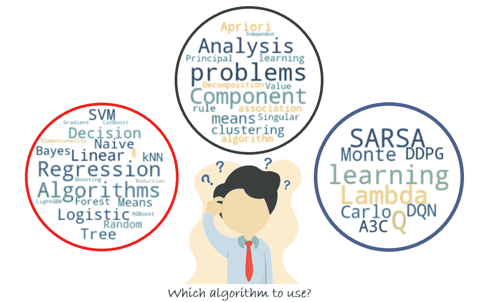

# 如何找到性能最好的机器学习算法

> 原文：<https://medium.com/analytics-vidhya/how-to-find-the-best-performing-machine-learning-algorithm-dc4eb4ff34b6?source=collection_archive---------9----------------------->

## 入门指南

## *本文展示了用于分类或回归的多种机器学习算法的快速比较方法。*

附注:我做了这个横幅

想象一下这样一种情况，您想要测试给定的数据集是否有足够的特征来训练机器学习算法或…