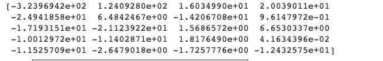
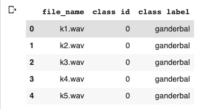
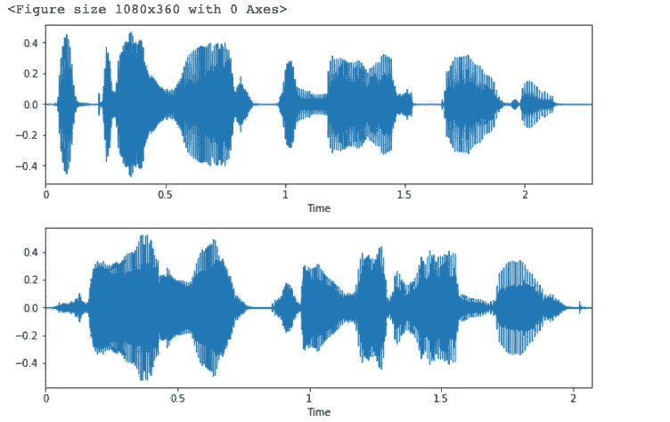
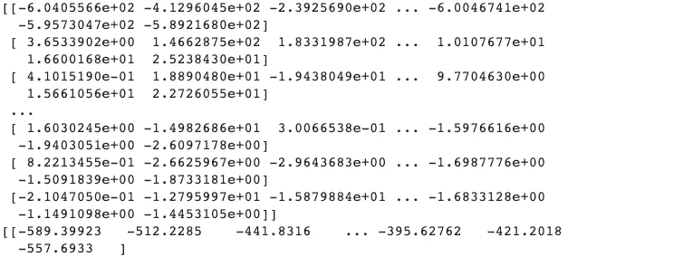
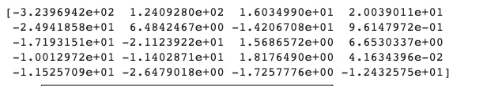

# 如何从音频生成 MFCC？— ML 代表懒惰 2021

> 原文：<https://medium.com/analytics-vidhya/how-to-generate-mfcc-from-audio-ml-for-lazy-2021-42c2fdfa208?source=collection_archive---------8----------------------->

MFCCs 在音频处理和语音识别系统中非常重要。假设你想让一台机器对音频声音进行分类，使用 MFCCs，并得到令人着迷的结果。

***想学习我们如何使用 python 来完成这个复杂的任务，并在音频处理和分类任务中获得最佳结果。那么，让我们来了解一下什么是 MFCC 以及如何获得它们的基本概念。***

# 什么是 MFCC

MFCC，梅尔频率倒谱系数的首字母缩写。当我们处理音频和音频处理技术时，它们非常重要。只要考虑它们，你的音频中最好的，你的音频所代表的最好的。

虽然完整的形式和缩写看起来紧张和复杂，但它是如此简单的概念，易于理解。

让我试着让你理解这个“看起来像火”的概念。打个比方，你在课堂上学习，你有一个激发学生玩某种游戏的计划，比如足球。不，你每天都在讲课，持续 10 天，在第 10 天结束时，学生们开始加入俱乐部，开始踢足球。那些学生受到激励，加入了进来。

在你的演讲中，你说了一些有趣的事情和一些奇怪的事情。加入俱乐部的学生只考虑那些在现实世界中影响他们的积极因素。而那些没有加入的人拿着怪异的东西，决定不加入。

他们都考虑了那些对他们影响最大，或者说对他们最重要，对他们最有用，最有利于他们做出决定的问题。

以同样的方式，MFCC 是系数，即从所有音频数据中重要的一些数值，并且只取重要的和具有最大值的部分。这些系数对音频特征贡献最大。它们会极大地影响音频样本，并且是音频样本中的重要值之一。

**现在，让我们看看同一个**的技术部分。

MFCC 系数包含关于不同光谱带中变化率的信息。



# 要获得 MFCC，我们遵循以下步骤:

## →对信号进行傅里叶变换

## →使用三角形重叠窗口或余弦重叠窗口将功率映射到 mel 标度

## →每个 mel 频率下的功率记录

## →对 mel 对数幂进行 DCT——离散余弦变换

## →MFCC 是合成光谱的振幅

由于我们不需要详细了解这些过程，这些过程将由库来处理。所以记住他们的名字而不是别的。这些可能会给你一个想法，当我们得到这些系数时，实际上在幕后发生了什么。

# 它们代表了什么？

如上所述，我们按照上述步骤从音频信号中提取 MFCCs。由于我们采用傅立叶变换，它们包含了不同光谱带中速率变化的信息。

> 如果 MFCCs 为正值，那么大部分频谱能量存在于低频。如果 MFCCs 为负值，大多数频谱能量集中在高频。

当处理声音和 MFCCs 时，低阶系数包含关于源-滤波器传递函数的频谱形状的大部分信息。

技术方面的东西已经够多了。让我们编写 python 代码，并使用一些库从音频信号中提取这些 MFCCs。

# MFCC 应用

MFCCs 通常用作[语音识别](https://en.wikipedia.org/wiki/Speech_recognition)系统中的[功能](https://en.wikipedia.org/wiki/Features_(pattern_recognition))，例如自动将音频翻译成文本的系统以及其他各种语音识别系统。语音识别系统有着广泛的应用，在当今世界，它是深度学习的主要分支之一，机器学习。它正在为世界的自动化系统和语言处理系统做出贡献。

另一个常见的应用是在[音乐信息检索](https://en.wikipedia.org/wiki/Music_information_retrieval)系统中，包括[流派](https://en.wikipedia.org/wiki/Genre)分类、音频相似性测量、重音分类等等。这些是我在我的项目中用于口音分类的相同特征。

## 考虑的重点。

当数据中存在噪声时，MFCCs 不是非常有效，因此我们需要在自动语音识别系统中归一化它们的值，以减少噪声对数据的影响。

# 如何获得 MFCC 值

获得这些 MFCCs，然后使用它们似乎很乏味。别担心。我们有一些库，我们可以用它们来获得 MFCCS 并轻松地使用它们。

Librosa 是其中一个库，在处理音频方面非常流行。

***Scipy 是另一个，是一个主要的包，用于各种用途，也带音频。***

我们将使用 Librosa 来获得这些 MFCCs。那么，让我们开始吧。

# 如何获得 MFCC 光谱图并绘制它们？

首先，让我们导入所有需要的库，然后我们会看到我们需要进一步做什么。希望你知道所有库的用途。由于我在本教程中不太使用 Numpy 和 Pandas，所以我喜欢将它们保留在我的脚本中。它给我一种工作的感觉。

```
import numpy as np import pandas as pd import librosa as lb import librosa.display import matplotlib.pyplot as plt
```

导入库之后，我创建了两个列表来存储音频数据和它们的采样率。虽然不是必需的，但我需要对这些值做进一步的处理，所以我使用了它们。

我有一个 CSV 文件，其中包含音频文件的名称及其对应的类。因此，让我们导入 CSV 文件，然后进一步工作。

```
csvPath = "path to csv" metadata = pd.read_csv(csvPath) metadata.head()
```



```
audioData = [] 
srate = [] 
for index, row in metadata.iterrows(): 
filename = "Path to the file" data, sampleRate = lb.load(filename)         audioData.append(data) 
srate.append(sampleRate) 
plt.figure(figsize=(10,3)) 
lb.display.waveplot(data, sampleRate)
```

使用' *Iterrows()'* ,对数据集(即 pandas dataframe)中的行逐一进行迭代，并对每一行逐一执行操作。在这里，我使用列' *file_name'* 加载数据集中的所有文件，并从数据集中提取音频数据和每个音频文件的采样率。为了使波形可视化，我使用了 librosa 的“***display . wave plot()***”，以获得音频图像的感觉。由于我在整个数据集中使用了循环的*，我将获得数据集中所有音频文件的波形。*



现在，让我们使用 zip 函数迭代我创建的列表。

***a —音频数据，s —采样率***

要得到 MFCC 特征，我们需要做的就是调用 librosa 的***【feature . MFCC***】,给它音频数据和相应的音频信号的采样率。现在，在打印出 MFCC 后，我们将会看到类似数字阵列的东西。

```
for a, s in zip(audioData, srate):
 mfcc = librosa.feature.mfcc(y=a, sr=s) 
print(mfcc)
```

因为我们正在使用列表，所以我们将逐个获得所有音频样本的 MFCCs。



我们还可以做一件事，那就是在一个特定的范围内调整这些 MFCC。让我们这样做吧，划船。

```
for a, s in zip(audioData, srate): 
mfcc = librosa.feature.mfcc(y=a, sr=s) 
mfccScaled = np.mean(mfcc.T, axis=0) 
print(mfccScaled) plt.plot(mfccScaled, 'g') 
plt.show()
```



# 最后的想法

在这篇博文中，我们看到了如何使用 librosa 库并获得 MFCC 特性。这是从音频数据中提取重要特征的一种方式，主要用于音频处理系统和其他自动语音系统。

现在，轮到您动手编写这个简单而重要的教程了。所以，起来开始编码，享受学习吧。

如果你喜欢这个帖子，分享它，给它👍并在下方留言评论。

如果你想看我以前的帖子，那么看看这个关于[硕士项目的帖子，我的第一天。](https://mlforlazy.in/masters-project-my-first-day/)


我是一名来自克什米尔的计算机科学研究生。在这些日子里，我转向传播关于机器学习的信息，这是我的激情和未来的研究。目的是让人们了解和理解机器和深度学习本身的基本概念，这些概念对该领域的进一步成功至关重要。

*原载于 2021 年 5 月 27 日*[*https://mlforlazy . in*](https://mlforlazy.in/how-to-generate-mfcc-from-audio/)*。*