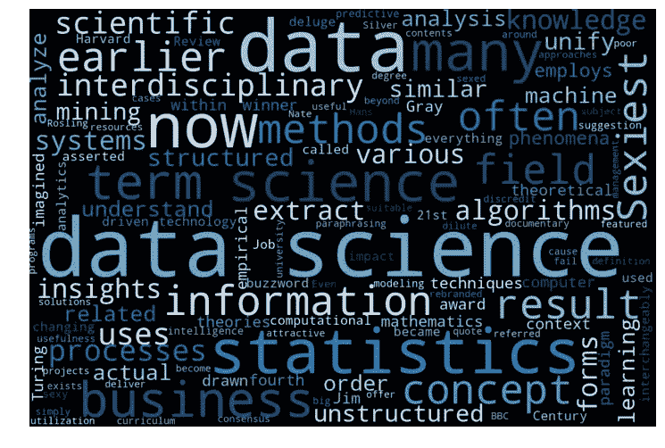
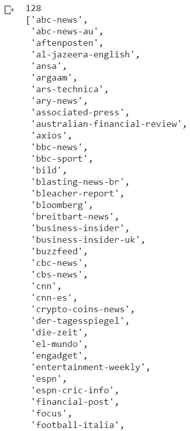

# 如何从多个新闻源生成单词云(使用 python 代码)

> 原文：<https://medium.com/analytics-vidhya/how-to-generate-word-clouds-from-multiple-news-source-with-python-code-47a03c512fe4?source=collection_archive---------15----------------------->

下面的教程将分为两个部分——从新闻 API 中检索新闻信息，以及单词云的生成。



# 新闻宣传短片

> **News API** 是一个简单易用的 API，它可以立即返回全网头条和文章的 JSON 元数据。

首先，前往[新闻 API](https://newsapi.org/) 到**获取 API 密钥。**


现在，打开你的 Jupyter 笔记本，开始编码吧！我们需要首先安装 [newsapi-python](https://pypi.org/project/newsapi-python/) 客户端库。

```
!pip install newsapi-python
```

然后，导入所有必需的库供以后使用。请将您的 API 密钥粘贴在括号中，如下所示。

```
import pandas as pdimport numpy as npfrom datetime import *from newsapi import NewsApiClientnewsapi = NewsApiClient(api_key=’5f921c126ca94bfc8afd8accaf02bef9')
```

## 资料检索

```
sources = newsapi.get_sources()sources_list = []for source in sources[‘sources’]:sources_list.append(source[‘id’])print(len(sources_list))sources_list
```

这部分代码将列出所有潜在的新闻来源。部分结果如下所示:



现在，您可以指定想要检索的新闻文章的**时间戳**。例如，30 天前发表的所有新闻文章。此外，这里需要指定**查询**字符串(例如“数据科学”)。在我的例子中，我只打算检索 30 天前前 50 家通讯社中与“数据科学”相关的新闻文章。所有结果都存储在*结果*数组中。

# 词云

一旦我们获得了上下文数据，我们就可以开始创建单词云了。这里，我们使用 **WordCloud** 库为每个新闻机构创建一个单独的 WordCloud。由于*结果*数组存储了 50 组新闻文章，根据下面的代码将生成 50 个单词云。

一些例子如下所示:


这就是为多个新闻源生成单词云的教程的结束。相同的技术可以应用于许多不同的用例中。希望这个简单的演示有所帮助！