# 如何生成任何东西

> 原文：<https://medium.com/analytics-vidhya/how-to-generated-anything-276fbf8c95e8?source=collection_archive---------10----------------------->

# 为赶时间的人准备的甘斯

> “生成对手网络是过去十年机器学习中最有趣的想法”
> 
> Yann LeCun，脸书人工智能研究主任。

GANs 是机器学习(ML)中一个令人敬畏的相对新概念。在这篇文章中，我将解释什么是 gan，gan 的类型和它们的好处，展示一些公司用 gan 做的惊人的事情，我将解释如何自己做一个。

# 什么是甘？

那么这些神奇的算法是什么呢？GANs(Generative adversial Networks)通常是两个[CNN](https://towardsdatascience.com/a-comprehensive-guide-to-convolutional-neural-networks-the-eli5-way-3bd2b1164a53)(卷积神经网络)，由一个**生成器**和一个**鉴别器**组成，两者互为对手。最简单的解释方法是类比，所以我们开始吧！你可以把一个甘想象成**警察**和**打假人。**造假者造假币，但一开始，他什么都不懂，就造出了这样的东西:

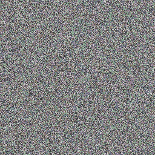

但是警察告诉伪造者和他自己有什么问题，导致伪造者和警察都变得更好。在实践中，我们把造假者称为生产者，把警察称为鉴别者。


显示 gan 如何工作的概念图

# **甘的种类**

那么现在我们知道了什么是甘，有哪些类型呢？

## **基地**

任何 GAN 都需要这两个 GAN 中的一个来启动:

**奥格甘**

这是 2014 年 Ian Goodfellow 在[论文](https://arxiv.org/abs/1406.2661)中首次引用的 GAN 原文。

**DCGAN(深度卷积生成对抗网络)**

DCGAN 是常规 GAN 的改进版本，通常用于 GAN 之上，因为它更稳定，通常也更好。

## **扩展**

在我们有了基本集合之后，我们可以通过特殊化来改进我们的 GAN 以满足特定的需求。有数百种方法可以改变我们的 GAN，但我将只涵盖最常见的方法。查看更多请看[甘动物园](https://github.com/hindupuravinash/the-gan-zoo)。

**WGAN**

WGAN 或 Wasserstein GAN 是一种 GAN，它将鉴别器改为鉴别器，并使用 Wasserstein 损耗，其中损耗现在不再局限于 0 和 1 之间，而是可以是任何实数。这解决了消失梯度问题和模式崩溃问题，这基本上意味着 GAN 不会陷入局部最小值，并且如果生成具有多个组的对象，则不会陷入仅生成一个组。

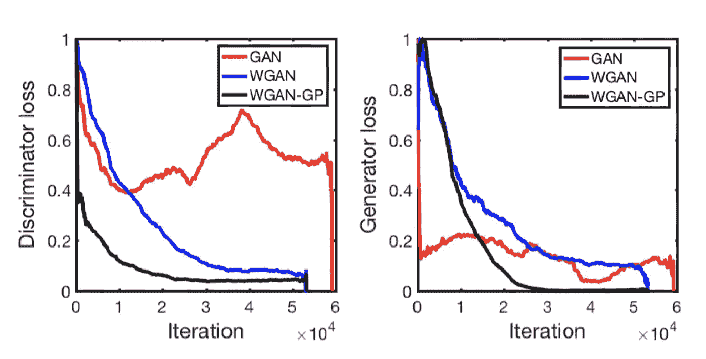

显示 WGAN 的功率的图，其中 GAN 是常规 GAN，WGAN 是具有重量削波的 WGAN，WGAN-GP 是具有梯度损失的 WGAN

**CGAN**

CGAN 或有条件 GAN 是一种防止模式崩溃并允许您从 GAN 中采样特定图像的 GAN。CGAN 通过将数据集的标签输入到 GAN 中来做到这一点。

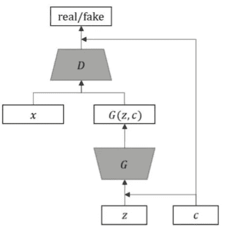

**Pix2Pix 甘**

Pix2Pix GAN 是您的一般图像到图像转换 GAN，可以做一些事情，如恢复丢失部分的旧图像，给没有颜色的图像添加颜色，以及[将](https://zaidalyafeai.github.io/pix2pix/pokemon.html) [绘图转换为图像](https://affinelayer.com/pixsrv/)。Pix2Pix GAN 的工作有点像一个更复杂的图像转换模型(如循环 GAN)的起点。Pix2Pix GAN 使用有条件的 GAN 来比较好的输出和差的输出，以产生好的输出。

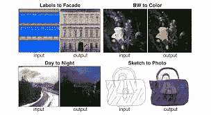

Pix2Pix GAN 的一些结果

**轮回甘**

循环 GAN 允许在没有匹配数据集的情况下进行模式转换，例如，如果您想让一匹马成为斑马，或者让一张照片看起来像梵高的画。自行车甘工作，但有两个甘。一个 GAN 接收一匹马(输入 1)并试图将它变成斑马(输出 1)，然后一个鉴别器评估被变成斑马的那匹马有多像斑马(损失 1)。之后，马-斑马(输入 2)现在被放入另一个生成器，试图使它看起来尽可能接近原始马(输出 2)。最后，第二个鉴别器计算那匹马-斑马-马的损失(损失 2)。我知道这听起来非常复杂，但基本上是马对斑马对马。

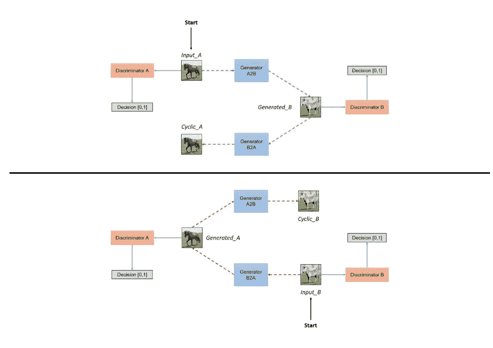

**递进式甘**

渐进 GAN 是在训练期间生长的 GAN，从低分辨率到高分辨率。GAN 通过在训练期间向模型添加层来生长。这样做使这个甘真正稳定，加速训练，让你得到更好的结果。

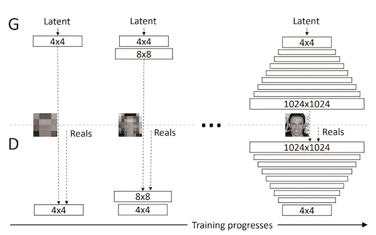

**信息甘**

info GAN 是一个 GAN，允许你按照宽度、旋转等属性对输出进行分类。info GAN 通过按照噪声和潜在代码对输出进行分类来实现这一点。

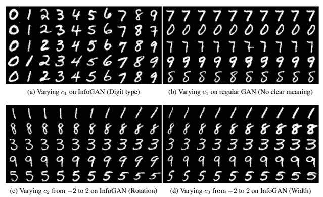

# **公司**

基于 GAN 的公司不多，也就是说，基于 GAN 的公司主要有两种类型。

## **内容创建**

拍摄照片和支付人们制作广告的工资是昂贵的。所以让甘斯为我们做这件事。GANs 非常擅长创造性工作，因此任何工作，如设计、图像编辑、图像/视频制作都可以使用 GANs 自动完成。一些公司使用 GANs 进行创意的例子有 [RoseBud.ai](https://www.rosebud.ai/) 、 [DataGrid](https://datagrid.co.jp/en/) 等等。这是 RoseBud 的一段视频，展示了他们的工作。

## **产品优化**

当然，我说的是甘斯的圣杯，生成式设计。生成式设计是一项神奇的技术，可以改变整个世界。生成式设计是 GANs 的一个应用，它允许我们通过迭代过程优化建筑、交通、家具等。使用创成式设计的公司有[太空工厂](https://www.aispacefactory.com/)、 [Fusion 360](https://www.autodesk.ca/en/products/fusion-360/personal) 等等。

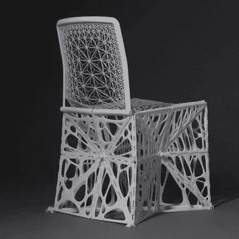

# **如何制作 GAN**

这听起来很棒，那我们怎么做呢？我将向你展示如何使用 Keras 和 TensorFlow 制作 DCGAN。链接到更多我在最后做的甘。

## **导入库**

```
import tqdm
import os
import cv2
import matplotlib.pyplot as plt
import tensorflow as tf
import numpy as np
from glob import glob
import keras
```

这一部分非常简单明了，但是我们导入了代码中将要使用的任何库。一般来说，这些是我推荐的库，但是你可能需要导入不同的库。

## **定义变量**

```
IMG_WIDTH = 100
IMG_HEIGHT = 100random_dim = 100 
np.random.seed(512) 
datadir = "" #path goes here
```

定义图像归一化的变量(宽度和高度)、潜在空间(random_dim 和种子)以及定义数据集的路径。

## **图像归一化/设置流水线**

```
from tqdm import tqdm
data = []def create_data():
    path = datadir
    for img in tqdm(os.listdir(path)):
      img_array = cv2.imread(os.path.join(path,img))
      new_array = cv2.resize(img_array, (IMG_SIZE, IMG_SIZE), interpolation = cv2.INTER_NEAREST)
      drawings_data.append(new_array)
    plt.imshow(drawings_data[0])
    plt.show()
    print(new_array)create_data()
```

在这里，我们正在做一些基本的图像规范化，如调整图像大小，然后将它们转换为数组，以便模型可以使用数据。

```
def load_data():
  x_train = data
  x_train = (np.asarray(x_train).astype(np.float32) - 127.5)/127.5
  return x_train
```

在这里，我们正在为模型重塑数组。

## **定义模型**

```
def get_optimizer():
  return Adam(lr=0.0002, beta_1=0.9)
```

这里我们定义了模型的学习率和 beta，一般来说，我建议大多数模型的学习率为 0.0002，大多数模型的 beta 为 0.9。

```
def get_generator(optimizer):
  generator = Sequential()generator.add(Dense(13*13*40, input_dim = random_dim,kernel_initializer=initializers.RandomNormal(stddev=0.02)))
  generator.add(BatchNormalization())
  generator.add(LeakyReLU())generator.add(Reshape((13, 13, 40)))generator.add(Conv2DTranspose(256, (3, 3), strides=(1, 1), padding='same'))
  generator.add(BatchNormalization())
  generator.add(LeakyReLU())generator.add(Conv2DTranspose(128, (3, 3), strides=(2, 2), padding='same'))
  generator.add(BatchNormalization())
  generator.add(LeakyReLU())generator.add(Conv2DTranspose(64, (3, 3), strides=(2, 2), padding='same'))
  generator.add(BatchNormalization())
  generator.add(LeakyReLU())generator.add(Conv2DTranspose(3, (3, 3), strides=(2, 2), padding='same', activation='tanh'))generator.add(Cropping2D(cropping=((2,2),(2,2))))return generator
```

这里我们定义发电机模型。

```
def get_discriminator(optimizer):discriminator = Sequential()discriminator.add(Conv2D(64, (5, 5), strides=(2, 2), padding='same', input_shape=(100,100, 3)))
  discriminator.add(LeakyReLU())
  discriminator.add(Dropout(0.02))

  discriminator.add(Conv2D(128, (5, 5), strides=(2, 2), padding='same'))
  discriminator.add(LeakyReLU())
  discriminator.add(Dropout(0.02))

  discriminator.add(Flatten())
  discriminator.add(Dense(1, activation= "sigmoid",))
  discriminator.compile(loss="BinaryCrossentropy", optimizer=optimizer)return discriminator
```

这里我们定义了鉴别器模型。

```
def get_gan_network(discriminator, random_dim, generator, optimizer):
  discriminator.trainable = False
  gan_input = Input(shape=(random_dim,))
  x = generator(gan_input)
  gan_output = discriminator(x)
  gan = Model(inputs=gan_input, outputs=gan_output)
  gan.compile(loss="binary_crossentropy", optimizer=optimizer)
  return gan
```

最后，我们在这里定义 GAN。

## **训练模特**

```
def plot_generated_images(epoch, generator, examples=100, dim=(10, 10), figsize=(5, 5)):
  noise = np.random.normal(0, 1, size=[examples, random_dim])
  generated_images = generator.predict(noise)
  generated_images = generated_images.reshape(examples, 100, 100, 3)
  generated_images += 1
  generated_images /= 2plt.figure(figsize=figsize)
  for i in range(generated_images.shape[0]):
    plt.subplot(dim[0], dim[1], i+1)
    plt.imshow(generated_images[i], interpolation="nearest")
    plt.axis("off")
  plt.tight_layout()
  plt.savefig("gan_generated_image_epoch_%d.png" % epoch)
```

这里我们设置了一个函数来绘制我们的图像。

```
def train(epochs=1, batch_size=50):
  x_train = load_data()
  batch_count = x_train.shape[0] / batch_size
  adam = get_optimizer()
  generator = get_generator(adam)
  discriminator = get_discriminator(adam)
  gan = get_gan_network(discriminator, random_dim, generator, adam)
  #random noise and images
  for e in range(1, epochs+1):
    print("-"*15,"Epoch %d" % e, "-"*15)
    for _ in tqdm(range(int(batch_count))):
      noise = np.random.normal(0, 1, size=[batch_size, random_dim])
      image_batch = x_train[np.random.randint(0, x_train.shape[0], size=batch_size)]#generate fake images
      generated_images = generator.predict(noise)
      X = np.concatenate([image_batch, generated_images])#labels for fake + real
      y_dis = np.zeros(2*batch_size)
      y_dis[:batch_size] = 0.9discriminator.trainable = True 
      discriminator.train_on_batch(X, y_dis)noise = np.random.normal(0, 1, size=[batch_size, random_dim])
      y_gen = np.ones(batch_size)
      discriminator.trainable = False
      gan.train_on_batch(noise, y_gen)if e == 1 or e % 5 == 0:
      plot_generated_images(e, generator)
```

现在我们要定义训练函数，然后最后我们可以训练我们的模型。

```
train(100,50)
```

在这里，它被设置为运行 100 个时期，批量大小为 50，但可以很容易地改变。

现在你知道如何制作 GAN 和不同类型的 GAN，以及它们的用途。

以下是我从 GANs 中得到的一些结果

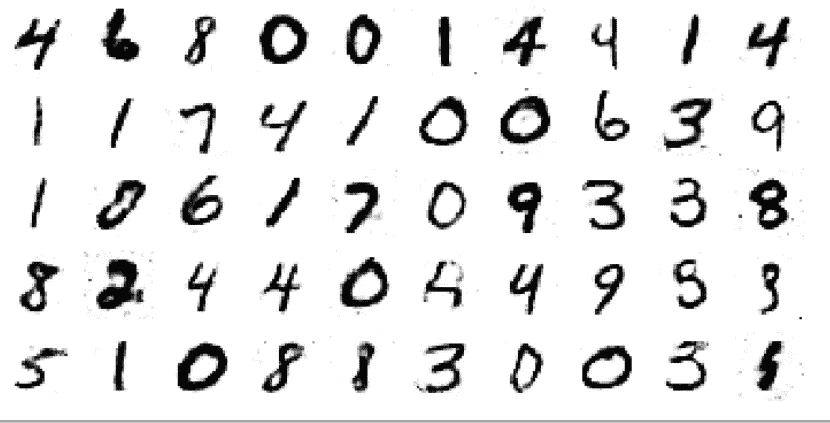

MNIST 数据集(第一个 GAN) 28 x 28

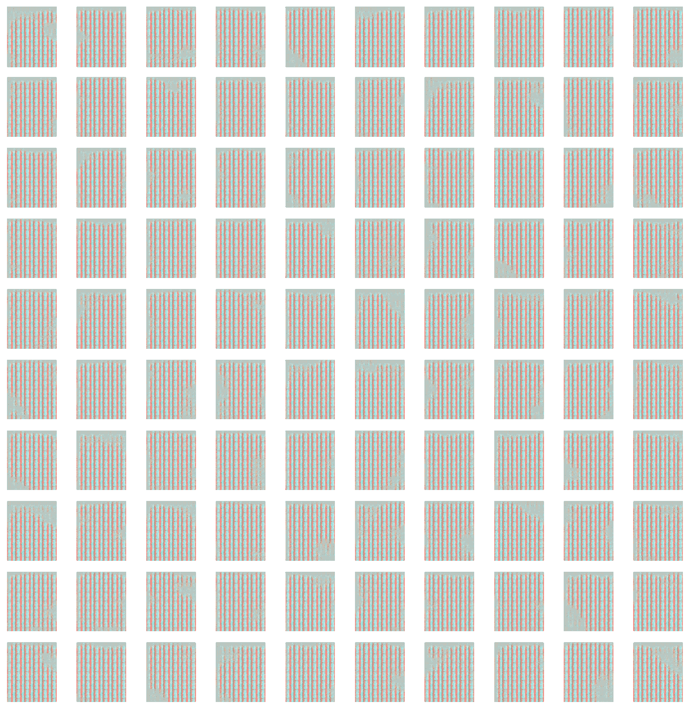

名人 _A 100 x 100

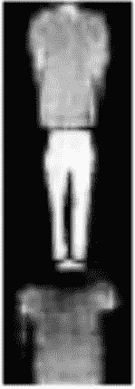

时尚 MNIST WGAN 28 x 28

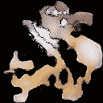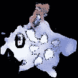

口袋妖怪 128 x 128

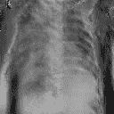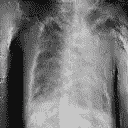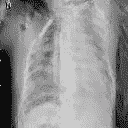

肺炎图像 128 x 128

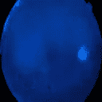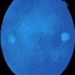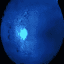

医学眼球图像(它变成了蓝色🤷‍♂️) 128 x 128

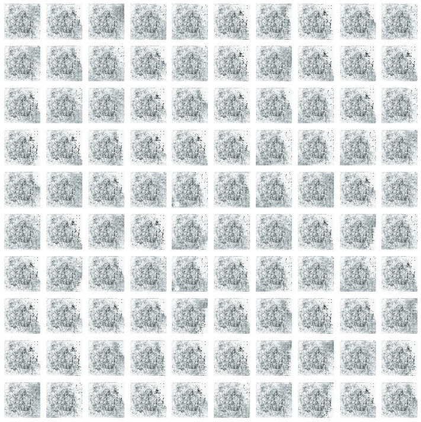

生成“艺术”100 x 100

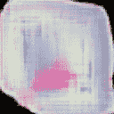

血细胞 128 x 128

> 这里是 Github 链接来查看我所有 GANs 的代码

> 如果你喜欢这篇文章，你可能会喜欢我的其他文章，所以考虑在[媒体](/@thomaslawrence642)上关注我，你正在做的很好在[推特](https://twitter.com/@Thomas6422)、 [Linkedin](https://www.linkedin.com/in/thomas-lawrence-7725291b6/) 上关注我，并注册我的[时事通讯](https://thomas-newsletters.mailchimpsites.com/)。