# 如何在“贷款批准预测”机器学习黑客马拉松中进入前 2%

> 原文：<https://medium.com/analytics-vidhya/how-to-get-into-top-2-in-loan-approval-prediction-machine-learning-hackathon-83d8c6cfde39?source=collection_archive---------0----------------------->

## 由 AnalyticsVidhya 主办的“贷款审批预测”机器学习黑客马拉松的完整解决方案

[儿童马戏团](https://unsplash.com/photos/7vSlK_9gHWA)在 [Unsplash](https://unsplash.com/?utm_source=medium&utm_medium=referral) 上拍摄的照片

H 这是我第一次体验由 AnalyticsVidhya 主办的关于“贷款预测实践问题”([点击此处](https://datahack.analyticsvidhya.com/contest/practice-problem-loan-prediction-iii/#ProblemStatement)了解问题详情)的机器学习黑客马拉松的故事。

完整的 Python 代码可以在我的 [**GitHub**](https://github.com/rahul-pednekar/Loan-Prediction-Analyticsvidhya-Hackathon/blob/main/Loan-Prediction-AV.ipynb) 资源库中找到。

## 外卖:

> 截止到 2011 年 2 月 20 日，最终提交为我赢得了 **80.55%的准确率**&**在 **5250** 名参与者中排名第 122 位(前 2%)**
> 
> 在附加功能的帮助下，功能工程帮助将精确度从 **77%提高到 80.55%**
> 
> 有时添加新功能可能会降低准确性，因此需要谨慎选择新功能。

***于是让我们直入黑客马拉松竞技场*** 😃

> 信息是 21 世纪的石油，而分析是内燃机

# 我们要解决什么？

## ***预测梦想房屋金融公司的贷款资格***

1.  梦想住房金融公司经营各种房屋贷款。他们遍布所有城市、半城市和农村地区。客户首先申请住房贷款，然后该公司验证客户的贷款资格。
2.  公司希望根据填写在线申请表时提供的客户详细信息自动执行贷款资格流程(实时)。这些详细信息包括性别、婚姻状况、教育程度、受抚养人人数、收入、贷款金额、信用记录等。
3.  为了实现这一过程的自动化，他们提供了一个数据集来识别有资格获得贷款金额的客户群，以便他们可以专门针对这些客户。

你可以在这里 找到练习题 [**的完整细节，训练和测试数据集可以从相同链接下载。**](https://datahack.analyticsvidhya.com/contest/practice-problem-loan-prediction-iii/#ProblemStatement)

> **总结:**用数据科学的术语来说，这个问题属于“**二元分类”**问题的范畴，其中目标变量(贷款状态)(我们应该预测的)可以有两个值(**【是】**或**【否】**)
> 
> **训练数据集**:包含客户的详细信息(如性别、婚姻状况、教育程度、受抚养人人数、收入、贷款金额、信用记录等。)以及目标列 Loan_Status，其值为:
> 
> 1.**“是”:**如果贷款被批准
> 
> 2.**【否】:**如果贷款未获批准
> 
> **测试数据集:**它包含新客户的类似详细信息(如性别、婚姻状况、教育程度、受抚养人人数、收入、贷款额、信用记录等。)，但是没有目标列(即 Loan_Status)
> 
> 使用**训练**数据集，我们需要准备一个**机器学习模型**，它将为***测试**数据集中的客户预测 ***贷款 _ 状态****
> 
> **(例如，对于测试数据集中的每个客户，预测贷款申请是否会获得批准)**

*   **让我们看看数据字典**

> **我们相信上帝。所有其他人必须带来数据**
> 
> **-爱德华兹·戴明**

**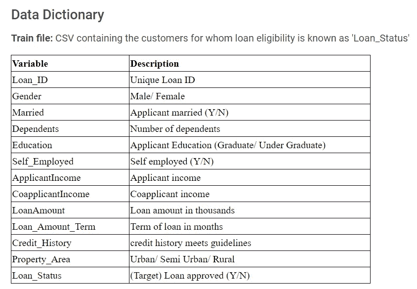**

**定型数据集中列的详细信息。测试数据集包含与上面相同的列，除了贷款状态列(我们将要预测)**

**现在我们已经熟悉了问题陈述，让我们看看解决这个问题需要什么**

# **我们需要哪些工具？**

*   **“Python 3.0 或更高版本”或“R”:任何一种你熟悉的编程语言**
*   **面向 Python 程序员的 Jupyter Notebook 或 Spyder 或面向 R 程序员的 R-Studio**

****是的。** **这就是我们所需要的😃****

**我的首选组合是 **Python 3.8** 搭配 **Jupyter 笔记本**来解决这个问题。**

**你可以在我的 [**GitHub**](https://github.com/rahul-pednekar/Loan-Prediction-Analyticsvidhya-Hackathon/blob/main/Loan-Prediction-AV.ipynb) 资源库找到完整的代码。**

# ****会有什么策略？****

## **将解决方法分成简单的 **9 步**并依次执行**

1.  **加载基本 Python 库**
2.  **在 Python 环境中加载训练/测试数据集。**
3.  **准备提交文件并删除不需要的列。**
4.  **探索性数据分析(EDA)。**
5.  **估算缺失值。**
6.  **特征工程。**
7.  **建立机器学习模型并对测试数据集进行预测**
8.  **准备带有最终预测的提交文件**
9.  **结论和要点**

**所以，让我们把手弄脏，投入到代码中😃**

## ****第一步:** **加载必要的 Python 库****

**Numpy(线性代数)，pandas(数据帧)，matplotlib 和 seaborn(绘图)**

## ****第二步:** **在 Python 环境中加载训练/测试数据集****

**当我们在 Python 环境中加载训练和测试数据集时，我们得到了下面的输出。**

**训练集有 614 行 13 列，测试集有 367 行 12 列(当然少了一列，即我们需要预测的目标变量( **Loan_Status** )**

## ****步骤 3:准备提交文件并删除不需要的列****

*   **准备提交文件**

**让我们从测试文件中为最终提交创建一个提交数据框架，并使用 Loan_ID:**

*   **先看数据:**

**让我们从训练数据集中查看任意 5 个样本行**

**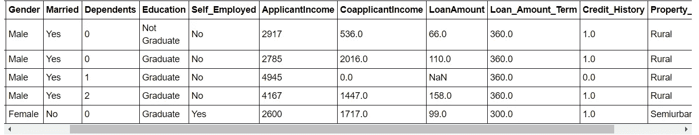**

**训练数据集-样本行**

> **训练数据集列可以分为以下几类:**
> 
> ****分类栏**:性别(男性/女性)、已婚(是/否)、受抚养人人数(可能值:0、1、2、3+)、教育程度(已毕业/未毕业)、自营职业(否/是)、信用记录(是/否)、财产面积(农村/半城市/城市)和贷款状况(是/否)(即目标变量)**
> 
> ****数字栏:**贷款 ID、申请人收入、共同申请人收入、贷款金额、贷款金额期限**

*   **删除不需要的列**

**“Loan_ID”只是一个数字标识符，并没有增加任何价值。因此，让我们将其从训练和测试数据集中删除。**

## ****第四步:** **探索性数据分析【EDA】****

> **数字有一个重要的故事要讲。他们依赖你给他们一个声音-斯蒂芬几**

*   **让我们从单变量分析开始**

**使用计数图的单变量分析**

**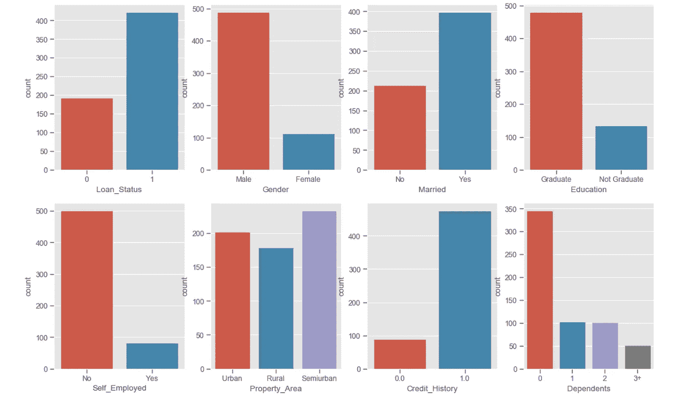**

**单变量分析—使用计数图的条形图**

****单变量分析观察值:****

1.  **批准的贷款比拒绝的贷款多**
2.  **男性申请者人数多于女性**
3.  **已婚申请人多于未婚申请人**
4.  **毕业生比非毕业生多**
5.  **自营职业者少于非自营职业者**
6.  **大多数房产位于半城市化地区**
7.  **许多申请者都有信用记录**
8.  **受抚养人人数=0 的申请人数是最大值。**

*   **使用 Catplot 进行双变量分析**

1.  **可变已婚与贷款状态**

**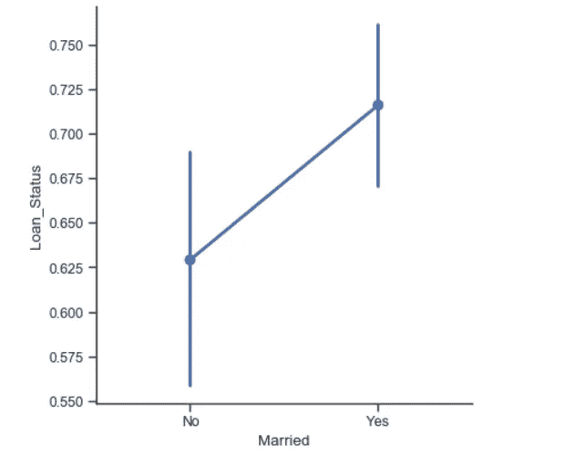**

**如果你已婚，那么获得贷款批准的机会(71.8%)比你未婚(62.9%)要多。**

**2.教育与贷款 _ 状态**

**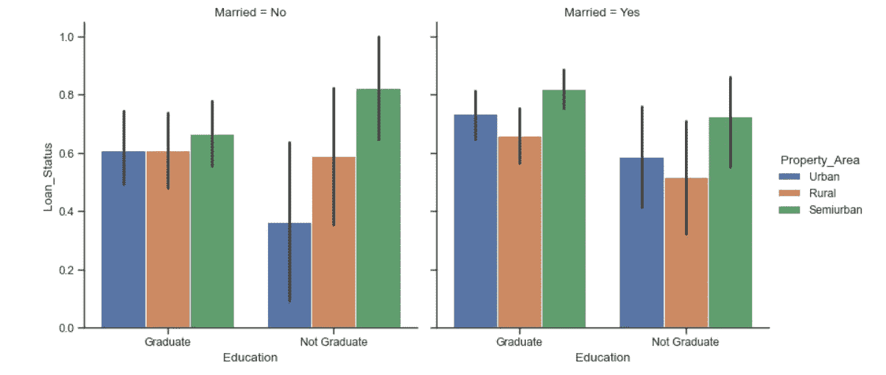**

**如果你在市区+未毕业+未结婚那么贷款获批的概率就比较小**

**3.性别与共同申请人收入**

**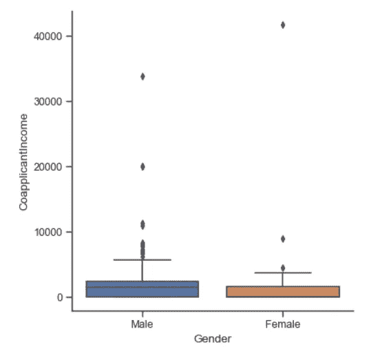**

**男性共同申请人的平均收入略高于女性。**

**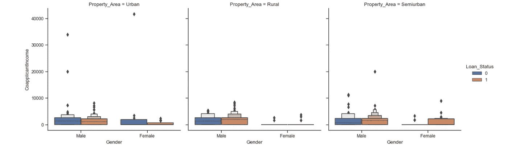**

**在这三个领域，男性的共同申请人收入都高于女性**

**4.信用记录与贷款状况**

**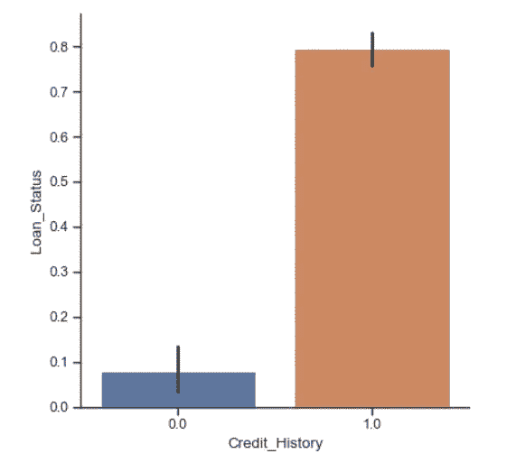**

**如果信用记录为 1，则获得贷款批准的几率(79.6%)比信用记录为 0 的几率(7.9%)高**

**5.性别与贷款金额**

**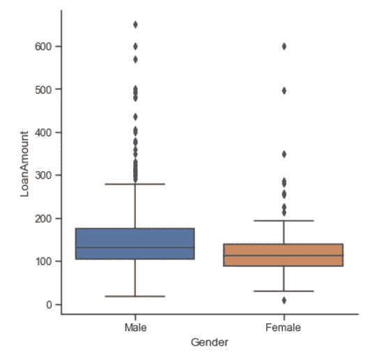**

**男性申请贷款金额的平均值略高于女性。**

**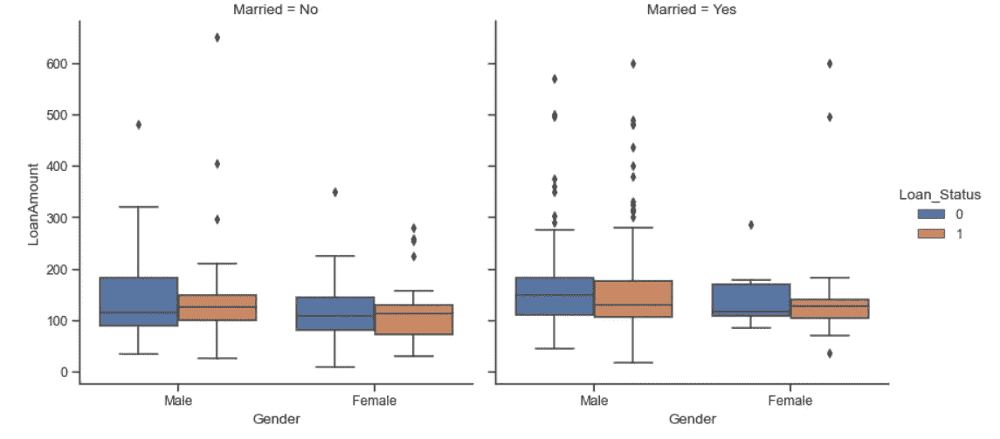**

**如果你是已婚人士，那么申请贷款的金额会比未婚人士略高**

**6.贷款状态与贷款金额期限**

**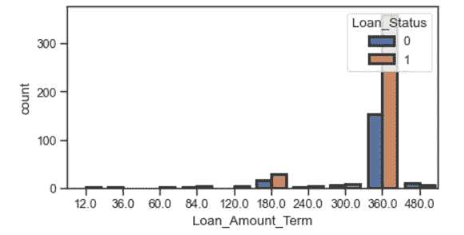**

**最多客户要求 360 个月的租期**

## ****步骤 5:估算缺失值****

1.  **识别训练和测试数据集中缺失的值**

**按列名查找缺失值的总和**

**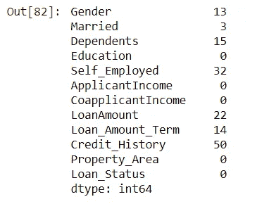**

**共有 7 列在训练数据中具有空值**

**2.让我们开始在训练和测试中输入缺失值**

*   ****栏:已婚****

**用已婚列的模式填充空值**

*   ****栏:家眷****

**对于训练数据集:如果贷款状态为 1，则 dependent = 2，否则 dependent=1，对于测试数据集:如果 Credit_History 为 1，则 dependent = 2，否则 dependent=1**

*   ****栏:信用记录****

**对于训练数据集:如果贷款状态为 1，则 Credit_History = 1，否则 Credit_History=0，对于测试数据集，使用测试的 Credit_History 列的模式填充空值**

*   ****栏:性别****

**用性别列的模式填充空值**

*   ****栏:个体户****

**如果 Credit_History 为 1，则估算自雇=否，否则为是**

*   ****列:Loan _ Amount _ Term:**Loan _ Amount _ Term 取决于性别、已婚、教育、自雇和受抚养人列。因此，我们将按照上面的列对它们进行分组，并估算中值。如果中值为空，那么我们将估算整个 Loan_Amount_Term 列的中值。**

*   ****列:贷款金额:**贷款金额取决于房产 _ 面积、性别、已婚、教育、自雇和家属列。因此，我们将按照上面的列对它们进行分组，并输入中值。如果中位数为空，那么我们将估算整个 LoanAmount 列的中位数。**

**检查是否有丢失的值**

****

**所有缺失值都是估算的**

## ****第六步:特征工程****

****

**特征工程是我最喜欢的话题之一，它是机器世界中的一种人情味😃**

*   **标签编码分类变量**

**机器学习算法理解数字而不是文本，因此让我们使用标签编码将分类数据转换成数字。**

*   **根据问题描述，所有客户申请的贷款金额都是以千为单位的，所以让 LoanAmount 列乘以 1000**

*   **让我们结合训练和测试数据集**

*   **让我们向数据集添加 8 个新要素:**

1.  **总收入:**

**2.电磁干扰:**

**3.附加功能:**

**4.数字列的 Bin 格式**

**让我们为这三个连续的变量建立箱**

**5.删除不需要的列**

**让我们看看新创建的要素的组合数据集的形状**

**我们增加了 8 个新功能，我们的列数从 12 个增加到 20 个**

## ****第七步:**建立机器学习模型&对测试数据集进行预测**

*   **在接下来的步骤中，我们将从组合数据集中分离训练和测试数据集，使用 get_dummies( ) & drop 目标变量(Loan_Status)对分类变量进行标签编码，并将其从训练数据集中复制到变量“y”**

*   **让我们使用 ExtraTreesClassifier 检查数据集中所有 20 个要素的要素重要性**

****

**信用历史和信贷历史收入总和是两个最重要的特征**

*   **训练-测试分割:让我们对训练数据集进行(80:20)分割**

*   **数据的标准缩放:我将使用 StandardScaler 在(-1 到 1)之间缩放数据(您也可以尝试 RobustScalar 或 MinMaxScalar)**

*   **机器学习算法:我已经尝试了多种机器学习算法，包括 XGBOOST、CATBOOST 和 LGBM，但是我用“逻辑回归”获得了最好的准确性……是的，有时基本算法会给你最好的结果😃**

**在使用**逻辑回归模型**的验证数据集上，我们得到了 **78%** 的准确率**

*   **让我们评估混淆矩阵**

****混淆矩阵结果**:在来自验证数据集的 **123** 个客户中，模型以 **100%的准确率**预测了 **96** (79+17)个客户，但是未能预测出 **27** (22+5)个客户的正确贷款状态。**

**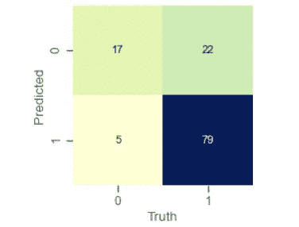**

**混淆矩阵**

## ****步骤 8:准备最终预测提交文件****

## ****第 9 步:结论和要点****

1.  **最终提交的测试数据集为我赢得了 80.55%的准确率&**截止到 2011 年 2 月 20 日，我在 5250 名**参与者中排名第 122(前 2%)**
2.  **新增功能有助于提高准确性**
3.  **有时添加新功能可能会降低准确性，因此需要谨慎选择新功能。**
4.  **使用 **XGBOOST 和 CATBOOST** (其通常比任何其他算法执行得更好)以及**超参数调整&** 基于树的模型，如**随机森林**、**决策树分类算法**不能匹配简单的**逻辑回归**的精度**
5.  **我前面还有 121 名参与者，这意味着还有提高准确性的空间。**

**干杯，感谢阅读！😃**

**你可以在我的 [**GitHub**](https://github.com/rahul-pednekar/Loan-Prediction-Analyticsvidhya-Hackathon/blob/main/Loan-Prediction-AV.ipynb) 库中找到完整的 Python 代码。**

> **如有任何疑问，请随时联系我的 [**LinkedIn**](https://www.linkedin.com/in/pednekar-rahul/) &我将竭诚为您服务。**

***跟我上*[*LinkedIn*](https://www.linkedin.com/in/pednekar-rahul/)*[*Medium*](/@rahul.pednekar)*和* [*Kaggle*](https://www.kaggle.com/rahulpednekar)***