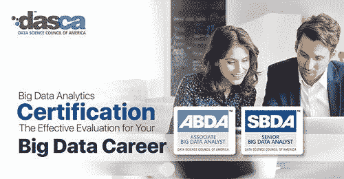
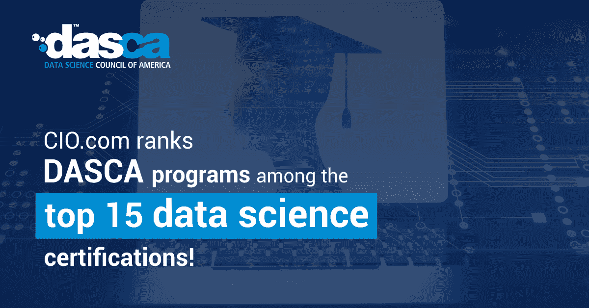

# 如何获得从事大数据决策智能工作的资格

> 原文：<https://medium.com/analytics-vidhya/how-to-get-qualified-to-work-in-big-data-for-decision-intelligence-24ef00a6e3fb?source=collection_archive---------22----------------------->

如果没有数据分析，公司就无法很好地执行重要任务，如正确决策。他们需要更好地了解市场分析，这样他们才能领先于他们的竞争对手。

有人认为，到 2024 年，数据分析专业人员的基础架构可能会增加 5 倍。这可能主要是因为公司正在快速增加这种被称为数据分析的技术工具。似乎现在所有人都在谈论它！那为什么要等？让我们大声讨论 2021 年数据分析的不同趋势。

以下考虑的趋势包括决策智能、数据故事和数据云服务。他们的视野正在扩大，看到了他们在[数据科学世界中受欢迎和进步的速度。](https://www.dasca.org/world-of-big-data)

# 1.决策智能

为了让一个公司在当前的竞争中生存下来，采取正确的决策是一项基本要求。机器学习和数据科学可以帮助做出正确的决策，使公司的底线得到改善。

决策智能主要是一个复合领域，包含数据科学和人工智能，以及基于管理科学和决策制定的概念。因此，可以说，像股东、公司领导等决策者。可以利用机器学习算法从他们的数据中获得洞察力。

这些数据可以帮助他们利用这些数据做出最佳决策。决策智能可能会变得更受欢迎，因为它为公司提供了优势，约有 33%的公司在所有领域使用这项技术。由此可见， [**数据科学和大数据分析**](https://www.dasca.org/data-science-certifications/big-data-scientist?ref=hackernoon.com) 是公司在货币价值的天空中高飞的趋势。

# 2.数据故事

在当前的数据科学和大数据分析领域，为了向公司股东展示数据，使用了大量的数据可视化仪表板。然而，如今数据故事越来越受欢迎。

您会选择只查看排列在控制面板中的数据的事实和数字，还是更喜欢查看揭示公司数据之旅的故事？如今，大多数公司都会选择一个好故事。这就是数据故事越来越受欢迎的原因。对于不了解数据分析领域特定信息的外行来说尤其如此。

Gartner 提出，到 2025 年，数据故事将成为用于传达数据的最受欢迎的数据。因此，一个善于讲故事的人，同时也是一个优秀的数据分析师，有着光明的前景。这也意味着数据分析专业人员可以体验工作保障以及更好的加薪前景。

# 3.数据云服务

今天，我们正在处理一个巨大的数据。未来会看到比今天更大的数据。有资料表明，地球上每天产生超过 2.5 万亿字节(等于 9 个零)的数据。

像谷歌这样的大公司处理这些数据的能力远胜于致力于数据洞察的小公司。这就是为什么云服务今天在数据分析中越来越受欢迎的原因。

正如我们有软件即服务一样，我们也有数据即服务(DaaS)。DaaS 是一种云服务，它利用云计算来提供数据处理、数据存储、数据集成以及数据分析服务。因此，DaaS 可以被公司用来提高他们对目标受众的了解。这一目标可以通过使用数据、生产自动化、通过改进产品满足市场需求来实现。

据估计，90%的大型公司将使用 DaaS 应用程序，这样他们就可以从数据中获得收入。微软，SAP，Azure 等。提供 DaaS。

# 怎样才能获得大数据方面的认证？

一些最好的大数据认证由 IBM、微软和美国数据科学委员会(DASCA) 提供。

但是，您可以决定哪个平台最适合您的需求。

# DASCA 在大数据分析师中提供两个级别的认证计划:

1.  [ABDA(大数据分析师助理)](https://www.dasca.org/data-science-certifications/associate-big-data-analyst)

2. [SBDA(高级大数据分析师)](https://www.dasca.org/data-science-certifications/senior-big-data-analyst)

ABDA 面向全球管理、商业、统计、经济或其他相关学科的毕业生，以及那些希望在大数据领域从事分析职业的人。

SBDA 的目标是在营销、分析和研究领域有经验的人，以及那些希望进入大数据领域或已经在大数据领域工作并希望在职业生涯中获得更多前景的人。

通过考试的数据科学专业人员向他们的潜在雇主保证，他们可以处理大量多样化的数据，提供设计模型分析，解释商业智能主题数据的重要性，还可以根据目标和任务的要求可视化和迁移大数据。

# 为什么是达斯卡？

大数据分析取得了进步，并作为最佳大数据职业领域之一而广受欢迎。如今，它鼓励拥有多种学术和专业知识和经验的专业人士。DASCA 是全球最佳的第三方和厂商中立认证途径。您可以信任国际认可和接受的 ABDA 和 SBDA 证书，以证明您在大数据分析方面的熟练程度、最佳水平、承诺和潜力。

这里需要特别注意的是， [**DASCA 的大数据分析师认证**](https://www.dasca.org/data-science-certifications/big-data-analyst) 全面而准确地涵盖了大数据分析师需要展示其对不断发展的技术基础设施的熟练程度的知识领域。这是为了在职业生涯中表现和增强自我成长。

其他可以考虑关注的趋势包括数据云服务、X 分析、数据区块链和边缘计算。

**结论:**适用于研究、学习、成功和商业增长的这些巨头的技术趋势和快速进步是当今许多公司感兴趣的话题。因此，不可否认的是，未来数据科学的应用将会有更大的增长，其认证将比现在更有价值。

*原载于 2021 年 2 月 15 日 https://hackernoon.com**的* [*。*](http://hackernoon.com/how-to-get-qualified-to-work-in-big-data-for-decision-intelligence-2x3v33bm)