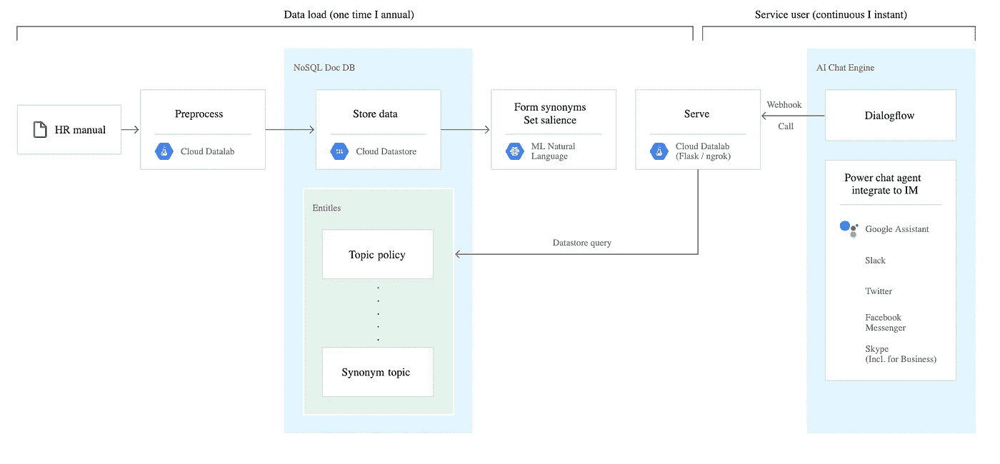
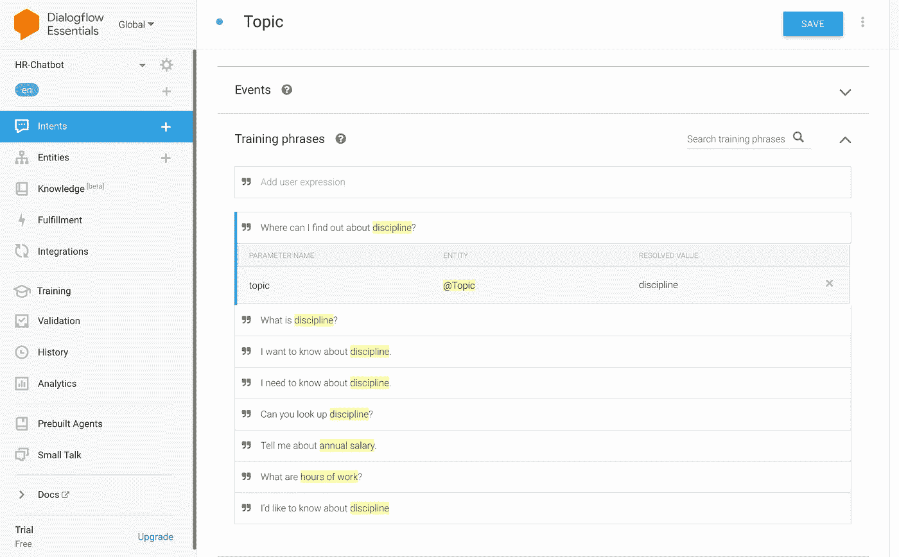

# 如何开始使用聊天机器人—第 1 部分

> 原文：<https://medium.com/analytics-vidhya/how-to-get-started-with-chatbots-part-1-29d619759b33?source=collection_archive---------24----------------------->

## 聊天机器人概念和工程介绍

交流是一门艺术，那么我们如何把它教给机器人呢？—照片由 [**米卡鲍梅斯特**](https://unsplash.com/@mbaumi) 在 Unsplash 上拍摄

嗨，欢迎来到聊天机器人系列。这个新的动机见我的[上一篇文章](/analytics-vidhya/using-pca-t-sne-to-mine-ideas-for-what-to-write-next-ab6eb7537596)。

这篇文章的主要目的是为那些想参与聊天机器人的开发者提供一个切入点。我发现许多聊天机器人教程实际上只是他们自己的聊天机器人产品的推销。

如果你正在寻找一种快速简单的方法来参与聊天机器人，并且你有足够的钱，那就花掉它。你将获得最先进的服务，以一种用户友好的方式；接受局限就好。

这篇文章为那些想自己创造艺术的人提供了一个低门槛。

作为一名开发人员，我想知道更多的事情。我们将开始这个旅程，一次剥开一层。大多数产品只是对聊天机器人 API 进行了修饰，并在其上提供了自己的集成和 GUI。

我们选择的 API 将是 Dialogflow，我们将使用它来训练聊天机器人并将其集成到 web 应用程序中，这是我们这个系列的主要目标。

由于 Google 已经在提供易于理解的介绍方面做了很好的工作，本文的剩余部分将用于补充该文档([https://cloud . Google . com/solutions/building-chatbot-agent-dialog flow](https://cloud.google.com/solutions/building-chatbot-agent-dialogflow))。

# 以下是该文档的高级概述:

*   在 Google 云平台中创建一个项目，并启用必要的 API
*   使用 Google Cloud Shell 创建一个项目，其中包含一个 Datalab 实例
*   使用 Datalab 运行脚本以在数据存储中创建实体
*   在 Dialogflow 中创建一个代理，并将其连接到您的 Google Cloud 项目
*   将数据存储中的“主题”实体填充到 Dialogflow 中
*   创建一个意图来训练用户提供的句子
*   运行 webhook 脚本，该脚本连接到数据存储并使用 Ngrok 创建一个到该 webhook 的 HTTP 隧道
*   将 webhook 集成到 Dialogflow 中，并测试您的第一个聊天机器人

在这里找到文档。

# 本文档中介绍的概念:

1.  聊天机器人架构(大量 API)

*   数据存储 API 包含 Dialogflow 创建响应所需的所有内容
*   webhook(和 Ngrok)将为 Dialogflow 提供与数据存储信息对话的能力
*   Google NLP API 将支持 Dialogflow
*   Dialogflow 将提供一个 iframe 来嵌入一个 chatbot 接口，该接口将引用 Dialogflow(以及后续的 API)

2.数据实验室

*   与 Jupyter 笔记本几乎完全一样，但运行在谷歌云平台上
*   因为这是从云中运行的，所以 Datalab 可以连接到 Google Cloud 项目，以及所有必要的 APIs 服务

3.数据存储

*   数据存储是“高度可扩展的 NoSQL 数据库”([https://cloud.google.com/datastore](https://cloud.google.com/datastore))
*   数据存储由实体组成，这些实体是具有一个或多个属性的对象，包含一个或多个值(【https://cloud.google.com/datastore/docs/concepts/entities】)

4.实体

*   Dialogflow 中的实体不同于数据存储中的实体
*   实体按实体类型和该实体的条目进行分组
*   在 Google 提供的文档的上下文中，创建的实体是一个“主题”

5.意图

*   意图定义了预期的可能的用户输入，以及相应的实体
*   在 Dialogflow 文档中，意图被描述为“最终用户对一次对话的意图”([https://cloud . Google . com/dialog flow/es/docs/intents-overview](https://cloud.google.com/dialogflow/es/docs/intents-overview))
*   聊天机器人利用用户输入的短语，作为一种为实际对话提供训练的方式

一张来自我的 Dialogflow 账户的图片，是在遵循谷歌提供的文档之后

*   在实体的帮助下，机器人现在可以学习或匹配正确的输入(意图)和适当响应的数据存储

6.Webhooks

*   Webhooks 是聊天机器人的核心，它们通过 API 为聊天机器人提供调用服务
*   在本教程的上下文中，通过 webhook 提供的 API 是数据存储(包含实体)，我们通过 Ngrok(提供 [HTTP 隧道](https://en.wikipedia.org/wiki/HTTP_tunnel))在本地为其提供服务

# 第 2 部分有什么值得期待的

第 2 部分将详述“安全和伸缩”。换句话说，我们将改进我们的 webhook，使它只能被我们的 chatbot API 访问，并使它总是可访问的(当你的计算机这么说时，本地主机停止)。如果等不及，文档在[这里](https://cloud.google.com/solutions/securing-scaling-chatbots)。