# 如何开始使用 Python 进行股票表现分析

> 原文：<https://medium.com/analytics-vidhya/how-to-get-started-with-stock-performance-analysis-in-python-53378e3b8d74?source=collection_archive---------5----------------------->

在 Python 中寻找真正的价值

在本文中，我将提到有效边界的基本概念。有效边界是一个金融数学概念，基于哈里·马科维茨，他是诺贝尔经济学奖获得者，在 1952 年发明了现代投资组合理论。一个资产组合，也称为投资组合，如果它对于其风险水平具有最佳的预期回报水平，则被认为是有效的。风险由投资组合回报的标准差来表示。Markowitz 描述了分析证券投资组合的不同技术。现代投资组合理论认为，投资的风险和回报特征不应单独看待，而应通过投资如何影响整体投资组合的风险和回报来评估。

我们将从零开始，建立一个笔记本，帮助我们评估股票投资组合的表现。

首先，我们应该看看有效边界的概念，以及相关性在创建投资组合中的重要性。下面的图是两个随机股票之间不同相关水平的有效边界的例子。我们使用不同的相关性，从-100%(负相关)到 100%(完全相关)。我们发现负相关资产导致最大的有效边界。


不同相关水平的有效前沿

# 要求

要设置虚拟环境并运行 Jupyter-Notebook，我推荐您使用 **Anaconda。**

## 窗口:

[https://docs.anaconda.com/anaconda/install/windows/](https://docs.anaconda.com/anaconda/install/windows/)

## Mac:

[https://docs.anaconda.com/anaconda/install/mac-os/](https://docs.anaconda.com/anaconda/install/mac-os/)

## Linux:

[https://docs.anaconda.com/anaconda/install/linux/](https://docs.anaconda.com/anaconda/install/linux/)

## 核心数据分析

矩阵运算:`numpy`

科学操作:`scipy`

数据帧操作:`pandas`

统计模型:`statsmodels`

数据可视化:`matplotlib`

## 金融

从网上读取财务数据:`pandas_datareader`

雅虎财经的网页抓取工具:`yfinance`

绩效评估:`ffn`

投资组合表现:`pypfopt`

金融统计:`empyrical`

## 机器和深度学习

核心机器学习包:`scikit-learn`

# 我们开始吧！

## 导入模块

```
import ffn 
from empyrical import alpha_beta
from pypfopt.efficient_frontier import EfficientFrontier
from pypfopt import risk_models
from pypfopt import expected_returns
from pypfopt import discrete_allocation
import matplotlib as pyplot
import numpy as np
import pandas as pd%matplotlib inlineimport datetime as dt
#from datetime import datetime
from datetime import datetime, timedelta 
date = dt.datetime.now()
modified_date = date - timedelta(days=1)
e_= dt.datetime.strftime(modified_date, "%Y-%m-%d")
import warnings
warnings.filterwarnings("ignore")
import matplotlib.pyplot as plt
import warnings
plt.style.use('dark_background')
warnings.simplefilter(action='ignore', category=FutureWarning)
```

## 下载定价数据

我们将直接用 ffn 包下载股票定价数据。投资组合将包括以下博彩股票:

1.  Take-Two 互动软件

2.卡普空有限公司

3.电子艺术公司。

我们从 2019-01-01 开始获取股票数据，并以最后一个可用工作日结束。

```
prices = ffn.get('TTWO, CCOEY, EA', start='2019-01-01')
benchmark = ffn.get('spy', start='2019-01-01')
ax = prices.rebase().plot(figsize=(12,5))
```

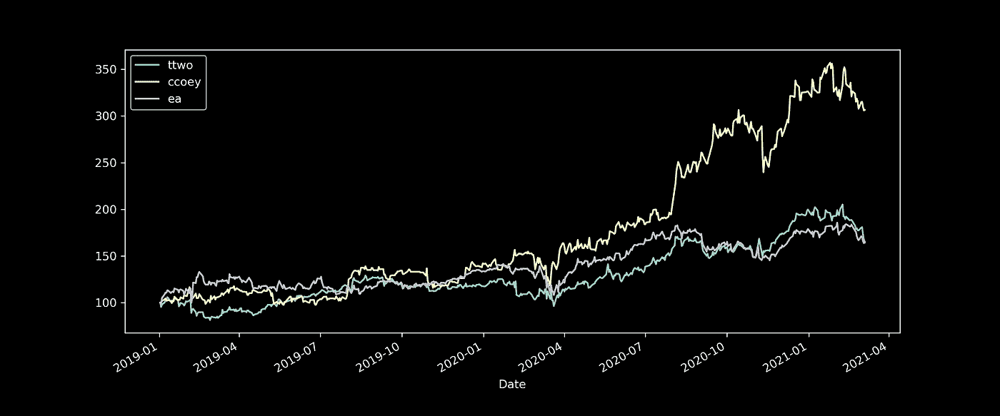

所选股票的收盘价

# 计算回报

然后绘制直方图。

```
returns = prices.to_returns().dropna()
ax = returns.hist(figsize=(10,10))
```

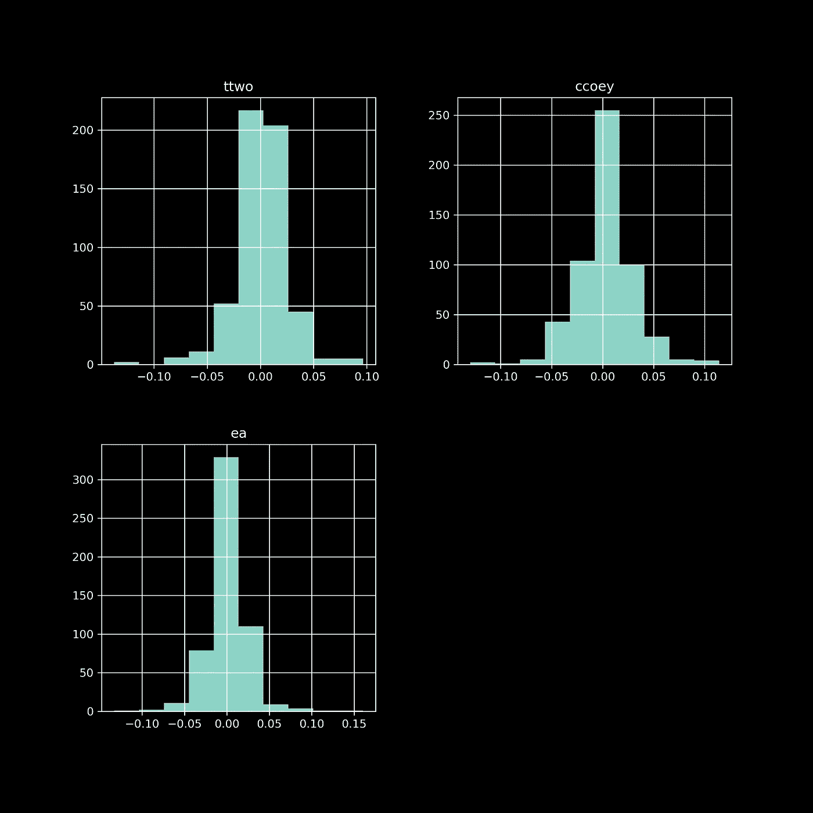

返回数据的直方图

# 性能统计

谈到股票表现，统计数据起着重要作用。ffn calc_stats()函数帮助我们快速显示()我们需要决定是否投资的所有统计数据。

```
stats = prices.calc_stats()
stats.display()
```

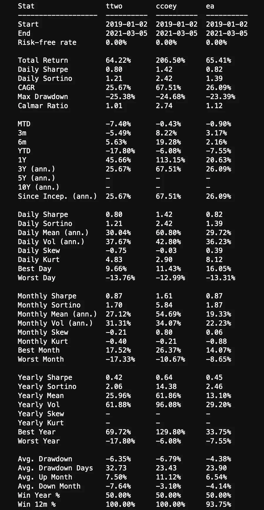

性能统计

# 提款怎么办？

让我们仔细看看股票回报不太好甚至最差的时期。最大损失期被称为提款期。我们可以将绩效统计数据转换为一个下降系列并绘制出来。

```
ax = stats.prices.to_drawdown_series().plot(figsize=(12,5))
```

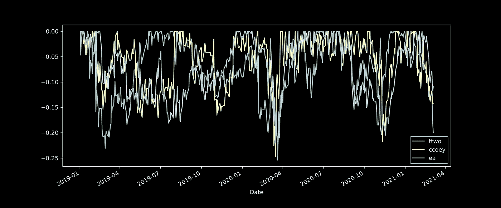

# 复合年增长率

年增长率是否符合我们的回报预期？

```
stats.prices.calc_cagr()
```

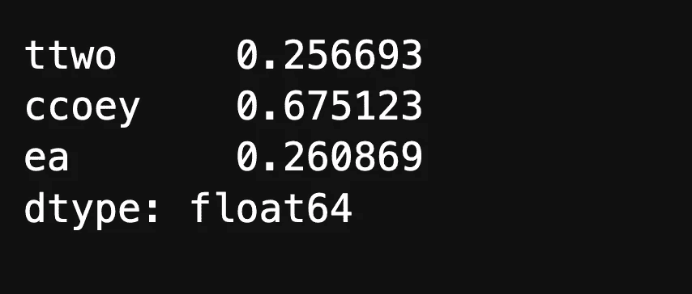

股票回报年增长率

# 投资组合权重

通过两种不同的方法使用 ffn 软件包快速确定投资组合的权重。

1.  均值-方差法

```
returns = prices.to_log_returns().dropna()
returns.calc_mean_var_weights().as_format('.2%')
```

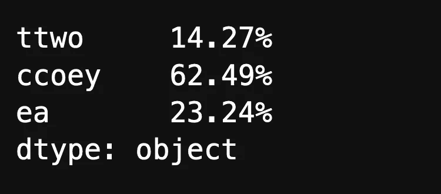

2.同等加权方法

```
returns.calc_erc_weights().as_format(‘.2%’)
```

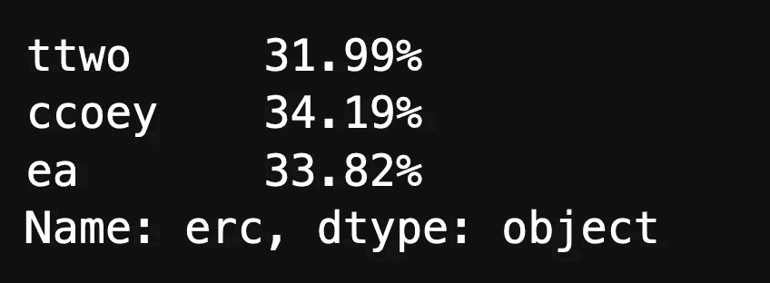

# 计算β值

一家公司的贝塔系数是一种证券的波动性或系统性风险的衡量标准，与大盘相比而言。具体来说，贝塔系数是通过股票收益相对于基准收益的回归分析获得的斜率。以标准普尔 500 为基准，我们可以对投资组合中的每个符号进行循环计算。

```
symbols = ['ttwo', 'ccoey', 'ea']for sym in symbols:
 stk = ffn.get(sym, start=’2016–01–01')
 alpha, beta = alpha_beta(stk, benchmark)
 print(sym, beta)
```

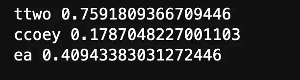

β系数

如果一只股票的贝塔系数为 1.0，表明它的价格活动与市场有很强的相关性。贝塔系数为 1.0 的股票存在系统性风险。

小于 1.0 的贝塔值意味着该证券理论上比市场波动性小。将这支股票纳入投资组合，比没有这支股票的投资组合风险更低。

大于 1.0 的贝塔系数表明证券的价格理论上比市场更不稳定。例如，如果一只股票的贝塔系数是 1.2，它被认为比市场波动性大 20%。

一些股票的贝塔系数为负。贝塔系数为-1.0 意味着股票与市场基准负相关。这只股票可以被认为是基准趋势的相反镜像。

# 投资组合风险和回报

假设我们购买了 **Take-Two 互动软件**的 **3 只**股票、 **3 只**Capcom**的股票和**电子艺界**的 5 只股票。现在我们想根据初始权重来计算预期收益。**

```
returns = prices.pct_change()
weight = np.array([3, 3, 5])
t = np.sum(weight)
weights = weight/
# mean daily return and covariance of daily returns
mean_daily_returns = returns.mean()
cov_matrix = returns.cov()

portfolio_return = round(np.sum(mean_daily_returns * weights) * 252,2)
portfolio_std_dev = round(np.sqrt(np.dot(weights.T,np.dot(cov_matrix, weights))) * np.sqrt(252),2)print("Expected annualised return: " + str(portfolio_return))
print("Volatility: " + str(portfolio_std_dev))
```

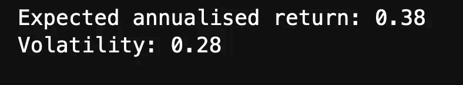

投资组合中有 3 只 **Take-Two 互动软件**，3 只 **Capcom** 和 5 只**电子艺界**股票

# 有效边界

我们希望比较我们投资组合中不同的权重组合，以及它对整体表现的影响。所以我们根据风险和收益偏好来计算有效边界。

在这个例子中，我们想要一个符合高回报预期的投资组合，所以我们计算一个最大夏普投资组合。

1.  我们需要计算预期收益和样本协方差

```
mu = expected_returns.mean_historical_return(prices)
S = risk_models.sample_cov(prices) 
```

2.我们针对最大夏普比率优化投资组合

```
ef = EfficientFrontier(mu, S)
raw_weights = ef.max_sharpe()
cleaned_weights = ef.clean_weights()
print(cleaned_weights)
ef.portfolio_performance(verbose=True)
```

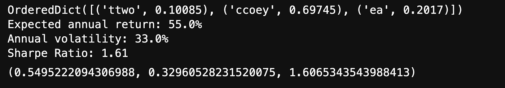

最大夏普投资组合绩效

对于夏普比率为 1.61 的投资组合，我们需要购买 10 %的 **Take-Two 互动软件、** 70 %的 **Capcom** 和 20 %的 **Electronic Arts** 股票。预期年回报率约为 55 %，年波动率约为 33 %。

为了计算有效回报，我们在有效边界计算中使用权重界限和目标回报。

```
ef = EfficientFrontier(mu, S, weight_bounds=(-1, 1))
ef.efficient_return(target_return=0.2, market_neutral=True)
```

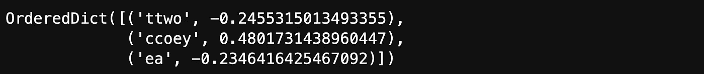

有效回报

# 来源:

*   [https://rand low . github . io/posts/finance-economics/efficient-frontier/](https://randlow.github.io/posts/finance-economics/efficient-frontier/)
*   [https://books.google.de/books?id=aJ7Cp5ZwZ9kC&pg = pa 382&redir _ ESC = y # v = one page&q&f = false](https://books.google.de/books?id=aJ7Cp5ZwZ9kC&pg=PA382&redir_esc=y#v=onepage&q&f=false)
*   [http://pmorissette.github.io/ffn/](http://pmorissette.github.io/ffn/)
*   [https://www . Nasdaq . com/glossary/m/markowitz-efficient-frontier](https://www.nasdaq.com/glossary/m/markowitz-efficient-frontier)
*   [https://www.investopedia.com/terms/b/beta.asp](https://www.investopedia.com/terms/b/beta.asp)
*   [https://github . com/Moccazio/Portfolio _ Selection/blob/main/chapter 4-Portfolio _ Performance _ Metrics/4-analyze _ Portfolio _ Performance . ipynb](https://github.com/Moccazio/Portfolio_Selection/blob/main/Chapter4-Portfolio_Performance_Metrics/4-Analyse_Portfolio_Performance.ipynb)