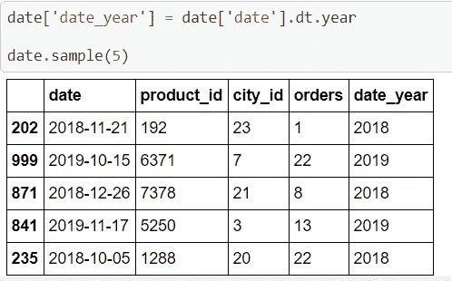

# 如何在 Python 中处理日期和时间列|特征工程|机器学习

> 原文：<https://medium.com/analytics-vidhya/how-to-handle-date-and-time-columns-in-python-feature-engineering-machine-learning-254e45a031ae?source=collection_archive---------3----------------------->

我们将讨论一些使用这些列的有用函数。

我们还将学习如何派生新列

**用例-** 当您想要分析费用跟踪时，数据和时间字段起着主要作用。

1997 年 1 月 22 日——从这个单一的日期，我们可以提取几个其他列，如

1.第二天。年份，3。月份，4。周末，5。星期几，6。四分之一，7。半个季度，8。日名称，9。日、月、秒、年等的差异。

09:12:05-从这个时间，我们可以分别提取秒、分和小时。

现在让我们看看如何用代码实现这一点

加载数据

1.  加载数据
2.  检查日期列的数据类型

数据类型

大多数超时日期时间列将属于**对象类型**。

我们需要将它转换成**日期时间对象**，这样我们就可以对它使用不同的方法。

3

现在我们已经改变了数据类型。

现在，我们将使用不同的方法提取不同的有用列进行分析

**4a。提取年份**

**4b。提取月份**

**4c。提取月份名称**

**4d。提取日**

**4e。提取星期几**

**4f。提取星期几名称**

**4g。检查当天是否是周末**

**4h。提取一年中的一周**

4i。提取季度

**4j。摘录学期**

**5a。提取日期之间经过的时间**

**5b。计算天数差异**

**5c。计算月差**

# **只用时间工作**

**6a。提取小时、分钟、秒**

**6b。提取时间部分**

**6c。时差**

**6d。以秒为单位的时间差**

**6e。以分钟为单位的时差**

**6f。以小时为单位的时差**

当您处理日期和时间列时，这将非常方便。

希望这对你有用。