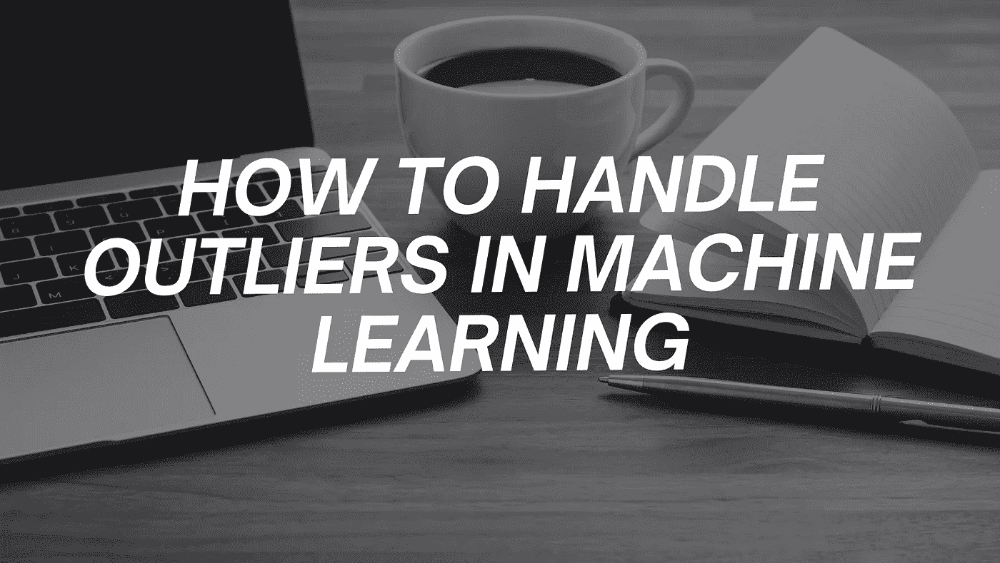
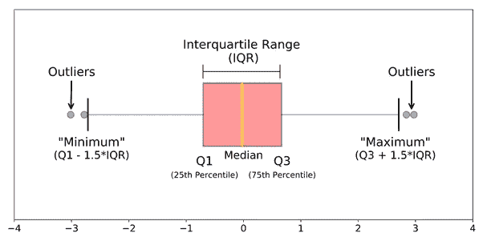
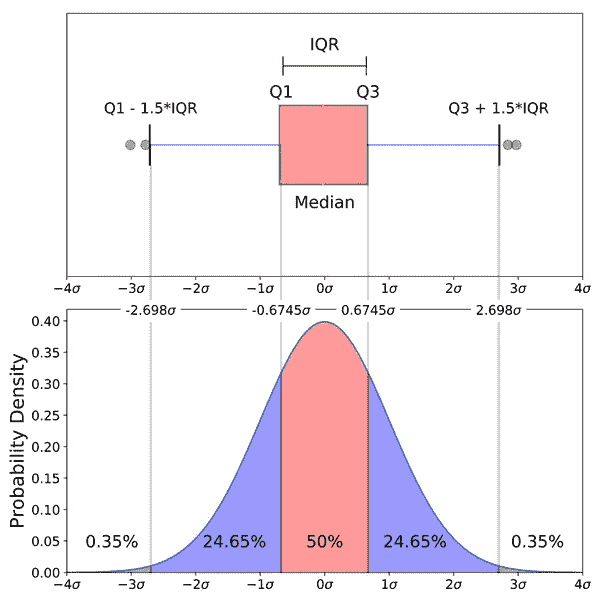

# 如何处理机器学习中的异常值

> 原文：<https://medium.com/analytics-vidhya/how-to-handle-outliers-in-machine-learning-5d8105c708e5?source=collection_archive---------5----------------------->

大家好！！！！特征工程中最重要的阶段是处理异常值，因为它确保我们的模型基于准确的数据进行训练，从而产生准确的模型。

今天，我们将看看什么是离群值，它们的原因和后果，识别它们的各种方法，以及最后使用代码样本处理它们的各种方法。

本文的代码示例和数据集可在[这里](https://github.com/ashutoshsahu2015/How-to-Handle-Outliers)获得。

## **什么是离群值**

与其他结果差异很大的数据点称为异常值。

异常值也可以被描述为我们的数据中与其他观察值相比不正确或异常的观察值。

**原因和后果**

异常值可能由测量不确定性或实验误差引起。

数据中的异常值会破坏和欺骗机器学习模型的训练过程，导致模型不太准确，最终表现不佳。

现在我们知道了什么是离群值以及它们如何影响机器学习算法，让我们看看如何在我们的数据中检测它们。

**如何检测异常值**

使用多种技术可以观察到数据中的异常值。在本文中，我们将研究最流行的方法，即可视化技术。

为了找出异常值，我们可以简单地绘制箱线图。异常值是最小值和最大值之外的点，如下图所示。

布洛图表示法

**如何测量异常值**

一旦我们使用箱线图确定了数据中是否存在异常值，我们就可以测量异常值的边界。
要测量异常值的边界，我们可以使用以下两种方法，这两种方法都基于数据分布。

**I)如果数据呈正态分布**

如果数据呈正态分布，我们可以使用正态分布的经验公式来确定异常值的边界。

下限=平均值-3 *(标准偏差)

上限=平均值+ 3 *(标准偏差)

标准偏差箱线图的正态分布

让我们看看下面的代码，找出数据集的异常值边界:

**II)数据是右偏还是左偏**

如果数据不符合正态分布或者是右偏或左偏的，我们将使用四分位间距来衡量异常值的界限。

四分位距(IQR) = Q3(第 75 百分位)-Q1(第 25 百分位)

异常值边界的公式可以计算如下:

下限=第一个四分位数(Q1/第 25 个百分位数)——(1.5 * IQR)

上限=第三个四分位数(第三季度/第 75 个百分位数)+(1.5* IQR)

如果异常值的最大值与上限相比非常高，将使用以下公式计算异常值的边界(也称为极端异常值):

下限=第一个四分位数(Q1/第 25 个百分位数)——(3 * IQR)

上限=第三个四分位数(第三季度/第 75 个百分位数)+(3 * IQR)

让我们看看下面的代码，找出票价列的异常值边界:

一旦我们为异常值定义了界限，就可以使用以下方法来处理异常值:

1.  删除观察
2.  归罪

**1。移除观察值**

我们可以从数据中明确删除异常值观察条目，这样它们就不会影响我们模型的训练。然而，在处理小数据集时，消除观察值并不是一个好主意。

**2。插补**

为了估算异常值，我们可以使用各种估算值，确保没有数据丢失。
作为估算值，我们可以在**平均值、中值、众数和边界值之间进行选择。**

**参考文献**

[https://towards data science . com/understanding-box plots-5e 2 df 7 bcbd 51](https://towardsdatascience.com/understanding-boxplots-5e2df7bcbd51)

[https://youtu.be/yoLpcelanpl](https://youtu.be/yoLpcelanpl)

[https://medium . com/analytics-vid hya/how-to-remove-outliers-for-machine-learning-24620 c 4657 E8](/analytics-vidhya/how-to-remove-outliers-for-machine-learning-24620c4657e8)

**恭喜**学习了如何在对数据进行特征工程时处理异常值。

感谢你花时间阅读这篇文章。如果你喜欢这篇文章，点击👏按钮并与他人分享。你也可以在我的[中](https://ashutosh-sahu.medium.com/)个人资料下查看其他有趣的文章。如果有任何问题，请在评论区留言，我会尽力回答。

你可以在 [LinkedIn](https://www.linkedin.com/in/ashutoshsahu2015/) 、[脸书](https://www.facebook.com/ashutosh.sahu.9699)和 [Instagram](https://www.instagram.com/_ashutosh_sahu/) 上和我联系。

下次再见，朋友！！！！