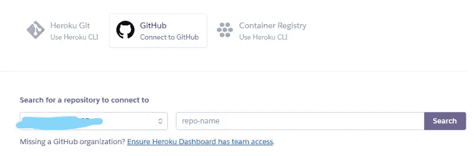

# 如何用 Heroku 和 Github 托管一个 discord.py 机器人

> 原文：<https://medium.com/analytics-vidhya/how-to-host-a-discord-py-bot-on-heroku-and-github-d54a4d62a99e?source=collection_archive---------2----------------------->

**所以你制造了你的不和谐机器人，你现在做什么？**

现在，让你的机器人上线的唯一方法是在你的电脑上运行程序。本教程将向您展示如何使用 Heroku 远程运行它。

*注意:本教程假设你已经(1)制作了一个 discord.py 机器人，并在虚拟环境中安装了所有依赖项，(2)创建了一个 Heroku 帐户，以及(3)熟悉 Github 的基础知识。它不涉及技术细节，而是一个易于遵循的步骤列表。*

## 初始项目目录

在学习本教程之前，您的项目目录应该大致是这样的。

注意:。创意不是项目的一部分

## **设置您的项目目录**

1.  添加一个***requirements . txt***。
    *这个文件包含了你的机器人使用的虚拟环境中的所有依赖项。*

在您的项目目录中使用这个命令来自动完成。

您的 requirements.txt 应该大致如下所示。**确定它有 discord.py.**

更新:还要确保你的 ***需求中有 **discord== <版本>**. txt****(注意不在图中)。输入`pip freeze`并将其复制粘贴到一个新创建的文本文件中，而不是自动方式。*

2.添加一个 ***runtime.txt*** 。这个文件将包含你在这个项目中使用的 Python 版本。

使用此命令检查 Python 的版本。确保你在正确的项目目录中。

用您的版本替换 3.9.2。

3.添加一个 ***Procfile*** 。
*该文件将包含 Heroku 所需的指定工人编号。*

*   创建一个文本文件，放入`worker: python3 main.py`，命名为 ***Procfile.txt*** 。*注意:用主程序的文件位置替换* `*main.py*` *。确保包括它可能在的任何文件夹。*
*   重命名该文件并删除。txt 扩展名。按“确定”弹出任何程序。

您的目录现在应该看起来像这样:

确保 Procfile 是一个文件而不是. txt。

## **在 HEROKU 上主持**

1.  创建一个 Github 存储库，并将您的项目上传到`main`分支。
2.  在 Heroku 上为你的机器人制作一个新的应用。
3.  在*部署*选项卡中，将您的应用程序连接到 Github repo。

搜索你的回购和连接。

4.部署您的应用程序。

注意:这个部分上面是自动部署。你在 Github Repo 中的每一次提交都会自动重新部署应用。

5.成功部署后，转到 *Resources* 选项卡，打开 worker dyno。

点击编辑图标向右滑动。

检查你在 Heroku 上的日志，看看是否一切正常。

之后，确保你的 GitHub repo 保持更新*(特别是 requirements.txt，如果你安装了更多的模块)*并在 Heroku 上部署每次更新*(除非你启用了自动部署)*。

就这么简单，你的机器人现在已经启动并远程运行了。