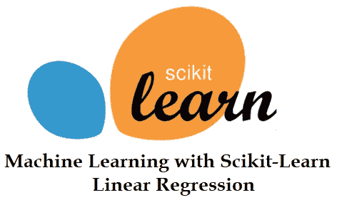
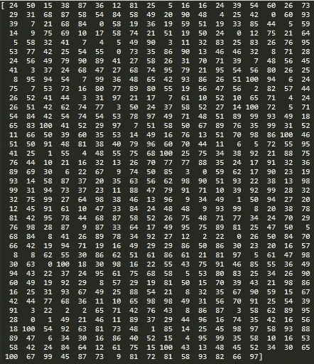
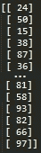

# 如何使用 sklearn 库实现线性回归

> 原文：<https://medium.com/analytics-vidhya/how-to-implement-linear-regression-using-sklearn-library-a1afb74fa664?source=collection_archive---------19----------------------->

Python 被认为是机器学习和基于人工智能的项目的最佳编程语言，因为它有各种各样的库和框架。Scikit-learn 可能是 Python 中最有用的机器学习库。sklearn 库有很多机器学习和统计建模的有效工具，包括分类、回归、聚类等。

在本文中，我将展示如何使用 sklearn 库实现线性回归算法。



**对于非库(从头开始)实现的算法，可以查看** [**我之前的论文**](https://abiyevanar.medium.com/machine-learning-linear-regression-project-from-scratch-without-library-87294048020) **。**

进入编码部分，就像 python 中库的任何其他用法一样，它极大地简化了代码。这就是为什么，这一节在代码本身方面非常简单，并有足够的解释。

1.  **导入必要的库:**

```
from sklearn.linear_model import LinearRegression
import pandas as pd
import numpy as np
```

**2。加载和操作数据集，以便能够与 sklearn 函数一起使用:**

```
train_data = pd.read_csv('train.csv')          #pandas dataframeX = train_data['x']                            #pandas series 
Y = train_data['y'] X = np.array(X)                                #numpy array
Y = np.array(Y) X = X.reshape(-1, 1)                           #reshaped numpy array
Y = Y.reshape(-1, 1)
```

read_csv 获取 csv 文件并将其转换为 pandas 数据帧，该数据帧保存在 train_data 变量中。

在数据集被写成 pandas dataframe 之后，它可以被分成 X(自变量)和 Y(因变量)。X 和 Y 是 pandas 系列，当 sklearn 使用 numpy 数组时，使用 np.array()操作符将 X 和 Y 变量转换为 numpy 数组。

一般来说，将数字放入矩阵中并进行乘法等运算效率更高。这就是为什么，在这里我们重塑 numpy 数组以形成一个(n×1)矩阵。

整形前的 numpy 数组:



整形后的 numpy 数组:



**3。建立模型:**

```
model = LinearRegression().fit(X, Y)
print(model.coef_)
print(model.intercept_)
```

拟合函数将自变量(X)和因变量(X)作为输入，并返回模型。之后就可以打印出拦截点和系数了。

**4。测试模型:**

```
test_data = pd.read_csv('test.csv')
X_test = np.array(test_data['x']).reshape(-1, 1)
Y_test = np.array(test_data['y']).reshape(-1, 1)print(model.score(X_test, Y_test))
```

在机器学习中，每一个模型都应该在建立之后进行测试。为此，使用了另一个数据集—测试集。因为训练集已经为模型所熟悉，因为它被用于构建过程。这就是为什么使用训练集来测试模型不会显示模型的真实性能。

这里，我们再次读取 csv 文件，并将其写入 test_data 变量。在与训练集中相同的数据集操作之后，X_test 和 Y_test 变量包含测试集的独立值和从属值。

score 函数将 X_test 和 Y_test 作为输入，并返回一个介于 0 和 1 之间的数字，分别表示完全失败和完全成功。

# 谢谢你