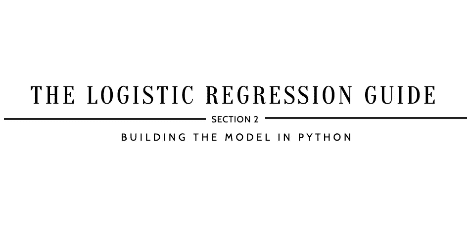
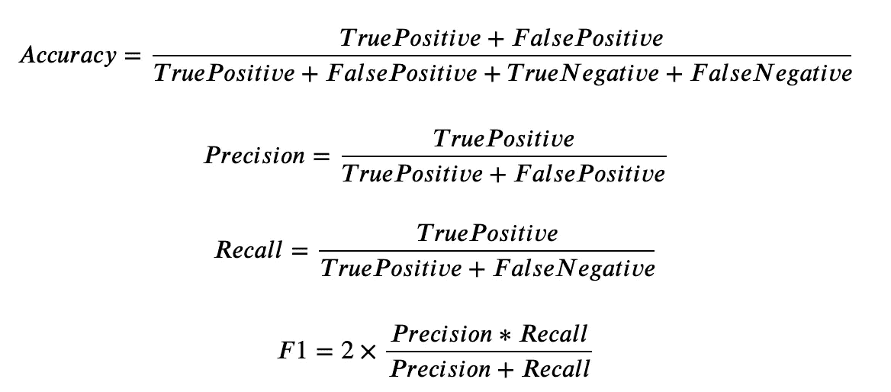

# 如何实现 Logistic 回归？

> 原文：<https://medium.com/analytics-vidhya/how-to-implement-logistic-regression-6f27ce4c45fd?source=collection_archive---------13----------------------->

## 逻辑回归指南

## 第 2 部分:用 Python 构建模型

*参考* [***什么是逻辑回归？第 1 节:定义模型***](https://kopaljain95.medium.com/what-is-logistic-regression-6f58c25471df) *，在继续…* 之前



> ***【1】导入库***

```
import numpy as np
import matplotlib.pyplot as plt
import pandas as pd
```

*   NumPy 是一个用于处理数组的 Python 库。
*   Matplotlib 是一个 Python 库，用于创建静态、动画和交互式可视化。
*   Pandas 是一个 Python 库，用于提供快速、灵活、富于表现力的数据结构。

W hy 这一步: **Python 库**是一组有用的函数，消除了从头编写代码的需要，尤其是在开发机器学习、深度学习、数据科学、数据可视化应用等时！

> ***【2】读取&存储数据***

```
df = pd.read_csv('Mammographic_Data_Cleaned.csv')
df.info()...*<class 'pandas.core.frame.DataFrame'>
RangeIndex: 831 entries, 0 to 830
Data columns (total 5 columns):
AGE         831 non-null float64
SHAPE       831 non-null int64
MARGIN      831 non-null int64
DENSITY     831 non-null int64
SEVERITY    831 non-null int64
dtypes: float64(1), int64(4)
memory usage: 32.6 KB*
```

注意:这里使用的[数据集](https://archive.ics.uci.edu/ml/datasets/Mammographic+Mass)是经过预处理和清洗的。要遵循这些步骤，请参考 [GitHub 代码](https://github.com/kopaljain95/import-data.science-classification/blob/main/DataPreprocessing%5B0%5D/Mammographic_DataPreprocessing.ipynb)。

请注意形状、边距和密度是怎样的数据类型。由于这些特性是名义上的，它们需要被转换成`object`数据类型。如果数据集的数据类型是正确的，那么可以跳过这一步，或者参考下面的代码:

```
for data in [df]: # Convert Data Type for SHAPE
    data['SHAPE'] = data['SHAPE'].astype(str) # Convert Data Type for MARGIN
    data['MARGIN'] = data['MARGIN'].astype(str) # Convert Data Type for DENSITY
    data['DENSITY'] = data['DENSITY'].astype(str)
```

通过这个步骤:为了使用数据和执行数据操作，数据必须以统一的结构读取和存储。熊猫被用来阅读。csv 文件，并将数据存储为名为 df 的数据帧格式。

> ***【3】拆分数据(自变量【X】&【因变量【y】)***

```
dependentVar = 'SEVERITY'X = df.loc[:, df.columns != dependentVar]
y = df[dependentVar].valuesprint("Number of observations and dimensions in 'X':", X.shape)
print("Number of observations in 'y':", y.shape)...*Number of observations and dimensions in 'X': (831, 4)
Number of observations in 'y': (831,)*
```

W 这一步的目的是用自变量(或特征)来预测因变量(或结果)。因此，需要将这些变量分为 X 和 y，其中 X 表示输入模型的所有特征，y 表示模型的结果。

> ***【4】编码自变量【X】***

```
X = pd.get_dummies(X)print("Number of observations and dimensions in 'X':", X.shape)
print("Number of observations in 'y':", y.shape)...*Number of observations and dimensions in 'X': (831, 14)
Number of observations in 'y': (831,)*
```

注意:注意 X.shape 特性是如何从 4 个增加到 14 个的。这意味着模型中又增加了 10 个特性。要了解添加的功能，请参考以下代码:

```
features = X.columns.tolist()print(features)...*['AGE', 'SHAPE_1', 'SHAPE_2', 'SHAPE_3', 'SHAPE_4', 'MARGIN_1', 'MARGIN_2', 'MARGIN_3', 'MARGIN_4', 'MARGIN_5', 'DENSITY_1', 'DENSITY_2', 'DENSITY_3', 'DENSITY_4']*
```

注意:例如，特征形状如何被分解成四个新特征:形状 _1、形状 _2、形状 _3 和形状 _4。

SHAPE_1 表示为[1，0，0，0]

SHAPE_2 表示为[0，1，0，0]

SHAPE_3 表示为[0，0，1，0]

SHAPE_4 表示为[0，0，0，1]

*   **一个热编码**:每个标签映射到一个二进制向量。

W hy 这一步:机器学习算法要求输入输出变量用数字表示。由于此数据集包含分类特征，因此必须先将其编码为数字，然后才能用于拟合和评估模型。

> ***【特征缩放】***

```
from sklearn.preprocessing import StandardScaler
sc = StandardScaler()
X = sc.fit_transform(X)print(X)...*[[ 0.76580356 -0.54443719 -0.52583048 ... -0.2688086   0.31497039
  -0.09859277]
 [ 0.15166622 -0.54443719 -0.52583048 ... -0.2688086   0.31497039
  -0.09859277]
 [-1.89545824  1.83675916 -0.52583048 ... -0.2688086   0.31497039
  -0.09859277]
 ...
 [ 0.56109111 -0.54443719 -0.52583048 ... -0.2688086   0.31497039
  -0.09859277]
 [ 0.69756608 -0.54443719 -0.52583048 ... -0.2688086   0.31497039
  -0.09859277]
 [ 0.42461615 -0.54443719 -0.52583048 ... -0.2688086   0.31497039
  -0.09859277]]*
```

W hy 这一步:一些机器学习算法使用欧几里德距离计算两点之间的距离。如果其中一个要素的值范围很大，则距离将由该要素决定。标准化和规范化是在独立变量范围内使用的技术，允许每个要素成比例地影响最终距离。

> ***【6】分割数据(训练&测试)***

```
from sklearn.model_selection import train_test_split
X_train, X_test, y_train, y_test = train_test_split(X, y, test_size = 0.25, random_state = 0)print("Number of observations and dimensions in training set:", X_train.shape)
print("Number of observations and dimensions in test set:", X_test.shape)
print("Number of observations in training set:", y_train.shape)
print("Number of observations in test set:", y_test.shape)...*Number of observations and dimensions in training set: (623, 14)
Number of observations and dimensions in test set: (208, 14)
Number of observations in training set: (623,)
Number of observations in test set: (208,)*
```

*   **训练集**用于训练或拟合模型。
*   **测试集**用于获得最终模型的无偏评估。

W 通过这一步:要评估模型的预测性能，重要的是要有一个无偏的评估。这可以通过在使用数据集之前对其进行拆分来实现。数据随机分为训练集和测试集，其中 75%的数据留作训练数据，其余 25%的数据留作测试数据。

> ***【7】在训练数据上建立模型***

```
from sklearn.linear_model import LogisticRegressionlogModel = LogisticRegression(random_state=1234)
logModel.fit(X_train, y_train)...*LogisticRegression(C=1.0, class_weight=None, dual=False,
fit_intercept=True, intercept_scaling=1, l1_ratio=None, max_iter=100, multi_class='warn', n_jobs=None, penalty='l2', random_state=None, solver='warn', tol=0.0001, verbose=0, warm_start=False)*
```

通过这一步:根据训练数据训练模型，使其能够准确预测结果。

> ***【8】对测试数据进行预测***

```
y_pred = logModel.predict(X_test)print(y_pred)...*[1 1 0 0 0 0 0 1 1 1 0 0 1 0 0 0 1 0 0 0 0 1 0 0 1 0 1 1 1 1 0 1 0 0 0 0 1 0 0 1 0 1 0 1 1 1 1 0 1 1 1 1 1 1 1 1 0 0 1 1 1 0 0 0 1 0 1 0 1 0 1 1 0 0 1 0 0 1 1 1 0 1 0 0 0 1 1 1 0 0 1 1 1 0 0 1 1 0 1 0 1 1 1 0 0 1 0 1 1 0 1 1 1 0 1 0 1 0 1 1 0 0 0 1 0 0 0 0 0 0 0 1 1 1 1 1 0 0 1 1 0 1 0 1 0 1 0 0 0 1 0 0 1 1 0 0 0 0 0 0 0 0 1 1 1 0 0 1 1 1 1 1 1 0 1 0 1 0 1 1 1 1 1 0 1 1 1 1 1 0 0 1 0 1 1 0 1 1 1 1 1 1 1 0 1 0 1 0]*
```

W 通过这一步:获得对测试数据的模型预测，以评估模型的准确性和效率。

> ***【9】数值分析***

```
from sklearn.metrics import confusion_matrix
print(confusion_matrix(y_test, y_pred), ": is the confusion matrix")from sklearn.metrics import accuracy_score
print(accuracy_score(y_test, y_pred), ": is the accuracy score")from sklearn.metrics import precision_score
print(precision_score(y_test, y_pred), ": is the precision score")from sklearn.metrics import recall_score
print(recall_score(y_test, y_pred), ": is the recall score")from sklearn.metrics import f1_score
print(f1_score(y_test, y_pred), ": is the f1 score")...*[[85 21]
[13 89]] : is the confusion matrix* 0.8365384615384616 : is the accuracy score
0.8090909090909091 : is the precision score
0.8725490196078431 : is the recall score
0.8396226415094339 : is the f1 score
```

注意:使用混淆矩阵，可以提取真阳性、假阳性、假阴性和真阴性值，这将有助于计算准确度分数、精确度分数、回忆分数和 f1 分数:

*   **真正** = 85
*   **假阳性** = 21
*   **假阴性** = 13
*   **真负** = 89



准确度、精确度、召回率和 F1 的方程式。

W 通过这一步:评估一个分类模型的性能。

[](https://github.com/kopaljain95/import-data.science-classification/blob/main/LogisticRegression%5B1%5D/LogisticRegression.ipynb) [## kopaljain 95/import-data . science-分类

### 在 GitHub 上创建一个帐户，为 kopaljain 95/import-data . science-classification 的开发做出贡献。

github.com](https://github.com/kopaljain95/import-data.science-classification/blob/main/LogisticRegression%5B1%5D/LogisticRegression.ipynb) 

*接下来——*[*如何提高 Logistic 回归？第 3 节:在 Python 中调优模型*](https://kopaljain95.medium.com/how-to-improve-logistic-regression-b956e72f4492) *…*