# 如何使用 raiwidgets 实现负责任的 AI 特性

> 原文：<https://medium.com/analytics-vidhya/how-to-implement-responsible-ai-features-using-raiwidgets-9e7a5600ca5e?source=collection_archive---------7----------------------->

# 如何使用 titanic 数据集实现负责任的人工智能特性

# 介绍

# 先决条件

*   Azure 帐户
*   Azure 存储
*   Azure 机器学习服务

# 代码示例

*   使用笔记本代码执行负责任的人工智能功能
*   可解释性
*   公平
*   更多

# 库安装

```
!pip install raiwidgets==0.9.2
!pip install fairlearn==0.7.0
```

*   检查版本

```
!pip show fairlearn
!pip show raiwidgets
```

*   现在实际的代码
*   从数据集或文件加载数据

```
from raiwidgets import ExplanationDashboardfrom azureml.core import Dataset
from azureml.data.dataset_factory import DataType# create a TabularDataset from a delimited file behind a public web url and convert column "Survived" to boolean
web_path ='https://dprepdata.blob.core.windows.net/demo/Titanic.csv'
titanic_ds = Dataset.Tabular.from_delimited_files(path=web_path, set_column_types={'Survived': DataType.to_bool()})# preview the first 3 rows of titanic_ds
titanic_ds.take(3).to_pandas_dataframe()
from azureml.core import Workspace, Datasetimport pandas as pd
import numpy as npdf = pd.read_csv('Titanic.csv')
df.head()df['id'] = df[['Name']].sum(axis=1).map(hash)titanic_features = df.copy()
titanic_labels = titanic_features.pop('Survived')df.drop('Name', axis=1, inplace=True)from sklearn.preprocessing import LabelEncoder, OneHotEncoder
import sklearn as skdf1 = pd.get_dummies(df)y = df1['Survived']X = df1
X = X.drop(columns=['Survived'])
X['Age'] = X['Age'].fillna(0)
X = X.dropna()import pandas as pd
import seaborn as sn
import matplotlib.pyplot as plt
from sklearn.preprocessing import StandardScaler
from sklearn.linear_model import LogisticRegression
from tqdm import tqdm
from sklearn import preprocessingfrom sklearn.model_selection import train_test_splitX_train, X_test, y_train, y_test = train_test_split(X, y, test_size=0.33, random_state=42)import sklearn as sk
from sklearn.linear_model import LogisticRegressionLR = LogisticRegression(random_state=0, solver='lbfgs', multi_class='ovr').fit(X, y)
LR.predict(X.iloc[460:,:])
round(LR.score(X,y), 4)y_pred = LR.predict(X_test)from sklearn.metrics import roc_auc_score
from sklearn.metrics import f1_scorefrom sklearn import metrics
print(metrics.classification_report(y_test, y_pred))from sklearn.datasets import load_breast_cancer
from sklearn import svm# Explainers:
# 1\. SHAP Tabular Explainer
#from interpret.ext.blackbox import TabularExplainer
from interpret.ext.blackbox import TabularExplainerclasses = X_train.columns.tolist()explainer = TabularExplainer(LR, 
                             X_train, 
                             features=X.columns, 
                             classes=['Sex_male', 'Sex_female'])from interpret.ext.blackbox import MimicExplainer# you can use one of the following four interpretable models as a global surrogate to the black box modelfrom interpret.ext.glassbox import LGBMExplainableModel
from interpret.ext.glassbox import LinearExplainableModel
from interpret.ext.glassbox import SGDExplainableModel
from interpret.ext.glassbox import DecisionTreeExplainableModel# "features" and "classes" fields are optional
# augment_data is optional and if true, oversamples the initialization examples to improve surrogate model accuracy to fit original model.  Useful for high-dimensional data where the number of rows is less than the number of columns. 
# max_num_of_augmentations is optional and defines max number of times we can increase the input data size.
# LGBMExplainableModel can be replaced with LinearExplainableModel, SGDExplainableModel, or DecisionTreeExplainableModel
explainer = MimicExplainer(LR, 
                           X_train, 
                           LGBMExplainableModel, 
                           augment_data=True, 
                           max_num_of_augmentations=10, 
                           features=X.columns, 
                           classes=['Sex_male', 'Sex_female'])global_explanation = explainer.explain_global(X_test)from raiwidgets import ExplanationDashboardExplanationDashboard(global_explanation, LR, dataset=X_test, true_y=y_test)
```

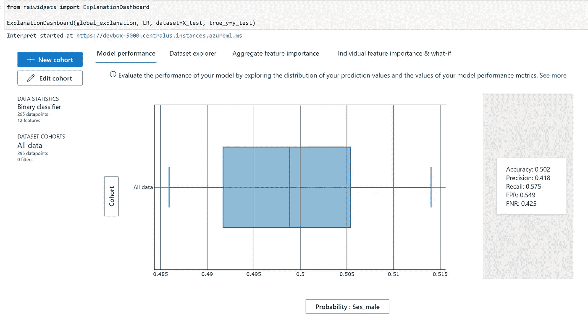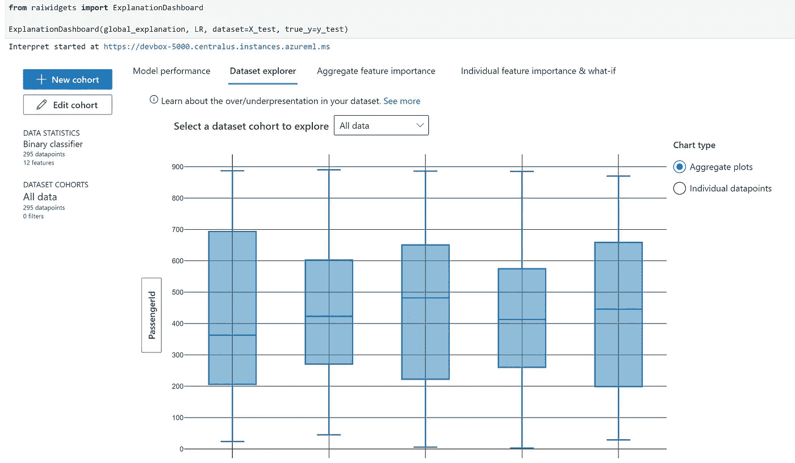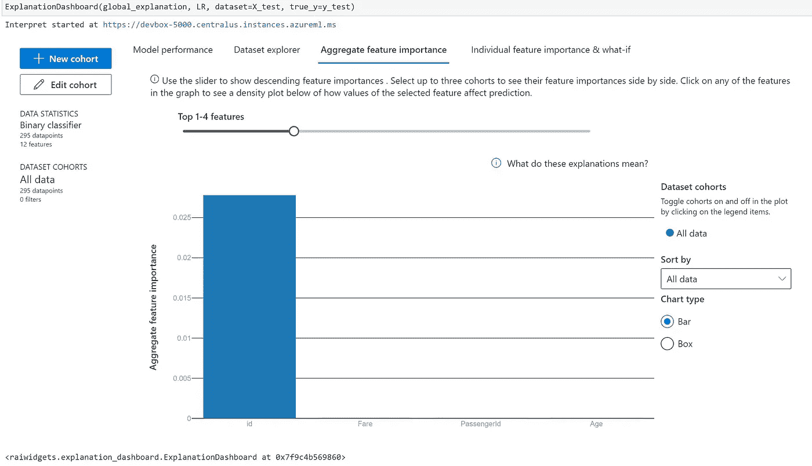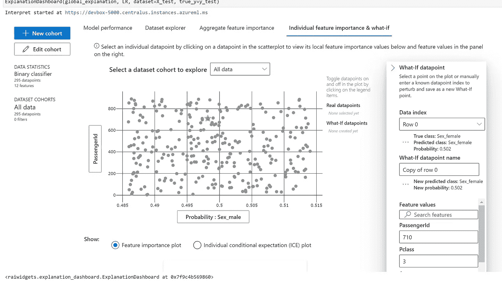

```
# Sorted SHAP values
print('ranked global importance values: {}'.format(global_explanation.get_ranked_global_values()))
# Corresponding feature names
print('ranked global importance names: {}'.format(global_explanation.get_ranked_global_names()))
# Feature ranks (based on original order of features)
print('global importance rank: {}'.format(global_explanation.global_importance_rank))

# Note: Do not run this cell if using PFIExplainer, it does not support per class explanations
# Per class feature names
print('ranked per class feature names: {}'.format(global_explanation.get_ranked_per_class_names()))
# Per class feature importance values
print('ranked per class feature values: {}'.format(global_explanation.get_ranked_per_class_values()))# Print out a dictionary that holds the sorted feature importance names and values
print('global importance rank: {}'.format(global_explanation.get_feature_importance_dict()))sex = df['Sex']
sex.value_counts()y_true = y_test
len(y_test)
len(y_pred)sensitivefeatures = X_test[['Sex_male', 'Sex_female']]
sensitivefeaturesprint ("Confusion Matrix:")
print (metrics.confusion_matrix(y_test, y_pred))gm = MetricFrame(metrics=accuracy_score, y_true=y_test, y_pred=y_pred, sensitive_features=sensitivefeatures)
print(gm.overall)
print(gm.by_group)from fairlearn.metrics import selection_rate
sr = MetricFrame(metrics=selection_rate, y_true=y_true, y_pred=y_pred, sensitive_features=sensitivefeatures)
```

*   公平

```
from raiwidgets import FairnessDashboard

# A_test contains your sensitive features (e.g., age, binary gender)
# y_true contains ground truth labels
# y_pred contains prediction labels

FairnessDashboard(sensitive_features=sensitivefeatures,
                  y_true=y_test.tolist(),
                  y_pred=y_pred)
```

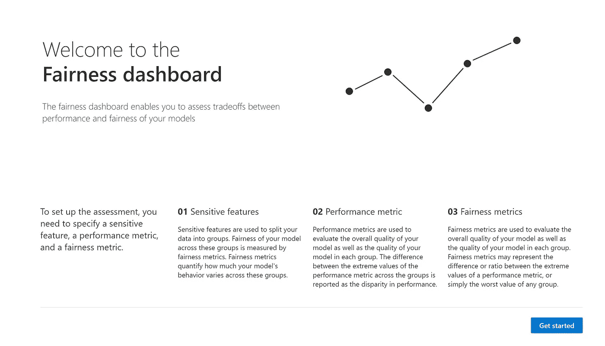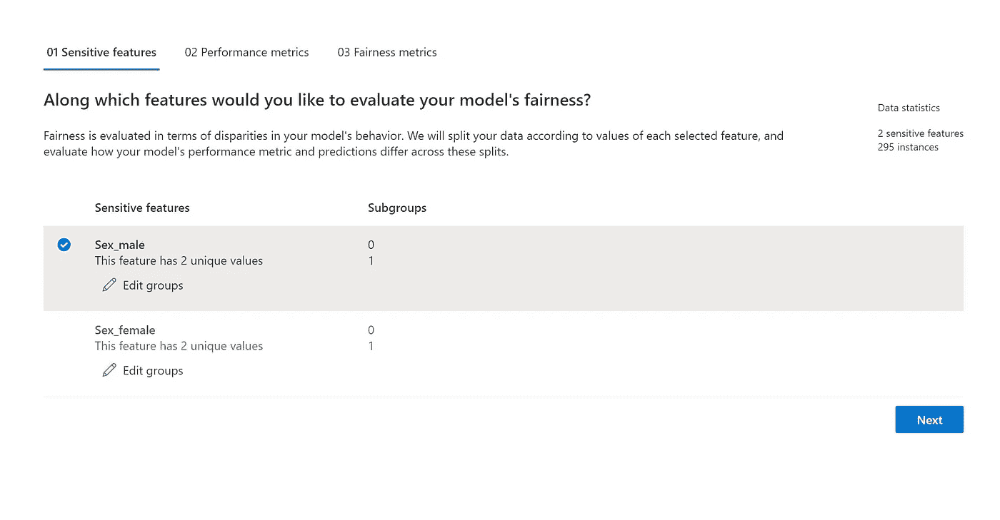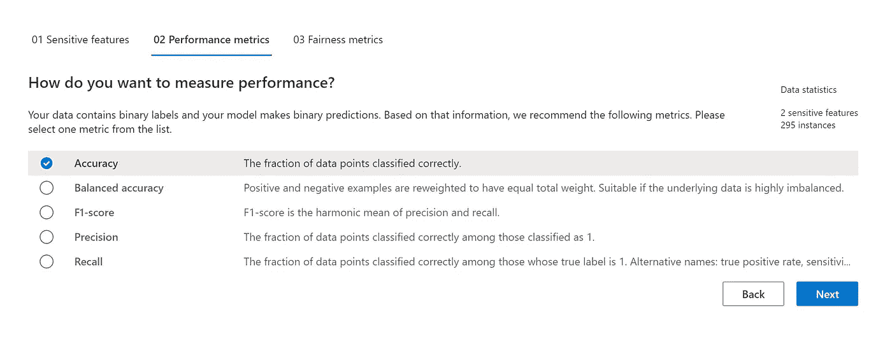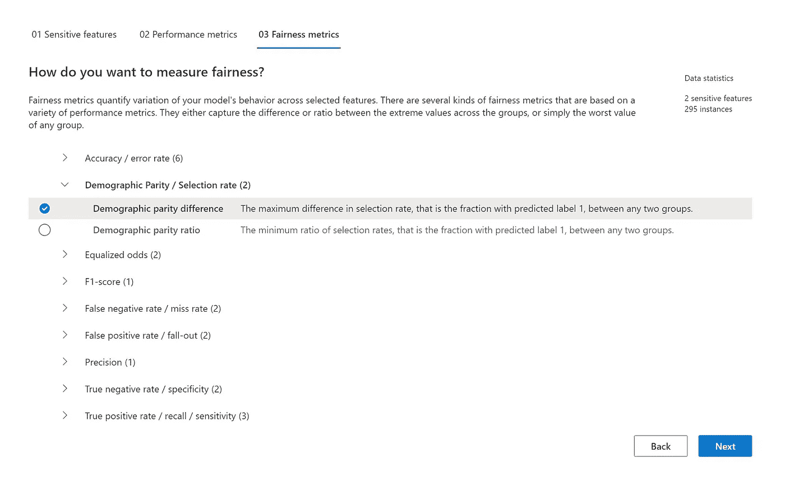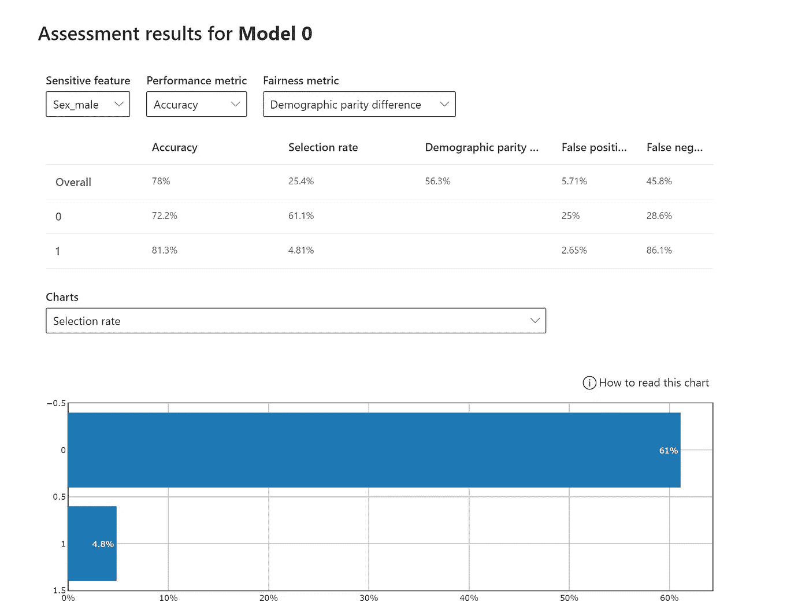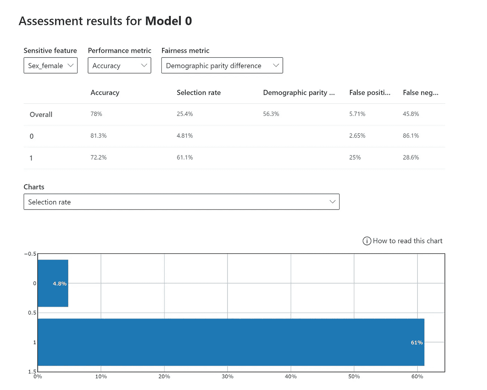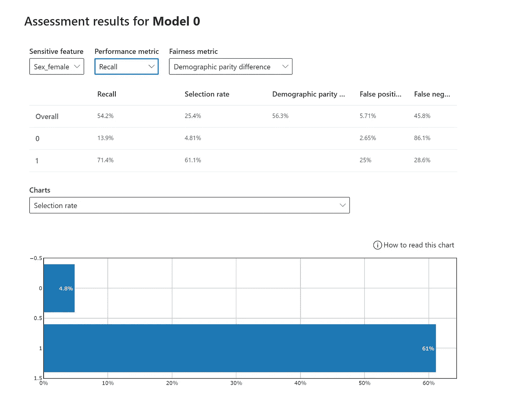

*最初发表于*[*【https://github.com】*](https://github.com/balakreshnan/Samples2021/blob/main/ResponsibleAI/titanicrai.md)*。*