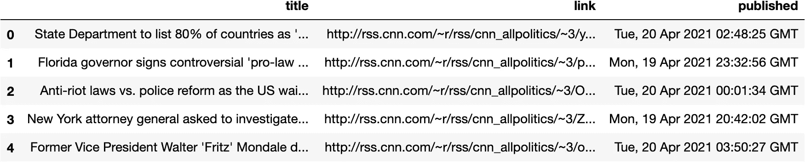

# 如何从 CNN 的 RSS 源导入/抓取数据？

> 原文：<https://medium.com/analytics-vidhya/how-to-import-data-from-cnns-rss-feed-95c828e446e?source=collection_archive---------18----------------------->


从任何 RSS 源导入数据非常容易，但是对于这个实现，我们将关注 CNN 的 RSS 源数据。在这个示例中，我们使用政治数据的 RSS 提要。所以让我们开始吧。

我们首先需要导入几个基本库，如**请求**、**美汤、**和**熊猫**。我们将使用 pandas 将数据保存到数据帧或 **CSV**

```
import requests
from bs4 import BeautifulSoup
import pandas as pd
```

我们将在这里定义两个不同的函数。**使用 CNN _ news _ scraper**功能是为了用美汤刮数据。我们使用`features='xml'`来解析来自 RSS 提要的 **XML**

```
**#** Function to get the various attributes of the article
def getArticles(articles):
    all_articles = []
    for article in articles:
        article_title = article.find('title').text
        article_link = article.find('link').text
        article_published = article.find('pubDate').text
        all_articles.append({
            'title':article_title,
            'link':article_link,
            'published':article_published
        })
    return all_articles

# Function to invoke CNN Scrapper
def cnn_news_scrapper(URL):
    try:
        r = requests.get(URL)
        soupContent = BeautifulSoup(r.content,features='xml')
        print('Job Succeeded returning Status Code: ', r.status_code)
        items = soupContent.findAll('item')
        print('Total News Content')
        print(len(items))
        return getArticles(soupContent.findAll('item'))
    except Exception as e:
        print('Scraping failed due to the below exception')
        print(e)
```

## 报废流程

我们将使用上述函数开始刮擦过程。我们将使用下面提到的 URL `[http://rss.cnn.com/rss/cnn_allpolitics.rss](http://rss.cnn.com/rss/cnn_allpolitics.rss)`调用它

```
print('Starting scraping')
data = cnn_news_scrapper('http://rss.cnn.com/rss/cnn_allpolitics.rss')
print('Finished scraping')Starting scraping
Job Succeeded returning Status Code:  200
Total News Content
30
Finished scraping
```

将数据加载到数据帧中很容易。我们只需要获得变量`data`，并将其输入到创建新数据帧的函数中，例如`pd.DataFrame(data)`

```
df = pd.DataFrame(data)df.head()
```



```
# Persist data as CSV

# df.to_csv('cnn_political_news.csv', index=False)
```

# 结论

如您所见，我们使用 BeautifulSoup 从 RSS 提要中提取数据的方式与 BeautifulSoup 的任何其他抓取实现非常相似。它也很容易实现和使用。

# 参考

[1] [源代码可以在 Github](https://github.com/shivkumarganesh/PythonScrapers/blob/main/CNN%20RSS%20Scraper.ipynb) 中找到