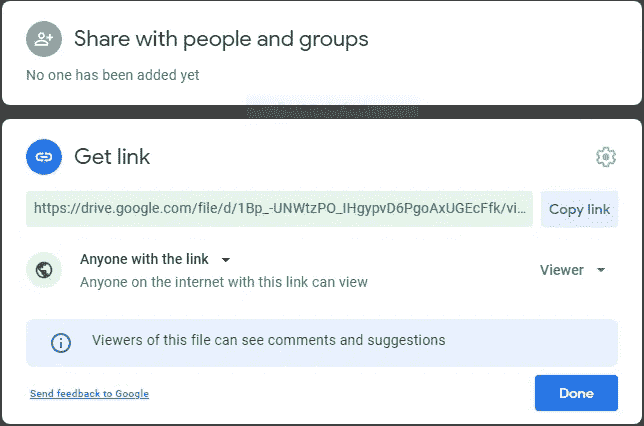

# 如何将数据从 Google Drive 导入 Kaggle 笔记本

> 原文：<https://medium.com/analytics-vidhya/how-to-import-data-from-google-drive-into-kaggle-notebook-3af68a1f0d4?source=collection_archive---------6----------------------->

在本教程中，我将教你如何从 google drive o Kaggle 内核传输文件。它只需要三个快速的步骤。


照片由[PJ·加尔·萨伯](https://unsplash.com/@pjgalszabo?utm_source=medium&utm_medium=referral)在 [Unsplash](https://unsplash.com?utm_source=medium&utm_medium=referral) 上拍摄

3 个步骤:

1.  安装驱动器扩展
2.  获取可共享文件 id
3.  在笔记本中运行下载命令

**第一步:**

```
#Setup Gdrive file download extention 
!conda install -y gdown
```

**第二步:**

1.  将您的文件访问权限设置为可共享。
2.  复制链接并提取文件 ID



共享权限屏幕

```
Example: [https://drive.google.com/file/d/1Bp_-UNWtzPO_IHgypvD6PgoAxUGEcFfk/view?usp=sharing](https://drive.google.com/file/d/1Bp_-UNWtzPO_IHgypvD6PgoAxUGEcFfk/view?usp=sharing)[https://drive.google.com/file/d/{FILE ID}/view?usp=sharing](https://drive.google.com/file/d/1Bp_-UNWtzPO_IHgypvD6PgoAxUGEcFfk/view?usp=sharing)
```

**第三步:**

粘贴您的文件 Id 并取消单元格。
您的文件将立即下载到 Kaggle 中。

```
Syntax:
!gdown --id <File ID>Example:
!gdown --id 138F0Dro2O0Rvk17OjjrTOmx8uy16Q5G0
```

# 结论:

权力越大，责任越大。现在你有了一个惊人的数据集。你会用它做什么？

你觉得这篇文章有用吗？给它鼓掌👏，分享给社区，有一些想法，还是我漏掉了什么？请在评论中与我分享📝。

# 连接

作者是一名应用深度学习工程师，热衷于构建有意义的影响导向型产品。他还是 AWS 教育云大使，以及由 Google 开发者领导的前开发者学生俱乐部成员。他真的很喜欢与人交流。如果你喜欢他的工作，就在 LinkedIn 上跟他打个招呼。

[](https://linktr.ee/mrasimzahid) [## @MrAsimZahid

### 链接树。让你的链接做得更多。

linktr.ee](https://linktr.ee/mrasimzahid) 

# 阅读更多信息:

[](/analytics-vidhya/how-to-scrape-tweets-and-create-dataset-using-twint-without-twitter-api-e5890c25d1c9) [## 如何在没有 Twitter API 的情况下使用 Twint 抓取推文并创建数据集

### Twint 是一个用 Python 编写的高级 Twitter 抓取工具，允许从 Twitter 个人资料中抓取推文…

medium.com](/analytics-vidhya/how-to-scrape-tweets-and-create-dataset-using-twint-without-twitter-api-e5890c25d1c9)