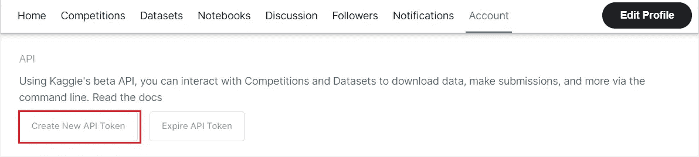
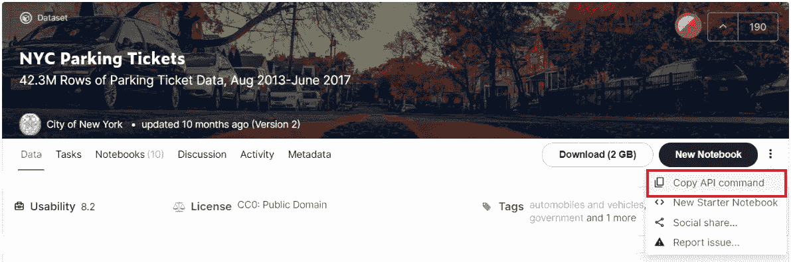
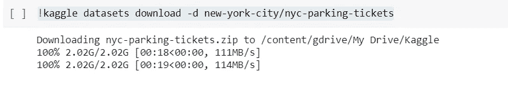
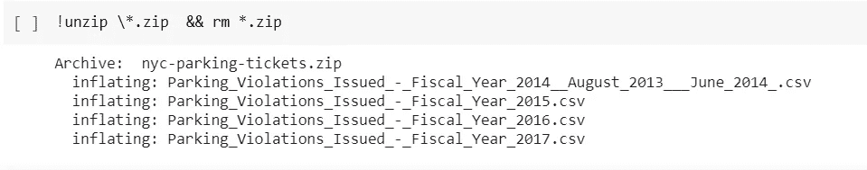

# 如何将 Kaggle 数据集导入 Google Colab

> 原文：<https://medium.com/analytics-vidhya/how-to-import-kaggle-datasets-into-google-colab-fb23c1566be3?source=collection_archive---------11----------------------->


由 [Austin Distel](https://unsplash.com/@austindistel?utm_source=medium&utm_medium=referral) 在 [Unsplash](https://unsplash.com?utm_source=medium&utm_medium=referral) 拍摄

对于那些试图提高数据科学/分析技能的人来说，Kaggle 是一个很好的地方。它有大量的公共数据集可供你下载和使用。您可以使用这些 Kaggle 数据集，而不必将它们下载到您的 PC 上，而是将它们导入到 Google Colaboratory 中。Colab 是一个免费的 Jupyter 笔记本环境，它完全运行在云中。它允许您通过浏览器编写和执行 Python 代码。

因此，让我们看看如何轻松地将 Kaggle 数据集导入 Colab，我还将提供一些有用的 Python 代码来分析您导入的数据集。

1.  创建一个 Kaggle 帐户。你已经有一个谷歌账户了吧？
2.  复制 Kaggle API 令牌

转到您的帐户并单击创建新的 API 令牌。



将下载一个 kaggle.json 文件。

3.将 kaggle.json 文件上传到 Google drive 的一个文件夹中。我给我的取名为卡格尔。这是我们将要存储数据集的文件夹。

4.创建新的 Colab 笔记本。

现在我们必须在我们的 Colab 笔记本上写一些代码。

```
from google.colab import drive
drive.mount('/content/gdrive')
```

这将把驱动器安装到 Colab。您将被要求提供授权码。

```
import os
os.environ['KAGGLE_CONFIG_DIR'] = "/content/gdrive/My Drive/Kaggle"
```

这提供了 kaggle 文件夹中 kaggle.json 文件的配置路径。

```
%cd /content/gdrive/My Drive/Kaggle
```

如上所示更改当前工作目录。

现在转到 Kaggle 数据集，复制 API 命令。



现在，在您的 Colab 笔记本中运行以下命令。`kaggle datasets download -d new-york-city/nyc-parking-tickets`是我为我的数据集复制的 API 命令。

```
!kaggle datasets download -d new-york-city/nyc-parking-tickets
```

您将得到如下所示的结果。



使用下面的命令解压并删除 zip 文件。

```
!unzip \*.zip  && rm *.zip
```

您将得到如下输出。



就是这样。您已经成功地将 Kaggle 数据集导入到 Colabs 中。😀

我希望这篇文章通过将 Kaggle 数据集导入 Colab，帮助您更轻松地从事数据科学项目。

编码快乐！