# 如何从备份的压缩 File(tar.gz)🗜️导入/恢复 Neo4j 图形数据库

> 原文：<https://medium.com/analytics-vidhya/how-to-import-restore-neo4j-database-from-a-backup-compressed-file-tar-gz-f6e355a03b80?source=collection_archive---------2----------------------->

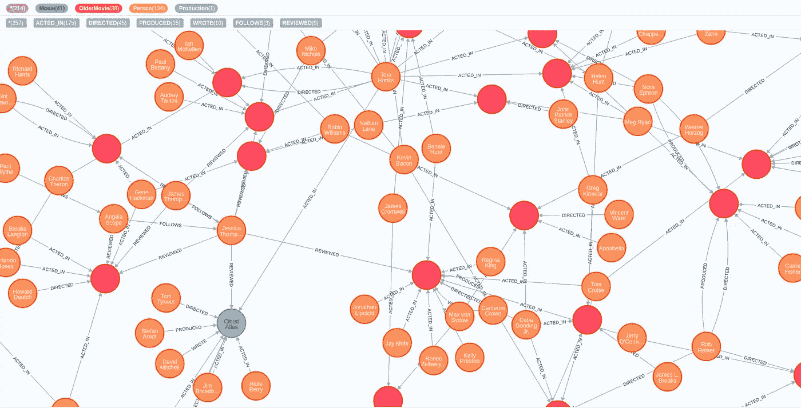

电影知识图(Neo4j)

Neo4j 是一个图形数据库管理系统。常见的用例有知识图、数字孪生、极点等。

我假设您的系统中安装了 neo4j desktop。

# 程序:

1.  获取数据库备份/文件。

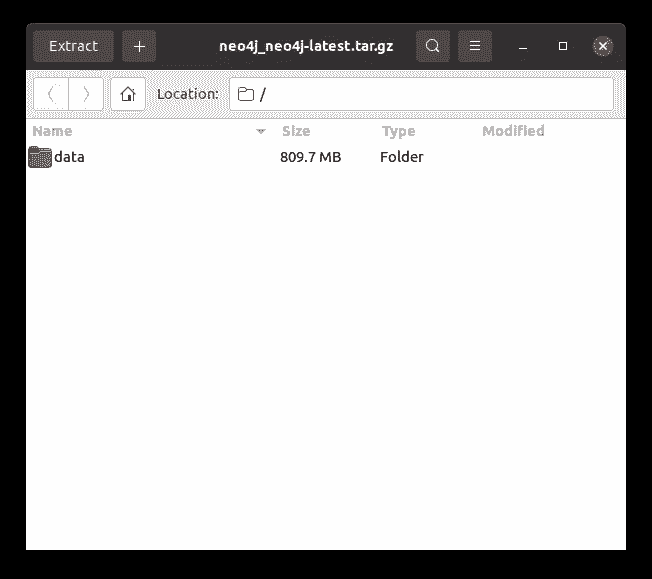

数据库备份

2.提取文件夹。你将得到一个名为“数据”的文件夹。

3.打开你的 neo4j 桌面。

4.创建一个数据库。

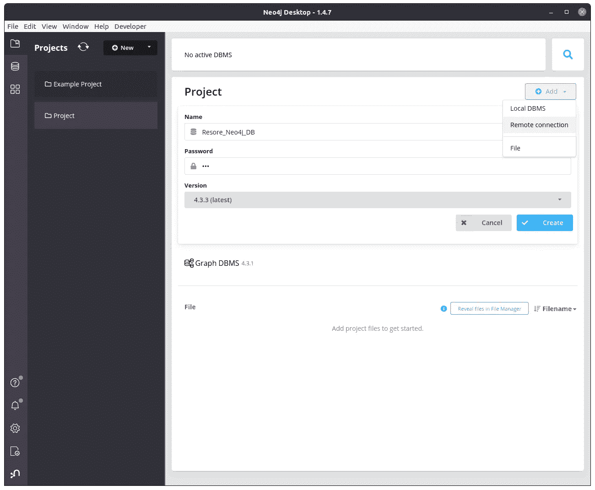

Neo4j 桌面，创建数据库

5.暂时不要启动数据库。

6.打开设置。

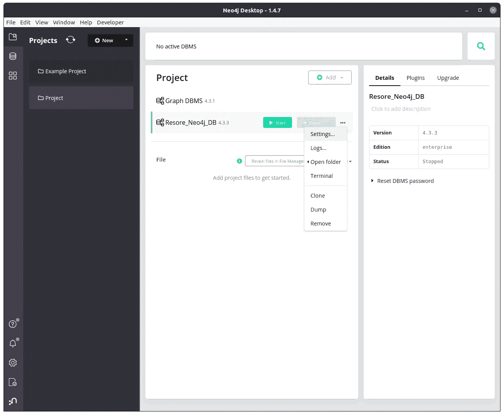

打开设置

7.取消“设置…”中以下行的注释

```
# Enable this to be able to upgrade a store from an older version.
dbms.allow_upgrade=true
```

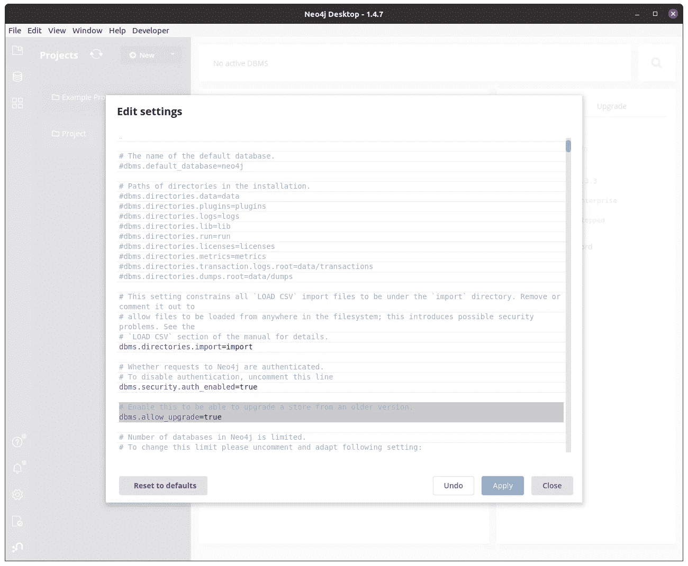

编辑设置

8.按应用。

9.打开 Neo4j 端子。

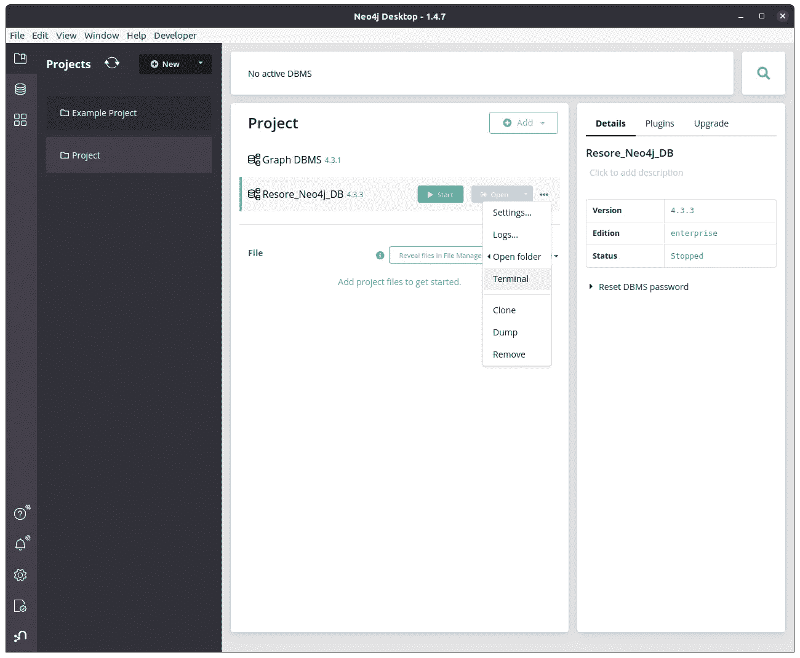

开放终端

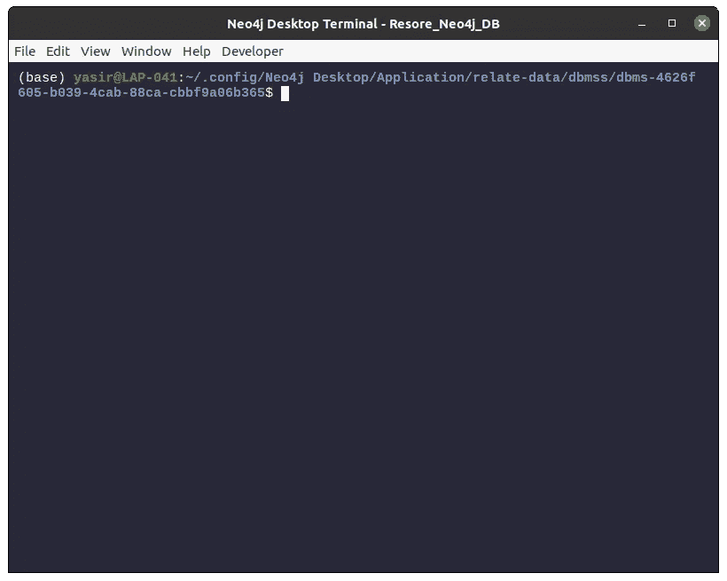

Neo4j 端子

10.在您的终端中输入以下命令以及提取的备份的路径，包括“path_to_folder/data/neo4j”

```
./bin/neo4j-admin restore --from=/path/to/your/data/folder/data/neo4j --database=neo4j --force
```

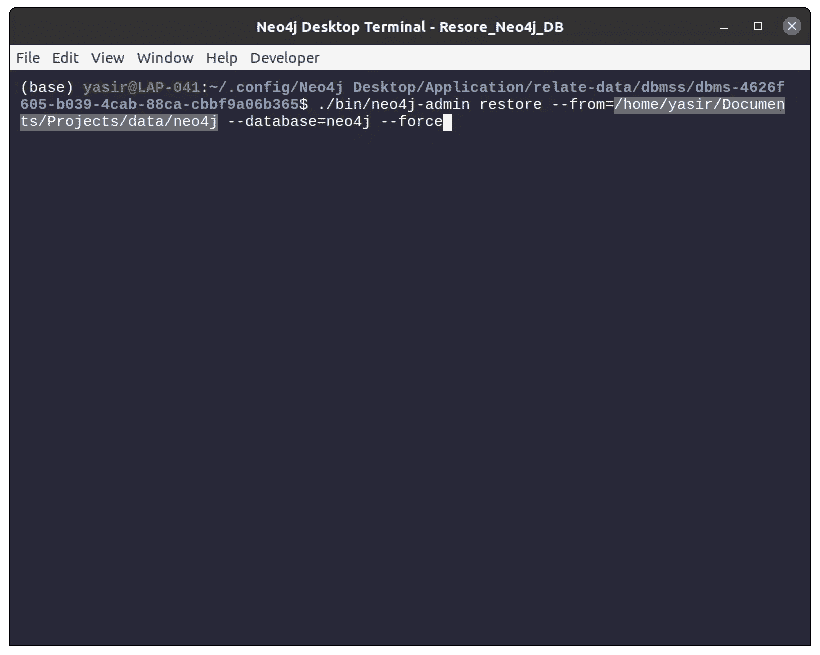

输入恢复命令

11.按回车键，您将看到一条成功消息。

恭喜你，你的数据库已经恢复。

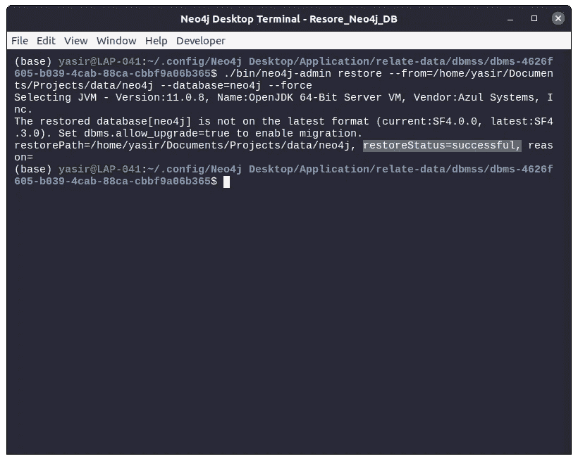

查看数据库恢复结果

12.关闭终端并启动数据库。

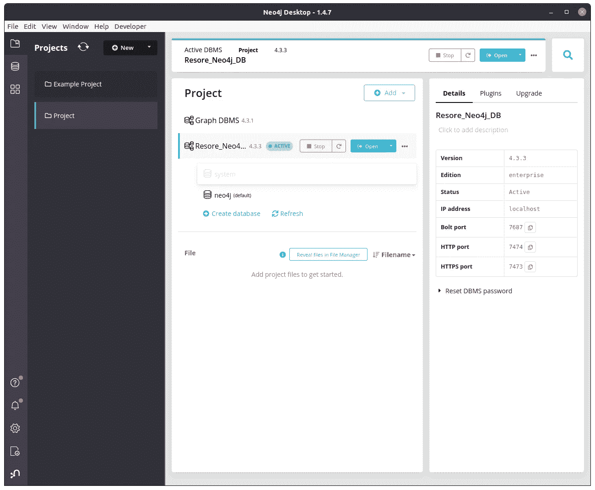

启动数据库

13.打开 Neo4j 浏览器，浏览你的数据库。运行查询，构建知识图表。玩得开心。干杯🎉

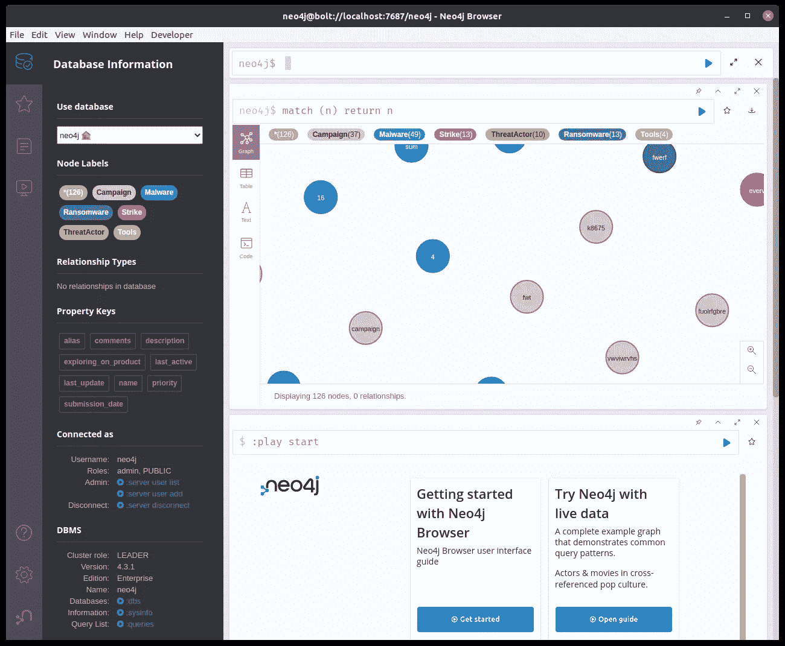

探索知识图表

供进一步参考:

[](https://neo4j.com/docs/operations-manual/current/backup-restore/restore-backup/) [## 恢复数据库备份-操作手册

### 可以使用 neo4j-admin 的 restore 命令恢复数据库备份或离线数据库。您必须创建…

neo4j.com](https://neo4j.com/docs/operations-manual/current/backup-restore/restore-backup/) 

# 结论:

你觉得这篇文章有用吗？给它鼓掌👏，分享给社区，有一些想法，还是我漏掉了什么？请在评论中与我分享📝。

# 连接

作者是一名数据科学家，热衷于构建有意义的影响导向型产品。他是纸牌专家。他是前谷歌开发者学生俱乐部(GDSC)负责人和 AWS 教育云大使。他喜欢与人交往。如果你喜欢他的作品，跟他打个招呼。

[](https://mrasimzahid.github.io/) [## @MrAsimZahid |研究科学家

### 双 Kaggle 专家|前谷歌开发者 Studnet 俱乐部负责人兼 AWS 教育大使

mrasimzahid.github.io](https://mrasimzahid.github.io/)