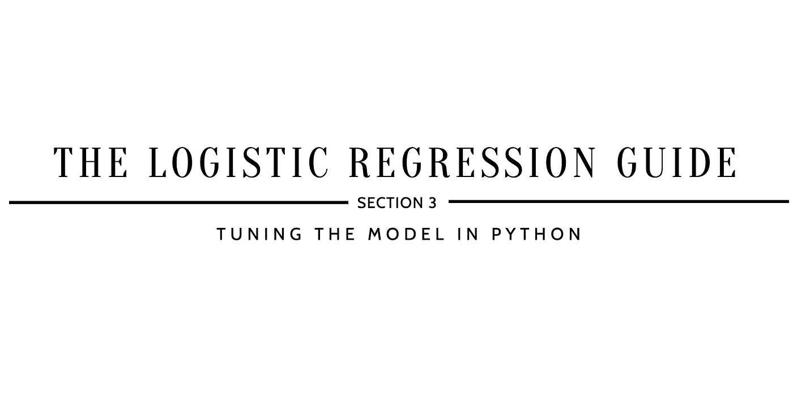

# 如何提高 Logistic 回归？

> 原文：<https://medium.com/analytics-vidhya/how-to-improve-logistic-regression-b956e72f4492?source=collection_archive---------3----------------------->

## 逻辑回归指南

## 第 3 节:用 Python 调优模型

*参考* [***如何实现 Logistic 回归？第 2 节:在继续…* 之前，用 Python**](https://kopaljain95.medium.com/how-to-implement-logistic-regression-6f27ce4c45fd) *构建模型*



> ***【10】定义网格搜索参数***

```
param_grid_lr = {
    'max_iter': [20, 50, 100, 200, 500, 1000],                      
    'solver': ['newton-cg', 'lbfgs', 'liblinear', 'sag', 'saga'],   
    'class_weight': ['balanced']                                    
}
```

*   `max_iter`为迭代次数。
*   `solver`是用于优化的算法。
*   `class_weight`是排除不平衡数据采样的故障。

W hy 这一步:设置所选择的参数用来寻找最佳组合。通过引用 [sklearn.linear_model。在 LogisticRegression](https://scikit-learn.org/stable/modules/generated/sklearn.linear_model.LogisticRegression.html) 文档中，您可以找到一个完整的参数列表，其中包含可用于网格搜索功能的描述。

> ***【11】超参数调整使用训练数据***

```
from sklearn.linear_model import LogisticRegression
from sklearn.model_selection import GridSearchCVlogModel_grid = GridSearchCV(estimator=LogisticRegression(random_state=1234), param_grid=param_grid_lr, verbose=1, cv=10, n_jobs=-1)logModel_grid.fit(X_train, y_train)print(logModel_grid.best_estimator_)...*Fitting 10 folds for each of 30 candidates, totalling 300 fits**LogisticRegression(C=1.0, class_weight='balanced', dual=False, fit_intercept=True, intercept_scaling=1, l1_ratio=None, max_iter=20, multi_class='warn', n_jobs=None, penalty='l2', random_state=1234, solver='newton-cg', tol=0.0001, verbose=0, warm_start=False)*
```

注:由于`cv`被定义为 10，有 30 个候选值，因此总拟合数为 300(`max_iter`有 6 个定义参数，`solver`有 5 个定义参数，`class_weight`有 1 个定义参数)。因此，拟合总数的计算→ 10 x [6 x 5 x 1] = 300。

*   `estimator`是感兴趣的机器学习模型，假设该模型具有评分功能；在这种情况下，分配的模型是 LogisticRegression()。
*   `random_state`是混洗数据时使用的伪随机数生成器的种子。为了避免模型数值评估输出中的差异，将种子设置为模型间比较的一致数字；在这种情况下，该数字设置为 1234。
*   `param_grid`是一个字典，以参数名(字符串)作为关键字，以参数设置列表作为值进行尝试；这使得能够搜索任何参数设置序列。
*   `verbose`是详细度:越高，消息越多；在这种情况下，它被设置为 1。
*   `cv`是交叉验证生成器还是 iterable，本例中有 10 重交叉验证。
*   `n_jobs`是并发运行的工人的最大数量；在这种情况下，它被设置为-1，这意味着使用了所有的 CPU。

W 为什么这一步:找到一个**超参数**的最佳组合，该组合最小化一个预定义的损失函数以给出更好的结果。

> ***【12】对测试数据进行预测***

```
y_pred = logModel_grid.predict(X_test)print(y_pred)...*[1 1 0 0 0 0 0 1 1 1 0 0 1 0 0 0 1 0 0 0 0 1 0 0 1 0 1 1 1 1 0 1 0 0 0 0 1 0 0 1 0 1 0 1 1 1 1 0 1 1 1 1 1 1 1 1 0 0 1 1 1 0 0 0 1 0 1 0 1 0 1 1 0 0 1 0 0 1 1 1 0 1 0 0 0 1 1 1 0 0 1 1 1 0 0 1 1 0 1 0 1 1 1 0 0 1 0 1 1 0 1 1 1 0 1 0 1 0 1 1 0 0 0 1 0 0 0 0 0 0 0 1 1 1 1 1 0 0 1 1 0 1 0 1 0 1 0 0 0 1 0 0 1 1 0 0 0 0 0 0 0 0 1 1 1 0 0 1 1 1 1 1 1 0 1 0 1 0 1 1 1 1 1 0 1 1 1 1 1 0 0 1 0 1 1 0 1 1 1 1 1 1 1 0 1 0 1 0]*
```

W 通过这一步:获得对测试数据的模型预测，以评估模型的准确性和效率。

> ***【13】数值分析***

```
from sklearn.metrics import confusion_matrix
print(confusion_matrix(y_test, y_pred), ": is the confusion matrix \n")from sklearn.metrics import accuracy_score
print(accuracy_score(y_test, y_pred), ": is the accuracy score")from sklearn.metrics import precision_score
print(precision_score(y_test, y_pred), ": is the precision score")from sklearn.metrics import recall_score
print(recall_score(y_test, y_pred), ": is the recall score")from sklearn.metrics import f1_score
print(f1_score(y_test, y_pred), ": is the f1 score")...*[[85 21]
[12 90]] : is the confusion matrix 

0.8413461538461539 : is the accuracy score
0.8108108108108109 : is the precision score
0.8823529411764706 : is the recall score
0.8450704225352113 : is the f1 score*
```

注意:使用混淆矩阵，可以提取真阳性、假阳性、假阴性和真阴性值，这将有助于计算准确度分数、精确度分数、回忆分数和 f1 分数:

*   **真阳性** = 85
*   **假阳性** = 21
*   **假阴性** = 12
*   **真阴性** = 90


准确度、精确度、召回率和 F1 的方程式。

W 通过这一步:评估调优分类模型的性能。正如您所看到的，通过调整在[第 2 节](https://kopaljain95.medium.com/how-to-implement-logistic-regression-6f27ce4c45fd)中创建的基本逻辑回归模型，准确度、精确度、召回率和 F1 分数都有所提高。

[](https://github.com/kopaljain95/import-data.science-classification/blob/main/LogisticRegression%5B1%5D/LogisticRegression.ipynb) [## kopaljain 95/import-data . science-分类

### 在 GitHub 上创建一个帐户，为 kopaljain 95/import-data . science-classification 的开发做出贡献。

github.com](https://github.com/kopaljain95/import-data.science-classification/blob/main/LogisticRegression%5B1%5D/LogisticRegression.ipynb) 

*接下来—* [*为什么要用逻辑回归？第 4 部分:评估模型权衡*](https://kopaljain95.medium.com/why-use-logistic-regression-6cd17e09e6d0) *…*