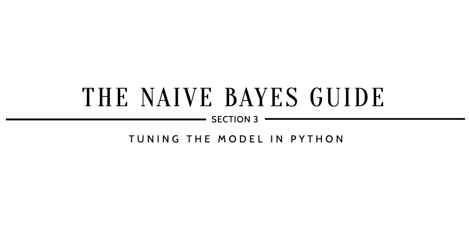

# 如何改进朴素贝叶斯？

> 原文：<https://medium.com/analytics-vidhya/how-to-improve-naive-bayes-9fa698e14cba?source=collection_archive---------0----------------------->

## 朴素贝叶斯指南

## 第 3 节:用 Python 调优模型

*参考*[**如何实现朴素贝叶斯？第 2 节:在继续… 之前，用 Python**](https://kopaljain95.medium.com/how-to-implement-naive-bayes-24e92f2b49f3) *构建模型*



> ***【10】定义网格搜索参数***

```
param_grid_nb = {
    'var_smoothing': np.logspace(0,-9, num=100)
}
```

*   `var_smoothing`是一种稳定性计算，用于加宽(或平滑)曲线，因此考虑更多远离分布均值的样本。在这种情况下，np.logspace 返回在对数标度上均匀分布的数字，从 0 开始，到-9 结束，并生成 100 个样本。

W hy 这一步:设置所选择的参数用来寻找最佳组合。通过引用 [sklearn.naive_bayes。GaussianNB](https://scikit-learn.org/stable/modules/generated/sklearn.naive_bayes.GaussianNB.html#sklearn.naive_bayes.GaussianNB) 文档，您可以找到一个完整的参数列表，其中包含可用于网格搜索功能的描述。

> ***【11】超参数调整使用训练数据***

```
from sklearn.naive_bayes import GaussianNB
from sklearn.model_selection import GridSearchCVnbModel_grid = GridSearchCV(estimator=GaussianNB(), param_grid=param_grid_nb, verbose=1, cv=10, n_jobs=-1)nbModel_grid.fit(X_train, y_train)print(nbModel_grid.best_estimator_)...*Fitting 10 folds for each of 100 candidates, totalling 1000 fits**GaussianNB(priors=None, var_smoothing=1.0)*
```

注意:由于`cv`被定义为 10，有 100 个候选值(`var_smoothing`有 100 个定义的参数)，所以总拟合数为 1000。因此，总配合数的计算→ 10 x [100] = 1000。

*   `estimator`是感兴趣的机器学习模型，假设该模型具有评分功能；在这种情况下，分配的模型是 GaussianNB()。
*   `param_grid`是一个字典，以参数名(字符串)作为键，以参数设置列表作为值进行尝试；这使得能够搜索任何参数设置序列。
*   `verbose`是详细度:越高，消息越多；在这种情况下，它被设置为 1。
*   `cv`是交叉验证生成器还是 iterable，在本例中，有 10 重交叉验证。
*   `n_jobs`是并发运行的工作线程的最大数量；在这种情况下，它被设置为-1，这意味着使用了所有的 CPU。

W 通过这一步:找到**超参数**的最佳组合，使预定义的损失函数最小化，以给出更好的结果。

> ***【12】对测试数据进行预测***

```
y_pred = nbModel_grid.predict(X_test)print(y_pred)...*[0 0 0 1 0 0 0 0 1 1 1 0 0 1 0 1 1 1 1 1 1 0 0 0 1 1 1 1 0 1 0 1 0 0 0 1 0 0 0 1 0 1 1 0 1 1 1 0 1 0 1 1 0 1 1 0 1 0 0 0 1 0 0 1 0 1 1 0 1 0 1 1 0 1 1 1 1 1 1 0 1 0 0 1 0 1 0 0 0 1 1 1 1 0 1 1 0 1 1 0 0 1 1 1 0 0 0 0 1 0 0 0 0 0 1 0 0 0 1 0 1 1 1 1 1 1 0 0 0 0 1 1 0 1 1 1 1 0 1 1 0 1 0 0 0 0 0 1 1 1 1 1 0 1 0 1 1 1 1 0 1 0 0 1 0 1 0 1 1 1 1 0 0 1 0 1 0 0 0 1 0 0 1 0 1 0 1 1 0 0 0 0 0 1 1 1 0 0 0 1 1 1 1 1 0 0 1 0]*
```

W 通过这一步:获得对测试数据的模型预测，以评估模型的准确性和效率。

> ***【13】数值分析***

```
from sklearn.metrics import confusion_matrix
print(confusion_matrix(y_test, y_pred), ": is the confusion matrix")from sklearn.metrics import accuracy_score
print(accuracy_score(y_test, y_pred), ": is the accuracy score")from sklearn.metrics import precision_score
print(precision_score(y_test, y_pred), ": is the precision score")from sklearn.metrics import recall_score
print(recall_score(y_test, y_pred), ": is the recall score")from sklearn.metrics import f1_score
print(f1_score(y_test, y_pred), ": is the f1 score")...*[[81 27]
 [19 81]] : is the confusion matrix 

0.7788461538461539 : is the accuracy score
0.75 : is the precision score
0.81 : is the recall score
0.7788461538461539 : is the f1 score*
```

注意:使用混淆矩阵，可以提取真阳性、假阳性、假阴性和真阴性值，这将有助于计算准确度分数、精确度分数、回忆分数和 f1 分数:

*   **真正** = 81
*   **假阳性** = 27
*   **假阴性** = 19
*   **真负值** = 81


准确度、精确度、召回率和 F1 的方程式。

W 通过这一步:评估调优分类模型的性能。如您所见，通过调整在第 2 节中创建的基本高斯朴素贝叶斯模型，准确度、精确度、召回率和 F1 分数都得到了提高。

[](https://github.com/kopaljain95/import-data.science-classification/blob/main/NaiveBayes%5B4%5D/NaiveBayes.ipynb) [## kopaljain 95/import-data . science-分类

### 在 GitHub 上创建一个帐户，为 kopaljain 95/import-data . science-classification 的开发做出贡献。

github.com](https://github.com/kopaljain95/import-data.science-classification/blob/main/NaiveBayes%5B4%5D/NaiveBayes.ipynb) 

*接下来—* [*为什么要用朴素贝叶斯？第 4 部分:评估模型权衡*](https://kopaljain95.medium.com/why-use-naive-bayes-a56cbae55181) *…*