# 如何在 5 分钟内在 Ubuntu 上安装 Anaconda？

> 原文：<https://medium.com/analytics-vidhya/how-to-install-anaconda-on-ubuntu-cc87608c6e9a?source=collection_archive---------1----------------------->


[**图片的信用链接**](https://wallpaperaccess.com/ubuntu-4k)

## 简介:

注意:如果你不感兴趣，可以跳过介绍。在介绍之后，移动到下面的设置和安装信息。

在全球拥有超过 2500 万用户，开源个人版(发行版)是在单台机器上执行 Python/R 数据科学和机器学习的最简单方式。它是为单枪匹马的从业者开发的，是装备你与数以千计的开源包和库一起工作的工具包。

**开源**🐍

Anaconda 个人版是世界上最受欢迎的 Python 分发平台，在全球拥有超过 2500 万用户。您可以相信我们对支持 Anaconda 开源生态系统的长期承诺，这是 Python 数据科学的首选平台。

**康达包装**📦

搜索 Anaconda 基于云的存储库，查找并安装超过 7，500 个数据科学和机器学习包。使用 conda-install 命令，您可以开始使用数千个开源的 conda、R、Python 和许多其他包。

**管理环境**🏘🏘

个人版是一个开放源代码、灵活的解决方案，它提供了以跨平台方式构建、分发、安装、更新和管理软件的实用程序。Conda 可以轻松管理多个数据环境，这些环境可以独立维护和运行，互不干扰。

## **让我们开始安装和设置:**

*   首先，我们必须访问下面的链接，点击下载 Anaconda for Linux。我用的是 Ubuntu 16.04，所以它可以自动检测到 Anaconda。

> [**https://www.anaconda.com/distribution/**](https://www.anaconda.com/distribution/)

选择你需要的 Python 版本的 anaconda。我需要蟒蛇的 **Python 3.7** (当前 3.8)版本，所以我安装了蟒蛇的 **Python3.7** (当前 3.8)版本。你也可以选择下载其他版本。根据您的要求选择。

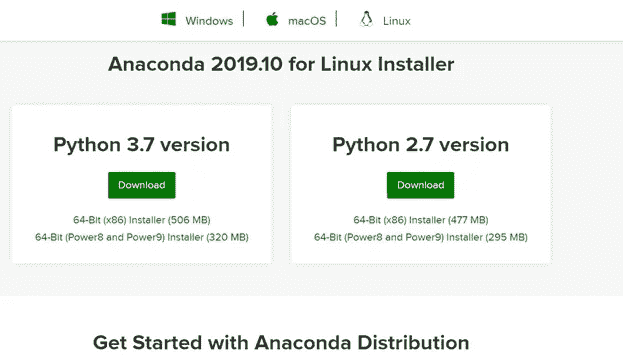

**1。Pic 鸣谢:作者 Ankit Gpta**

*   我选择 64 位 OS 是因为我在虚拟机/基础机上有 64 位的 ubuntu OS。如果您的操作系统是 32 位的，那么请选择 32 位操作系统。

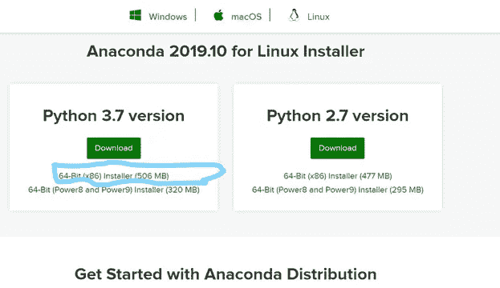

**2。** [**Pic 鸣谢:作者 Ankit Gpta**](/@ankitgupta_974)

*   下载的 Anaconda 文件应该在“**下载文件夹**”中。在我的情况下，我已经下载了这个文件，并在我的笔驱动器中保存了一份副本，以供将来使用。所以我用 u 盘复制了这个文件并粘贴到下载文件夹中。

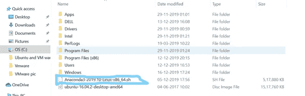

**3。** [**Pic 鸣谢:作者 Ankit Gpta**](/@ankitgupta_974)

*   打开一个**终端/命令行外壳**并运行以下命令或遵循 pic 中的命令:

```
**1\. cd Downloads****2\. ls****3\.** “**sha256sum** /path/filename” 
```

> 复制下载的文件名类似这样**" anaconda 3–2019.10-Linux-x86 _ 64 . sh "**，粘贴在"/path/filename "的位置。

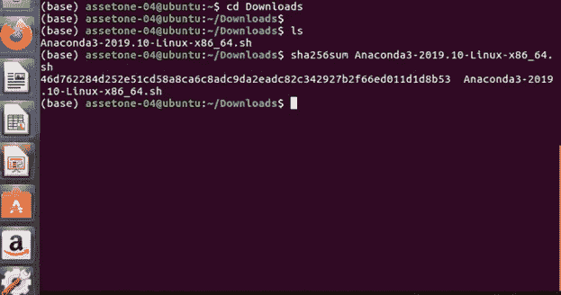

**4。** [**图片来源:作者 Ankit Gpta**](/@ankitgupta_974)

**推荐** : [与 SHA-256](https://docs.anaconda.com/anaconda/install/hashes/) 验证数据完整性。有关散列的更多信息，请参见[加密散列验证怎么样？](https://conda.io/projects/conda/en/latest/user-guide/install/download.html#cryptographic-hash-verification)。

*   执行上述命令后，您的终端看起来像这样。

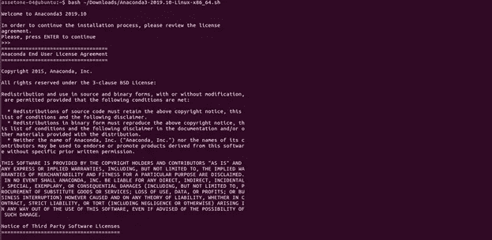

**5。** [**Pic 鸣谢:作者 Ankit Gpta**](/@ankitgupta_974)

*   你必须点击输入，然后在某一行之后询问一个问题，然后写下**“是”**接受期限许可，如图所示。

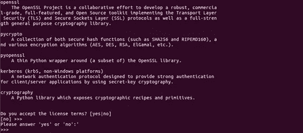

**6。** [**图片来源:作者 Ankit Gpta**](/@ankitgupta_974)


**7。** [**图片来源:作者 Ankit Gpta**](/@ankitgupta_974)

*   现在，您必须提供安装 Anaconda 的位置，在您提供的位置上，Anaconda 可能会安装，但我会将它设置为默认位置。如果必须设置为默认位置，按**键输入**。

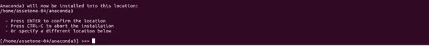

**8。** [**Pic 鸣谢:作者 Ankit Gpta**](/@ankitgupta_974)

*   下一步是在给定的位置自动打开 anaconda 的包。


**9。** [**图片来源:作者 Ankit Gpta**](/@ankitgupta_974)

*   完成上述过程后，对给定问题“您希望安装程序通过运行 conda init 来初始化 Anaconda3 吗？”提供答案**“是”**

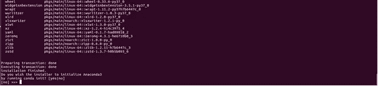

**10。** [**图片来源:作者 Ankit Gpta**](/@ankitgupta_974)

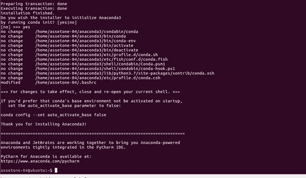

**11。** [**Pic 鸣谢:作者 Ankit Gpta**](/@ankitgupta_974)

*   Anaconda 安装过程完成。
*   在终端上逐个输入以下命令进行检查。

> 1.巨蟒领航员
> 
> 2. **jupyter 笔记本或 jupyter 笔记本**

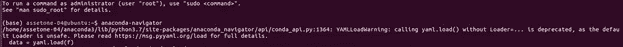

**12。** [**图片来源:作者 Ankit Gpta**](/@ankitgupta_974)

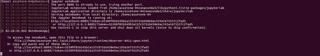

**13。** [**图片来源:作者 Ankit Gpta**](/@ankitgupta_974)

*   执行上述命令后，Jupyter 笔记本将打开，看起来像下面的图片。

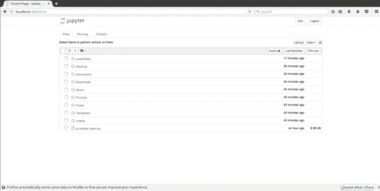

**14。** [**Pic 鸣谢:作者 Ankit Gpta**](/@ankitgupta_974)

最后，输入并执行以下命令，检查 [**conda**](https://docs.conda.io/en/latest/) 是否工作。

```
**conda info**
```

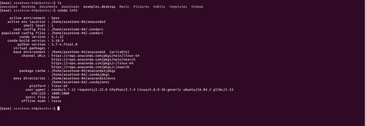

15。 [**Pic 鸣谢:作者 Ankit Gpta**](/@ankitgupta_974)

```
**conda list**
```

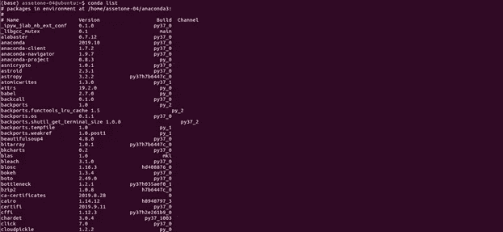

16 岁。 [**图片来源:作者 Ankit Gpta**](/@ankitgupta_974)

```
**conda –version**
```

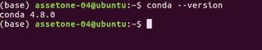

17。 [**图片来源:作者 Ankit Gpta**](/@ankitgupta_974)

## **Anaconda 设置和安装在 Ubuntu Linux 上成功完成。**

**参考文献**:

[https://www.anaconda.com/products/individual](https://www.anaconda.com/products/individual)

感谢您的阅读，如果您喜欢请点击***点击*** 按钮**。**

**关注我们**更多轻松有趣的**文章**。

***更多内容请看***[***AnalyticsVidhya***](https://medium.com/analytics-vidhya)***。***

[](/analytics-vidhya/the-top-and-best-content-of-machine-learning-deep-learning-artificial-intelligence-free-9e36186d4b2) [## 机器学习、深度学习、人工智能(免费)的顶级最好的内容

### 这篇中型文章特别为那些想在机器学习/深度学习领域开始职业生涯的初学者而写…

medium.com](/analytics-vidhya/the-top-and-best-content-of-machine-learning-deep-learning-artificial-intelligence-free-9e36186d4b2) [](/analytics-vidhya/extract-the-useful-data-from-jason-file-for-data-sceince-34ed5ae0b350) [## 从 JSON 文件中提取有用数据用于机器学习

### 如何从一个 JSON 文件中提取数据用于 Python 中的机器学习模型

medium.com](/analytics-vidhya/extract-the-useful-data-from-jason-file-for-data-sceince-34ed5ae0b350) 

**作者领英-**

[](https://www.linkedin.com/in/ankit-gupta2/) [## Ankit Gupta —印度马哈拉施特拉邦浦那|职业简介| LinkedIn

### 我是深度学习爱好者/学习者，正在寻找一个可以贡献和提高技能的机会…

www.linkedin.com](https://www.linkedin.com/in/ankit-gupta2/)