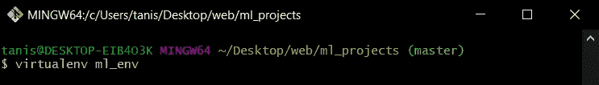
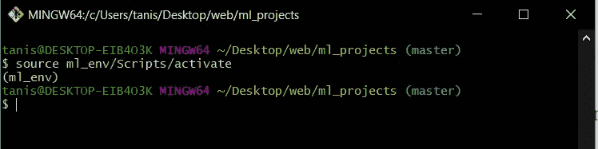
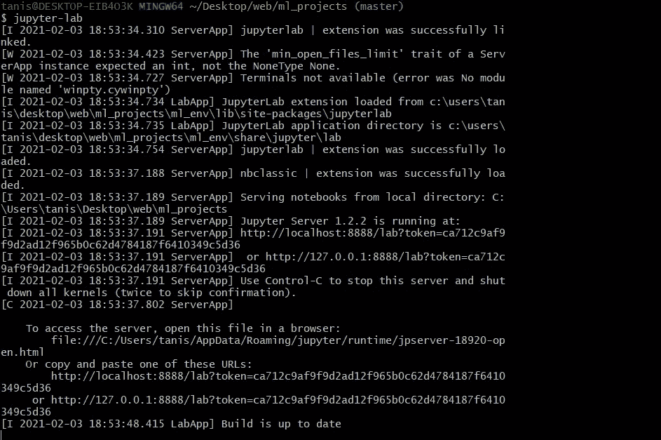
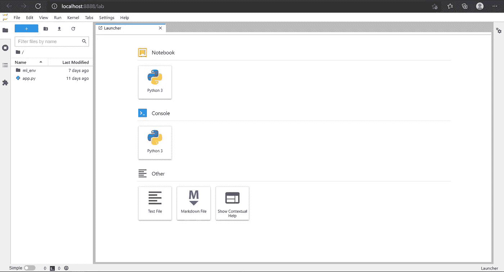
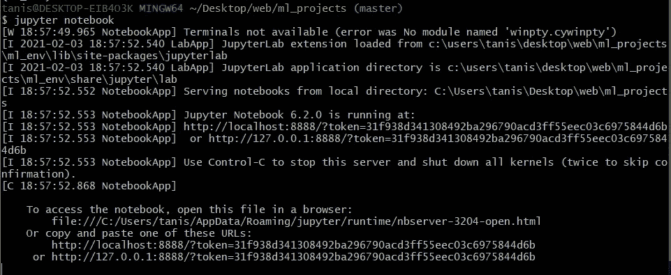
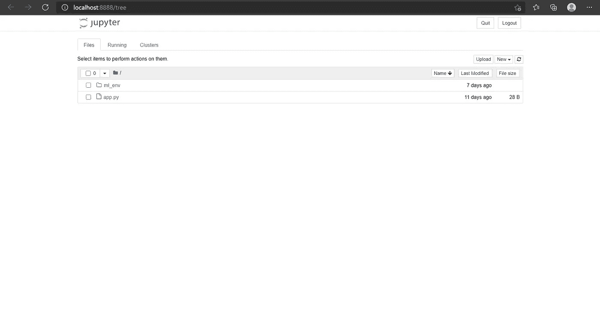

# 如何使用 PIP 安装 Jupyter 笔记本

> 原文：<https://medium.com/analytics-vidhya/how-to-install-jupyter-notebook-using-pip-e597b5038bb1?source=collection_archive---------1----------------------->


[图像来源](https://www.bing.com/images/search?view=detailV2&ccid=m87%2fHtb%2f&id=98B7779AD7D400E9CFE84020F4F52E2C847291FC&thid=OIP.m87_Htb_9Pstq0UcvNJ49wHaDr&mediaurl=https%3a%2f%2fs3-ap-south-1.amazonaws.com%2fav-blog-media%2fwp-content%2fuploads%2f2018%2f04%2fjupyter.png&exph=795&expw=1600&q=jupyter+notebook&simid=608020095208852461&ck=E7F06D6D0BEA9D4B2D2E13BFCF32DCBB&selectedIndex=2&FORM=IRPRST)

Jupyter 笔记本对于使用 python 或 r 开始学习数据科学是非常必要的。

这里是你可以使用 PIP 安装它的方法

# 第一步:创建一个虚拟环境。

在命令提示符下运行以下命令。

```
pip install virtualenv
```

这将安装一个名为 *virtualenv* 的包，可以用来创建一个虚拟环境。

若要确保 virtualenv 安装成功，请运行以下命令。

```
virtualenv --version
```

很好！现在让我们创建一个虚拟环境。

```
virtualenv virtualenv_name
```

就这么简单！！



我非常喜欢使用 git bash(如果您使用的是 windows)。

现在您已经创建了虚拟环境，您可以通过以下方式激活它…..

```
$ source ml_env/Scripts/activate
```



如果括号中有您刚刚创建的虚拟环境的名称，那么该环境已被激活，您可以开始工作了！

# 步骤 2:安装 jupyter 实验室和 Jupyter 笔记本

首先，我们需要确保您已经安装了 IPyKernel。

使用命令…

```
pip install ipykernel
```

来安装它。

然后是安装 Jupyterlab 的时候了。

运行…

```
pip install jupyterlab
```

呜哇！！你现在可以打开 Jupyter 实验室并运行 python 笔记本了。



下一步是最后安装 Jupyter 笔记本。

```
pip install notebook
```

搞定了。！

点燃朱庇特笔记本！



笔记本一般在 Pout 8888 上打开，要确保其他软件不会与之冲突。

如果你正面临任何问题，请在评论中提及…..

谢谢大家！