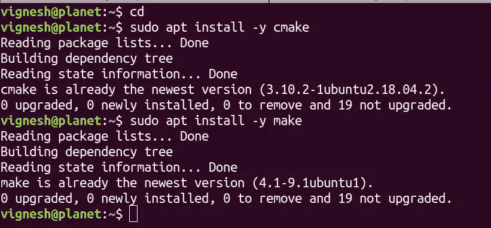
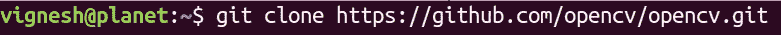
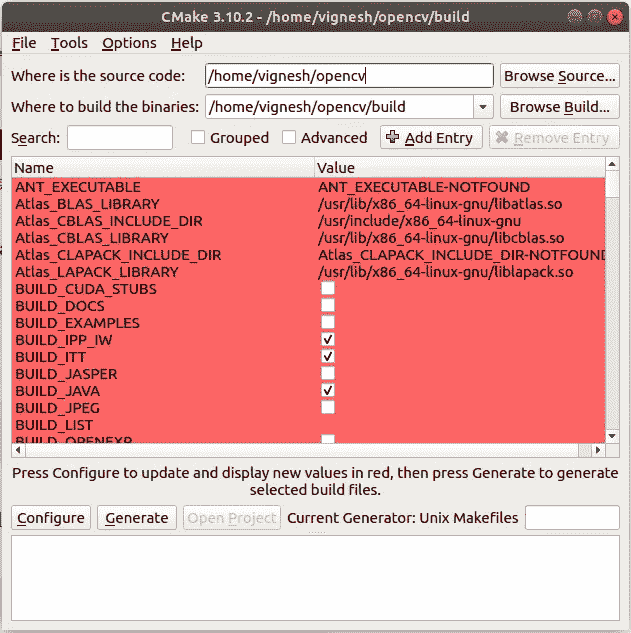
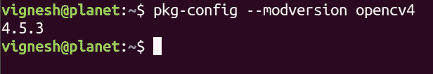
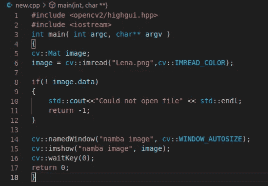
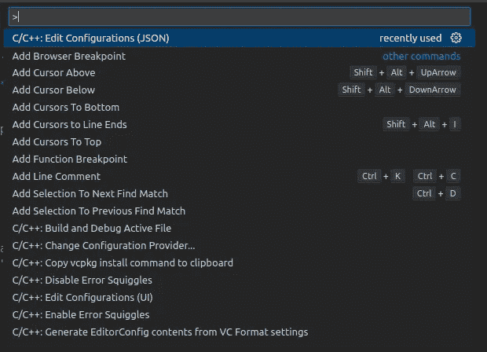
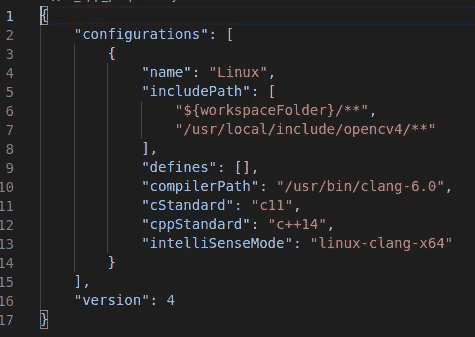
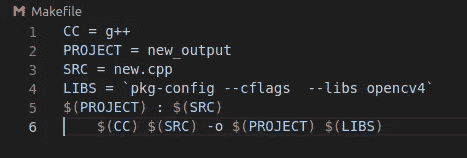
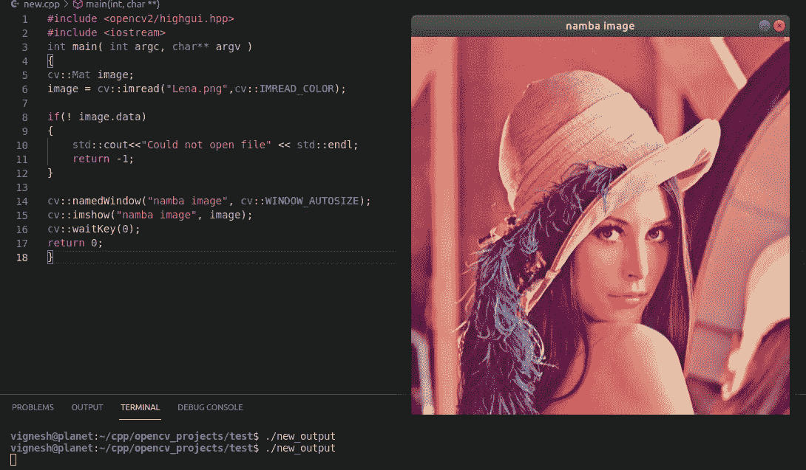

# 如何在 Ubuntu OS 的 Visual Studio 代码中安装 OpenCV for C++

> 原文：<https://medium.com/analytics-vidhya/how-to-install-opencv-for-visual-studio-code-using-ubuntu-os-9398b2f32d53?source=collection_archive---------0----------------------->

在搜索“如何使用 Ubuntu 18.04 OS 安装 OpenCV for Visual studio 代码”时，只有很少的资源。所以，在花了几个小时后，我通过阅读这篇文章，设法在 linux 操作系统上安装了 OpenCV for Visual studio。虽然这篇文章涵盖了如何安装的核心概念，但对于像我这样的初学者来说，它并不清楚。所以，我正在复制我的一个版本，这样对于像我这样的初学者来说会很有用，他们有兴趣使用他们最喜欢的 Visual Studio 代码 IDE 来体验使用 C++的 OpenCV。

# 第 1 部分:安装 OpenCV

**第一步**:打开你的终端，输入如下图所示的命令。(即使用“cd”命令移动到您的主目录并安装“cmake”和 make)

```
cd
sudo apt install -y cmake
sudo apt install -y make
```



安装 cmake 和 make

(因为我已经安装了它们，所以我在控制台中得到如上所示的消息)

【https://github.com/opencv/opencv/tree/4.5.1】第二步:从 github 页面[下载 OpenCV 文件的最新稳定版本](https://github.com/opencv/opencv/tree/4.5.1)

撰写本文时，OpenCV 4.5.1 是最新的稳定版本。

转到上面提到的链接，最好在主文件夹中使用如下所示的 git clone 方法

```
git clone [https://github.com/opencv/opencv.git](https://github.com/opencv/opencv.git)
```



git 克隆 opencv

在成功的 git 克隆之后，您应该在您的主文件夹中找到一个名为 opencv 的文件夹

现在进入 opencv 文件夹，创建一个名为 build 的文件夹

```
cd opencv && mkdir build
```

**步骤 4:** 现在使用以下命令安装 cmake gui

```
sudo apt-get install cmake-qt-gui
```

完成后，使用命令“cmake-gui”打开 cmake gui

```
cmake-gui
```

现在你应该得到如下所示的窗口



cmake-gui

如上图所示，对于“何处是源代码:”对话框，粘贴您的 opencv 文件的路径，对于“何处构建二进制文件:”对话框，复制粘贴 opencv 目录(我们在第 3 步开始时创建的)内的构建目录的路径

**步骤 5:** 现在点击配置，然后点击生成。不要被 gui 中出现的红色值吓倒，只需单击“配置”,完成后单击“生成”

**第 6 步:**现在返回终端，移动到 opencv 文件夹中的 build 文件夹，然后一个接一个地输入命令，如下面的代码片段所示。坐下来放松一下，因为“进行安装”将会花费大量的时间

```
cd ~/opencv/build
make -j4
make install
sudo apt-get install libopencv-dev
```

**Step7:** 一旦以上步骤结束，现在就该检查安装是否成功了。这可以使用命令“pkg-config — modversion opencv4”来完成

```
pkg-config --modversion opencv4
```



检查 opencv 包的版本

如果您在执行上述命令时遇到任何错误，请返回到构建文件夹 cd ~/opencv/build，尝试以下命令，然后尝试“pkg-config — modeversion opencv4”

```
cd ~/opencv/buildcmake -D CMAKE_BUILD_TYPE=Release -D OPENCV_GENERATE_PKGCONFIG=YES -D CMAKE_INSTALL_PREFIX=/usr/local ..sudo make 
sudo make installpkg-config --modversion opencv4
```

# **第二部分:Visual Studio 代码配置**

**第一步:**打开 visual studio 代码- >新建一个文件夹(比如说“project”)->新建一个 cpp 文件(比如说“new.cpp”)

**第二步:**复制粘贴一张图片(比如“Lena.jpg”)到新建的文件夹中

现在，我们的文件夹结构应该看起来像下面这样

```
project
|--new.cpp
|--Lena.png
```

**步骤 3:** 复制粘贴下面的代码，如果需要的话，不要忘记更改图像名称，并确保在进一步操作之前检查是否存在任何语法错误

```
#include <opencv2/highgui.hpp>
#include <iostream>int main( int argc, char** argv )
{
    cv::Mat image;
    image = cv::imread("Lena.png",cv::IMREAD_COLOR);
    if(! image.data)
        {
            std::cout<<"Could not open file" << std::endl;
            return -1;
        } cv::namedWindow("namba image", cv::WINDOW_AUTOSIZE);
    cv::imshow("namba image", image);
    cv::waitKey(0);
    return 0;
}
```



**Step4:** 在 main.cpp 文件打开的情况下，按“ctrl+shift+p”，这将打开命令托盘，在其中选择“C/C++:编辑配置(JSON)”打开“c_cpp_properties.json”，如下所示



**步骤 5:** 在“c_cpp_properties.json”中编辑要添加的 IncludePath

"/usr/local/include/opencv4/** "如下所示



现在创建另一个文件并命名为“Makefile”，我们的文件夹结构应该类似于下面的代码片段

```
project
|--new.cpp
|--Lena.png
|--Makefile
```

在 Makefile 中输入下面的代码。最好键入下面的代码，而不是复制粘贴，因为这可能会导致错误。

> (**注意:当您键入命令时，确保最后一行的开头有一个制表符，而不是四个空格)**

```
CC = g++
PROJECT = new_output
SRC = new.cpp
LIBS = `pkg-config --cflags --libs opencv4`
$(PROJECT) : $(SRC)
    $(CC) $(SRC) -o $(PROJECT) $(LIBS)
```



**Step7:** 现在转到 VS 代码中的终端，键入“make”。这将为您提供一个名为“new_output”的可执行文件

第八步:现在执行。/new _ out。这应该弹出我们的图像，如下所示



如果这篇文章对你有帮助，别忘了留下两个掌声。如果在评论区遇到任何错误，请不吝发表。谢谢你。

问候，

维格内什·卡希尔卡马尔

[人工授精](https://aipylinux.quora.com/)