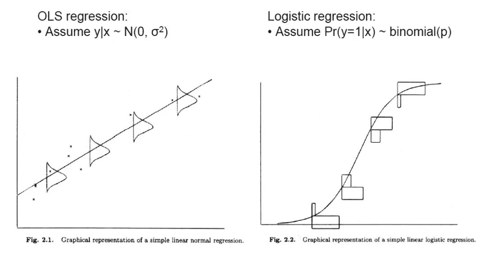
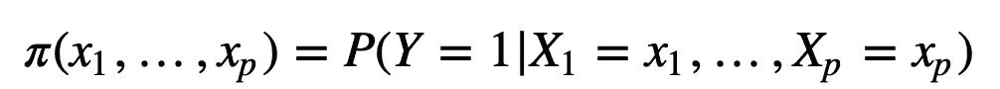
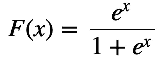
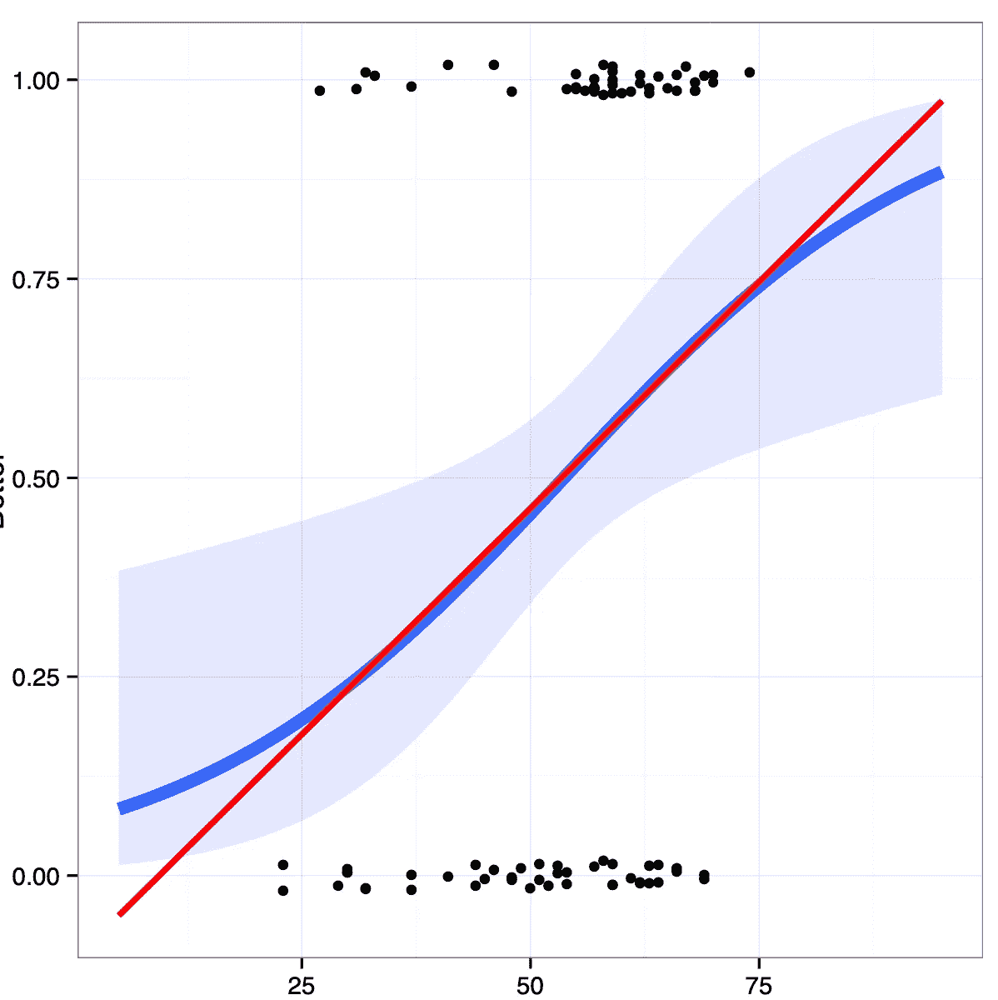
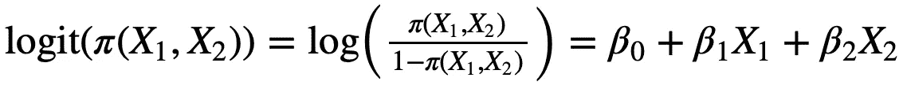
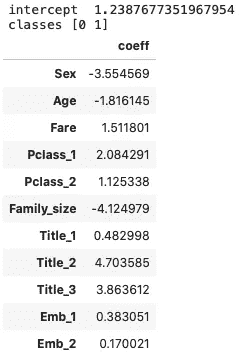
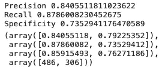
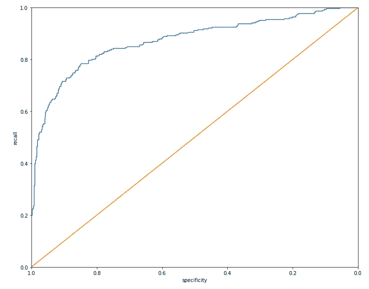

# 如何用 Python 解释逻辑回归模型

> 原文：<https://medium.com/analytics-vidhya/how-to-interpret-the-logistic-regression-model-with-python-2bacfb50e223?source=collection_archive---------0----------------------->

逻辑回归模型是数据科学中一种有效而普遍的分类方法。

任何商业问题都需要自动化决策。例如，给定客户的流失可能性有多大？给定客户点击广告的可能性有多大？如此多的相似之处。这些被归类为*分类*问题，它本身是一个叫做*监督学习*的更大主题的一部分。大多数分类问题的结果只有两个不同的值。这类分类问题被称为二元分类。二元结果的一些例子是网络钓鱼/非网络钓鱼、点击/不点击、流失/不流失。即使在两个以上的结果的情况下，问题也可以通过条件概率转化为一系列的二元问题。


# **逻辑回归**

逻辑回归有点用词不当。因为它的名字包含了*回归*，它实际上并不处理回归问题。逻辑回归是最有效的分类方法之一。由于与线性回归的高度相似性，它很容易解释，因此是数据探索(剖析)和预测的最佳候选之一。虽然线性回归和逻辑回归之间有一些相似之处，但也有一些不同之处。

## 线性回归和逻辑回归的相似性

逻辑回归和线性回归之间的最大相似之处在于，两者都试图线性逼近特定的函数。在线性回归中，我们估计反应/目标结果的真实值，而在逻辑回归中，我们通过预测因子的线性函数来近似比值比。优势比是成功和失败的概率之比。在分类中，在二元分类问题中，大多数成功被标记为“1”(感兴趣的情况)，而失败被标记为“0”。

逻辑回归和线性回归之间最明显的区别是目标函数和数据背后的假设。在线性回归中，得出权重的目标函数是误差的平方和，并且假设目标响应的条件分布是正态分布。相反，在逻辑回归中，偏差函数用于权重推导。它还假设基础条件分布是*二项式*。



线性回归与逻辑回归

此外，两种模型的残差的性质和分析是不同的。逻辑回归中的部分残差虽然没有回归中的部分残差有价值，但仍然有助于确认非线性行为和识别高度有影响的记录。

## 逻辑回归背后的数学

对于 0-1 响应，我们需要建模



换句话说，响应变量被建模为伯努利变量，其参数取决于协变量 X_i。一个天真的想法是通过线性函数来近似上述概率。然而，有一个警告。模型函数不保证概率在 0 和 1 之间。为了解决这个问题，我们需要通过线性回归来转换概率和近似结果。为此，采用的变换是 *logit* 变换。



Logit 函数

> 采用 logit 变换的基本原理是，它将大范围的值映射到有界的 0 和 1。

logit 被解释为响应 Y=1 的“对数概率”。logit 函数如下图所示。对于 0.2 和 0.8 范围内的概率，拟合值接近线性回归的值。



Logit 变换和线性回归

上图中的黑点反映了映射到 1 和 0 的真实响应值。

逻辑回归建模为



我们可以使用任何形式的广义线性模型(GLM)来逼近罗吉斯比。逻辑回归是 *GLM* 的一个特例，被开发用于将线性回归扩展到其他设置。

拟合模型的优化方法是基于前面提到的偏差，与线性方法相反，它没有封闭形式。许多迭代算法可以用来推导逻辑回归参数的最大似然解。不幸的是，深入研究这些算法超出了本文的范围。

# Python 实现

为了展示逻辑回归的实用性，我们的目标是使用 *Sci-kit Learn 实现逻辑回归。*我们采用 Titanic 数据集进行逻辑回归。此外，还增加了 4 栏，从姓名栏重新设计为标题 *1 到标题* 4，表示男性&女性，取决于他们是否结婚。(先生、夫人、主人、小姐)。另外一项分析是看已婚人士或者说有社会责任感的人是否有更多的生存本能&这种趋势对男女来说是相似的。完整的数据集可以从[这里](https://www.kaggle.com/azeembootwala/titanic)下载。该数据集由 15 个预测因子组成，如性别、票价、p_class、家庭规模、…。目标反应是*幸存。*请注意，取值有限的因子变量已经通过一键编码进行了转换。为了避免因子变量的一键编码器的多重共线性效应，我们为每组因子变量省略了因子变量的一个级别。来自`sklearn.linaer_model`的`LogisticRegression`的预测值将提供逻辑回归核心实现。实现逻辑回归([全码](https://www.kaggle.com/vahidnaghshin/logisticregtitanic))的代码如下:

```
from sklearn.linear_model import LogisticRegressionpredictors = ['Sex', 'Age', 'Fare', 'Pclass_1',
 'Pclass_2', 'Family_size', 'Title_1', 'Title_2', 'Title_3', 'Emb_1', 'Emb_2']outcome = 'Survived'
X = train_df[predictors]
y = train_df[outcome]logit_reg = LogisticRegression(penalty='l2', C=1e42, solver='liblinear')
logit_reg.fit(X, y)print('intercept ', logit_reg.intercept_[0])
print('classes', logit_reg.classes_)
pd.DataFrame({'coeff': logit_reg.coef_[0]}, 
             index=X.columns)
```

输出将是:



## 解释模型

预测值的截距和系数如上表所示。请注意，在解释系数时，应考虑参考水平。也请记住，线性方程是关于接近比值比的对数，而不是概率。如果需要基于概率的解释，应进行适当的转换。

举个例子，我们可以看到*性别*的系数是-3.55。因为男性的性别是 1，女性的性别是 0。身为男性会将性别为女性的情况下的存活优势比降低至约 3%(经验值(-3.55)=0.028)！如果按概率来换算，概率差不多是溺水概率的 0.03。

关于另一个因素变量，应考虑参考水平。例如，由于预测值中省略了`Title_4`，因此应该相应地解释`Title_1`系数。对于我们的情况，这个值是 0.48，这意味着作为`Title_1 = Mr`(请参考 Kaggle 页的数据解释)，幸存的几率比在`Title_4=Miss.`可能是已婚男性处于高优先拯救的情况下增加了大约 60%(exp(0.48)= 1.6)；)

使用来自`sklearn.metrics`的`confusion_matrix`和`precision_recall_fscore_support` ，我们可以获得混淆矩阵。

```
from sklearn.metrics import confusion_matrix, precision_recall_fscore_support
pred = logit_reg.predict(X)
conf_mat = confusion_matrix(y, logit_reg.predict(X))
print('Precision', conf_mat[0, 0] / sum(conf_mat[:, 0]))
print('Recall', conf_mat[0, 0] / sum(conf_mat[0, :]))
print('Specificity', conf_mat[1, 1] / sum(conf_mat[1, :]))
precision_recall_fscore_support(list(y.values), list(logit_reg.predict(X)))
```



混淆矩阵

你可以看到在召回率和特异性之间有一个权衡。捕获更多的 1 通常意味着将更多的 0 误归类为 1。理想的分类器会很好地对 1 进行分类，而不会将更多的 0 误分类为 1。捕捉这种权衡的指标是“接收器工作特性”曲线，通常称为 *ROC 曲线*。ROC 曲线在 y 轴上绘制了召回率(灵敏度),在 x 轴上绘制了特异性。4 ROC 曲线显示了当您改变临界值以确定如何对记录进行分类时召回率和特异性之间的权衡[1]。



皇家对空观察队

# 总结

在本文中，我们简要介绍了逻辑回归分类器，并分享了逻辑回归和线性回归之间的相似性和差异。我们还使用 Python 语言演示了分类器。我们还解释了基于系数的模型，并得出模型评估。

# 参考

[1]布鲁斯、彼得、安德鲁·布鲁斯和彼得·格德克。*数据科学家实用统计学:使用 R 和 Python 的 50 多个基本概念*。奥莱利媒体，2020。