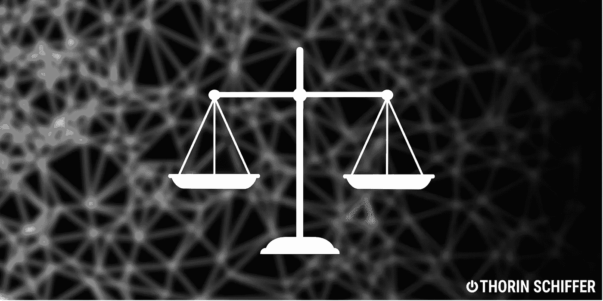
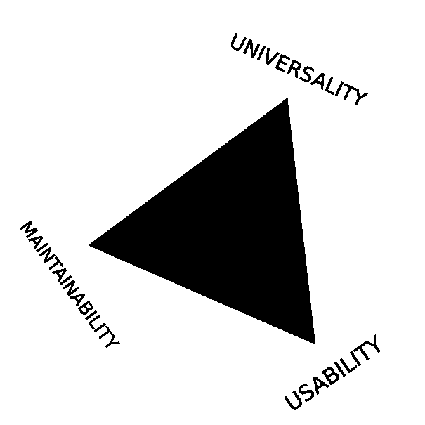
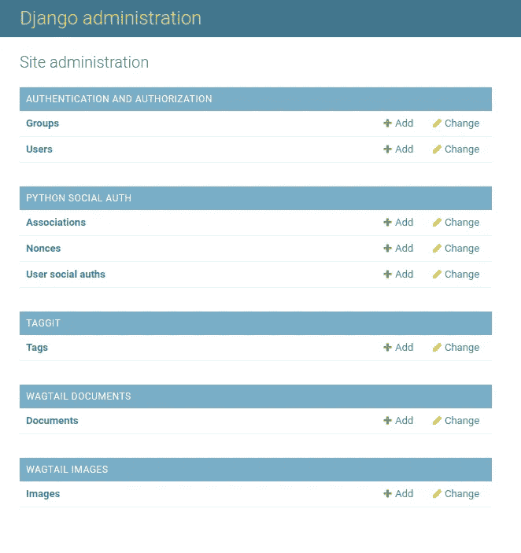
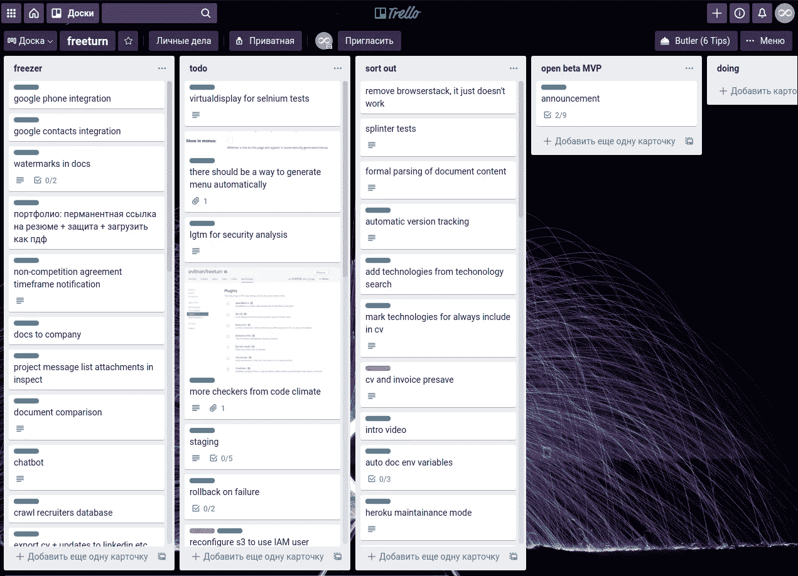
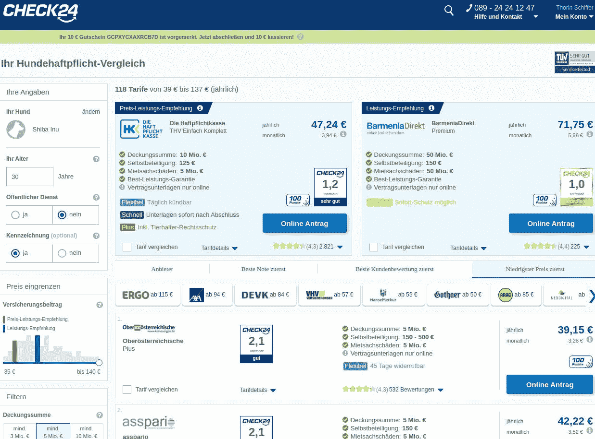
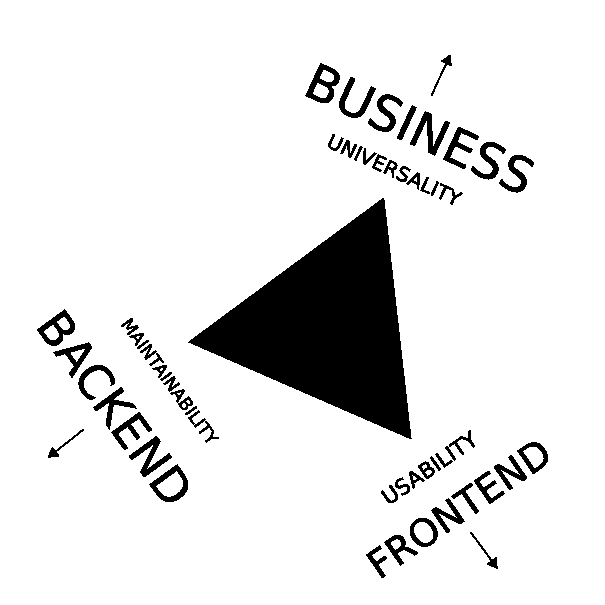
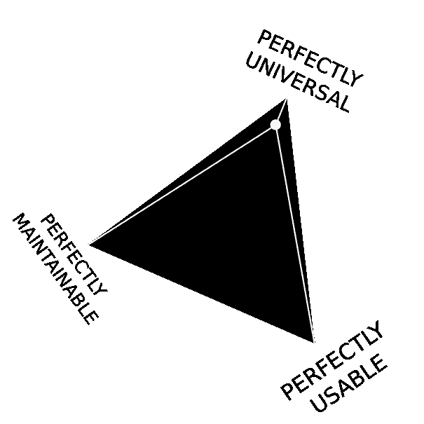
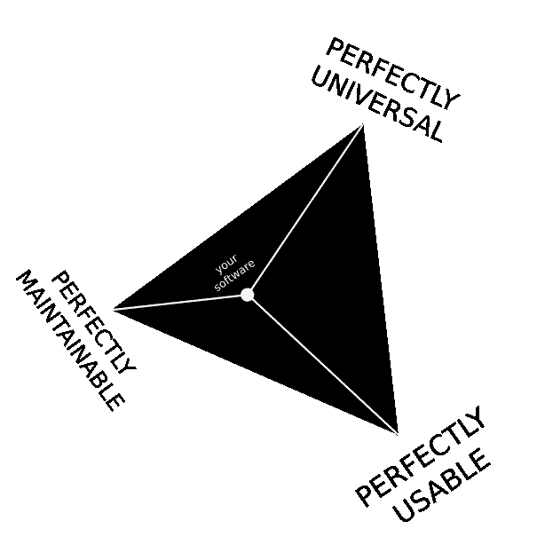

# 如何在开发者、用户和利益相关者之间保持软件的平衡

> 原文：<https://medium.com/analytics-vidhya/how-to-keep-your-software-balanced-72dd63ba2f55?source=collection_archive---------25----------------------->



## 开发人员的视点

## 理解过程和模式

期望和资源管理可能会非常累人，团队成员似乎也帮不上忙！前端对后端的圣战挫伤了团队的积极性，而且似乎没有共同的基础。让我们解密软件开发交付链的秘密法则和机制。

# 软件开发的三角

类似于期望的三角形，我提出了软件开发的三角形:



最多选两个。

你的软件可以是通用的、易于维护的，但是用户却很难理解。它易于维护和使用，但功能不丰富。它对用户很有吸引力，有很多功能，但是不容易部署和开发。

让我们看看汽车商店的例子，这是我最喜欢的话题。

# 通用+可维护=不可用

你的汽车商店列出了所有可能的汽车型号，它们的制造商和联系数据，它们的技术参数，它们的生产历史，数以千计的图片，但实际上是无法使用的。可维护性是可以的:您给出您在数据库中得到的东西，而不需要过多考虑用户是否需要它，也不需要构建太多的数据库请求。

它很复杂，细节过多。

在现实世界中，想想 Django Admin:一个容易扩展但功能强大的站点管理框架，以其快速开发的可能性而闻名。视图很容易与查询结合起来，并且该界面为用户提供了一种简单的方法来执行常见的数据操作。

问题是:很丑。它只是在视觉上重复 Django 模型，这对于非开发人员用户来说通常没有意义。该界面是老式的，功能超载，提供了一个很差的可用性概念，不符合当今 UX 的最高标准。



Django 管理员:快速和肮脏的好，但仅此而已

# 可维护+可用=不通用

您的汽车商店列出了多种型号的汽车。这个界面对用户和他们的需求很有吸引力。你决定保持你的应用程序的简约性，去掉所有不需要的东西。

用户抱怨他们找不到生产年份、其他相关型号和汽车保险费用。你，害怕成为一个典型的德国技术网站，回避用户的要求，继续走自己的路。一些用户离开是因为他们没有得到他们需要的东西，尽管有吸引人的界面和出色的可用性。

在现实世界中，当你想象这样的软件时，想想 Trello:优雅、干净的设计，不可思议的 UX，但你不能用权限处理或完全启用的软件开发来组织团队合作，它只是为了可用性而错过了必要的功能。



Trello:设计天才和令人难以置信的软件，但缺少大规模的关键功能

# 通用+可用=不(容易)维护

您的汽车商店易于使用，有一个搜索栏。它包含了数百万辆汽车；人工智能预测用户偏好并关联产品。用户界面简洁直观。必要的元素会在用户需要的时候出现。

但这是一项巨大的工程。数十个 docker 容器和数据库在 8 个不同地区复制，数百万代码行，三个 QA 步骤，各种测试机制和流程。这就是你的应用程序的本质。

你的托管和服务费用是每月五位数。你的应用程序看起来天真无邪的界面，用柔和的颜色和令人惊叹的图形欢迎用户，覆盖了数千人参与的压倒性复杂性的可怕机制。

在现实世界中，想想谷歌:它的标志性设计最终在地球上的任何地方都可以识别，它隐藏了令人难以置信的复杂服务器景观、人工智能等等，以保证谷歌以惊人的 SLA 而闻名。


谷歌:地球上所有知识的简单界面

# 局外人和局外人

不一定给出三角形的三条边中有两条。有些应用程序甚至连这一点都达不到，只停留在单一的质量上。看看大部分德国互联网的样子:



Deutschtech 是一个不可用但通用且绝对不可维护的软件的例子。

互联网上有很多这样的网站，正如康威定律所说:产品反映了交流。在这种情况下，它反映了团队中的能力分布。

# 供应链悖论

除了沟通问题，这是很自然的工作材料仍在形成，还有一个问题。我称之为*供应链悖论*。

例如，让我们看看开发单页面应用程序时前端和后端开发人员之间的常见交互。

后端的主要任务是:

*   执行用户请求，将它们转换成数据库查询
*   有效地存储数据
*   最小化满足用户请求的数据
*   最小化处理时间
*   管理数据访问、角色和权限。

所以后端的理想情况是当**没有用户**时。所有目标均已实现:

*   无用户-无请求✔
*   任何数据存储都是有效的，因为没有人要求它✔
*   无请求-无数据✔
*   无数据-处理时间为零✔
*   无请求-无访问管理✔

另一端的前端具有以下任务:

*   以最适合用户的方式显示和组织信息和控件
*   将用户输入转换成服务器请求
*   将服务器响应转换成本地数据模型
*   将本地数据模型转换成图形元素和控件

前端的理想情况是:

*   没有用户✔
*   前端有整个数据库本地✔

这是一个主要的冲突:相互矛盾的意图导致开发人员只从他们的角度看问题，引发了关于为什么他们不关心其他人的问题的长时间讨论。虽然每个阶段都是处理链的一部分，但从用户到数据库，再返回来，他们在责任范围和服务级别上不断地相互争斗。

例如，设计师和前端也是如此。最好的前端设计是一个绿色的大按钮，上面写着“解决所有问题”，而从设计角度来看，最好的前端是该设计的精确副本，这在现实中远远不可行。

> 这就是供应链悖论:为了交付最高质量的软件，开发者需要克服相反方向的利益，找到中间道路。他们需要做好自己的工作，也考虑到邻居的利益。

# 发展动力守恒

软件开发的三角形和供应链悖论是联系在一起的。从设计师到数据库工程师的供应链中的任何不平衡都会立即反映在产品中。



软件开发三角中的动力

因此，如果前端主导决策，应用程序将是可用的和好看的，但可维护性和通用性将受到影响。

如果企业玩我是老板驱动的开发，你的软件将会充满功能，但是没有人能够或者想要使用或者维护它。

如果你的应用程序向后端发展不平衡，你会得到一个丑陋无用的没人想用的应用程序，但是它有世界上最好的数据库性能。



你越是说服其中一个品质，你的软件在另外两个品质上就离完美越远。

# 保持平衡

大自然热爱平衡，软件也是如此。保持供应链中所有参与者的利益平衡，你的软件就会长期繁荣。🖖



平衡的开发过程是成功的关键。

你不可能一下子拥有所有的，所以首先，从一个折中开始:在你的情况下什么是重要的:通用性、可维护性还是可用性？

```
Thanks for reading. Subscribe for more interesting content!
```

另外，看看我最近的文章:V

🍑 [Fullstack 我的后端](/analytics-vidhya/fullstack-my-backend-c89d1126ae57):为什么 full stack developer 是一个神话

🕒[为什么你的软件质量随着时间退化](https://thorin-schiffer.medium.com/same-old-story-4d1ef4df0824):短篇故事

🐍 [RapidAPI:使用 Python 的第一步](/analytics-vidhya/rapidapi-and-fastapi-d720789a5b7e):综合指南