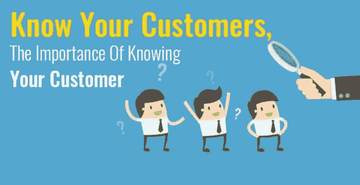
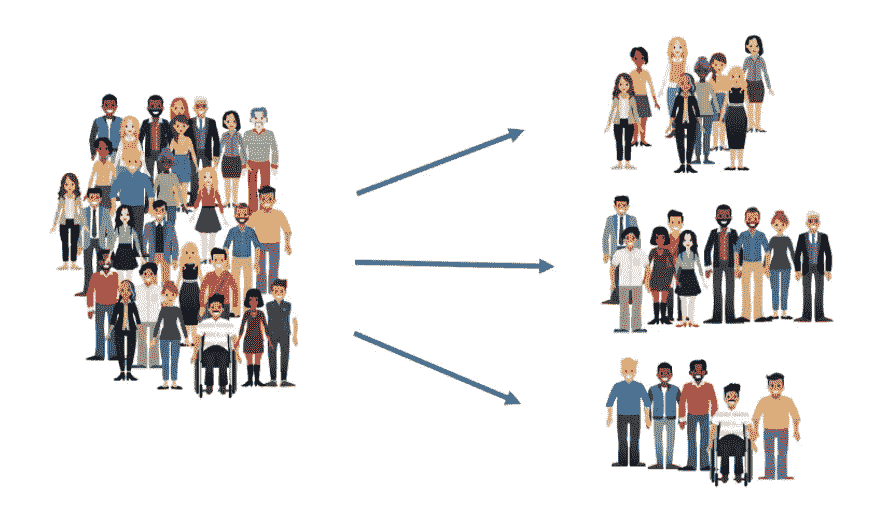
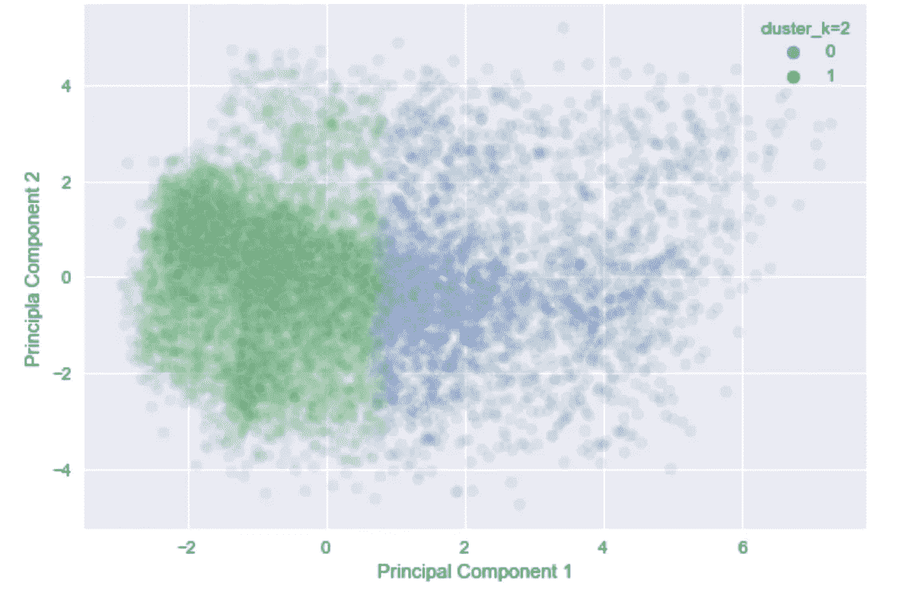
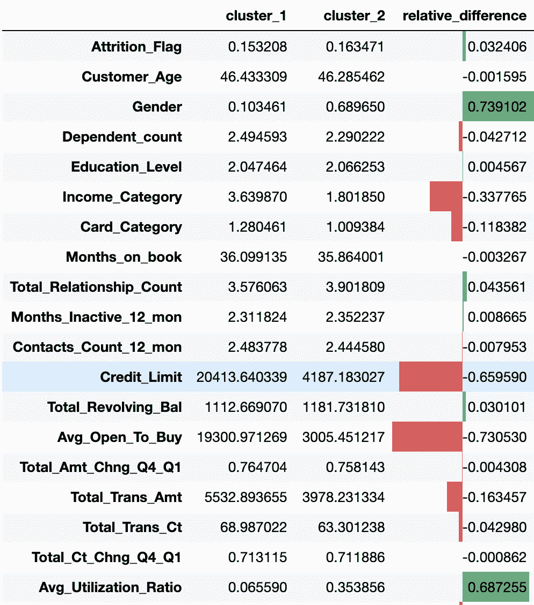
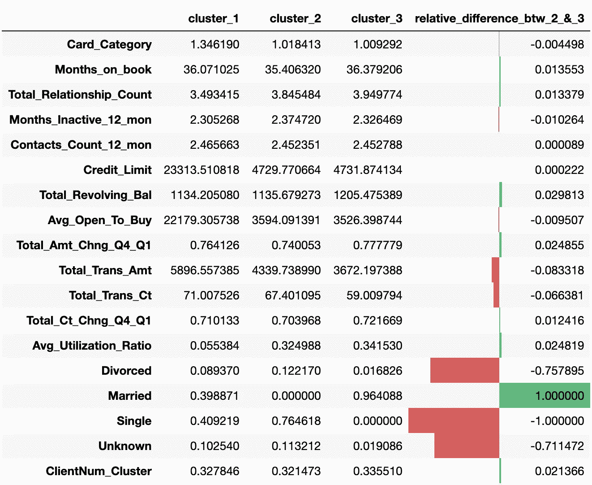
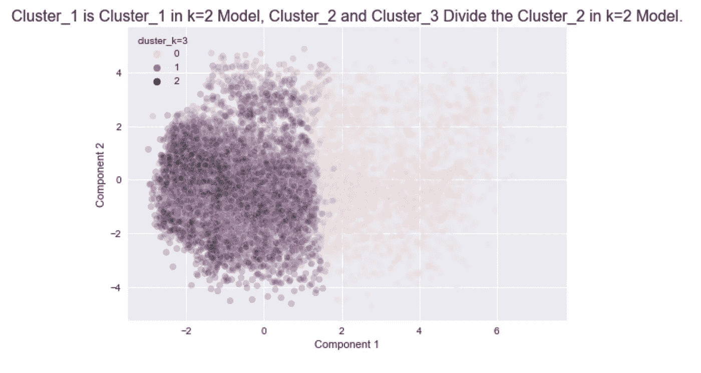
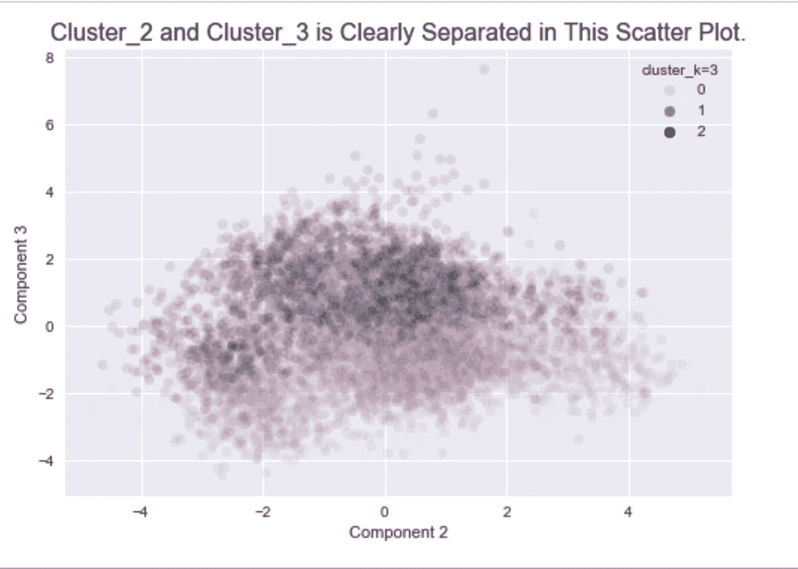
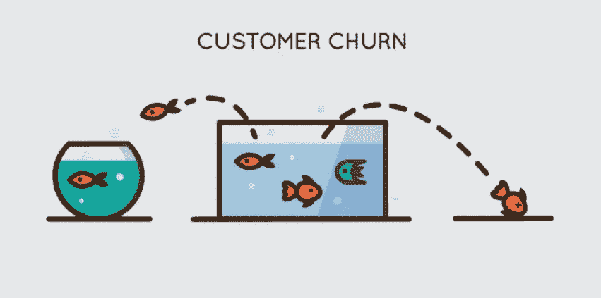
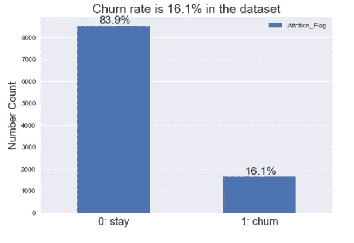

# 如何通过数据了解你的客户？

> 原文：<https://medium.com/analytics-vidhya/how-to-know-your-customers-through-data-37974aae474e?source=collection_archive---------18----------------------->

了解你的顾客。图片来源:[convergehub.com](https://www.convergehub.com/blog/six-principles-knowing-your-customers-better)。

理解客户是成功的商业策略和决策的关键。随着这些天客户数据量的不断增长，数据科学和机器学习已经成为提取客户信息不可或缺的工具。

**那么，如何利用数据来更好地了解你的客户并获得商业洞察力呢？**

在这篇文章中，我将提出两个关于客户的问题，数据可以帮助我们回答。我们对**信用卡客户数据集**进行分析和建模，并探索以下内容:

(1).**客户细分**:客户数据集中是否隐藏了聚类结构？

(2).**客户流失预测**:我们能预测未来哪些客户会停止使用我们的产品吗？

# 数据集的快照。

我们分析的数据集由一家信用卡公司的 10，000 多名客户的数据组成。

它大致包含两类信息:

a)。**每个客户的人口统计信息**，例如他们的年龄、性别、婚姻状况、教育程度和收入水平。

b)。**信用卡使用信息**，比如他们的信用额度、交易金额、使用率、损耗率(也就是他们是否关卡)。

**确认**。多亏了 Sakshi Goyal，数据集在 [Kaggle](https://www.kaggle.com/sakshigoyal7/credit-card-customers) 上可用。

# 第 1 部分:客户细分。

客户细分。图片来源:[eventsair.com](https://eventsair.com/guest-post-how-to-use-surveys-to-understand-and-segment-your-audience/)

如今，我们手机上的新闻应用足够智能，可以将不同的新闻文章和相似的主题归为一类。客户细分背后的理念是一样的。我们希望将具有相似特征(如购买习惯或偏好)的不同个人分组。良好的客户细分对精准营销至关重要。

传统上，可以通过手动检查客户信息和手工选择分组标准来进行细分。有了机器学习技术，我们现在有了另一种选择。我们可以将数据提供给一些算法，让机器探索数据中的聚类结构。

这是我们可以利用数据解决的第一个问题。

这项任务主要有两个挑战:

(一)。**准备数据**:机器会学习什么模式很大程度上取决于我们给它喂什么数据。如何恰当地准备我们的数据是我们首先要考虑的问题。

㈡。I **会议结果**:如果机器确实报告了它发现的一些聚类结构，那么将它翻译成人类可以理解的语言可能并不容易。

# 我们发现了什么？

我们的分析揭示了两个具有有趣见解的聚类结构。一种是将我们的客户分为两类。另一个呈现三组。

**案例一:两组。**

**当我们选择组的数量为 2 时，模型能够学习客户的财务状况并基于此对他们进行分组！**

散点图 1:两个集群

在上面的散点图中，每个点代表一个客户，点的颜色表示我们的模型认为他们属于哪个组。

**为了将其转化为人类语言，我们查看了两个聚类中每个变量的组均值，并在下表中对它们进行了比较。**

例如，第十二行“Credit_Limit”表示集群 1 的平均信用限额约为 20414，集群 2 的平均信用限额为 4187，差距很大！各列中红色条显示了相对差异(差异除以总和),并给出了两组之间差异的清晰标志。

两个集群的均值表。

**洞察:**

从这个表中我们了解到**聚类 1** 中的客户是那些**收入、信用额度、购买能力较高，但使用率较低的客户，** **更像是男性**(对于性别，男性=0，女性=1)。

**我们的模型似乎表明了顾客中不同性别之间的财务不平等！**

**案例二:三组。**

**当我们选择组的数量为 3 时，那么我们的模型基本上根据他们的婚姻状况将前一个案例中的聚类 2 细分为两个组。**

三个集群的均值表。

换句话说，在案例二中，我们有三个集群。这里的聚类 1 和情况 I 中的聚类 1 大致相同，而这里的聚类 2 和聚类 3 基本上加起来就是情况 I 中的聚类 2，聚类 2 中的大部分客户都是单身，所有已婚客户都属于聚类 3。

(注意，这里的分组结构与我们如何准备数据有很大关系。)

案例 I 聚类和案例 II 聚类之间的这些关系可以用下面两个散点图来可视化。

将下面的图与上面的散点图 1(蓝绿色的图)进行比较，我们看到聚类 2(紫色)和聚类 3(黑色)混合在一起，大致占据了绿色点的空间。

从不同的角度(或者说数据云的不同部分)，我们可以清楚地看到集群 2(紫色)和集群 3(黑色)的分离。

**另一个洞见:**

在聚类 2(单个客户)和聚类 3(已婚客户)之间，平均总交易金额存在**显著差异。**

这是一个显著的差异还是只是一些随机波动？

一个统计测试告诉我们，这种差异确实是显著的。所以也许我们学到的另一个观点是:

> **“结婚省钱！”**

这对我来说完全违背直觉。

**警告**:我们应该指出的是，上述结论值得对因果关系进行更多的思考，因此应该谨慎对待！

有关分析和结果的更多详细信息，请参见本 [GitHub repo](https://github.com/hchen3368/Customer-Data-Analysis) 。

# 第二部分。客户流失预测。

客户流失。图片来源:[nextommerce.com](https://nextommerce.com/churn-rate-benchmarks/)

客户流失率是每年停止使用某项服务的客户的百分比。能够预测哪些顾客将会离开是商业中一项长久以来的超能力。因为我们可以想出有效的策略，在客户离开之前留住他们，并在问题造成不可挽回的损失之前发现问题。

例如，在我们的数据集中，大约有 16%的客户不再与我们合作！

柱状图展示了流失率。

所以，这是我们可以利用数据解决的第**个问题**:

**我们可以训练机器学习模型，根据客户的人口统计和其他用卡信息，预测哪些客户更有可能离开。**

**我们的模型有多好？**

经过长期反复的人类学习(挖掘数据)和模型调整过程后，我们选择了一个所谓的基于树的 boosting 模型，该模型在测试集上具有以下得分:

*   ***90.9%* 召回**，这意味着在那些确实离开的客户中，模型可以检测出 10 个中的 9 个。

在商业环境中，能够尽可能多地发现那些将要离开的人往往是最有价值的能力。这个回忆分数正好抓住了这一点。我们定制了我们的模型选择标准，并强调它来获得这个结果。

*   ***准确率 97%****，这意味着我们对其中 97%的客户是否会离开的预测是正确的。*

*关于我们的模型的更多细节，请看这个 [GitHub repo](https://github.com/hchen3368/Customer-Data-Analysis) 。*

# *摘要*

*在这篇文章中，我们看到了两个可以用数据来回答的关于客户的问题。它们是:*

*(1).**客户细分**:我们可以使用数据和机器学习方法来检测客户中有意义的聚类结构。*

*(2).**客户流失预测**:我们可以非常准确地预测哪些客户会停止使用我们的产品。*

*关于我们分析的更多细节，请看 [GitHub 回购](https://github.com/hchen3368/Customer-Data-Analysis)。*

***感谢您的阅读！非常欢迎和感谢您的评论！***