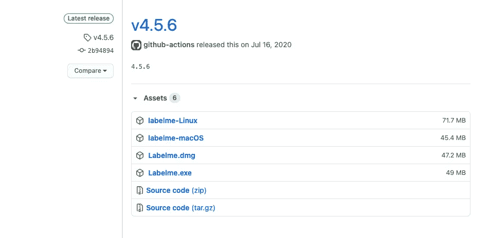
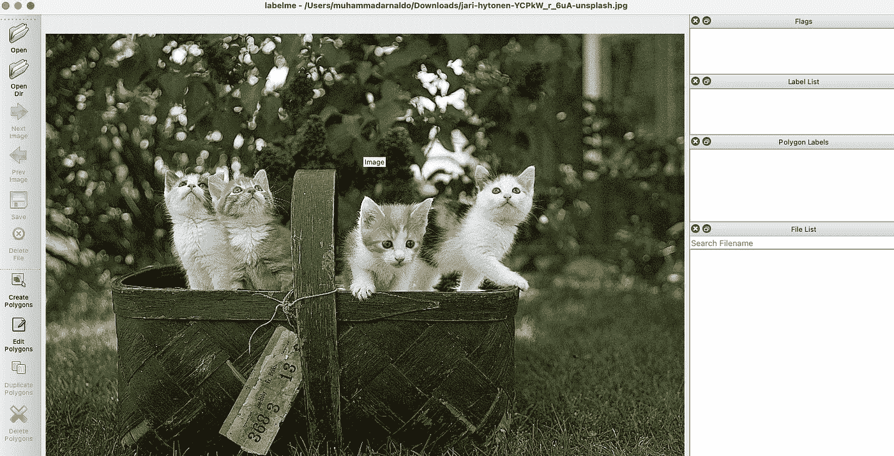
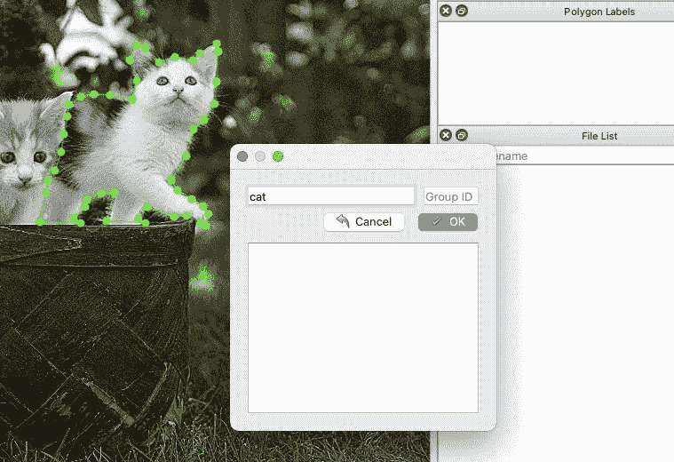

# 为实例分段创建您自己的数据集

> 原文：<https://medium.com/analytics-vidhya/how-to-label-training-image-data-for-instance-segmentation-task-8a8c16fb5a5b?source=collection_archive---------23----------------------->

## 为深度学习准备数据


杰瑞·海托宁在 [Unsplash](https://unsplash.com/photos/YCPkW_r_6uA) 上拍摄的猫咪照片

也许你已经做了几个图像分类模型。利用来自 [Kaggle](https://www.kaggle.com/) 的数据集或来自 TensorFlow 和 PyTorch 的内置数据集。您可以轻松构建自己的影像分类数据集。但是实例分段呢？

# 概观

在我们可以开始训练我们的实例分割模型之前，需要完成的任务之一是注释图像数据。在图像分类任务中，我们只需要收集图像数据，并根据它们的类别将它们分离到文件夹中。

实例分割需要我们做一个额外的任务，就是标注感兴趣的对象。通过这种方式，我们正在告诉我们的机器学习模型，图像中的哪些像素属于特定的类别。

# 安装标签

在这里，我们将使用 labelme 来帮助我们做这项工作。那么，什么是拉贝梅？

> Labelme 是一个图形图像注释工具，灵感来自于 http://labelme.csail.mit.edu。它是用 Python 编写的，图形界面使用 Qt。—健太郎·瓦达

您可以通过以下链接获得 labelme 并阅读文档:

```
[https://github.com/wkentaro/labelme](https://github.com/wkentaro/labelme)
```

有几种方法可以安装 labelme。我们可以从 anaconda 或 docker 安装它。此外，它可以从命令行安装或独立安装。我们可以通过以下链接获得独立的可执行文件/应用程序:

```
[https://github.com/wkentaro/labelme/releases](https://github.com/wkentaro/labelme/releases)
```

这里你会看到几个版本的独立安装，你可以根据你的操作系统下载。



Labelme 独立安装

安装成功后，我们可以通过键入以下命令并按 enter 键从终端启动应用程序:

```
labelme
```

我们可以从打开一个图像开始，或者单击 open dir 在一个文件夹中打开整个图像。这是它的样子。



Labelme 的用户界面

# 注释图像数据

要开始注释图像数据，我们可以点击左边栏的*创建多边形*菜单，然后围绕感兴趣的对象边缘创建一个多边形。这个其实和 Photoshop 应用上的*钢笔工具*差不多。完成后，我们可以为注释命名。重复这个过程来注释整个实例。



注释图像数据

# 输出

labelme 的输出是 JSON 文件格式。确保将注释文件保存在与图像文件相同的文件夹中。

完成后，您可以使用实例分割算法(如 Mask-RCNNs)训练自己的数据集。