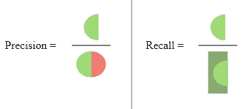
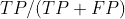
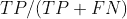

# 如何学习精确度和召回率的区别？

> 原文：<https://medium.com/analytics-vidhya/how-to-learn-difference-between-precision-and-recall-152154781138?source=collection_archive---------14----------------------->

我真的花了很长时间去理解如何记住精确和回忆的区别。本文旨在构建一个有助于清晰区分这两者的概念。

[https://upload . wikimedia . org/Wikipedia/commons/2/26/precision recall . SVG](https://upload.wikimedia.org/wikipedia/commons/2/26/Precisionrecall.svg)

**精度**定义为*真阳性(TP)与真阳性和假阳性(FP)之和的比例。*

FP:误报

换句话说，就是“积极认同的比例实际上是正确的”。Precision 的分母:TP + FP = **预测阳性总数**

**召回**定义为*真阳性与真阳性和假阴性之和的比例。*召回的分母:TP + FN = **所有实际阳性**

FN:假阴性

# **如何学会记忆精度？**

如果你像我一样努力记住这两者的区别，那么我建议你大声说出下面的句子。试着通过向你的同事说出这些来解释这些概念。从问他们知道什么开始，然后告诉他们你学到了什么！

**大声说出来练习**

*“你有多精确*”

“你在预测积极方面有多精确??”

“你多精确，*出了所有你预言为* ***正*** ？”

“你多精确，*所有你预测为* ***正*的事情，都被正确预测了**？”

* *上面的斜体表示精度的分母数字，即* **预测阳性总数**

最后，你也可以(应该)记住 **P** 精度以 **P** ，开始，所以我们只讨论所有类型的 P**阳性(TP 和 FN)的比例。所以，如果你是那种记得公式的人，那么你可以从公式走到解释。**

# 如何学会记忆回忆？

词典对回忆的一个定义是*把(一个事实、事件或情况)带回某人的脑海；* ***记***

回忆都是关于实际的肯定。

如果你像我一样是健忘的人，不记得事情？(咄！！这篇文章存在的原因，然后阅读下面与 Honey 的对话。

我:(上周六) *嘿，亲爱的，我买了 5 个芒果和 5 个苹果？:)*

**我:(今天)** *Heyy 蜜！！冰箱里没有芒果？我买了大概两个？Grrrr！！你把他们两个都吃了？*

**亲爱的** : *你还记得你买了多少芒果吗？*

**我:***对，我* ***记得*** *我买了 2 个芒果！！*

亲爱的:你是人类健忘的儿子！！所以你记得你买了两个？你买了 5 个芒果，但你只记得 5 个中的 2 个！！

**大声说出来——练习**

你还记得吗？”

你还记得积极的一面吗？“你说'*是的，我记得有两个是阳性'*，

“你能回忆起正面的，但实际的中有多少**？”**

将**精度**视为**质量**(真阳性的质量)

把**回忆**当成**关联**(真阳性的关联)