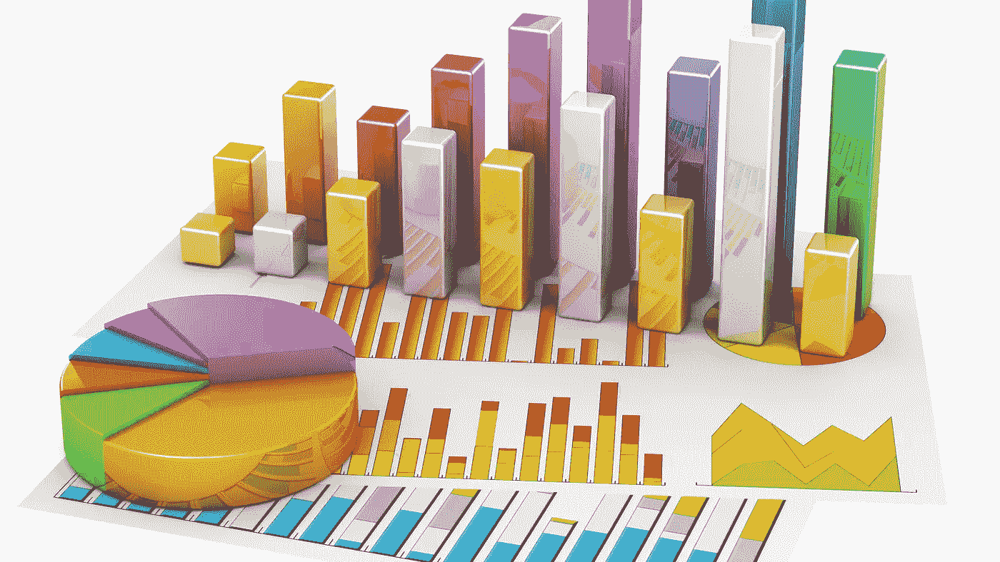
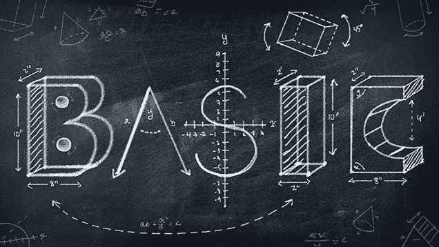

# 从初学者到进阶如何学习数据科学统计学

> 原文：<https://medium.com/analytics-vidhya/how-to-learn-statistic-for-data-science-from-beginner-to-advance-959e0b166cb9?source=collection_archive---------15----------------------->

**统计数据**是**数据科学**的关键概念，没有**统计数据**我们永远不会想到**数据**，所以我们可以说**统计数据**是**数据科学**的核心，所以在这篇小文章中，我们将简单地学习如何以更简单的方式学习**数据科学**的**统计数据**，所以让我们开始吧。

我们在学生时代都学过**统计**，但是放学后我们从来不使用**统计来**解决现实世界的问题，但是在**数据**领域，我们必须使用**统计**来解决商业问题，从**数据中看到洞察力或模式。**

所以让我们从基础话题开始，当你开始**统计**为**数据科学**时你会学到的一些话题是:

**你在统计学中涉及的基本话题:**

1.  **是什么意思** **中值**还是**模式。**
2.  **总体**，**样本，** **总体均值，样本** **均值**所有这些东西是如何工作的。
3.  **统计中的**范围**是什么。**
4.  **分散度的度量。**
5.  **标准差。**
6.  **高斯正态分布。**
7.  **方差。**
8.  什么是**随机变量。**
9.  **人口分布** **样本分布。**

这些是你必须首先学习的基本术语，以便更好地理解**统计**。

放松一段时间，然后移到中间部分

**中间段:**

1.  什么是**标准正态分布？。**
2.  **Z 分数。**
3.  **概率密度函数。**
4.  **累积分布函数**。
5.  **假设检验。**
6.  **核密度估计。**
7.  **中心极限定理。**
8.  **不同的绘图图形。**
9.  **协方差**
10.  **皮尔逊相关和系数。**
11.  **斯皮尔曼等级相关系数。**
12.  **假设检验。**
13.  **零假设，替代假设**
14.  **假设检验中有哪些不同类型的检验** ( **T 检验**， **Anova 检验**，**卡方检验，P 值)**

这些是你可以从网上任何地方学到的中级话题。

现在进入高级部分

**前进部分:**

1.  **离散和连续分布。**
2.  **对数正态分布。**
3.  **幂律分布。**
4.  **BOX COX 变换。**
5.  **泊松分布。**
6.  **切比雪夫不等式。**
7.  **伯努利和二项分布。**

因此，这些是你必须学习的完整主题，以使用 stats 和**数据来解决**业务问题**。**

希望这篇小文章能帮助你学习**统计**

祝你好运。