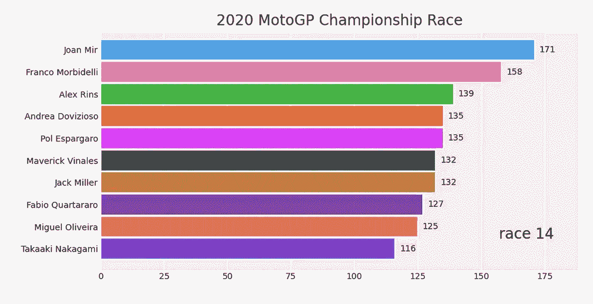
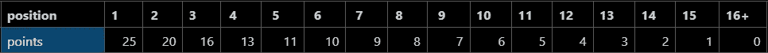
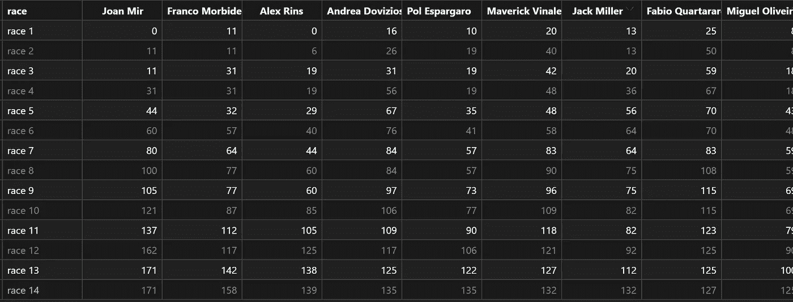

# 如何在 2 分钟内用 Python 制作条形图比赛

> 原文：<https://medium.com/analytics-vidhya/how-to-make-a-bar-chart-race-with-python-in-2-minutes-c9ee617c8d75?source=collection_archive---------7----------------------->

## 如何创建一个很酷的条形图比赛动画，最简单的方法。



最终结果。

**先决条件**:在你的电脑上安装 Python 或者注册 Google 联合实验室。

# 步骤 0

首先，为项目创建一个新的目录(如果你使用*谷歌合作实验室*，跳过这一步)

```
mkdir my_bar_chart_race
cd my_bar_chart_race
```

然后，创建并激活新的虚拟环境

```
python3 -m venv venv
source venv/bin/activate
```

# 第一步

如果你还没有，安装熊猫

```
pip3 install pandas
```

安装我们将用来创建名为 bar_chart_race 的条形图比赛的库，你不会猜到的

```
pip3 install bar_chart_race
```

# 第二步

现在我们已经安装了必要的库，让我们加载数据。

在本教程中，我们将创建 2020 年 MotoGP 世界锦标赛冠军赛的条形图动画。如果你不熟悉这项运动——那很糟糕——不要担心。
我简单总结一下，让大家更好的理解数据的含义。

## MotoGP 如何工作

MotoGP 是摩托车公路赛的顶级赛事。锦标赛每年举行，由许多比赛(或大奖赛)组成。每次大奖赛后，每个车手都会根据他在大奖赛的最终位置获得一些积分。赛季结束时，得分最高的骑手赢得冠军。

自 1993 年以来使用的计分制度如下:



MotoGP 积分系统

## 数据集

对于每场比赛，数据集都有一行，其中第一列报告了比赛，而其他列则显示了每位骑手在比赛后的总积分。



你可以在这里找到数据集[。](https://gist.github.com/lorenzofelletti/36df65f62e927108b628614030a25cda)

# 第三步

现在最酷的部分是:编码！

## 导入库

```
import pandas as pd
import bar_chart_race as bcr
```

## 加载数据集

```
df = pd.read_csv('./2020-championship.csv')
df = df.set_index('race')
```

## 让奇迹发生吧

最终结果只有一行代码之遥

```
bcr.bar_chart_race(
    df=df, 
    title='2020 MotoGP Championship Race', 
    orientation='h', 
    sort='desc', 
    n_bars=10, 
    steps_per_period=40, 
    period_length=2000
)
```

好了，我们已经完成了编码。您可以保存并运行该程序，您将获得条形图比赛视频作为输出。

# 搞定了。

恭喜，你完成了。就这么简单。

最终结果—条形图竞赛的视频。

这只是对这个库的一个简短介绍。你可以释放你的想象力，创造更先进的种族。