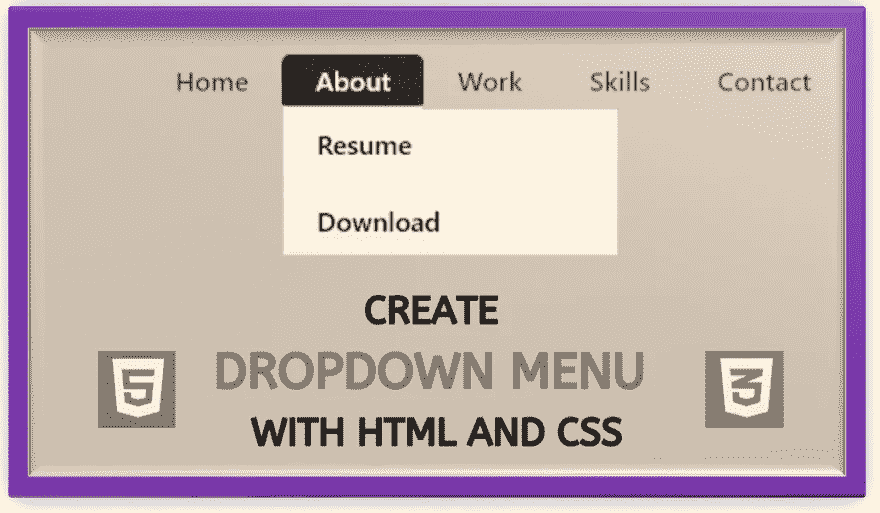
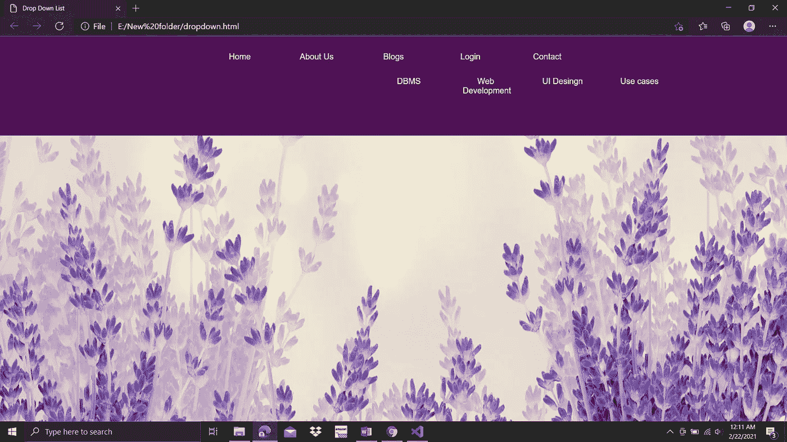
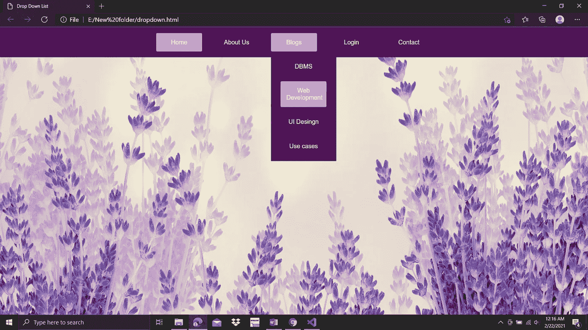
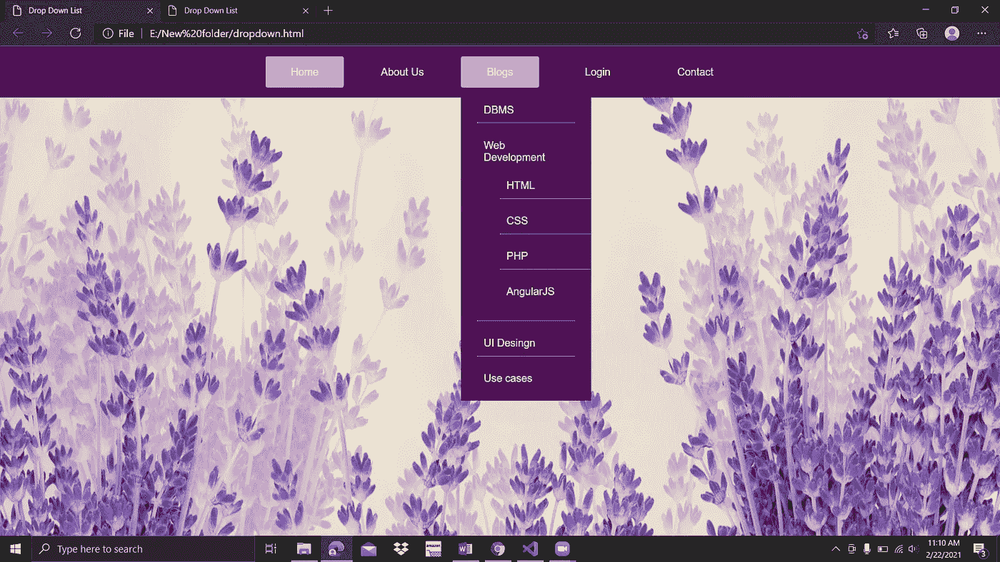
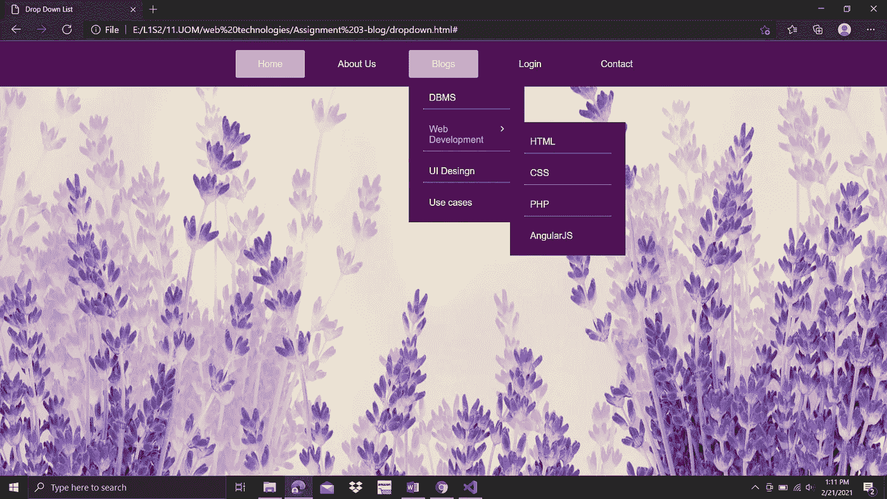

# 如何轻松制作下拉列表？

> 原文：<https://medium.com/analytics-vidhya/how-to-make-a-drop-down-list-easily-a4ae28ecae13?source=collection_archive---------23----------------------->

几乎每个网站都有 enu 吧。下拉菜单是一个很好的导航。通常使用悬停或可点击的下拉菜单。我们可以让我们的网站看起来更专业，也可以通过使用下拉菜单来改进内容布局和设计。同样为了可读性，我们可以使用下拉菜单，因为它可以释放侧边栏空间。



让我们看看如何使用 HTML & CSS 制作一个下拉列表。为了更好地理解，我将一步一步地指导你。

**第一步:创建 HTML & CSS 文件**

**第二步:使用 HTML 的基础知识创建一个导航栏**

**第三步:给网页添加基本样式**

**第四步:为我们准备的导航添加样式**

**第五步:在 HTML 文件中创建子菜单**

**第六步:为子菜单添加样式**

**步骤 7:在第一个创建的子菜单下创建另一个子菜单**

**步骤 8:为第二个子菜单添加样式**

我们一步一步来。

**第一步:创建 HTML & CSS 文件**

您可以选择自己喜欢的文本编辑器。我推荐 Visual Studio 代码文本编辑器，因为它是用户友好的文本编辑器。在那里你可以使用自动保存选项。(打开 VS 代码，转到文件并选择自动保存选项)

之后，用。css 和。html 扩展。如果你能使用一个单独的文件夹，当你链接 CSS 和 HTML 的时候会很容易。

第二步:使用 HTML 的基础知识创建一个导航栏

打开创建的 HTML 文件。所有的 HTML 文档都必须以 **<开头！DOCTYPE >声明**。 **< html >** 标签是所有其他 html 元素的容器。然后将创建的 CSS 文件链接到 HTML。 **<链接>** 标签最常用于链接外部样式表。之后，在 **< div >** 标签中准备一个无序列表，使用 CSS 作为一个部分来设置菜单的样式。创建一个**<>**标签到列表中使它们成为链接并创建一个类到第一个 **<李>** 标签。 **<李>** 标签定义了一个列表项。**<>**标签定义了一个超链接，用来从一个页面链接到另一个页面。 **"href"** 属性表示链接的目的地

```
<!DOCTYPE html>
<html>
<head>
<title>Drop Down List</title><link rel="stylesheet" href="style.css">   <!--link CSS file--></head>
<body><!--to prepare unordered list inside div tag-->
<div class="menu">
<ul>
    <li class="active"><a href="#">Home</a></li>
    <li><a href="#">About Us</a></li>
    <li><a href="#">Blogs</a></li>
    <li><a href="#">Login</a></li>
    <li><a href="#">Contact</a></li>
</ul>
</div>
</body>
</html>
```

然后在浏览器中打开 html 文件。现在你可以看到菜单是垂直对齐的。(每做一步，刷新浏览器就能看到发生的变化。)

**第三步:给网页添加基本样式**

我链接了一个背景图片，并通过样式将它放置在网页中。我们使用选择器来设计样式。[(选择器参考)](https://www.w3schools.com/cssref/css_selectors.asp)。这里**通用选择器(*** )用于选择所有元素。padding 属性的默认值为零。这意味着内盒和外盒之间没有空间。(完全符合)。padding 属性不允许负值。

```
/*part of “CSS Reset”. helps to keep your designs consistent across browsers*/
*{
       padding:0;
       margin: 0;
       box-sizing: border-box;
}
```

这里，CSS 背景属性用于为元素添加背景效果。

```
body{
       background-image: url(https://i.pinimg.com/originals/63/61/7e/63617ecffd58c4199c2e43669ba1730f.jpg); background-size: 1550px 1500px;/*resize background image */ background-position: center;
       box-sizing: border-box;
       font-family: sans-serif;
}
```

**第四步:为我们准备的导航添加样式**

现在，我将通过设计来以适当的方式安排菜单。选择器**”。菜单"**用于通过 **class= "menu"** 选择所有元素。inline-influx 值用于将元素显示为内嵌级别的 flex 容器。

```
.menu{
     background: rgb(79, 16, 85);
     text-align: center;/*can see your menu in center*/
}/*menu is aligned horizontally*/
.menu ul{ display: inline-flex;
     list-style: none;
}/*arrange spaces in the menu*/
.menu ul li{
     width: 120px;
     margin: 15px;
     padding: 15px;
}/*remove underlining of the elements in the menu*/
.menu ul li a {
     text-decoration: none;
     color: white;
}
```

现在我要给菜单添加悬停效果。这里第一个菜单是活跃的。通过添加这些东西，你可以有一个适当的期待。

```
.active, .menu ul li:hover{ background: violet;
      border-radius: 3px;
}
```

**第五步:在 HTML 文件中创建子菜单**

然后我需要创建一个子菜单，我在我需要的那个 **<【李】>** 标签里面创建了一个 **< div >** 标签。然后创建了一个名为**“子菜单”**的类用于样式化。然后，我遵循了我在之前的列表准备中所做的所有步骤。

```
<li><a href="#">Blogs</a>
<div class="submenu">
<ul>
     <li><a href="#">DBMS</a></li>
     <li><a href="#">Web Development</a></li>
     <li><a href="#">UI Design</a></li>
     <li><a href="#">Use cases</a></li>
</ul>
</div>
</li>
```



**第六步:为子菜单添加样式**

让我们来排列子菜单的样式，因为它是水平对齐的。最合适的方法是以垂直方式创建它。当鼠标悬停在元素上时，悬停选择器用于选择元素。**显示:无；**通常用于隐藏和显示元素，无需删除和重新创建。属性设置一个元素的左边距。以及 **margin-top** 属性设置元素的上边距。

```
.submenu{
           display: none;/*invisible the sub menu list*/
           color: white;
}.menu ul li:hover .submenu{
          display: block;
          position: absolute;
          background-color: rgb(79, 16, 85);
          margin-left: -15px;
          margin-top: 15px;
}/*to align the sub menu vertical*/
.menu ul li:hover .submenu ul{
         display: block;
         margin: 10px;
}
```



现在，我们可以看到垂直排列的子菜单。为了使它更有吸引力，我们可以遵循以下步骤。 **border-bottom** 属性用于创建带有虚线的边框样式。

```
.menu ul li:hover .submenu ul li{
          width: 150px;
          border-bottom: 1px dotted white;
          padding: 10px;
          background: transparent;
          border-radius: 0;
          text-align: left;
}.menu ul li:hover .submenu ul li:hover{
          color: violet;
}
```

为了看起来完美，我们可以做这个调整。最后一个菜单的虚线边框被移除。为此，我使用 border-bottom 属性和**“none”**作为值。

```
.menu ul li:hover .submenu ul li:last-child{ border-bottom: none;
}
```

现在，我将创建一个指向我们最近创建的子菜单的右箭头。

这里有很多方法可以做到。我们可以下载右箭头的图标。你可以使用 flaticon.com 网站。然后创建 **< img >** 标签，做必要的样式调整大小和定位。如果你需要更多关于添加图标作为图像的信息，请在评论区发表评论。我会帮助你的。另一种方法是添加下面提到的图标库，并使用所需的描述。

```
<!-- Add icon library --><link rel="stylesheet" href="https://cdnjs.cloudflare.com/ajax/libs/font-awesome/4.7.0/css/font-awesome.min.css">
```

**< i >** 和 **< span >** 元素被广泛用于添加图标。这里我使用了 **< i >** 元素。并且我已经添加了库，使用了**“fa fa-angle-right”**描述。

```
<li>
<a href="#"></a><i class="fa fa-angle-right"></i>Web Development
</li>
```

然后做样式，把图标放在需要的地方。我需要把它放在右边。属性指定了一个元素应该如何浮动。

```
.fa-angle-right{ float: right;
            /*move arrow head to right*/
}
```

**步骤 7:在第一个创建的子菜单下创建另一个子菜单**

要在最近创建的子菜单中创建另一个子菜单，我们可以创建一个 **< div >** 标签。然后像前面一样在 **< li >** 标签中创建一个无序列表。 **"gonext"** 类是为样式目的而创建的。

```
<li class="gonext">
<a href="#"><i class="fa fa-angle-right"></i></a>Web Development
<div class="submenu2">
<ul>
     <li><a href="#">HTML</a></li>
     <li><a href="#">CSS</a></li>
     <li><a href="#">PHP</a></li>
     <li><a href="#">AngularJS</a></li>
</ul>
</div>
</li>
```



则该子菜单位于先前创建的子菜单之下。但是这不是一个好的做法，因为现在下拉列表非常长。

**第八步:为第二个子菜单**添加样式

为了有一个完美的外观，我们可以做以下造型。这里使用创建的 **"submenu2"** 和 **"gonext"** 类进行造型。

```
.submenu2{
      display: none;
      /*then newly created submenu is invisible*/
}.gonext:hover .submenu2{
       position: absolute;
       display: block;
       margin-left: 140px;
       margin-top: -40px;
       background-color: 
       rgb(79, 16, 85);
}
```

哇..！

现在我们可以有一个设计完美的下拉列表了。你可以试试这个。

