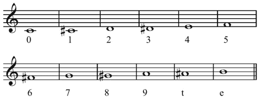

# 如何制作一首流行歌曲？—数据驱动的方法

> 原文：<https://medium.com/analytics-vidhya/how-to-make-a-popular-song-a-data-driven-approach-452e178f13d3?source=collection_archive---------11----------------------->

昨晚，我有了一个奇怪的想法，我应该创作一首歌，并用统计学的**力量**告知这个过程的每一步——歌曲的基调、流派、节奏，一切！

## 数据

为了做到这一点，我首先必须找到可以分析的当前音乐数据。幸运的是，Spotify 已经公开了他们歌曲的大量数据。那里的信息真的很大，而且使用起来非常友好。

我已经链接了我的数据源[这里](https://www.kaggle.com/yamaerenay/spotify-dataset-19212020-160k-tracks)和[这里](https://www.kaggle.com/leonardopena/top-spotify-songs-from-20102019-by-year)。

## 工具

我在所有的分析中使用了编程语言 R。如果你愿意，你可以用 Excel 做类似的分析，但是我更喜欢用 r。

我用苹果的 GarageBand 制作并录制了这首歌[lol]。

## 流行

好了，我们开始吧！

我们在这里处理的因变量被称为“流行度”，它是一个范围从 0 到 100 的值。

这个值是由 Spotify 的内部算法计算出来的，主要基于一首歌曲的总播放次数以及这些播放有多近。

因此，该值偏向于较新的歌曲。现在经常播放的曲目将比过去经常播放的歌曲更受欢迎。

## 其他因素

但是你可能会问，是什么让一首流行歌曲“流行”呢？嗯，很多不同的因素:

*   **Key:**Key 总共有 11 个值，以 *C (0)* 、 *C# (1)* 、 *D (2)* 等开始。

键基于以下整数表示法表示。

*   **声音度:**这个值的范围在 0 到 1 之间，1 代表一首歌曲的最高声音度。
*   **可跳舞性:**可跳舞性描述了一个曲目在多种因素的基础上适合跳舞的程度，这些因素包括速度、节奏稳定性、节拍强度和整体规律性。值的范围在 0 和 1 之间。
*   **能量:**能量代表了一首曲目如何充满活力的*感知感受*——换句话说，就是活泼、响亮和强烈。值的范围在 0 和 1 之间。
*   **时长:**歌曲有多长。
*   **响度:**响度值(以分贝为单位)是整个音轨的平均值，用于比较音轨的相对响度。值的范围在-60 分贝和 0 分贝之间。

(你可以在 [Spotify 的官网上查看变量的完整列表，这里是](https://developer.spotify.com/documentation/web-api/reference/#endpoint-get-track)。)

## 如何制作一首流行歌曲？

所以，让我们开始吧。

我必须确定的第一件事是:我的流行歌曲应该属于什么类型？

## 类型

不出所料，最常见的流派是流行音乐。然而，如果我们仔细看看最流行的歌曲，我们会发现流行音乐的一个子类实际上占据了蛋糕。

(*出于这项研究的目的，我将“流行”歌曲定义为流行率超过 60 的歌曲。)

你会问，舞曲和流行音乐有什么区别？好吧，下面是解释这一点的数字:

据观察，“流行舞曲”歌曲通常

*   更快的
*   更适合跳舞(咄)
*   更快乐，而且
*   更长的

比普通的老流行歌曲。此外，从领域知识来看，众所周知，流行舞曲也比流行音乐更偏重于技术。

所以我在 GarageBand 上从他们的“视觉和韵文”Live Loop 包中选了一段舞蹈流行节拍，并决定跟着它走。

## 速度与调

我要回答的下一个问题是:我的歌应该是什么调和速度？

据观察，流行的新歌大多是 C#调，这是我决定为我的歌曲选择的调。

人们还观察到，流行歌曲——绝大多数——的节奏是每分钟 119 拍。我决定将我的节拍调整到这个速度，使原始节拍比 GarageBand 原始节拍慢得多。

到目前为止，节拍听起来有点像这样:

诚然，节拍不完全是一个有灵感的艺术作品，但是！这是件大事。对于一个完全由统计分析激发的节拍，我很自豪。

## 音量

自 20 世纪 60 年代以来，流行音乐变得越来越响亮，直到 2000 年代，之后曲线变平了一点。现在，流行音乐实际上没有几年前那么响亮了。

这对我的节拍意味着什么？这意味着我必须降低分贝水平，让它变得更柔和，甚至更安静，也许。

## 歌词

在这个数据集中有一个非常有趣的变量叫做化合价。价是衡量歌曲中快乐程度的一个属性，就像一个分数，根据所谓的“音乐积极性”对歌曲进行评级

高价音轨听起来更积极(**快乐、愉悦、欣快**)，而低价音轨听起来更消极(**悲伤、沮丧、愤怒**)。

正如你所看到的，随着时间的推移，流行音乐变得越来越悲伤。它在 70 年代末达到顶峰，标志着嬉皮士运动的结束。有趣的是，自 80 年代以来，音乐一直变得不那么快乐，在 2021 年达到最低点。

但这是否意味着流行音乐就一定要悲伤呢？

不，不是的。如果你看上面的图表，今天的音乐配价分数略低于 0.5。这意味着流行音乐既不过度快乐，也不过度悲伤或愤怒。

这对我的节拍意味着什么？嗯，很简单，这意味着我需要想出的歌词，排名在这个效价指标的中间。像我说的，既不太高兴，也不太悲伤。

这是我想到的:

> 是的，我喜欢苹果，是的，我喜欢水果
> 
> 当我出门时，我穿我的靴子，我穿我的西装
> 
> 我是一个有根有据的人
> 
> 那是我的属性，没有替代品。
> 
> 婊子，我绝对喜欢伏特加
> 
> 像卡夫卡一样抽象的思想
> 
> 有一副我是辛纳屈的声音
> 
> 第一，宝贝，就像普拉达(x2)

我知道，我知道:这样的灵感作品，不是吗？不，我开玩笑的。我完全知道这些歌词毫无意义！是的，但这也是重点。

这些歌词没什么特别的，没有传达任何特别的情感或感觉。这就是如今的卖点:虚无，伴随着 119 BPM 的流行舞曲节奏。

## 最终结果

综上所述，我得出了以下结论:

总结一下:

*   这首歌是流行舞曲。
*   它的节奏是每分钟 119 拍。
*   它在升 C 调。
*   它的效价(幸福)等级大约是 0.5。
*   它具有很高的可跳性和能量值。
*   它的声音、响度和持续时间都很低。

这是我有机会参与的最有趣的项目之一，我必须说我玩得非常开心！

让我知道你的想法，如果你有任何反馈。

干杯，

史瑞亚斯。